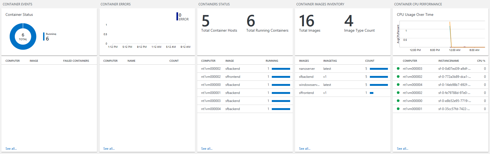
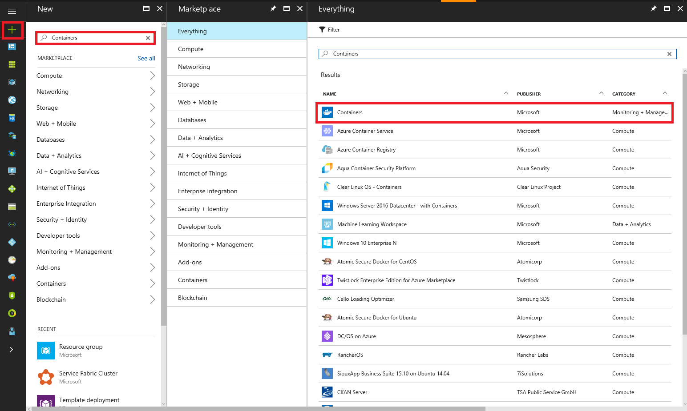

# Monitoring Windows Server containers with OMS

## OMS Containers Solution

The Operations Management Suite (OMS) team has published a Containers solution for diagnostics and monitoring for containers. Alongside their Service Fabric solution, this solution is a great tool to monitor container deployments orchestrated on Service Fabric. Here's a simple example of what the dashboard in the solution looks like:

It also collects different kinds of logs that can be queried in the OMS Log Analytics tool, and can be used to visualize any metrics or events being generated. The log types that are collected are:

1. ContainerInventory: shows information about container location, name, and images
2. ContainerImageInventory: information about deployed images, including IDs or sizes
3. ContainerLog: specific error logs, docker logs (stdout, etc.), and other entries
4. ContainerServiceLog: docker daemon commands that have been run
5. Perf: performance counters including container cpu, memory, network traffic, disk i/o, and custom metrics from the host machines

This article covers the steps required to set up container monitoring for your cluster. To learn more about OMS's Containers solution, check out their [documentation](../log-analytics/log-analytics-containers.md).

## 1. Set up a Service Fabric cluster

Create a cluster using the Azure Resource Manager template found [here](https://github.com/dkkapur/Service-Fabric/tree/master/ARM%20Templates/SF%20OMS%20Sample). Make sure to add a unique OMS workspace name. This template also defaults to deploying a cluster in the preview build of Service Fabric (v255.255), which means that it cannot be used in production, and cannot be upgraded to a different Service Fabric version. If you decide to use this template for long-term or production use, change the version to a stable version number.

Once the cluster is set up, confirm that you have installed the appropriate certificate, and make sure you are able to connect to the cluster.

Confirm that your Resource Group is set up correctly by heading to the [Azure portal](https://portal.azure.com/) and finding the deployment. The resource group should contain all the Service Fabric resources, and also have a Log Analytics solution as well as a Service Fabric solution.

For modifying an existing Service Fabric cluster:
* Confirm that Diagnostics is enabled (if not, enable it via [updating the virtual machine scale set](/rest/api/virtualmachinescalesets/create-or-update-a-set))
* Add an OMS Workspace by creating a "Service Fabric Analytics" solution via the Azure Marketplace
* Edit the data sources of the Service Fabric solution to pick up data from the appropriate Azure Storage tables (set up by WAD) in the Resource Group that the cluster is in
* Add the agent as an [extension to the virtual machine scale set](/powershell/module/azurerm.compute/add-azurermvmssextension) via PowerShell or through updating the virtual machine scale set (same link as above, to modify the Resource Manager template)

## 2. Deploy a container

Once the cluster is ready and you have confirmed that you can access it, deploy a container to it. If you chose to use the preview version as set by the template, you can also explore Service Fabric's new docker compose functionality. Bear in mind that the first time a container image is deployed to a cluster, it takes several minutes to download the image depending on its size.

## 3. Add the Containers solution

In the Azure portal, create a Containers resource (under the Monitoring + Management category) through Azure Marketplace. 

In the creation step, it requests an OMS workspace. Select the one that was created with the deployment above. This step adds a Containers solution within your OMS workspace, and is automatically detected by the OMS agent deployed by the template. The agent will start gathering data on the containers processes in the cluster, and in about 10-15 minutes, you should see the solution light up with data as in the image of the dashboard above.

## 4. Next steps

OMS offers various tools in the workspace to make if more useful for you. Explore the following options to customize the solution to your needs:
- Get familiarized with the [log search and querying](../log-analytics/log-analytics-log-searches.md) features offered as part of Log Analytics
- Configure the OMS agent to pick up specific performance counters (go to the workspace Home > Settings > Data > Windows Performance Counters)
- Configure OMS to set up [automated alerting](../log-analytics/log-analytics-alerts.md) rules to aid in detecting and diagnostics