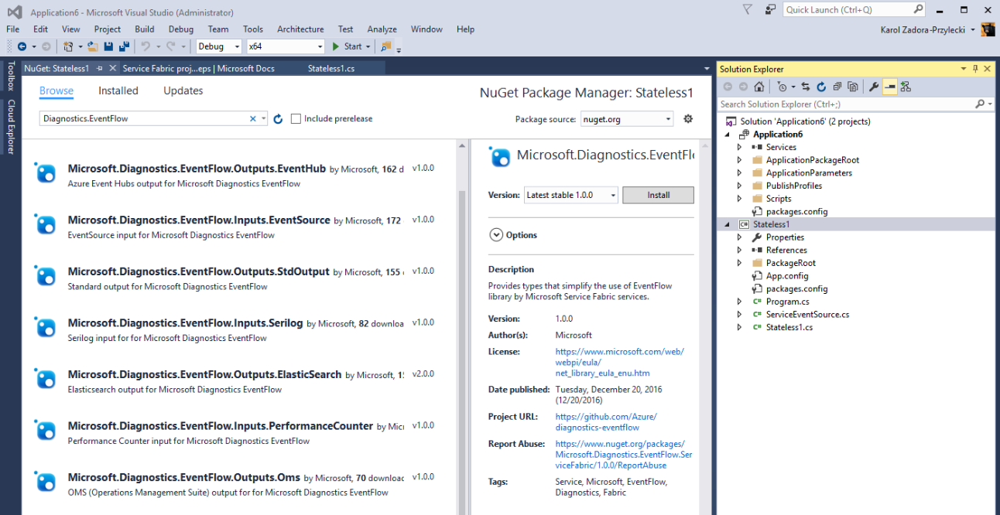

# Event aggregation and collection using EventFlow

[Microsoft Diagnostics EventFlow](https://github.com/Azure/diagnostics-eventflow) can route events from a node to one or more monitoring destinations. Because it is included as a NuGet package in your service project, EventFlow code and configuration travel with the service, eliminating the per-node configuration issue mentioned earlier about Azure Diagnostics. EventFlow runs within your service process, and connects directly to the configured outputs. Because of the direct connection, EventFlow works for Azure, container, and on-premises service deployments. Be careful if you run EventFlow in high-density scenarios, such as in a container, because each EventFlow pipeline makes an external connection. So, if you host several processes, you get several outbound connections! This isn't as much a concern for Service Fabric applications, because all replicas of a `ServiceType` run in the same process, and this limits the number of outbound connections. EventFlow also offers event filtering, so that only the events that match the specified filter are sent.

## Set up EventFlow

EventFlow binaries are available as a set of NuGet packages. To add EventFlow to a Service Fabric service project, right-click the project in the Solution Explorer and choose "Manage NuGet packages." Switch to the "Browse" tab and search for "`Diagnostics.EventFlow`":



You will see a list of various packages show up, labeled with "Inputs" and "Outputs". EventFlow supports various different logging providers and analyzers. The service hosting EventFlow should include appropriate packages depending on the source and destination for the application logs. In addition to the core ServiceFabric package, you also need at least one Input and Output configured. For example, you can add the following packages to send EventSource events to Application Insights:

* `Microsoft.Diagnostics.EventFlow.Inputs.EventSource` to capture data from the service's EventSource class, and from standard EventSources such as *Microsoft-ServiceFabric-Services* and *Microsoft-ServiceFabric-Actors*)
* `Microsoft.Diagnostics.EventFlow.Outputs.ApplicationInsights` (we are going to send the logs to an Azure Application Insights resource)
* `Microsoft.Diagnostics.EventFlow.ServiceFabric`(enables initialization of the EventFlow pipeline from Service Fabric service configuration and reports any problems with sending diagnostic data as Service Fabric health reports)

>[!NOTE]
>`Microsoft.Diagnostics.EventFlow.Inputs.EventSource` package requires the service project to target .NET Framework 4.6 or newer. Make sure you set the appropriate target framework in project properties before installing this package.

After all the packages are installed, the next step is to configure and enable EventFlow in the service.

## Configure and enable log collection
The EventFlow pipeline responsible for sending the logs is created from a specification stored in a configuration file. The `Microsoft.Diagnostics.EventFlow.ServiceFabric` package installs a starting EventFlow configuration file under `PackageRoot\Config` solution folder, named `eventFlowConfig.json`. This configuration file needs to be modified to capture data from the default service `EventSource` class, and any other inputs you want to configure, and send data to the appropriate place.

>[!NOTE]
>If your project file has VisualStudio 2017 format the `eventFlowConfig.json` file will not be automatically added. To fix this create the file in the `Config` folder and set the build action to `Copy if newer`. 

Here is a sample *eventFlowConfig.json* based on the NuGet packages mentioned above:
```json
{
  "inputs": [
    {
      "type": "EventSource",
      "sources": [
        { "providerName": "Microsoft-ServiceFabric-Services" },
        { "providerName": "Microsoft-ServiceFabric-Actors" },
        // (replace the following value with your service's ServiceEventSource name)
        { "providerName": "your-service-EventSource-name" }
      ]
    }
  ],
  "filters": [
    {
      "type": "drop",
      "include": "Level == Verbose"
    }
  ],
  "outputs": [
    {
      "type": "ApplicationInsights",
      // (replace the following value with your AI resource's instrumentation key)
      "instrumentationKey": "00000000-0000-0000-0000-000000000000"
    }
  ],
  "schemaVersion": "2016-08-11"
}
```

The name of service's ServiceEventSource is the value of the Name property of the `EventSourceAttribute` applied to the ServiceEventSource class. It is all specified in the `ServiceEventSource.cs` file, which is part of the service code. For example, in the following code snippet the name of the ServiceEventSource is *MyCompany-Application1-Stateless1*:

```csharp
[EventSource(Name = "MyCompany-Application1-Stateless1")]
internal sealed class ServiceEventSource : EventSource
{
    // (rest of ServiceEventSource implementation)
}
```

Note that `eventFlowConfig.json` file is part of service configuration package. Changes to this file can be included in full- or configuration-only upgrades of the service, subject to Service Fabric upgrade health checks and automatic rollback if there is upgrade failure. For more information, see [Service Fabric application upgrade](service-fabric-application-upgrade.md).

The *filters* section of the config allows you to further customize the information that is going to go through the EventFlow pipeline to the outputs, allowing you to drop or include certain information, or change the structure of the event data. For more information on filtering, see [EventFlow filters](https://github.com/Azure/diagnostics-eventflow#filters).

The final step is to instantiate EventFlow pipeline in your service's startup code, located in `Program.cs` file:

```csharp
using System;
using System.Diagnostics;
using System.Threading;
using Microsoft.ServiceFabric;
using Microsoft.ServiceFabric.Services.Runtime;

// **** EventFlow namespace
using Microsoft.Diagnostics.EventFlow.ServiceFabric;

namespace Stateless1
{
    internal static class Program
    {
        /// <summary>
        /// This is the entry point of the service host process.
        /// </summary>
        private static void Main()
        {
            try
            {
                // **** Instantiate log collection via EventFlow
                using (var diagnosticsPipeline = ServiceFabricDiagnosticPipelineFactory.CreatePipeline("MyApplication-MyService-DiagnosticsPipeline"))
                {

                    ServiceRuntime.RegisterServiceAsync("Stateless1Type",
                    context => new Stateless1(context)).GetAwaiter().GetResult();

                    ServiceEventSource.Current.ServiceTypeRegistered(Process.GetCurrentProcess().Id, typeof(Stateless1).Name);

                    Thread.Sleep(Timeout.Infinite);
                }
            }
            catch (Exception e)
            {
                ServiceEventSource.Current.ServiceHostInitializationFailed(e.ToString());
                throw;
            }
        }
    }
}
```

The name passed as the parameter of the `CreatePipeline` method of the `ServiceFabricDiagnosticsPipelineFactory` is the name of the *health entity* representing the EventFlow log collection pipeline. This name is used if EventFlow encounters and error and reports it through the Service Fabric health subsystem.

### Use Service Fabric settings and application parameters in eventFlowConfig

EventFlow supports using Service Fabric settings and application parameters to configure EventFlow settings. You can refer to Service Fabric settings parameters using this special syntax for values:

```json
servicefabric:/<section-name>/<setting-name>
```

`<section-name>` is the name of the Service Fabric configuration section, and `<setting-name>` is the configuration setting providing the value that will be used to configure an EventFlow setting. To read more about how to do this, go to [Support for Service Fabric settings and application parameters](https://github.com/Azure/diagnostics-eventflow#support-for-service-fabric-settings-and-application-parameters).

## Verification

Start your service and observe the Debug output window in Visual Studio. After the service is started, you should start seeing evidence that your service is sending records to the output that you have configured. Navigate to your event analysis and visualization platform and confirm that logs have started to show up (could take a few minutes).

## Next steps

* [Event Analysis and Visualization with Application Insights](service-fabric-diagnostics-event-analysis-appinsights.md)
* [Event Analysis and Visualization with Azure Monitor logs](service-fabric-diagnostics-event-analysis-oms.md)
* [EventFlow documentation](https://github.com/Azure/diagnostics-eventflow)
