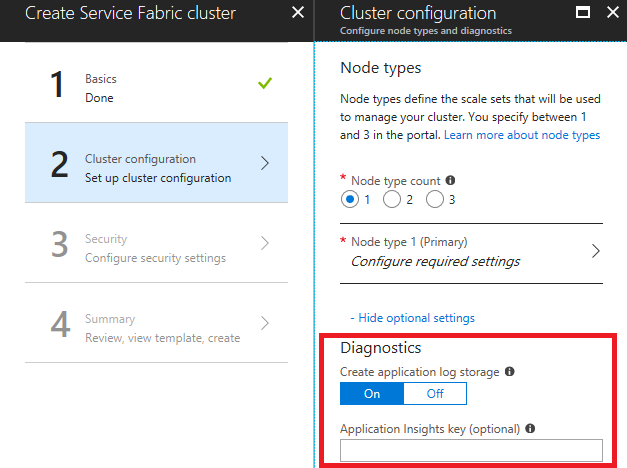
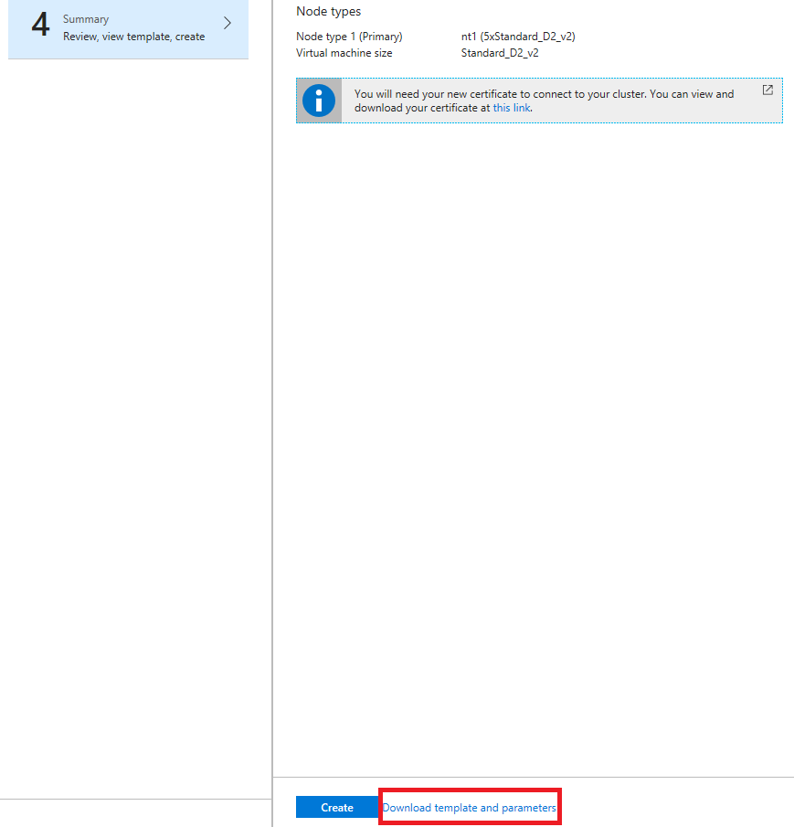

# Event aggregation and collection using Windows Azure Diagnostics
> [!div class="op_single_selector"]
> * [Windows](service-fabric-diagnostics-event-aggregation-wad.md)
> * [Linux](service-fabric-diagnostics-event-aggregation-lad.md)
>
>

When you're running an Azure Service Fabric cluster, it's a good idea to collect the logs from all the nodes in a central location. Having the logs in a central location helps you analyze and troubleshoot issues in your cluster, or issues in the applications and services running in that cluster.

One way to upload and collect logs is to use the Windows Azure Diagnostics (WAD) extension, which uploads logs to Azure Storage, and also has the option to send logs to Azure Application Insights or Event Hubs. You can also use an external process to read the events from storage and place them in an analysis platform product, such as [Azure Monitor logs](../log-analytics/log-analytics-service-fabric.md) or another log-parsing solution.


[!INCLUDE [updated-for-az](../../includes/updated-for-az.md)]

## Prerequisites
The following tools are used in this article:

* [Azure Resource Manager](../azure-resource-manager/resource-group-overview.md)
* [Azure PowerShell](/powershell/azure/overview)
* [Azure Resource Manager template](../virtual-machines/windows/extensions-diagnostics-template.md?toc=%2fazure%2fvirtual-machines%2fwindows%2ftoc.json)

## Service Fabric platform events
Service Fabric sets you up with a few [out-of-the-box logging channels](service-fabric-diagnostics-event-generation-infra.md), of which the following channels are pre-configured with the extension to send monitoring and diagnostics data to a storage table or elsewhere:
  * [Operational events](service-fabric-diagnostics-event-generation-operational.md): higher-level operations that the Service Fabric platform performs. Examples include creation of applications and services, node state changes, and upgrade information. These are emitted as Event Tracing for Windows (ETW) logs
  * [Reliable Actors programming model events](service-fabric-reliable-actors-diagnostics.md)
  * [Reliable Services programming model events](service-fabric-reliable-services-diagnostics.md)

## Deploy the Diagnostics extension through the portal
The first step in collecting logs is to deploy the Diagnostics extension on the virtual machine scale set nodes in the Service Fabric cluster. The Diagnostics extension collects logs on each VM and uploads them to the storage account that you specify. The following steps outline how to accomplish this for new and existing clusters through the Azure portal and Azure Resource Manager templates.

### Deploy the Diagnostics extension as part of cluster creation through Azure portal
When creating your cluster, in the cluster configuration step, expand the optional settings and ensure that Diagnostics is set to **On** (the default setting).



We highly recommend that you download the template **before you click Create** in the final step. For details, refer to [Set up a Service Fabric cluster by using an Azure Resource Manager template](service-fabric-cluster-creation-via-arm.md). You need the template to make changes on what channels (listed above) to gather data from.



Now that you're aggregating events in Azure Storage, [set up Azure Monitor logs](service-fabric-diagnostics-oms-setup.md) to gain insights and query them in the Azure Monitor logs portal

>[!NOTE]
>There is currently no way to filter or groom the events that are sent to the tables. If you don't implement a process to remove events from the table, the table will continue to grow (the default cap is 50 GB). Instructions on how to change this are [further below in this article](service-fabric-diagnostics-event-aggregation-wad.md#update-storage-quota). Additionally, there is an example of a data grooming service running in the [Watchdog sample](https://github.com/Azure-Samples/service-fabric-watchdog-service), and it is recommended that you write one for yourself as well, unless there is a good reason for you to store logs beyond a 30 or 90 day timeframe.


## Deploy the Diagnostics extension through Azure Resource Manager

### Create a cluster with the diagnostics extension
To create a cluster by using Resource Manager, you need to add the Diagnostics configuration JSON to the full Resource Manager template. We provide a sample five-VM cluster Resource Manager template with Diagnostics configuration added to it as part of our Resource Manager template samples. You can see it at this location in the Azure Samples gallery: [Five-node cluster with Diagnostics Resource Manager template sample](https://azure.microsoft.com/resources/templates/service-fabric-secure-cluster-5-node-1-nodetype/).

To see the Diagnostics setting in the Resource Manager template, open the azuredeploy.json file and search for **IaaSDiagnostics**. To create a cluster by using this template, select the **Deploy to Azure** button available at the previous link.

Alternatively, you can download the Resource Manager sample, make changes to it, and create a cluster with the modified template by using the `New-AzResourceGroupDeployment` command in an Azure PowerShell window. See the following code for the parameters that you pass in to the command. For detailed information on how to deploy a resource group by using PowerShell, see the article [Deploy a resource group with the Azure Resource Manager template](../azure-resource-manager/resource-group-template-deploy.md).

### Add the diagnostics extension to an existing cluster
If you have an existing cluster that doesn't have Diagnostics deployed, you can add or update it via the cluster template. Modify the Resource Manager template that's used to create the existing cluster or download the template from the portal as described earlier. Modify the template.json file by performing the following tasks:

Add a new storage resource to the template by adding to the resources section.

```json
{
	"apiVersion": "2018-07-01",
	"type": "Microsoft.Storage/storageAccounts",
	"name": "[parameters('applicationDiagnosticsStorageAccountName')]",
	"location": "[parameters('computeLocation')]",
	"sku": {
	"name": "[parameters('applicationDiagnosticsStorageAccountType')]"
	"tier": "standard"
  },
	"tags": {
	"resourceType": "Service Fabric",
	"clusterName": "[parameters('clusterName')]"
  }
},
```

 Next, add to the parameters section just after the storage account definitions, between `supportLogStorageAccountName`. Replace the placeholder text *storage account name goes here* with the name of the storage account you'd like.

```json
    "applicationDiagnosticsStorageAccountType": {
      "type": "string",
      "allowedValues": [
        "Standard_LRS",
        "Standard_GRS"
      ],
      "defaultValue": "Standard_LRS",
      "metadata": {
        "description": "Replication option for the application diagnostics storage account"
      }
    },
    "applicationDiagnosticsStorageAccountName": {
      "type": "string",
      "defaultValue": "**STORAGE ACCOUNT NAME GOES HERE**",
      "metadata": {
        "description": "Name for the storage account that contains application diagnostics data from the cluster"
      }
    },
```
Then, update the `VirtualMachineProfile` section of the template.json file by adding the following code within the extensions array. Be sure to add a comma at the beginning or the end, depending on where it's inserted.

```json
{
    "name": "[concat(parameters('vmNodeType0Name'),'_Microsoft.Insights.VMDiagnosticsSettings')]",
    "properties": {
        "type": "IaaSDiagnostics",
        "autoUpgradeMinorVersion": true,
        "protectedSettings": {
        "storageAccountName": "[parameters('applicationDiagnosticsStorageAccountName')]",
        "storageAccountKey": "[listKeys(resourceId('Microsoft.Storage/storageAccounts', parameters('applicationDiagnosticsStorageAccountName')),'2015-05-01-preview').key1]",
        "storageAccountEndPoint": "https://core.windows.net/"
        },
        "publisher": "Microsoft.Azure.Diagnostics",
        "settings": {
        "WadCfg": {
            "DiagnosticMonitorConfiguration": {
            "overallQuotaInMB": "50000",
            "EtwProviders": {
                "EtwEventSourceProviderConfiguration": [
                {
                    "provider": "Microsoft-ServiceFabric-Actors",
                    "scheduledTransferKeywordFilter": "1",
                    "scheduledTransferPeriod": "PT5M",
                    "DefaultEvents": {
                    "eventDestination": "ServiceFabricReliableActorEventTable"
                    }
                },
                {
                    "provider": "Microsoft-ServiceFabric-Services",
                    "scheduledTransferPeriod": "PT5M",
                    "DefaultEvents": {
                    "eventDestination": "ServiceFabricReliableServiceEventTable"
                    }
                }
                ],
                "EtwManifestProviderConfiguration": [
                {
                    "provider": "cbd93bc2-71e5-4566-b3a7-595d8eeca6e8",
                    "scheduledTransferLogLevelFilter": "Information",
                    "scheduledTransferKeywordFilter": "4611686018427387904",
                    "scheduledTransferPeriod": "PT5M",
                    "DefaultEvents": {
                    "eventDestination": "ServiceFabricSystemEventTable"
                    }
                }
                ]
            }
            }
        },
        "StorageAccount": "[parameters('applicationDiagnosticsStorageAccountName')]"
        },
        "typeHandlerVersion": "1.5"
    }
}
```

After you modify the template.json file as described, republish the Resource Manager template. If the template was exported, running the deploy.ps1 file republishes the template. After you deploy, ensure that **ProvisioningState** is **Succeeded**.

> [!TIP]
> If you are going to deploy containers to your cluster, enable WAD to pick up docker stats by adding this to your **WadCfg > DiagnosticMonitorConfiguration** section.
>
>```json
>"DockerSources": {
>    "Stats": {
>        "enabled": true,
>        "sampleRate": "PT1M"
>    }
>},
>```

### Update storage quota

Since the tables populated by the extension grows until the quota is hit, you may want to consider decreasing the quota size. The default value is 50 GB and is configurable in the template under the `overallQuotaInMB` field under `DiagnosticMonitorConfiguration`

```json
"overallQuotaInMB": "50000",
```

## Log collection configurations
Logs from additional channels are also available for collection, here are some of the most common configurations you can make in the template for clusters running in Azure.

* Operational Channel - Base: Enabled by default, high-level operations performed by Service Fabric and the cluster, including events for a node coming up, a new application being deployed, or an upgrade rollback, etc. For a list of events, refer to [Operational Channel Events](https://docs.microsoft.com/azure/service-fabric/service-fabric-diagnostics-event-generation-operational).
  
```json
      scheduledTransferKeywordFilter: "4611686018427387904"
  ```
* Operational Channel - Detailed: This includes health reports and load balancing decisions, plus everything in the base operational channel. These events are generated by either the system or your code by using the health or load reporting APIs such as [ReportPartitionHealth](https://msdn.microsoft.com/library/azure/system.fabric.iservicepartition.reportpartitionhealth.aspx) or [ReportLoad](https://msdn.microsoft.com/library/azure/system.fabric.iservicepartition.reportload.aspx). To view these events in Visual Studio's Diagnostic Event Viewer add "Microsoft-ServiceFabric:4:0x4000000000000008" to the list of ETW providers.

```json
      scheduledTransferKeywordFilter: "4611686018427387912"
  ```

* Data and Messaging Channel - Base: Critical logs and events generated in the messaging (currently only the ReverseProxy) and data path, in addition to detailed operational channel logs. These events are request processing failures and other critical issues in the ReverseProxy, as well as requests processed. **This is our recommendation for comprehensive logging**. To view these events in Visual Studio's Diagnostic Event Viewer, add "Microsoft-ServiceFabric:4:0x4000000000000010" to the list of ETW providers.

```json
      scheduledTransferKeywordFilter: "4611686018427387928"
  ```

* Data & Messaging Channel - Detailed: Verbose channel that contains all the non-critical logs from data and messaging in the cluster and the detailed operational channel. For detailed troubleshooting of all reverse proxy events, refer to the [reverse proxy diagnostics guide](service-fabric-reverse-proxy-diagnostics.md).  To view these events in Visual Studio's Diagnostic Event viewer, add "Microsoft-ServiceFabric:4:0x4000000000000020" to the list of ETW providers.

```json
      scheduledTransferKeywordFilter: "4611686018427387944"
  ```

>[!NOTE]
>This channel has a very high volume of events, enabling event collection from this detailed channel results in a lot of traces being generated quickly, and can consume storage capacity. Only turn this on if absolutely necessary.


To enable the **Base Operational Channel** our recommendation for comprehensive logging with the least amount of noise, The `EtwManifestProviderConfiguration` in the `WadCfg` of your template would look like the following:

```json
  "WadCfg": {
        "DiagnosticMonitorConfiguration": {
          "overallQuotaInMB": "50000",
          "EtwProviders": {
            "EtwEventSourceProviderConfiguration": [
              {
                "provider": "Microsoft-ServiceFabric-Actors",
                "scheduledTransferKeywordFilter": "1",
                "scheduledTransferPeriod": "PT5M",
                "DefaultEvents": {
                  "eventDestination": "ServiceFabricReliableActorEventTable"
                }
              },
              {
                "provider": "Microsoft-ServiceFabric-Services",
                "scheduledTransferPeriod": "PT5M",
                "DefaultEvents": {
                  "eventDestination": "ServiceFabricReliableServiceEventTable"
                }
              }
            ],
            "EtwManifestProviderConfiguration": [
              {
                "provider": "cbd93bc2-71e5-4566-b3a7-595d8eeca6e8",
                "scheduledTransferLogLevelFilter": "Information",
                "scheduledTransferKeywordFilter": "4611686018427387904",
                "scheduledTransferPeriod": "PT5M",
                "DefaultEvents": {
                  "eventDestination": "ServiceFabricSystemEventTable"
                }
              }
            ]
          }
        }
      },
```

## Collect from new EventSource channels

To update Diagnostics to collect logs from new EventSource channels that represent a new application that you're about to deploy, perform the same steps as previously described for the setup of Diagnostics for an existing cluster.

Update the `EtwEventSourceProviderConfiguration` section in the template.json file to add entries for the new EventSource channels before you apply the configuration update by using the `New-AzResourceGroupDeployment` PowerShell command. The name of the event source is defined as part of your code in the Visual Studio-generated ServiceEventSource.cs file.

For example, if your event source is named My-Eventsource, add the following code to place the events from My-Eventsource into a table named MyDestinationTableName.

```json
        {
            "provider": "My-Eventsource",
            "scheduledTransferPeriod": "PT5M",
            "DefaultEvents": {
            "eventDestination": "MyDestinationTableName"
            }
        }
```

To collect performance counters or event logs, modify the Resource Manager template by using the examples provided in [Create a Windows virtual machine with monitoring and diagnostics by using an Azure Resource Manager template](../virtual-machines/windows/extensions-diagnostics-template.md?toc=%2fazure%2fvirtual-machines%2fwindows%2ftoc.json). Then, republish the Resource Manager template.

## Collect Performance Counters

To collect performance metrics from your cluster, add the performance counters to your "WadCfg > DiagnosticMonitorConfiguration" in the Resource Manager template for your cluster. See [Performance monitoring with WAD](service-fabric-diagnostics-perf-wad.md) for steps on modifying your `WadCfg` to collect specific performance counters. Reference [Service Fabric Performance Counters](service-fabric-diagnostics-event-generation-perf.md) for a list of performance counters that we recommend collecting.
  
If you are using an Application Insights sink, as described in the section below, and want these metrics to show up in Application Insights, then make sure to add the sink name in the "sinks" section as shown above. This will automatically send the performance counters that are individually configured to your Application Insights resource.


## Send logs to Application Insights

### Configuring Application Insights with WAD

>[!NOTE]
>This is only applicable to Windows clusters at the moment.

There are two primary ways to send data from WAD to Azure Application Insights, which is achieved by adding an Application Insights sink to the WAD configuration, through the Azure portal or through an Azure Resource Manager template.

#### Add an Application Insights Instrumentation Key when creating a cluster in Azure portal


When creating a cluster, if Diagnostics is turned "On", an optional field to enter an Application Insights Instrumentation key will show. If you paste your Application Insights Key here, the Application Insights sink is automatically configured for you in the Resource Manager template that is used to deploy your cluster.

#### Add the Application Insights Sink to the Resource Manager template

In the "WadCfg" of the Resource Manager template, add a "Sink" by including the following two changes:

1. Add the sink configuration directly after the declaring of the `DiagnosticMonitorConfiguration` is completed:

    ```json
    "SinksConfig": {
        "Sink": [
            {
                "name": "applicationInsights",
                "ApplicationInsights": "***ADD INSTRUMENTATION KEY HERE***"
            }
        ]
    }

    ```

2. Include the Sink in the `DiagnosticMonitorConfiguration` by adding the following line in the `DiagnosticMonitorConfiguration` of the `WadCfg` (right before the `EtwProviders` are declared):

    ```json
    "sinks": "applicationInsights"
    ```

In both the preceding code snippets, the name "applicationInsights" was used to describe the sink. This is not a requirement and as long as the name of the sink is included in "sinks", you can set the name to any string.

Currently, logs from the cluster show up as **traces** in Application Insights' log viewer. Since most of the traces coming from the platform are of level "Informational", you can also consider changing the sink configuration to only send logs of type "Warning" or "Error." This can be done by adding "Channels" to your sink, as demonstrated in [this article](../azure-monitor/platform/diagnostics-extension-to-application-insights.md).

>[!NOTE]
>If you use an incorrect Application Insights Key either in portal or in your Resource Manager template, you will have to manually change the key and update the cluster / redeploy it.

## Next steps

Once you have correctly configured Azure diagnostics, you will see data in your Storage tables from the ETW and EventSource logs. If you choose to use Azure Monitor logs, Kibana, or any other data analytics and visualization platform that is not directly configured in the Resource Manager template, make sure to set up the platform of your choice to read in the data from these storage tables. Doing this for Azure Monitor logs is relatively trivial, and is explained in [Event and log analysis](service-fabric-diagnostics-event-analysis-oms.md). Application Insights is a bit of a special case in this sense, since it can be configured as part of the Diagnostics extension configuration, so refer to the [appropriate article](service-fabric-diagnostics-event-analysis-appinsights.md) if you choose to use AI.

>[!NOTE]
>There is currently no way to filter or groom the events that are sent to the table. If you don't implement a process to remove events from the table, the table will continue to grow. Currently, there is an example of a data grooming service running in the [Watchdog sample](https://github.com/Azure-Samples/service-fabric-watchdog-service), and it is recommended that you write one for yourself as well, unless there is a good reason for you to store logs beyond a 30 or 90 day timeframe.

* [Learn how to collect performance counters or logs by using the Diagnostics extension](../virtual-machines/windows/extensions-diagnostics-template.md?toc=%2fazure%2fvirtual-machines%2fwindows%2ftoc.json)
* [Event Analysis and Visualization with Application Insights](service-fabric-diagnostics-event-analysis-appinsights.md)
* [Event Analysis and Visualization with Azure Monitor logs](service-fabric-diagnostics-event-analysis-oms.md)
* [Event Analysis and Visualization with Application Insights](service-fabric-diagnostics-event-analysis-appinsights.md)
* [Event Analysis and Visualization with Azure Monitor logs](service-fabric-diagnostics-event-analysis-oms.md)
