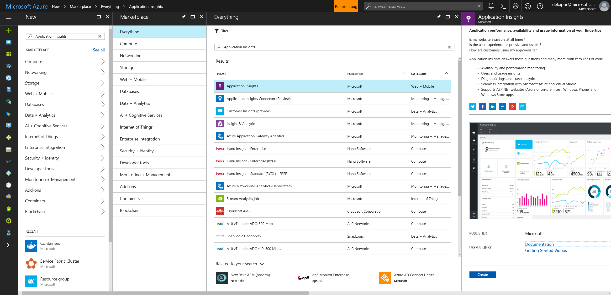

# Event analysis and visualization with Application Insights

Azure Application Insights is an extensible platform for application monitoring and diagnostics. It includes a powerful analytics and querying tool, customizable dashboard and visualizations, and further options including automated alerting. It is the recommended platform for monitoring and diagnostics for Service Fabric applications and services.

## Setting up Application Insights

### Creating an AI Resource

To create an AI resource, head over to the Azure Marketplace, and search for "Application Insights". It should show up as the first solution (it is under category "Web + Mobile"). Click **Create** when you are looking at the right resource (confirm that your path matches the image below).



You will need to fill out some information to provision the resource correctly. In the *Application Type* field, use "ASP.NET web application" if you will be using any of Service Fabric's programming models or publishing a .NET application to the cluster. Use "General" if you will be deploying guest executables and containers. In general, default to using "ASP.NET web application" to keep your options open in the future. The name is up to your preference, and both the resource group and subscription are changeable post-deployment of the resource. We recommend that your AI resource is in the same resource group as your cluster. If you need more information, please see [Create an Application Insights resource](../application-insights/app-insights-create-new-resource.md)

You need the AI Instrumentation Key to configure AI with your event aggregation tool. Once your AI resource is set up (takes a few minutes after the deployment is validated), navigate to it and find the **Properties** section on the left navigation bar. A new blade will open up that shows an *INSTRUMENTATION KEY*. If you need to change the subscription or resource group of the resource, it can be done here as well.

### Configuring AI with WAD

There are two primary ways to send data from WAD to Azure AI, which is achieved by adding an AI sink to the WAD configuration, as detailed in [this article](../monitoring-and-diagnostics/azure-diagnostics-configure-application-insights.md).

#### Add an AI Instrumentation Key when creating a cluster in Azure portal


When creating a cluster, if Diagnostics is turned "On", an optional field to enter an Application Insights Instrumentation key will show. If you paste your AI IKey here, the AI sink will be automatically configured for you in the Resource Manager template that is used to deploy your cluster.

#### Add the AI Sink to the Resource Manager template

In the "WadCfg" of the Resource Manager template, add a "Sink" by including the following two changes:

1. Add the sink configuration:

    ```json
    "SinksConfig": {
        "Sink": [
            {
                "name": "applicationInsights",
                "ApplicationInsights": "***ADD INSTRUMENTATION KEY HERE***"
            }
        ]
    }

    ```

2. Include the Sink in the DiagnosticMonitorConfiguration by adding the following line in "DiagnosticMonitorConfiguration" of the "WadCfg":

    ```json
    "sinks": "applicationInsights"
    ```

In both the code snippets above, the name "applicationInsights" was used to describe the sink. This is not a requirement and as long as the name of the sink is included in "sinks", you can set the name to any string.

Currently, logs from the cluster will show up as traces in AI's log viewer. Since most of the traces coming from the infrastructure level are of type "Information", you can also consider changing the sink configuration to only send logs of type "Critical" or "Error". This can be done by adding "Channels" to your sink, as demonstrated in [this article](../monitoring-and-diagnostics/azure-diagnostics-configure-application-insights.md).

>[!NOTE]
>If you use an incorrect AI IKey either in portal or in your Resource Manager template, you will have to manually change the key and update the cluster / redeploy it. 

### Configuring AI with EventFlow

If you are using EventFlow to aggregate events, make sure to import the `Microsoft.Diagnostics.EventFlow.Output.ApplicationInsights`NuGet package. The following has to be included in the *outputs* section of the *eventFlowConfig.json*:

```json
"outputs": [
    {
        "type": "ApplicationInsights",
        // (replace the following value with your AI resource's instrumentation key)
        "instrumentationKey": "00000000-0000-0000-0000-000000000000"
    }
]
```

Make sure to make the required changes in your filters, as well as include any other inputs (along with their respective NuGet packages).

## AI.SDK

It is generally recommended to use EventFlow and WAD as aggregation solutions, because they allow for a more modular approach to diagnostics and monitoring, i.e. if you want to change your outputs from EventFlow, it requires no change to your actual instrumentation, just a simple modification to your config file. If, however, you decide to invest in using Application Insights and are not likely to change to a different platform, you should look into using AI's new SDK for aggregating events and sending them to AI. This means that you will no longer have to configure EventFlow to send your data to AI, but instead will install the ApplicationInsight's Service Fabric NuGet package. Details on the package can be found [here](https://github.com/Microsoft/ApplicationInsights-ServiceFabric).

[Application Insights support for Microservices and Containers](https://azure.microsoft.com/app-insights-microservices/) shows you some of the new features that are being worked on (currently still in beta), which allow you to have richer out-of-the-box monitoring options with AI. These include dependency tracking (used in building an AppMap of all your services and applications in a cluster and the communication between them), and better correlation of traces coming from your services (helps in better pinpointing an issue in the workflow of an app or service).

If you are developing in .NET and will likely be using some of Service Fabric's programming models, and are willing to use AI as your platform for visualizing and analyzing event and log data, then we recommend that you go via the AI SDK route as your monitoring and diagnostics workflow. Read [this](../application-insights/app-insights-asp-net-more.md) and [this](../application-insights/app-insights-asp-net-trace-logs.md) to get started with using AI to collect and display your logs.

## Navigating the AI resource in Azure portal

Once you have configured AI as an output for your events and logs, information should start to show up in your AI resource in a few minutes. Navigate to the AI resource, which will take you to the AI resource dashboard. Click **Search** in the AI taskbar to see the latest traces that it has received, and to be able to filter through them.

*Metrics Explorer* is a useful tool for creating custom dashboards based on metrics that your applications, services, and cluster may be reporting. See [Exploring Metrics in Application Insights](../application-insights/app-insights-metrics-explorer.md) to set up a few charts for yourself based on the data you are collecting.

Clicking **Analytics** will take you to the Application Insights Analytics portal, where you can query events and traces with greater scope and optionality. Read more about this at [Analytics in Application Insights](../application-insights/app-insights-analytics.md).

## Next steps

* [Set up Alerts in AI](../application-insights/app-insights-alerts.md) to be notified about changes in performance or usage
* [Smart Detection in Application Insights](../application-insights/app-insights-proactive-diagnostics.md) performs a proactive analysis of the telemetry being sent to AI to warn you of potential performance problems