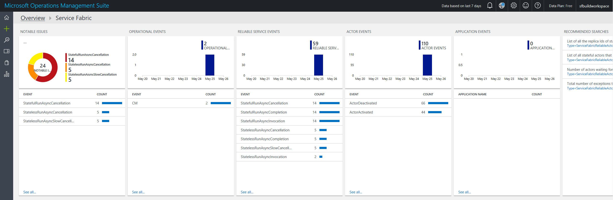

# Event analysis and visualization with OMS

Operations Management Suite (OMS) is a collection of management services that help with monitoring and diagnostics for applications and services hosted in the cloud. To get a more detailed overview of OMS and what it offers, read [What is OMS?](../operations-management-suite/operations-management-suite-overview.md)

## Log Analytics and the OMS workspace

Log Analytics collects data from managed resources, including an Azure storage table or an agent, and maintains it in a central repository. The data can then be used for analysis, alerting, and visualization, or further exporting. Log Analytics supports events, performance data, or any other custom data.

When OMS is configured, you will have access to a specific *OMS workspace*, from where data can be queried or visualized in dashboards.

After data is received by Log Analytics, OMS has several *Management Solutions* that are prepackaged solutions to monitor incoming data, customized to several scenarios. These include a *Service Fabric Analytics* solution and a *Containers* solution, which are the two most relevant ones to diagnostics and monitoring when using Service Fabric clusters. There are several others as well that are worth exploring, and OMS also allows for the creation of custom solutions, which you can read more about [here](https://docs.microsoft.com/azure/operations-management-suite/operations-management-suite-solutions). Each solution that you choose to use for a cluster will be configured in the same OMS workspace, alongside Log Analytics. Workspaces allow for custom dashboards and visualization of data, and modifications to the data you want to collect, process, and analyze.

## Setting up an OMS workspace with the Service Fabric Solution

It is recommended that you include the Service Fabric Solution in your OMS workspace, since it provides a useful dashboard that shows the various incoming log channels from the infrastructure and application level, and the able to query Service Fabric specific logs. Here is what a relatively simple Service Fabric Solution looks like, with a single application deployed on the cluster:

There are two ways to provision and configure an OMS workspace, either through a Resource Manager template or directly from Azure Marketplace. Use the former when you are deploying a cluster, and the latter if you already have a cluster deployed with Diagnostics enabled.

### Deploying OMS using a Resource Management template

This happens at the cluster creation stage - when deploying a cluster using a Resource Manager template, the template can also create a new OMS workspace, add the Service Fabric Solution to it, and configure it to read data from the appropriate storage tables.

>[!NOTE]
>For this to work, Diagnostics has to be enabled in order for the Azure storage tables to exist for OMS / Log Analytics to read information in from.

[Here](https://azure.microsoft.com/resources/templates/service-fabric-oms/) is a sample template that you can use and modify as per requirement, which performs above actions. In the case that you want more optionality, there are a few more templates that give you different options depending on where in the process you might be of setting up an OMS workspace - they can be found at [Service Fabric and OMS templates](https://azure.microsoft.com/resources/templates/?term=service+fabric+OMS).

### Deploying OMS using through Azure Marketplace

If you prefer to add an OMS workspace after you have deployed a cluster, head over to Azure Marketplace and look for *"Service Fabric Analytics"*. There should only be one resource that shows up, within the "Monitoring + Management" category, seen below:

Clicking **Create** will ask you for an OMS workspace. Click **Select a workspace** and then **Create a new workspace**. Fill out the required entries - the only requirement here is that the subscription for the Service Fabric cluster and the OMS workspace should be the same. Once your entries have been validated, your OMS workspace will deploy in a few minutes. While it finishes deploying, the creation of the Service Fabric solution blade will still remain open. Make sure that the same workspace shows up under *OMS Workspace* and hit **Create** at the bottom, to add the Service Fabric solution to the workspace.

## Using the OMS Agent

It is recommended to use EventFlow and WAD as aggregation solutions because they allow for a more modular approach to diagnostics and monitoring. For example, if you want to change your outputs from EventFlow, it requires no change to your actual instrumentation, just a simple modification to your config file. If, however, you decide to invest in using OMS and are willing to continue using it for event analysis (does not have to be the only platform you use, but rather that it will be at least one of the platforms), we recommend that you explore setting up the [OMS agent](https://docs.microsoft.com/azure/log-analytics/log-analytics-windows-agents).

The process for doing this is relatively easy, since you just have to add the agent as a virtual machine scale set extension to your Resource Manager template, ensuring that it gets installed on each of your nodes. A sample Resource Manager template that deploys the OMS workspace with the Service Fabric solution (as above) and adds the agent to your nodes can be found [here](https://github.com/ChackDan/Service-Fabric/tree/master/ARM%20Templates/SF%20OMS%20Sample).

The advantages of this are the following:

* Richer data on the performance counters and metrics side
* Easy to configure data being collected from the cluster and make changes to it without redeploying your applications or the cluster, since changes to the settings of the agent can be done from the OMS workspace and will just reset the agent automatically. To configure the OMS agent to pick up specific performance counters, go to the workspace **Home > Settings > Data > Windows Performance Counters** and pick the data you would like to see collected
* Data shows up faster than it having to be stored before being picked up by OMS / Log Analytics
* Monitoring containers is much easier, since it can pick up docker logs (stdout, stderror) and stats (performance metrics on container and node levels)

The main consideration here is that since it is an agent, it will be deployed on your cluster alongside all your applications, so there will be some minimal impact to the performance of your applications on the cluster.

## Monitoring Containers

When deploying containers to a Service Fabric cluster, it is recommended that the cluster has been set up with the OMS agent and that the Containers solution has been added to your OMS workspace to enable monitoring and diagnostics. Here is what the containers solution looks like in a workspace:

The agent enables the collection of several container-specific logs that can be queried in OMS, or used to visualized performance indicators. The log types that are collected are:

* ContainerInventory: shows information about container location, name, and images
* ContainerImageInventory: information about deployed images, including IDs or sizes
* ContainerLog: specific error logs, docker logs (stdout, etc.), and other entries
* ContainerServiceLog: docker daemon commands that have been run
* Perf: performance counters including container cpu, memory, network traffic, disk i/o, and custom metrics from the host machines

This article covers the steps required to set up container monitoring for your cluster. To learn more about OMS's Containers solution, check out their [documentation](../log-analytics/log-analytics-containers.md).

To set up the Container solution in your workspace, make sure you have the OMS agent deployed on your cluster's nodes by following the steps mentioned above. Once the cluster is ready, deploy a container to it. Bear in mind that the first time a container image is deployed to a cluster, it takes several minutes to download the image depending on its size.

In Azure Marketplace, search for *Containers* and create a Containers resource (under the Monitoring + Management category).

In the creation step, it requests an OMS workspace. Select the one that was created with the deployment above. This step adds a Containers solution within your OMS workspace, and is automatically detected by the OMS agent deployed by the template. The agent will start gathering data on the containers processes in the cluster, and less than 15 minutes or so, you should see the solution light up with data, as in the image of the dashboard above.

## Next steps

Explore the following OMS tools and options to customize a workspace to your needs:

* For on-premise clusters, OMS offers a Gateway (HTTP Forward Proxy) that can be used to send data to OMS. Read more about that in [Connecting computers without Internet access to OMS using the OMS Gateway](../log-analytics/log-analytics-oms-gateway.md)
* Configure OMS to set up [automated alerting](../log-analytics/log-analytics-alerts.md) to aid in detecting and diagnostics
* Get familiarized with the [log search and querying](../log-analytics/log-analytics-log-searches.md) features offered as part of Log Analytics