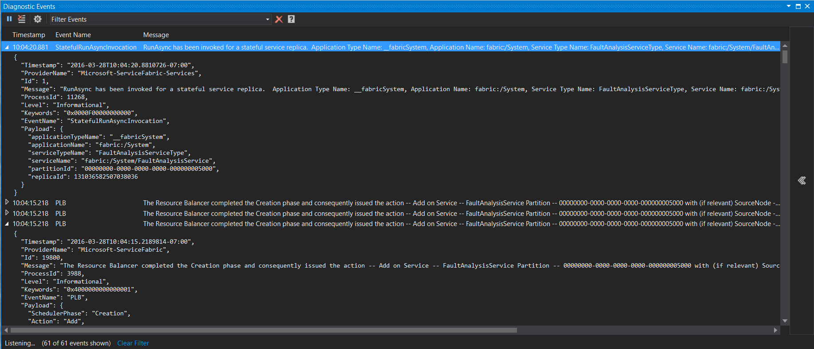

# Monitor and diagnose services in a local machine development setup
> [!div class="op_single_selector"]
> * [Windows](service-fabric-diagnostics-how-to-monitor-and-diagnose-services-locally.md)
> * [Linux](service-fabric-diagnostics-how-to-monitor-and-diagnose-services-locally-linux.md)
> 
> 

Monitoring, detecting, diagnosing, and troubleshooting allow for services to continue with minimal disruption to the user experience. While monitoring and diagnostics are critical in an actual deployed production environment, the efficiency will depend on adopting a similar model during development of services to ensure they work when you move to a real-world setup. Service Fabric makes it easy for service developers to implement diagnostics that can seamlessly work across both single-machine local development setups and real-world production cluster setups.

## Event Tracing for Windows
[Event Tracing for Windows](https://msdn.microsoft.com/library/windows/desktop/bb968803.aspx) (ETW) is the recommended technology for tracing messages in Service Fabric. Some benefits of using ETW are:

* **ETW is fast.** It was built as a tracing technology that has minimal impact on code execution times.
* **ETW tracing works seamlessly across local development environments and also real-world cluster setups.** This  means you don't have to rewrite your tracing code when you are ready to deploy your code to a real cluster.
* **Service Fabric system code also uses ETW for internal tracing.** This allows you to view your application traces interleaved with Service Fabric system traces. It also helps you to more easily understand the sequences and interrelationships between your application code and events in the underlying system.
* **There is built-in support in Service Fabric Visual Studio tools to view ETW events.** ETW events appear in the Diagnostic Events view of Visual Studio once Visual Studio is correctly configured with Service Fabric. 

## View Service Fabric system events in Visual Studio
Service Fabric emits ETW events to help application developers understand what's happening in the platform. If you haven't already done so, go ahead and follow the steps in [Creating your first application in Visual Studio](service-fabric-tutorial-create-dotnet-app.md). This information will help you get an application up and running with the Diagnostics Events Viewer showing the trace messages.

1. If the diagnostics events window does not automatically show, Go to the **View** tab in Visual Studio, choose **Other Windows** and then **Diagnostic Events Viewer**.
2. Each event has standard metadata information that tells you the node, application and service the event is coming from. You can also filter the list of events by using the **Filter events** box at the top of the events window. For example, you can filter on **Node Name** or **Service Name.** And when you're looking at event details, you can also pause by using the **Pause** button at the top of the events window and resume later without any loss of events.
   
   

## Add your own custom traces to the application code
The Service Fabric Visual Studio project templates contain sample code. The code shows how to add custom application code ETW traces that show up in the Visual Studio ETW viewer alongside system traces from Service Fabric. The advantage of this method is that metadata is automatically added to traces, and the Visual Studio Diagnostic Events Viewer is already configured to display them.

For projects created from the **service templates** (stateless or stateful) just search for the `RunAsync` implementation:

1. The call to `ServiceEventSource.Current.ServiceMessage` in the `RunAsync` method shows an example of a custom ETW trace from the application code.
2. In the **ServiceEventSource.cs** file, you will find an overload for the `ServiceEventSource.ServiceMessage` method that should be used for high-frequency events due to performance reasons.

For projects created from the **actor templates** (stateless or stateful):

1. Open the **"ProjectName".cs** file where *ProjectName* is the name you chose for your Visual Studio project.  
2. Find the code `ActorEventSource.Current.ActorMessage(this, "Doing Work");` in the *DoWorkAsync* method.  This is an example of a custom ETW trace written from application code.  
3. In file **ActorEventSource.cs**, you will find an overload for the `ActorEventSource.ActorMessage` method that should be used for high-frequency events due to performance reasons.

After adding custom ETW tracing to your service code, you can build, deploy, and run the application again to see your event(s) in the Diagnostic Events Viewer. If you debug the application with **F5**, the Diagnostic Events Viewer will open automatically.

## Next steps
The same tracing code that you added to your application above for local diagnostics will work with tools that you can use to view these events when running your application on an Azure cluster. Check out these articles that discuss the different options for the tools and describe how you can set them up.

* [How to collect logs with Azure Diagnostics](service-fabric-diagnostics-how-to-setup-wad.md)
* [Event aggregation and collection using EventFlow](service-fabric-diagnostics-event-aggregation-eventflow.md)

