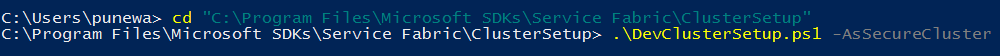
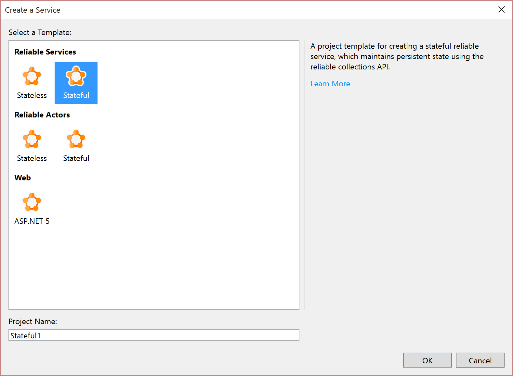
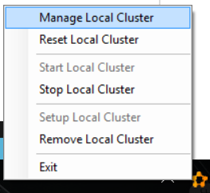
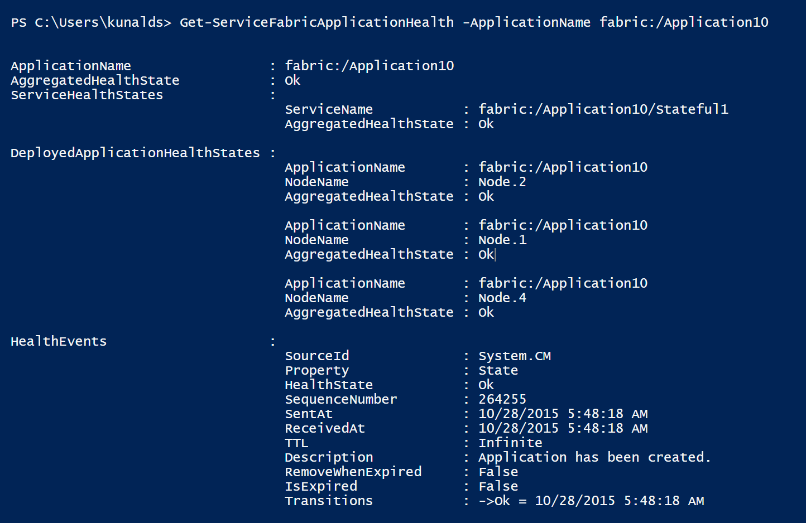
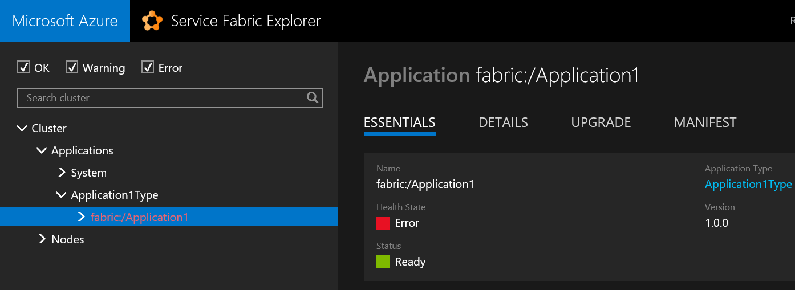

# Report and check service health
When your services encounter problems, your ability to respond to and fix incidents and outages depends on your ability to detect the issues quickly. If you report problems and failures to the Azure Service Fabric health manager from your service code, you can use standard health monitoring tools that Service Fabric provides to check the health status.

There are three ways that you can report health from the service:

* Use [Partition](https://docs.microsoft.com/dotnet/api/system.fabric.istatefulservicepartition) or [CodePackageActivationContext](https://docs.microsoft.com/dotnet/api/system.fabric.codepackageactivationcontext) objects.  
  You can use the `Partition` and `CodePackageActivationContext` objects to report the health of elements that are part of the current context. For example, code that runs as part of a replica can report health only on that replica, the partition that it belongs to, and the application that it is a part of.
* Use `FabricClient`.   
  You can use `FabricClient` to report health from the service code if the cluster is not [secure](service-fabric-cluster-security.md) or if the service is running with admin privileges. Most real-world scenarios do not use unsecured clusters, or provide admin privileges. With `FabricClient`, you can report health on any entity that is a part of the cluster. Ideally, however, service code should only send reports that are related to its own health.
* Use the REST APIs at the cluster, application, deployed application, service, service package, partition, replica, or node levels. This can be used to report health from within a container.

This article walks you through an example that reports health from the service code. The example also shows how the tools provided by Service Fabric can be used to check the health status. This article is intended to be a quick introduction to the health monitoring capabilities of Service Fabric. For more detailed information, you can read the series of in-depth articles about health that start with the link at the end of this article.

## Prerequisites
You must have the following installed:

* Visual Studio 2015 or Visual Studio 2019
* Service Fabric SDK

## To create a local secure dev cluster
* Open PowerShell with admin privileges, and run the following commands:



## To deploy an application and check its health
1. Open Visual Studio as an administrator.
1. Create a project by using the **Stateful Service** template.
   
    
1. Press **F5** to run the application in debug mode. The application is deployed to the local cluster.
1. After the application is running, right-click the Local Cluster Manager icon in the notification area and select **Manage Local Cluster** from the shortcut menu to open Service Fabric Explorer.
   
    
1. The application health should be displayed as in this image. At this time, the application should be healthy with no errors.
   
    
1. You can also check the health by using PowerShell. You can use ```Get-ServiceFabricApplicationHealth``` to check an application's health, and you can use ```Get-ServiceFabricServiceHealth``` to check a service's health. The health report for the same application in PowerShell is in this image.
   
    

## To add custom health events to your service code
The Service Fabric project templates in Visual Studio contain sample code. The following steps show how you can report custom health events from your service code. Such reports show up automatically in the standard tools for health monitoring that Service Fabric provides, such as Service Fabric Explorer, Azure portal health view, and PowerShell.

1. Reopen the application that you created previously in Visual Studio, or create a new application by using the **Stateful Service** Visual Studio template.
1. Open the Stateful1.cs file, and find the `myDictionary.TryGetValueAsync` call in the `RunAsync` method. You can see that this method returns a `result` that holds the current value of the counter because the key logic in this application is to keep a count running. If this application was a real application, and if the lack of result represented a failure, you would want to flag that event.
1. To report a health event when the lack of result represents a failure, add the following steps.
   
    a. Add the `System.Fabric.Health` namespace to the Stateful1.cs file.
   
    ```csharp
    using System.Fabric.Health;
    ```
   
    b. Add the following code after the `myDictionary.TryGetValueAsync` call
   
    ```csharp
    if (!result.HasValue)
    {
        HealthInformation healthInformation = new HealthInformation("ServiceCode", "StateDictionary", HealthState.Error);
        this.Partition.ReportReplicaHealth(healthInformation);
    }
    ```
    We report replica health because it's being reported from a stateful service. The `HealthInformation` parameter stores information about the health issue that's being reported.
   
    If you had created a stateless service, use the following code
   
    ```csharp
    if (!result.HasValue)
    {
        HealthInformation healthInformation = new HealthInformation("ServiceCode", "StateDictionary", HealthState.Error);
        this.Partition.ReportInstanceHealth(healthInformation);
    }
    ```
1. If your service is running with admin privileges or if the cluster is not [secure](service-fabric-cluster-security.md), you can also use `FabricClient` to report health as shown in the following steps.  
   
    a. Create the `FabricClient` instance after the `var myDictionary` declaration.
   
    ```csharp
    var fabricClient = new FabricClient(new FabricClientSettings() { HealthReportSendInterval = TimeSpan.FromSeconds(0) });
    ```
   
    b. Add the following code after the `myDictionary.TryGetValueAsync` call.
   
    ```csharp
    if (!result.HasValue)
    {
       var replicaHealthReport = new StatefulServiceReplicaHealthReport(
            this.Context.PartitionId,
            this.Context.ReplicaId,
            new HealthInformation("ServiceCode", "StateDictionary", HealthState.Error));
        fabricClient.HealthManager.ReportHealth(replicaHealthReport);
    }
    ```
1. Let's simulate this failure and see it show up in the health monitoring tools. To simulate the failure, comment out the first line in the health reporting code that you added earlier. After you comment out the first line, the code will look like the following example.
   
    ```csharp
    //if(!result.HasValue)
    {
        HealthInformation healthInformation = new HealthInformation("ServiceCode", "StateDictionary", HealthState.Error);
        this.Partition.ReportReplicaHealth(healthInformation);
    }
    ```
   This code fires the health report each time `RunAsync` executes. After you make the change, press **F5** to run the application.
1. After the application is running, open Service Fabric Explorer to check the health of the application. This time, Service Fabric Explorer shows that the application is unhealthy. The application shows as unhealthy because the error that was reported from the code that we added previously.
   
    
1. If you select the primary replica in the tree view of Service Fabric Explorer, you will see that **Health State** indicates an error, too. Service Fabric Explorer also displays the health report details that were added to the `HealthInformation` parameter in the code. You can see the same health reports in PowerShell and the Azure portal.
   
    

This report remains in the health manager until it is replaced by another report or until this replica is deleted. Because we did not set `TimeToLive` for this health report in the `HealthInformation` object, the report never expires.

We recommend that health should be reported on the most granular level, which in this case is the replica. You can also report health on `Partition`.

```csharp
HealthInformation healthInformation = new HealthInformation("ServiceCode", "StateDictionary", HealthState.Error);
this.Partition.ReportPartitionHealth(healthInformation);
```

To report health on `Application`, `DeployedApplication`, and `DeployedServicePackage`, use  `CodePackageActivationContext`.

```csharp
HealthInformation healthInformation = new HealthInformation("ServiceCode", "StateDictionary", HealthState.Error);
var activationContext = FabricRuntime.GetActivationContext();
activationContext.ReportApplicationHealth(healthInformation);
```

## Next steps
* [Deep dive on Service Fabric health](service-fabric-health-introduction.md)
* [REST API for reporting service health](https://docs.microsoft.com/rest/api/servicefabric/report-the-health-of-a-service)
* [REST API for reporting application health](https://docs.microsoft.com/rest/api/servicefabric/report-the-health-of-an-application)

