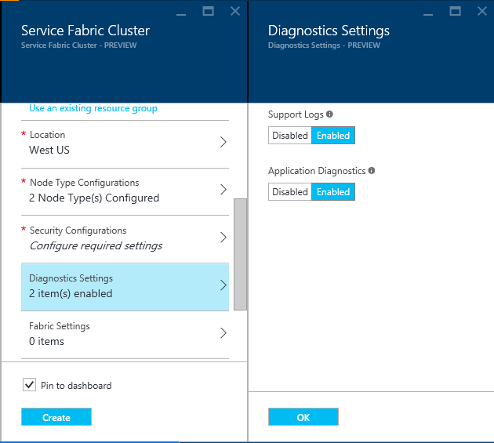
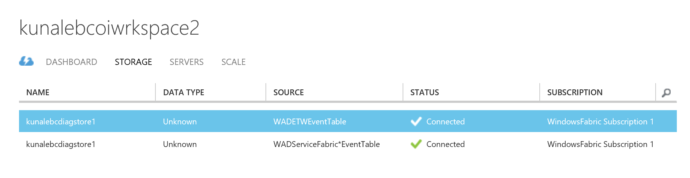
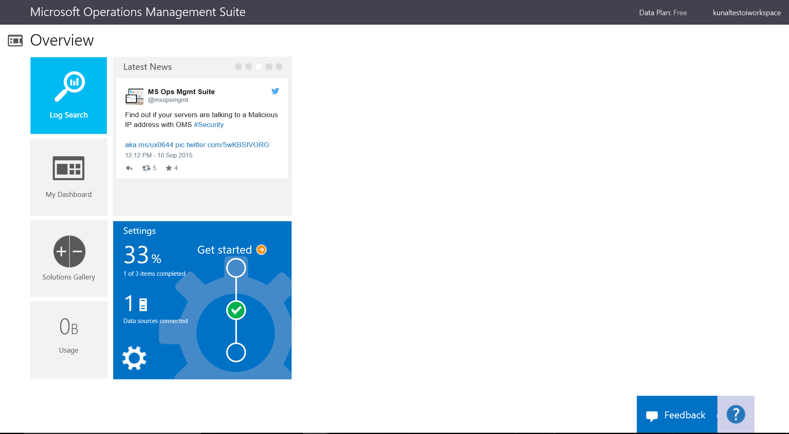
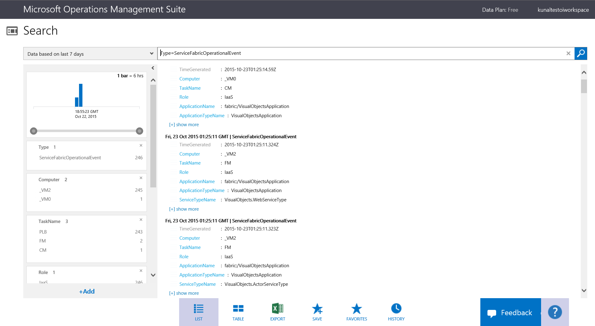

<properties
   pageTitle="How to collect logs with Azure Diagnostics and Azure Operational Insights | Microsoft Azure"
   description="This article describes how to set up Azure Diagnostics and Azure Operational Insights to collect logs from a Service Fabric cluster running in Azure."
   services="service-fabric"
   documentationCenter=".net"
   authors="kunaldsingh"
   manager="timlt"
   editor=""/>

<tags
   ms.service="service-fabric"
   ms.devlang="dotnet"
   ms.topic="article"
   ms.tgt_pltfrm="NA"
   ms.workload="NA"
   ms.date="10/20/2015"
   ms.author="kunalds"/>


# Collect logs from a Service Fabric cluster by using Azure Diagnostics and Operational Insights

When you're running an Azure Service Fabric cluster, it's a good idea to collect the logs from all the nodes in a central location. Having the logs in a central location makes it easy to analyze and troubleshoot issues in your cluster or in the applications and services running in that cluster. One way to upload and collect logs is to use the Azure Diagnostics extension, which uploads logs to Azure Storage.

Azure Operational Insights (part of the Microsoft Operations Management Suite) is an SaaS solution that makes it easy to analyze and search logs. The steps below describe how to set up the Azure Diagnostics extension on the VMs in a cluster to upload logs to a central store, and then to configure Operational Insights to pull the logs so that you can view them in the Operational Insights portal.

Operational Insights identifies the sources of the different types of logs uploaded from a Service Fabric cluster by the names of the storage tables that they are stored in. This means the Azure Diagnostics extension must be configured to upload the logs to storage tables with names that match what Operational Insights will look for. The configuration settings examples in this document will show you what the names of the storage tables should be.

## Suggested reading
* [Azure Diagnostics](../cloud-services/cloud-services-dotnet-diagnostics.md) (Related to Azure Cloud Services but has good information and examples)
* [Operational Insights](https://azure.microsoft.com/services/operational-insights/)
* [Azure Resource Manager](https://azure.microsoft.com/resource-group-overview/)

## Prerequisites
These tools will be used to perform some of the operations in this document:
* [Azure PowerShell](https://azure.microsoft.com/powershell-install-configure/)
* [Azure Resource Manager client](https://github.com/projectkudu/ARMClient)

## Different log sources that you may want to collect
1. **Service Fabric logs:** Emitted by the platform to standard ETW and EventSource channels. Logs can be one of several types:
  - Operational events: Logs for operations performed by the Service Fabric platform. Examples include creation of applications and services, node state changes, and upgrade information.
  - [Actor Programming Model events](https://azure.microsoft.com/service-fabric-reliable-actors-diagnostics/)
  - [Reliable Services Programming Model events](https://azure.microsoft.com/service-fabric-reliable-services-diagnostics/)
2. **Application events:** Events emitted from your services code and written out by using the EventSource helper class provided in the Visual Studio templates. For more information on how to write logs from your application, refer to [this article about monitoring and diagnosing services in a local machine setup](https://azure.microsoft.com/service-fabric-diagnostics-how-to-monitor-and-diagnose-services-locally/).


## Deploy the Diagnostics extension to a Service Fabric cluster to collect and upload logs
The first step in collecting logs is to deploy the Diagnostics extension on each of the VMs in the Service Fabric cluster. The Diagnostics extension collects logs on each VM and uploads them to the storage account you specify. The steps vary a little based on whether you use the Azure portal or Azure Resource Manager and if the deployment is being done as part of cluster creation or for a cluster that already exists. Let's look at the steps for each scenario.

### Deploy the Diagnostics extension as part of cluster creation through the portal
To deploy Diagnostics to the VMs in the cluster as part of cluster creation, the Diagnostics setting shown in the image below is used. It is **On** by default.


### Deploy the Diagnostics extension as part of cluster creation by using Azure Resource Manager
To create a cluster by using Resource Manager, you need to add the Diagnostics configuration JSON to the full cluster Resource Manager template before creating the cluster. We provide a sample five-VM cluster Resource Manager template with Diagnostics configuration added to it as part of our Resource Manager template samples. You can see it at this location in the Azure Samples gallery: [Five-node cluster with Diagnostics Resource Manager template sample](https://github.com/Azure/azure-quickstart-templates/tree/master/service-fabric-cluster-5-node-1-nodetype-wad).

To see the Diagnostics setting in the Resource Manager template, search for **WadCfg.** To create a cluster with this template, just press the **Deploy to Azure** button available at the link above.
Alternatively, you can download the Resource Manager sample, makes changes to it, and create a cluster with the modified template by using the `New-AzureResourceGroupDeployment` command in an Azure PowerShell window. See the information below for the parameters you will need to pass in to the command.

Additionally, before calling this deployment command, you may need to do some setup, including adding your Azure account(`Add-AzureAccount`), choosing a subscription(`Select-AzureSubscription`), switching to Resource Manager mode(`Switch-AzureMode AzureResourceManager`), and creating the resource group if you haven't already(`New-AzureResourceGroup`).

```powershell
New-AzureResourceGroupDeployment -ResourceGroupName $resourceGroupName -Name $deploymentName -TemplateFile $pathToARMConfigJsonFile -TemplateParameterFile $pathToParameterFile –Verbose
```

### <a name="deploywadarm"></a>Deploy the Diagnostics extension to an existing cluster
If you have an existing cluster that doesn't have Diagonistics deployed, you can add it by following these steps.
Create the two files, WadConfigUpdate.json and WadConfigUpdateParams.json, by using the JSON below.

##### WadConfigUpdate.json
```json
{
    "$schema": "http://schema.management.azure.com/schemas/2015-01-01/deploymentTemplate.json#",
  "contentVersion": "1.0.0.0",

  "parameters": {
        "vmNamePrefix": {
      "type": "string"
    },
        "applicationDiagnosticsStorageAccountName": {
      "type": "string"
    },
        "vmCount": {
            "type": "int"
    }
  },

  "resources": [
    {
      "apiVersion": "2015-05-01-preview",
      "type": "Microsoft.Compute/virtualMachines/extensions",
            "name": "[concat(parameters('vmNamePrefix'),copyIndex(0),'/Microsoft.Insights.VMDiagnosticsSettings')]",
            "location": "[resourceGroup().location]",
      "properties": {
        "type": "IaaSDiagnostics",
                "typeHandlerVersion": "1.5",
        "publisher": "Microsoft.Azure.Diagnostics",
                "autoUpgradeMinorVersion": true,
        "settings": {
                    "WadCfg": {
            "DiagnosticMonitorConfiguration": {
                            "overallQuotaInMB": "50000",
                "EtwProviders": {
                    "EtwEventSourceProviderConfiguration": [
                        {
                            "provider": "Microsoft-ServiceFabric-Actors",
                            "scheduledTransferKeywordFilter": "1",
                                        "scheduledTransferPeriod": "PT5M",
                            "DefaultEvents": { "eventDestination": "ServiceFabricReliableActorEventTable" }
                        },
                        {
                            "provider": "Microsoft-ServiceFabric-Services",
                            "DefaultEvents": { "eventDestination": "ServiceFabricReliableServiceEventTable" },
                                        "scheduledTransferPeriod": "PT5M"
                        }
                    ],
                    "EtwManifestProviderConfiguration": [
                        {
                            "provider": "cbd93bc2-71e5-4566-b3a7-595d8eeca6e8",
                            "scheduledTransferKeywordFilter": "4611686018427387904",
                                        "scheduledTransferLogLevelFilter": "Information",
                                        "scheduledTransferPeriod": "PT5M",
                            "DefaultEvents": { "eventDestination": "ServiceFabricSystemEventTable" }
                        }
                    ]
                }
            }
    },
                    "StorageAccount": "[parameters('applicationDiagnosticsStorageAccountNamee')]"
                },
                "protectedSettings": {
                    "storageAccountName": "[parameters('applicationDiagnosticsStorageAccountName')]",
                    "storageAccountKey": "[listKeys(resourceId('Microsoft.Storage/storageAccounts', parameters('applicationDiagnosticsStorageAccountName')),'2015-05-01-preview').key1]",
                    "storageAccountEndPoint": "https://core.windows.net/"
                }
            },
            "copy": {
                "name": "vmExtensionLoop",
                "count": "[parameters('vmCount')]"
            }
        }
    ],

    "outputs": {
    }
}
```

##### WadConfigUpdateParams.json
Replace the vmNamePrefix with the prefix you chose for VM names while creating your cluster. Then edit the vmStorageAccountName to be the storage account where you want to upload the logs from the VMs.
```json
{
    "$schema": "http://schema.management.azure.com/schemas/2015-01-01/deploymentParameters.json#",
    "contentVersion": "1.0.0.0",
    "parameters": {
        "vmNamePrefix": {
            "value": "VM"
        },
        "applicationDiagnosticsStorageAccountName": {
            "value": "testdiagacc"
        },
        "vmCount": {
            "value": 5
        }
    }
}
```

After creating the JSON files as described above, change them for the specifics of your environment. Then call the following command, passing in the name of the resource group for your Service Fabric cluster. Once this command is run successfully, Diagnostics will be deployed on all the VMs and will start uploading the logs from the cluster to tables in the specified Azure Storage account.

Additionally, before calling this deployment command you may need to do some setup, including adding your Azure account(`Add-AzureAccount`), choosing the right subscription(`Select-AzureSubscription`), and switching to Resource Manager mode(`Switch-AzureMode AzureResourceManager`).
```powershell
New-AzureResourceGroupDeployment -ResourceGroupName $resourceGroupName -Name $deploymentName -TemplateFile $pathToWADConfigJsonFile -TemplateParameterFile $pathToParameterFile –Verbose
```

## Set up Operational Insights to view and search cluster logs
Once Diagnostics is set up on the cluster and is uploading logs to a storage account, the next step is to set up Operational Insights so you can view, search, and query all the cluster logs through the of the Operational Insights portal.

### Create an Operational Insights Workspace
To see the steps for creating an Operational Insights workspace, go to the article below. Note that it describes two different ways to create a workspace. Choose the Azure portal and subscription-based approach. You will need the name of the Operational Insights workspace in the later sections of this document. Create the Operational Insights workspace by using the same subscription that you used to create all the cluster resources, including storage accounts.

[Operational Insights Onboarding](https://technet.microsoft.com/library/mt484118.aspx)

### Configure an Operational Insights workspace to show the cluster logs
Once you have created the Operational Insights workspace as described above, the next step is to configure the workspace to pull the logs from the Azure storage tables where they are being uploaded from the cluster by the Diagnostics extension. Currently this configuration can't be done through the Operational Insights portal and can only be done through PowerShell commands. Run the following PowerShell script:
```powershell
<#
    This script will configure an Operations Management Suite workspace (aka Operational Insights workspace) to read Diagnostics from an Azure Storage account.

    It will enable all supported data types (currently Windows Event Logs, Syslog, Service Fabric Events, ETW Events and IIS Logs).

    It supports both classic and Resource Manager storage accounts.

    If you have more than one OMS workspace you will be prompted for the workspace to configure.

    If you have more than one storage account you will be prompted for which storage account to configure.
#>

Add-AzureAccount

Switch-AzureMode -Name AzureResourceManager

$validTables = "WADServiceFabric*EventTable", "WADETWEventTable"

function Select-Workspace {

    $workspace = ""

    $allWorkspaces = Get-AzureOperationalInsightsWorkspace  

    switch ($allWorkspaces.Count) {
        0 {Write-Error "No Operations Management Suite workspaces found"}
        1 {return $allWorkspaces}
        default {
            $uiPrompt = "Enter the number corresponding to the workspace you want to configure.`n"

            $count = 1
            foreach ($workspace in $allWorkspaces) {
                $uiPrompt += "$count. " + $workspace.Name + " (" + $workspace.CustomerId + ")`n"
                $count++
            }
            $answer = (Read-Host -Prompt $uiPrompt) - 1
            $workspace = $allWorkspaces[$answer]
        }  
    }
    return $workspace
}

function Select-StorageAccount {

    $storage = ""

    $allStorageAccounts = (get-azureresource -ResourceType Microsoft.ClassicStorage/storageAccounts) + (get-azureresource -ResourceType Microsoft.Storage/storageAccounts)

    switch ($allStorageAccounts.Count) {
        0 {Write-Error "No storage accounts found"}
        1 {$storage = $allStorageAccounts}
        default {

            $uiPrompt = "Enter the number corresponding to the storage account with diagnostics.`n"

            $count = 1
            foreach ($storageAccount in $allStorageAccounts) {
                $uiPrompt += "$count. " + $storageAccount.Name + " (" + $storageAccount.Location + ")`n"
                $count++
            }
            $answer = (Read-Host -Prompt $uiPrompt)

            $storage = $allStorageAccounts[$answer - 1]
        }
    }
    return $storage
}

$workspace = Select-Workspace
$storageAccount = Select-StorageAccount

$insightsName = $storageAccount.Name + $workspace.Name

$existingConfig = ""

try
{
    $existingConfig = Get-AzureOperationalInsightsStorageInsight -Workspace $workspace -Name $insightsName -ErrorAction Stop
}
catch [Hyak.Common.CloudException]
{
    # HTTP Not Found is returned if the storage insight doesn't exist
}

if ($existingConfig) {
    Set-AzureOperationalInsightsStorageInsight -Workspace $workspace -Name $insightsName -Tables $validTables -Containers $validContainers

} else {
    if ($storageAccount.ResourceType -eq "Microsoft.ClassicStorage/storageAccounts") {
        Switch-AzureMode -Name AzureServiceManagement
        $key = (Get-AzureStorageKey -StorageAccountName $storageAccount.Name).Primary
        Switch-AzureMode -Name AzureResourceManager
    } else {
        $key = (Get-AzureStorageAccountKey -ResourceGroupName $storageAccount.ResourceGroupName -Name $storageAccount.Name).Key1
    }
    New-AzureOperationalInsightsStorageInsight -Workspace $workspace -Name $insightsName -StorageAccountResourceId $storageAccount.ResourceId -StorageAccountKey $key -Tables $validTables -Containers $validContainers
}
```
Once you've configured the Operational Insights workspace to read from the Azure tables in your storage account, you should log into the portal, and go to the **Storage** tab for the Operational Insights resource. It should show something like this:


### Search and view logs in Operational Insights
After you've configured your Operational Insights workspace to read the logs from the specified storage account, it may take up to 10 minutes for the logs to show up in the Operational Insights UI. To ensure there are new logs generated, it's a good idea to deploy a Service Fabric application to your cluster because that will generate operational events from the Service Fabric platform.

1. To view the logs, select **Log Search** on the main page of the Operational Insights portal.


2. In the log search page, use the query **Type=ServiceFabricOperationalEvent** and you should see the operational logs from your cluster as shown below. To see all the Actor programming model logs, query for **Type=ServiceFabricReliableActorEvent**. To see all the logs from the Reliable Services programming model, type **Type=ServiceFabricReliableServiceEvent**.


### Sample queries to help troubleshoot issues
Here are examples of a few scenarios and the queries you can use to troubleshoot them:

1. **To find out if the RunAsync was called for a specific service by Service Fabric:** You many want to do this if you need to rule out whether a service is crashing while starting up. To do this, search by using a query similar to the one below, but replace the service and application name to match what you have deployed, and see if any results are returned:

    ```
    Type=ServiceFabricReliableServiceEvent AND ServiceName="fabric:/Application2/Stateless1" AND "RunAsync has been invoked"
    ```

2. **If you are running a stateful service and would like to see if any exceptions were thrown by it that were marked as failures by Service Fabric:** Find those events by using a query similar to this:

    ```
    Type=ServiceFabricReliableServiceEvent AND ServiceName="fabric:/Application2/Stateful1" AND TaskName=StatefulRunAsyncFailure
    ```

3. **To find events corresponding to any exceptions thrown by Actor methods in all the deployed applications and services:** A query like this may be used:

    ```
    Type=ServiceFabricReliableActorEvent AND TaskName=ActorMethodThrewException
    ```

## Update Diagnostics to collect and upload logs from new EventSource channels
To update Diagnostics to collect logs from new EventSource channels that represent a new application that you are about to deploy, you just need to perform the same steps as in the [section above](#deploywadarm) describing setup of Diagnostics for an existing cluster.

You will need to update the EtwEventSourceProviderConfiguration section in the WadConfigUpdate.json to add entries for the new EventSources before you apply the config update through the Resource Manager command. The table for upload will be the same (ETWEventTable), since that's the table that is configured for Operational Insights to read application ETW events from.


## Next steps
Check out the diagnostic events emitted for [Reliable Actors](service-fabric-reliable-actors-diagnostics.md) and [Reliable Services](service-fabric-reliable-services-diagnostics.md) to understand in more detail what events you should look into while troubleshooting issues.
