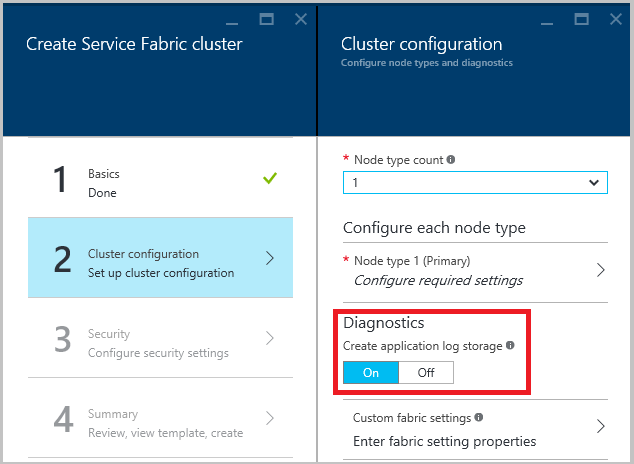

<properties
   pageTitle="How to collect logs with Azure Diagnostics | Microsoft Azure"
   description="This article describes how to set up Azure Diagnostics to collect logs from a Service Fabric cluster running in Azure."
   services="service-fabric"
   documentationCenter=".net"
   authors="ms-toddabel"
   manager="timlt"
   editor=""/>

<tags
   ms.service="service-fabric"
   ms.devlang="dotnet"
   ms.topic="article"
   ms.tgt_pltfrm="NA"
   ms.workload="NA"
   ms.date="06/24/2016"
   ms.author="toddabel"/>


# How to collect logs with Azure Diagnostics

When you're running an Azure Service Fabric cluster, it's a good idea to collect the logs from all the nodes in a central location. Having the logs in a central location makes it easy to analyze and troubleshoot issues in your cluster or in the applications and services running in that cluster. One way to upload and collect logs is to use the Azure Diagnostics extension, which uploads logs to Azure Storage. The logs are really not that useful directly in storage, but an external process can be used to read the events from storage and place them into a product such as [Elastic Search](service-fabric-diagnostic-how-to-use-elasticsearch.md) or another log parsing solution.

## Prerequisites
These tools will be used to perform some of the operations in this document:

* [Azure Diagnostics](../cloud-services/cloud-services-dotnet-diagnostics.md) (Related to Azure Cloud Services but has good information and examples)
* [Azure Resource Manager](../resource-group-overview.md)
* [Azure PowerShell](../powershell-install-configure.md)
* [Azure Resource Manager client](https://github.com/projectkudu/ARMClient)
* [Create a Windows Virtual machine with monitoring and diagnostics using Azure Resource Manager Template](../virtual-machines/virtual-machines-windows-extensions-diagnostics-template.md)


## Different log sources that you may want to collect
1. **Service Fabric logs:** Emitted by the platform to standard ETW and EventSource channels. Logs can be one of several types:
  - Operational events: Logs for operations performed by the Service Fabric platform. Examples include creation of applications and services, node state changes, and upgrade information.
  - [Actor Programming Model events](service-fabric-reliable-actors-diagnostics.md)
  - [Reliable Services Programming Model events](service-fabric-reliable-services-diagnostics.md)
2. **Application events:** Events emitted from your services code and written out by using the EventSource helper class provided in the Visual Studio templates. For more information on how to write logs from your application, refer to [this article about monitoring and diagnosing services in a local machine setup](service-fabric-diagnostics-how-to-monitor-and-diagnose-services-locally.md).


## Deploy the diagnostics extensions
The first step in collecting logs is to deploy the Diagnostics extension on each of the VMs in the Service Fabric cluster. The Diagnostics extension collects logs on each VM and uploads them to the storage account you specify. The steps vary a little based on whether you use the Azure portal or Azure Resource Manager and if the deployment is being done as part of cluster creation or for a cluster that already exists. Let's look at the steps for each scenario.

### Deploy the diagnostics extension as part of cluster creation through the portal
To deploy diagnostics extension to the VMs in the cluster as part of cluster creation, the Diagnostics Settings panel shown in the image below is used.  To enable Actor or Reliable Service event collection, ensure the Diagnostics is set to **On**, which is the default setting. After the cluster has been created, these setting cannot be changed using the portal. 



The Support Logs are **required** by the Azure support team to revolve any support requests that you create. These logs are collected in real-time and will be stored in one of the storage accounts created in the resource group. The Diagnostics setting configures application level events including [Actor](service-fabric-reliable-actors-diagnostics.md) events, [Reliable Service](service-fabric-reliable-services-diagnostics.md) events and some system level Service Fabric events to be stored into Azure storage. Products such as [Elastic Search](service-fabric-diagnostic-how-to-use-elasticsearch.md) or your own process can pick up the events from the storage account. There is currently no way to filter or groom the events that are sent to the table. If a processes to remove events from the table is not implemented, the table will continue to grow. 

When creating a cluster using the portal it is highly recommended that you download the template *before clicking on OK* to create the cluster. For details, refer to [Setup a Service Fabric cluster by using an Azure Resource Manager template](service-fabric-cluster-creation-via-arm.md). This will give you a usable ARM template for the cluster you are about to create. This is needed to make changes later, not all changes can be made using the portal. Templates can be exported from the portal using the steps below, but these templates can be more difficult to use because they may have a number of null values that will have to have values provided or be missing all required information. 

1. Open your resource group
2. Select Settings to display the Settings panel
3. Select Deployments to display the Deployment history panel
4. Select a deployment to display the details of the deployment
5. Select Export Template to display the Template panel
6. Select Save to file to export a .zip file containing the template, parameter and PowerShell files.

After exporting the files, a modification is needed. Edit the **parameters.json** file and remove the **adminPassword** element. This will cause a prompt for the password when the deployment script is run. When running the deployment script, you may have to fix null parameter values.
To use the downloaded template to update a configuration

1. Extract the contents to a folder on your local computer
2. Modify the content to reflect the new configuration
3. Start PowerShell and change to the folder where you extracted the content
4. Run **deploy.ps1** and fill in the subscriptionId, resource group name (use the same name to update the configuration) and a unique deployment name


### Deploy the diagnostics extension as part of cluster creation by using Azure Resource Manager
To create a cluster by using Resource Manager, you need to add the Diagnostics configuration JSON to the full cluster Resource Manager template before creating the cluster. We provide a sample five-VM cluster Resource Manager template with Diagnostics configuration added to it as part of our Resource Manager template samples. You can see it at this location in the Azure Samples gallery: [Five-node cluster with Diagnostics Resource Manager template sample](https://github.com/Azure/azure-quickstart-templates/tree/master/service-fabric-secure-cluster-5-node-1-nodetype-wad). To see the Diagnostics setting in the Resource Manager template, open the **azuredeploy.json** file and search for **IaaSDiagnostics**. To create a cluster with this template, just press the **Deploy to Azure** button available at the link above.

Alternatively, you can download the Resource Manager sample, makes changes to it, and create a cluster with the modified template by using the `New-AzureRmResourceGroupDeployment` command in an Azure PowerShell window. See the information below for the parameters you will need to pass in to the command. For detailed information on how to deploy a Resource Group using PowerShell, refer to the article [Deploy a Resource Group with Azure Resource Manager template](../resource-group-template-deploy.md)

```powershell

New-AzureRmResourceGroupDeployment -ResourceGroupName $resourceGroupName -Name $deploymentName -TemplateFile $pathToARMConfigJsonFile -TemplateParameterFile $pathToParameterFile –Verbose
```

### Deploy the diagnostics extension to an existing cluster
If you have an existing cluster that doesn't have diagnostics deployed or you want to modify an existing configuration, you can add or update it by following these steps. Modify the ARM template used to create the existing cluster or download the template from the portal as described above. Modify the **template.json** file by performing the following tasks:

Add a new storage resource to the template by adding to the resources section.

##### Update resources section
```json
{
  "apiVersion": "2015-05-01-preview",
  "type": "Microsoft.Storage/storageAccounts",
  "name": "[parameters('applicationDiagnosticsStorageAccountName')]",
  "location": "[parameters('computeLocation')]",
  "properties": {
    "accountType": "[parameters('applicationDiagnosticsStorageAccountType')]"
  },
  "tags": {
    "resourceType": "Service Fabric",
    "clusterName": "[parameters('clusterName')]"
  }
},
```

 Next add to the parameters section just after the storage account definitions, between "supportLogStorageAccountName" and "vmNodeType0Name". Replace the placeholder text *storage account name goes here* with the name of the desired storage account.

##### Update parameters section
```json
    "applicationDiagnosticsStorageAccountType": {
      "type": "string",
      "allowedValues": [
        "Standard_LRS",
        "Standard_GRS"
      ],
      "defaultValue": "Standard_LRS",
      "metadata": {
        "description": "Replication option for the application diagnostics storage account"
      }
    },
    "applicationDiagnosticsStorageAccountName": {
      "type": "string",
      "defaultValue": "storage account name goes here",
      "metadata": {
        "description": "Name for the storage account that contains application diagnostics data from the cluster"
      }
    },
```
Then update the *VirtualMachineProfile* section of the **template.json**, by adding the following within the "extensions" array. Be sure to add a comma at the beginning or the end, depending on where it is inserted.

##### Add to extensions array of VirtualMachineProfile
```json
{
	"name": "[concat(parameters('vmNodeType0Name'),'_Microsoft.Insights.VMDiagnosticsSettings')]",
	"properties": {
		"type": "IaaSDiagnostics",
		"autoUpgradeMinorVersion": true,
		"protectedSettings": {
		"storageAccountName": "[parameters('applicationDiagnosticsStorageAccountName')]",
		"storageAccountKey": "[listKeys(resourceId('Microsoft.Storage/storageAccounts', parameters('applicationDiagnosticsStorageAccountName')),'2015-05-01-preview').key1]",
		"storageAccountEndPoint": "https://core.windows.net/"
		},
		"publisher": "Microsoft.Azure.Diagnostics",
		"settings": {
		"WadCfg": {
			"DiagnosticMonitorConfiguration": {
			"overallQuotaInMB": "50000",
			"EtwProviders": {
				"EtwEventSourceProviderConfiguration": [
				{
					"provider": "Microsoft-ServiceFabric-Actors",
					"scheduledTransferKeywordFilter": "1",
					"scheduledTransferPeriod": "PT5M",
					"DefaultEvents": {
					"eventDestination": "ServiceFabricReliableActorEventTable"
					}
				},
				{
					"provider": "Microsoft-ServiceFabric-Services",
					"scheduledTransferPeriod": "PT5M",
					"DefaultEvents": {
					"eventDestination": "ServiceFabricReliableServiceEventTable"
					}
				}
				],
				"EtwManifestProviderConfiguration": [
				{
					"provider": "cbd93bc2-71e5-4566-b3a7-595d8eeca6e8",
					"scheduledTransferLogLevelFilter": "Information",
					"scheduledTransferKeywordFilter": "4611686018427387904",
					"scheduledTransferPeriod": "PT5M",
					"DefaultEvents": {
					"eventDestination": "ServiceFabricSystemEventTable"
					}
				}
				]
			}
			}
		},
		"StorageAccount": "[parameters('applicationDiagnosticsStorageAccountName')]"
		},
		"typeHandlerVersion": "1.5"
	}
}
```

After modifying the **template.json** file as described, republish the ARM template. If the template was exported, running the **deploy.ps1** file will republish the template. After you deploy, ensure that the *ProvisioningState* is *Succeeded*.


## Update Diagnostics to collect and upload logs from new EventSource channels
To update diagnostics to collect logs from new EventSource channels that represent a new application that you are about to deploy, you just need to perform the same steps as in the [section above](#deploywadarm) describing setup of diagnostics for an existing cluster.  You will need to update the *EtwEventSourceProviderConfiguration* section in the **template.json** to add entries for the new EventSources before you apply the configuration update using the *New-AzureRmResourceGroupDeployment* PowerShell command. The name of the event source is defined as part of your code in the Visual Studio generated **ServiceEventSource.cs** file.


## Next steps
Check out the diagnostic events emitted for [Reliable Actors](service-fabric-reliable-actors-diagnostics.md) and [Reliable Services](service-fabric-reliable-services-diagnostics.md) to understand in more detail what events you should look into while troubleshooting issues.


## Related articles
* [Learn how to collect performance counters or logs using diagnostic extensions](../virtual-machines/virtual-machines-windows-extensions-diagnostics-template.md)
* [Service Fabric Solution in Log Analytics](../log-analytics/log-analytics-service-fabric.md)


