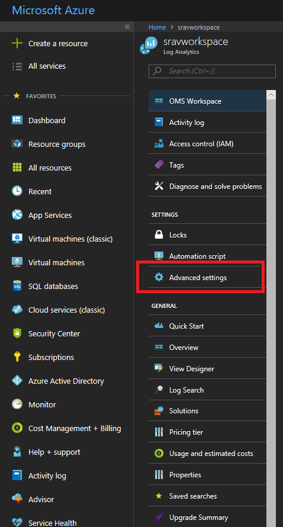
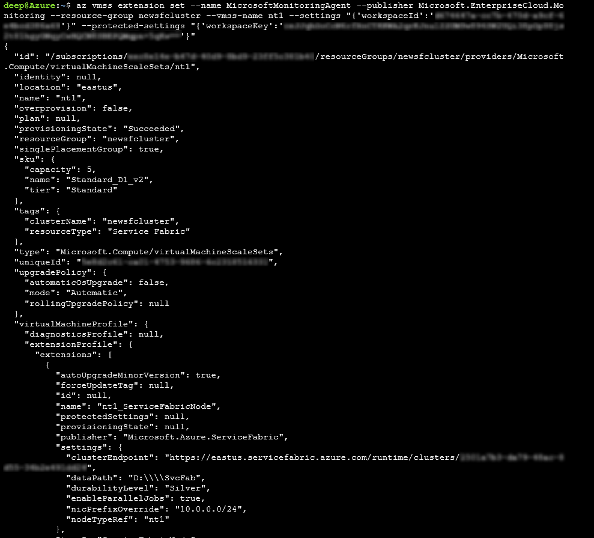
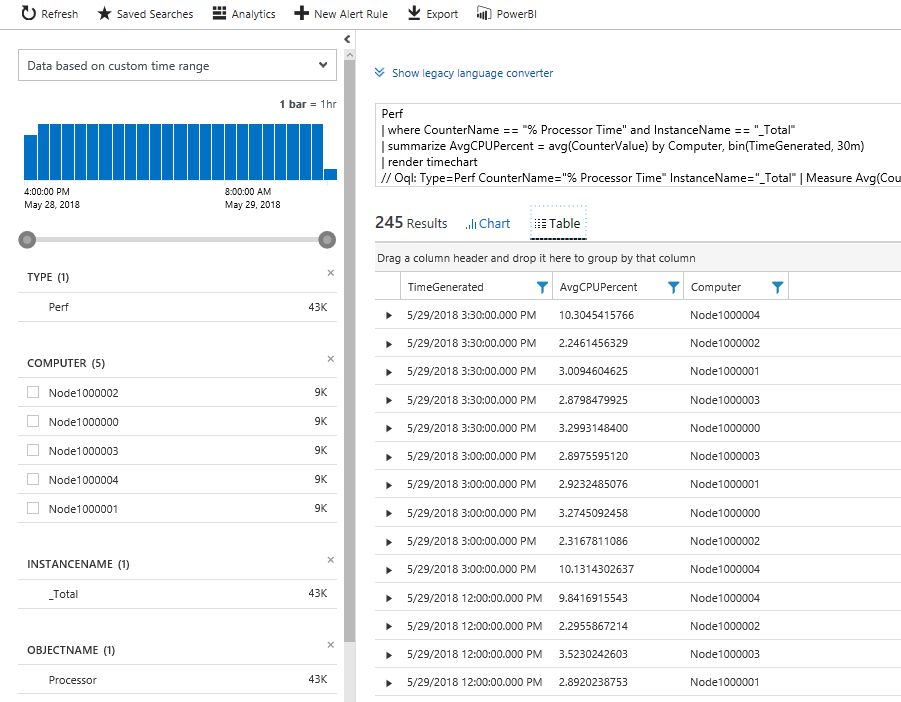

# Performance Monitoring with Azure Monitor logs

This article covers the steps to add the Log Analytics agent as a virtual machine scale set extension to your cluster, and connect it to your existing Azure Log Analytics workspace. This enables collecting diagnostics data about containers, applications, and performance monitoring. By adding it as an extension to the virtual machine scale set resource, Azure Resource Manager ensures that it gets installed on every node, even when scaling the cluster.

> [!NOTE]
> This article assumes that you have an Azure Log Analytics workspace already set up. If you do not, head over to [Set up Azure Monitor logs](service-fabric-diagnostics-oms-setup.md)

[!INCLUDE [azure-monitor-log-analytics-rebrand](../../includes/azure-monitor-log-analytics-rebrand.md)]

## Add the agent extension via Azure CLI

The best way to add the Log Analytics agent to your cluster is via the virtual machine scale set APIs available with the Azure CLI. If you do not have Azure CLI set up yet, head over to Azure portal and open up a [Cloud Shell](../cloud-shell/overview.md) instance, or [Install the Azure CLI](https://docs.microsoft.com/cli/azure/install-azure-cli).

1. Once your Cloud Shell is requested, make sure you are working in the same subscription as your resource. Check this with `az account show` and make sure the "name" value matches that of your cluster's subscription.

2. In the Portal, navigate to the resource group where your Log Analytics workspace is located. Click into the log analytics resource (the type of the resource will be Log Analytics workspace). Once you are at the resource overview page, click on **Advanced Settings** under the Settings section on the left menu.

    

3. Click on **Windows Servers** if you are standing up a Windows cluster, and **Linux Servers** if you are creating a Linux cluster. This page will show you your `workspace ID` and `workspace key` (listed as Primary Key in the portal). You will need both for the next step.

4. Run the command to install the Log Analytics agent onto your cluster, using the `vmss extension set` API in your Cloud Shell:

    For a Windows cluster:

    ```sh
    az vmss extension set --name MicrosoftMonitoringAgent --publisher Microsoft.EnterpriseCloud.Monitoring --resource-group <nameOfResourceGroup> --vmss-name <nameOfNodeType> --settings "{'workspaceId':'<Log AnalyticsworkspaceId>'}" --protected-settings "{'workspaceKey':'<Log AnalyticsworkspaceKey>'}"
    ```

    For a Linux cluster:

    ```sh
    az vmss extension set --name OmsAgentForLinux --publisher Microsoft.EnterpriseCloud.Monitoring --resource-group <nameOfResourceGroup> --vmss-name <nameOfNodeType> --settings "{'workspaceId':'<Log AnalyticsworkspaceId>'}" --protected-settings "{'workspaceKey':'<Log AnalyticsworkspaceKey>'}"
    ```

    Here's an example of the Log Analytics agent being added to a Windows cluster.

    

5. This should take less than 15 min to successfully add the agent to your nodes. You can verify that the agents have been added by using the `az vmss extension list` API:

    ```sh
    az vmss extension list --resource-group <nameOfResourceGroup> --vmss-name <nameOfNodeType>
    ```

## Add the agent via the Resource Manager template

Sample Resource Manager templates that deploy an Azure Log Analytics workspace and add an agent to each of your nodes is available for [Windows](https://github.com/Azure-Samples/service-fabric-cluster-templates/tree/master/5-VM-Windows-OMS-UnSecure) or [Linux](https://github.com/ChackDan/Service-Fabric/tree/master/ARM%20Templates/SF%20OMS%20Samples/Linux).

You can download and modify this template to deploy a cluster that best suits your needs.

## View Performance Counters

Now that you have added the Log Analytics agent, head on over to the Log Analytics portal to choose which performance counters you'd like to collect.

1. In the Azure portal, go to the resource group in which you created the Service Fabric Analytics solution. Select **ServiceFabric\<nameOfLog AnalyticsWorkspace\>**.

2. Click **Log Analytics**.

3. Click **Advanced Settings**.

4. Click **Data**, then click **Windows or Linux Performance Counters**. There is a list of default counters you can choose to enable and you can set the interval for collection too. You can also add [additional performance counters](service-fabric-diagnostics-event-generation-perf.md) to collect. The proper format is referenced in this [article](https://msdn.microsoft.com/library/windows/desktop/aa373193(v=vs.85).aspx).

5. Click **Save**, then click **OK**.

6. Close the Advanced Settings blade.

7. Under the General heading, click **Workspace summary**.

8. You will see tiles in the form of a graph for each of the solutions enabled, including one for Service Fabric. Click the **Service Fabric** graph to continue to the Service Fabric Analytics solution.

9. You will see a few tiles with graphs on operational channel and reliable services events. The graphical representation of the data flowing in for the counters you have selected will appear under Node Metrics.

10. Click on a Container Metric graph to see additional details. You can also query on performance counter data similarly to cluster events and filter on the nodes, perf counter name, and values using the Kusto query language.



## Next steps

* Collect relevant [performance counters](service-fabric-diagnostics-event-generation-perf.md). To configure the Log Analytics agent to collect specific performance counters, review [configuring data sources](../azure-monitor/platform/agent-data-sources.md#configuring-data-sources).
* Configure Azure Monitor logs to set up [automated alerting](../log-analytics/log-analytics-alerts.md) to aid in detecting and diagnostics
* As an alternative you can collect performance counters through [Azure Diagnostics extension and send them to Application Insights](service-fabric-diagnostics-event-aggregation-wad.md#add-the-application-insights-sink-to-the-resource-manager-template)
