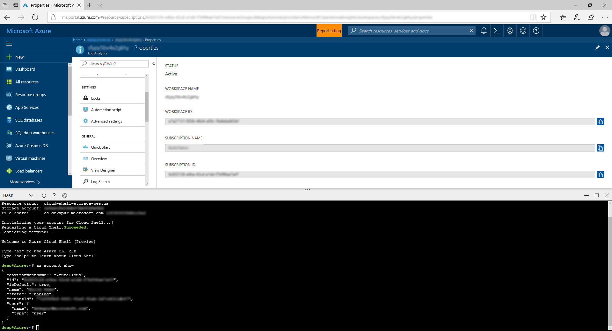

# Add the OMS Agent to a cluster

This article covers the steps to add the OMS Agent as a virtual machine scale set extension to your cluster, and connect it to your existing OMS Log Analytics workspace. This enables collecting diagnostics data about containers, applications, and performance monitoring. By adding it as an extension, Azure Resource Manager ensures that it gets installed on every node, even when scaling the cluster.

> [!NOTE]
> This article assumes that you have an OMS Log Analytics workspace already set up. If you do not, head over to [Set up OMS Log Analytics](service-fabric-diagnostics-oms-setup.md)

## Add the agent extension via Azure CLI

The best way to add the OMS Agent to your cluster is via the virtual machine scale set APIs available with the Azure CLI. If you do not have Azure CLI set up yet, head over to Azure portal and open up a [Cloud Shell](../cloud-shell/overview.md) instance, or [Install Azure CLI 2.0](https://docs.microsoft.com/cli/azure/install-azure-cli).

1. Once your Cloud Shell is requested, make sure you are working in the same subscription as your resource. Check this with `az account show` and make sure the "name" value matches that of your cluster's subscription.

2. In the Portal, navigate to the resource group where your OMS workspace is located. Click into the Log Analytics resource (the type of the resource will be Log Analytics), on the right navigation, scroll down and click on **Properties**.

    

    Take note of your `workspaceId`. 

3. You will also need your `workspaceKey` to deploy the agent. To get to you key, click on **Advanced Settings**, under the *Settings* section of the left navigation. Click on **Windows Servers** if you are standing up a Windows cluster, and **Linux Servers** if you are creating a Linux cluster. You'll need the *Primary Key* that shows up to deploy your agents, as the `workspaceKey`.

4. Run the command to install the OMS agent onto your cluster, using the `vmss extension set` API in your Cloud Shell:

    For a Windows cluster:
    
    ```sh
    az vmss extension set --name MicrosoftMonitoringAgent --publisher Microsoft.EnterpriseCloud.Monitoring --resource-group <nameOfResourceGroup> --vmss-name <nameOfNodeType> --settings "{'workspaceId':'<OMSworkspaceId>'}" --protected-settings "{'workspaceKey':'<OMSworkspaceKey>'}"
    ```

    For a Linux cluster:

    ```sh
    az vmss extension set --name OmsAgentForLinux --publisher Microsoft.EnterpriseCloud.Monitoring --resource-group <nameOfResourceGroup> --vmss-name <nameOfNodeType> --settings "{'workspaceId'}":'<OMSworkspaceId>'}" --protected-settings "{'workspaceKey':'<OMSworkspaceKey>'}"
    ```

    Here's an example of the OMS Agent being added to a Windows cluster.

    
 
    This should take less than 15 min to successfully add the agent to your nodes. You can verify that the agents have been added by using the `az vmss extension list` API:

    ```sh
    az vmss extension list --resource-group <nameOfResourceGroup> --vmss-name <nameOfNodeType>
    ```

## Add the agent via the Resource Manager template

Sample Resource Manager templates that deploy an OMS Log Analytics workspace and add an agent to each of your nodes is available for [Windows](https://github.com/ChackDan/Service-Fabric/tree/master/ARM%20Templates/SF%20OMS%20Samples/Windows) or [Linux](https://github.com/ChackDan/Service-Fabric/tree/master/ARM%20Templates/SF%20OMS%20Samples/Linux).

You can download and modify this template to deploy a cluster that best suits your needs.

## Next Steps

* Collect relevant [performance counters](service-fabric-diagnostics-event-generation-perf.md). To configure the OMS agent to pick up specific performance counters, head to the OMS Portal (linked at the top of the OMS Log Analytics resource). Then click on **Home > Settings > Data > Windows Performance Counters** or **Linux Performance Counters**  and choose the counters you would like to collect.
* Configure OMS to set up [automated alerting](../log-analytics/log-analytics-alerts.md) to aid in detecting and diagnostics
