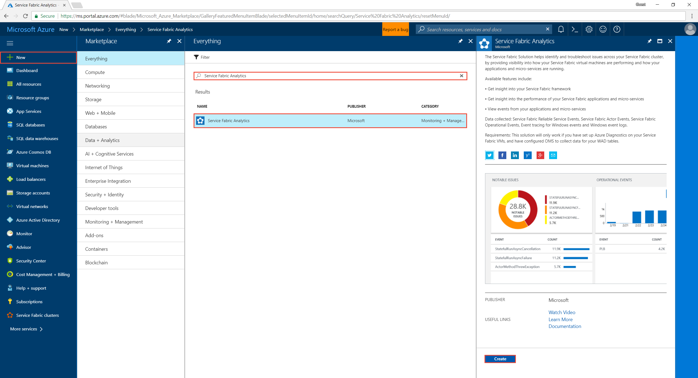
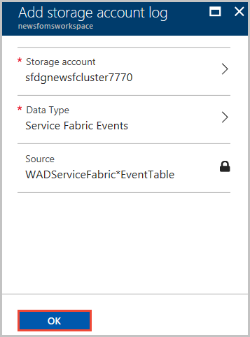

---
title: Azure Service Fabric - Set up monitoring with Log Analytics | Microsoft Docs
description: Learn how to set up Log Analytics for visualizing and analyzing events to monitor your Azure Service Fabric clusters.
services: service-fabric
documentationcenter: .net
author: srrengar
manager: timlt
editor: ''

ms.assetid:
ms.service: service-fabric
ms.devlang: dotnet
ms.topic: conceptual
ms.tgt_pltfrm: NA
ms.workload: NA
ms.date: 9/11/2018
ms.author: srrengar

---

# Set up Log Analytics for a cluster

Log Analytics is our recommendation to monitor cluster level events. You can set up Log Analytics workspace through Azure Resource Manager, PowerShell, or Azure Marketplace. If you maintain an updated Resource Manager template of your deployment for future use, use the same template to set up your Log Analytics environment. Deployment via Marketplace is easier if you already have a cluster deployed with diagnostics enabled. If you do not have subscription-level access in the account to which you are deploying to, deploy by using PowerShell or the Resource Manager template.

> [!NOTE]
> To set up Log Analytics to monitor your cluster, you need to have diagnostics enabled to view cluster-level or platform-level events. Refer to [how to set up diagnostics in Windows clusters](service-fabric-diagnostics-event-aggregation-wad.md) and [how to set up diagnostics in Linux clusters](service-fabric-diagnostics-event-aggregation-lad.md) for more

## Deploy a Log Analytics workspace by using Azure Marketplace

If you want to add a Log Analytics workspace after you have deployed a cluster, go to Azure Marketplace in the portal and look for **Service Fabric Analytics**. This is a custom solution for Service Fabric deployments that has data specific to Service Fabric. In this process you will create both the solution (the dashboard to view insights) and workspace (the aggregation of the underlying cluster data).

1. Select **New** on the left navigation menu. 

2. Search for **Service Fabric Analytics**. Select the resource that appears.

3. Select **Create**.

    

4. In the Service Fabric Analytics creation window, select **Select a workspace** for the **OMS Workspace** field, and then **Create a new workspace**. Fill out the required entries. The only requirement here is that the subscription for the Service Fabric cluster and the workspace is the same. When your entries have been validated, your workspace starts to deploy. The deployment takes only a few minutes.

5. When finished, select **Create** again at the bottom of the Service Fabric Analytics creation window. Make sure that the new workspace shows up under **OMS Workspace**. This action adds the solution to the workspace you created.

If you are using Windows, continue with the following steps to connect Log Analytics to the storage account where your cluster events are stored. 

>[!NOTE]
>Enabling this experience for Linux clusters is not yet available. 

### Connect the Log Analytics Workspace to your cluster 

1. The workspace needs to be connected to the diagnostics data coming from your cluster. Go to the resource group in which you created the Service Fabric Analytics solution. Select **ServiceFabric\<nameOfWorkspace\>** and go to its overview page. From there, you can change solution settings, workspace settings, and access the Log Analytics Workspace.

2. On the left navigation menu, under **Workspace Data Sources**, select **Storage accounts logs**.

3. On the **Storage account logs** page, select **Add** at the top to add your cluster's logs to the workspace.

4. Select **Storage account** to add the appropriate account created in your cluster. If you used the default name, the storage account is **sfdg\<resourceGroupName\>**. You can also confirm this with the Azure Resource Manager template used to deploy your cluster, by checking the value used for **applicationDiagnosticsStorageAccountName**. If the name does not show up, scroll down and select **Load more**. Select the storage account name.

5. Specify the Data Type. Set it to **Service Fabric Events**.

6. Ensure that the Source is automatically set to **WADServiceFabric\*EventTable**.

7. Select **OK** to connect your workspace to your cluster's logs.

    

The account now shows up as part of your storage account logs in your workspace's data sources.

You have added the Service Fabric Analytics solution in an Log Analytics workspace that's now correctly connected to your cluster's platform and application log table. You can add additional sources to the workspace in the same way.


## Deploy Log Analytics by using a Resource Manager template

When you deploy a cluster by using a Resource Manager template, the template creates a new Log Analytics workspace, adds the Service Fabric solution to the workspace, and configures it to read data from the appropriate storage tables.

You can use and modify [this sample template](https://github.com/Azure-Samples/service-fabric-cluster-templates/tree/master/5-VM-Windows-OMS-UnSecure) to meet your requirements. This template does the following

* Creates a 5 node Service Fabric cluster
* Creates a Log Analytics workspace and Service Fabric solution
* Configures the OMS Agent to collect and send 2 sample performance counters to the workspace
* Configures WAD to collect Service Fabric and sends them to Azure storage tables (WADServiceFabric*EventTable)
* Configures the Log Analytics workspace to read the events from these tables


You can deploy the template as a Resource Manager upgrade to your cluster by using the `New-AzureRmResourceGroupDeployment` API in the AzureRM PowerShell module. An example command would be:

```powershell
New-AzureRmResourceGroupDeployment -ResourceGroupName "<resourceGroupName>" -TemplateFile "<templatefile>.json" 
``` 

Azure Resource Manager detects that this command is an update to an existing resource. It only processes the changes between the template driving the existing deployment and the new template provided.

## Deploy Log Analytics by using Azure PowerShell

You can also deploy your Log Analytics resource via PowerShell by using the `New-AzureRmOperationalInsightsWorkspace` command. To use this method, make sure you have installed [Azure PowerShell](https://docs.microsoft.com/powershell/azure/install-azurerm-ps?view=azurermps-5.1.1). Use this script to create a new Log Analytics workspace and add the Service Fabric solution to it: 

```PowerShell

$SubscriptionName = "<Name of your subscription>"
$ResourceGroup = "<Resource group name>"
$Location = "<Resource group location>"
$WorkspaceName = "<Log Analytics workspace name>"
$solution = "ServiceFabric"

# Log in to Azure and access the correct subscription
Connect-AzureRmAccount
Select-AzureRmSubscription -SubscriptionId $SubID 

# Create the resource group if needed
try {
    Get-AzureRmResourceGroup -Name $ResourceGroup -ErrorAction Stop
} catch {
    New-AzureRmResourceGroup -Name $ResourceGroup -Location $Location
}

New-AzureRmOperationalInsightsWorkspace -Location $Location -Name $WorkspaceName -Sku Standard -ResourceGroupName $ResourceGroup
Set-AzureRmOperationalInsightsIntelligencePack -ResourceGroupName $ResourceGroup -WorkspaceName $WorkspaceName -IntelligencePackName $solution -Enabled $true

```

When you're done, follow the steps in the preceding section to connect Log Analytics to the appropriate storage account.

You can also add other solutions or make other modifications to your Log Analytics workspace by using PowerShell. To learn more, see [Manage Log Analytics using PowerShell](../log-analytics/log-analytics-powershell-workspace-configuration.md).

## Next steps
* [Deploy the Log Analytics Agent](service-fabric-diagnostics-oms-agent.md) onto your nodes to gather performance counters and collect docker stats and logs for your containers
* Get familiarized with the [log search and querying](../log-analytics/log-analytics-log-searches.md) features offered as part of Log Analytics
* [Use View Designer to create custom views in Log Analytics](../log-analytics/log-analytics-view-designer.md)
