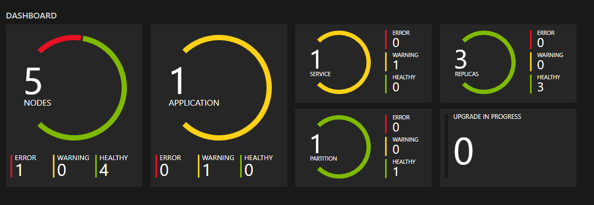

# Monitoring and diagnostics for Azure Service Fabric

This article provides an overview of monitoring and diagnostics for Azure Service Fabric. Monitoring and diagnostics are critical to developing, testing, and deploying workloads in any cloud environment. For example, you can track how your applications are used, the actions taken by the Service Fabric platform, your resource utilization with performance counters, and the overall health of your cluster. You can use this information to diagnose and correct issues, and prevent them from occurring in the future. The next few sections will briefly explain each area of Service Fabric monitoring to consider for production workloads. 

[!INCLUDE [azure-monitor-log-analytics-rebrand](../../includes/azure-monitor-log-analytics-rebrand.md)]

## Application monitoring
Application monitoring tracks how features and components of your application are being used. You want to monitor your applications to make sure issues that impact users are caught. The responsibility of application monitoring is on the users developing an application and its services since it is unique to the business logic of your application. Monitoring your applications can be useful in the following scenarios:
* How much traffic is my application experiencing? - Do you need to scale your services to meet user demands or address a potential bottleneck in your application?
* Are my service to service calls successful and tracked?
* What actions are taken by the users of my application? - Collecting telemetry can guide future feature development and better diagnostics for application errors
* Is my application throwing unhandled exceptions? 
* What is happening within the services running inside my containers?

The great thing about application monitoring is that developers can use whatever tools and framework they'd like since it lives within the context of your application! You can learn more about the Azure solution for application monitoring with Azure Monitor Application Insights in [Event analysis with Application Insights](service-fabric-diagnostics-event-analysis-appinsights.md).
We also have a tutorial with how to [set this up for .NET Applications](service-fabric-tutorial-monitoring-aspnet.md). This tutorial goes over how to install the right tools, an example to write custom telemetry in your application, and viewing the application diagnostics and telemetry in the Azure portal. 

## Platform (Cluster) monitoring
A user is in control over what telemetry comes from their application since a user writes the code itself, but what about the diagnostics from the Service Fabric platform? One of Service Fabric's goals is to keep applications resilient to hardware failures. This goal is achieved through the platform's system services' ability to detect infrastructure issues and rapidly failover workloads to other nodes in the cluster. But in this particular case, what if the system services themselves have issues? Or if in attempting to deploy or move a workload, rules for the placement of services are violated? Service Fabric provides diagnostics for these and more to make sure you are informed about activity taking place in your cluster. Some sample scenarios for cluster monitoring include:

Service Fabric provides a comprehensive set of events out of the box. These [Service Fabric events](service-fabric-diagnostics-events.md) can be accessed through the EventStore or the operational channel (event channel exposed by the platform). 

* Service Fabric event channels - On Windows, Service Fabric events are available from a single ETW provider with a set of relevant `logLevelKeywordFilters` used to pick between Operational and Data & Messaging channels - this is the way in which we separate out outgoing Service Fabric events to be filtered on as needed. On Linux, Service Fabric events come through LTTng and are put into one Storage table, from where they can be filtered as needed. These channels contain curated, structured events that can be used to better understand the state of your cluster. Diagnostics are enabled by default at the cluster creation time, which create an Azure Storage table where the events from these channels are sent for you to query in the future. 

* EventStore - The EventStore is a feature offered by the platform that provides Service Fabric platform events available in the Service Fabric Explorer and through REST API. You can see a snapshot view of what's going on in your cluster for each entity e.g. node, service, application and query based on the time of the event. You can also  Read more about the EventStore at the [EventStore Overview](service-fabric-diagnostics-eventstore.md).    

The diagnostics provided are in the form of a comprehensive set of events out of the box. These [Service Fabric events](service-fabric-diagnostics-events.md) illustrate actions done by the platform on different entities such as Nodes, Applications, Services, Partitions etc. In the last scenario above, if a node were to go down, the platform would emit a `NodeDown` event and you could be notified immediately by your monitoring tool of choice. Other common examples include `ApplicationUpgradeRollbackStarted` or `PartitionReconfigured` during a failover. **The same events are available on both Windows and Linux clusters.**

The events are sent through standard channels on both Windows and Linux and can be read by any monitoring tool that supports these. The Azure Monitor solution is Azure Monitor logs. Feel free to read more about our [Azure Monitor logs integration](service-fabric-diagnostics-event-analysis-oms.md) which includes a custom operational dashboard for your cluster and some sample queries from which you can create alerts. More cluster monitoring concepts are available at [Platform level event and log generation](service-fabric-diagnostics-event-generation-infra.md).

### Health monitoring
The Service Fabric platform includes a health model, which provides extensible health reporting for the status of entities in a cluster. Each node, application, service, partition, replica, or instance, has a continuously updatable health status. The health status can either be "OK", "Warning", or "Error". Think of Service Fabric events as verbs done by the cluster to various entities and health as an adjective for each entity. Each time the health of a particular entity transitions, an event will also be emitted. This way you can set up queries and alerts for health events in your monitoring tool of choice, just like any other event. 

Additionally, we even let users override health for entities. If your application is going through an upgrade and you have validation tests failing, you can write to Service Fabric Health using the Health API to indicate your application is no longer healthy, and Service Fabric will automatically rollback the upgrade! For more on the health model, check out the [introduction to Service Fabric health monitoring](service-fabric-health-introduction.md)

### Watchdogs
Generally, a watchdog is a separate service that watches health and load across services, pings endpoints, and reports unexpected health events in the cluster. This can help prevent errors that may not be detected based only on the performance of a single service. Watchdogs are also a good place to host code that performs remedial actions that don't require user interaction, such as cleaning up log files in storage at certain time intervals. If you want a fully implemented, open source SF watchdog service that includes an easy-to-use watchdog extensibility model and that runs in both Windows and Linux clusters, see the [FabricObserver](https://github.com/microsoft/service-fabric-observer) project. FabricObserver is production-ready software. We encourage you to deploy FabricObserver to your test and production clusters and extend it to meet your needs either through its plug-in model or by forking it and writing your own built-in observers. The former (plug-ins) is the recommended approach.

## Infrastructure (performance) monitoring
Now that we've covered the diagnostics in your application and the platform, how do we know the hardware is functioning as expected? Monitoring your underlying infrastructure is a key part of understanding the state of your cluster and your resource utilization. Measuring system performance depends on many factors that can be subjective depending on your workloads. These factors are typically measured through performance counters. These performance counters can come from a variety of sources including the operating system, the .NET framework, or the Service Fabric platform itself. Some scenarios in which they would be useful are

* Am I utilizing my hardware efficiently? Do you want to use your hardware at 90% CPU or 10% CPU. This comes in handy when scaling your cluster, or optimizing your application's processes.
* Can I predict infrastructure issues proactively? - many issues are preceded by sudden changes (drops) in performance, so you can use performance counters such as network I/O and CPU utilization to predict and diagnose the issues proactively.

A list of performance counters that should be collected at the infrastructure level can be found at [Performance metrics](service-fabric-diagnostics-event-generation-perf.md). 

Service Fabric also provides a set of performance counters for the Reliable Services and Actors programming models. If you are using either of these models, these performance counters can information to ensure that your actors are spinning up and down correctly, or that your reliable service requests are being handled fast enough. For more information, see [Monitoring for Reliable Service Remoting](service-fabric-reliable-serviceremoting-diagnostics.md#performance-counters) and [Performance monitoring for Reliable Actors](service-fabric-reliable-actors-diagnostics.md#performance-counters). 

The Azure Monitor solution to collect these is Azure Monitor logs just like platform level monitoring. You should use the [Log Analytics agent](service-fabric-diagnostics-oms-agent.md) to collect the appropriate performance counters, and view them in Azure Monitor logs.

## Recommended Setup
Now that we've gone over each area of monitoring and example scenarios, here is a summary of the Azure monitoring tools and set up needed to monitor all areas above. 

* Application monitoring with [Application Insights](service-fabric-tutorial-monitoring-aspnet.md)
* Cluster monitoring with [Diagnostics Agent](service-fabric-diagnostics-event-aggregation-wad.md) and [Azure Monitor logs](service-fabric-diagnostics-oms-setup.md)
* Infrastructure monitoring with [Azure Monitor logs](service-fabric-diagnostics-oms-agent.md)

You can also use and modify the sample ARM template located [here](service-fabric-diagnostics-oms-setup.md#deploy-azure-monitor-logs-with-azure-resource-manager) to automate deployment of all necessary resources and agents. 

## Other logging solutions

Although the two solutions we recommended, [Azure Monitor logs](service-fabric-diagnostics-event-analysis-oms.md) and [Application Insights](service-fabric-diagnostics-event-analysis-appinsights.md) have built in integration with Service Fabric, many events are written out through ETW providers and are extensible with other logging solutions. You should also look into the [Elastic Stack](https://www.elastic.co/products) (especially if you are considering running a cluster in an offline environment), [Dynatrace](https://www.dynatrace.com/), or any other platform of your preference. We have a list of integrated partners available [here](service-fabric-diagnostics-partners.md).

The key points for any platform you choose should include how comfortable you are with the user interface, the querying capabilities, the custom visualizations and dashboards available, and the additional tools they provide to enhance your monitoring experience. 

## Next steps

* For getting started with instrumenting your applications, see [Application level event and log generation](service-fabric-diagnostics-event-generation-app.md).
* Go through the steps to set up Application Insights for your application with [Monitor and diagnose an ASP.NET Core application on Service Fabric](service-fabric-tutorial-monitoring-aspnet.md).
* Learn more about monitoring the platform and the events Service Fabric provides for you at [Platform level event and log generation](service-fabric-diagnostics-event-generation-infra.md).
* Configure the Azure Monitor logs integration with Service Fabric at [Set up Azure Monitor logs for a cluster](service-fabric-diagnostics-oms-setup.md)
* Learn how to set up Azure Monitor logs for monitoring containers - [Monitoring and Diagnostics for Windows Containers in Azure Service Fabric](service-fabric-tutorial-monitoring-wincontainers.md).
* See example diagnostics problems and solutions with Service Fabric in [diagnosing common scenarios](service-fabric-diagnostics-common-scenarios.md)
* Check out other diagnostics products that integrate with Service Fabric in [Service Fabric diagnostic partners](service-fabric-diagnostics-partners.md)
* Learn about general monitoring recommendations for Azure resources - [Best Practices - Monitoring and diagnostics](/azure/architecture/best-practices/monitoring). 
