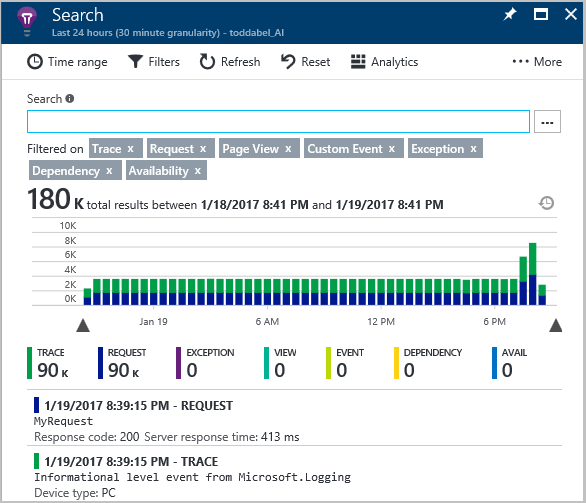

# Monitor and diagnose Azure Service Fabric applications

Monitoring, detecting, diagnosing, and troubleshooting allow for services to continue with minimal disruption to the user experience, providing business insights, monitoring resource usage, detecting hardware and software failures or performance issues and diagnosing potential service behavior issues. While monitoring and diagnostics are critical in an actual deployed production environment, the efficacy depends on adopting a similar model during development of services to ensure they work when you move to a real-world setup. Service Fabric makes it easy for service developers to implement diagnostics that can seamlessly work across both single-machine local development setups and real-world production cluster setups. 

Monitoring is a broad term that encompasses instrumenting the code, collecting the instrumentation logs, analyzing the logs, visualizing insights based on the log data, alerting based on log values and insights, monitoring the infrastructure and allowing engineers to detect and diagnose issues that affect their customers. This article is intended to provide an overview of monitoring for Service Fabric clusters hosted in Azure or on premises, deployed on Windows or Linux using .NET. Let's start by dividing the problem into three parts
- Instrument code or infrastructure
- Collection of generated events
- Storage, aggregation, visualization, and Analysis

While there are some products that cover all three aspects, many customers choose different technologies for each area. It is important that each plug together to deliver an end to end monitoring solution for the application. 

## Monitoring infrastructure

While Service Fabric helps to keep an application running during infrastructure failures, the application operators need to understand if an error is occurring within the application or the underlying infrastructure. Monitoring of the infrastructure is also needed for capacity planning to know when to add or remove infrastructure. Both the infrastructure and the application that compose a Service Fabric deployment are important to monitor and troubleshoot. As long as the application is available to customers, some of the infrastructure could be having issues.

### Azure Monitoring

For Azure deployed clusters, [Azure Monitoring](../monitoring-and-diagnostics/monitoring-overview.md) gives the ability to monitor many of the Azure resources on which a Service Fabric cluster is built. A set of metrics is automatically collected and displayed in the Azure portal for the [Virtual Machine Scale Set (VMSS)](../monitoring-and-diagnostics/monitoring-supported-metrics.md#microsoftcomputevirtualmachinescalesets) and individual [VMs](../monitoring-and-diagnostics/monitoring-supported-metrics.md#microsoftcomputevirtualmachinescalesetsvirtualmachines). This information can be viewed in the Azure portal by selecting the resource group that the Service Fabric cluster is contained within and choosing the VMSS to view. Then choose Metrics within the Monitoring navigation section to view a graph of the values


The charts can be customized by following the instructions in the article [Overview of Metrics in Microsoft Azure](../monitoring-and-diagnostics/insights-how-to-customize-monitoring.md). Alerts can also be created based on these metrics as described in the article [Use Azure portal to create alerts for Azure services](../monitoring-and-diagnostics/insights-alerts-portal.md). Alerts can be sent to a notification service using web hooks as described in the article [Configure a web hook on an Azure metric alert(../monitoring-and-diagnostics/insights-webhooks-alerts.md). Azure Monitoring supports a single subscription. If support for multiple subscriptions is needed or additional features are needed, [Log Analytics](https://azure.microsoft.com/documentation/services/log-analytics/) part of Operations Management Suite provides a holistic IT management solution for both on-premises and cloud-based infrastructure. Data from Azure Monitoring can be routed directly to Log Analytics so you can see metrics and logs for your entire environment in a single place.

Operations Management Suite is the recommended method for monitoring your on-premise infrastructure, but any existing solution that your company uses for infrastructure monitoring can also be used.

### Service Fabric Support Logs

If you should need to contact Microsoft support for help with your Azure Service Fabric Cluster, support logs are almost always required. If your cluster is hosted within Azure, these logs are automatically configured and collected as part of creating a cluster. The logs are stored in a dedicated storage account that can be seen in your cluster's resource group. There is no fixed name to the storage account, but within the account you see blob containers and tables starting with 'fabric'. If your cluster is a standalone cluster, you should configure collection of these logs following the guidance in [Create and manage a standalone Azure Service Fabric cluster](service-fabric-cluster-creation-for-windows-server.md) and [Configuration settings for standalone Windows cluster](service-fabric-cluster-manifest.md). For standalone Service Fabric, the logs should be sent to a local file share. You are **required** to have these logs for support, but they are not intended to be usable by anyone outside of the Microsoft customer support team. Using my best Obi-Wan Kenobi impression, these are not the logs you are interested in...

## Instrument your code

Instrumenting the code is the basis for most other aspects of monitoring your services. It is often surprising to people how much instrumentation is needed, but considering that this instrumentation is the only way you have of knowing something is wrong and to diagnose what needs to be fixed. While it is technically possible to do, it is unusual to connect a debugger to a production service, so having detailed instrumentation data is important. When producing this volume of information shipping all events off the local node can be expensive. Many services use a two-part strategy for dealing with the volume of instrumentation data:
* All events are kept in local rolling log file for a short interval of days and only collected when needed for debugging. Typically the events needed for detailed diagnosis are left on the node to reduce costs and resource utilization
* Any events indicating service health such as error events, heart beat events or performance events are sent to a central repository where they can be used to raise alerts of an unhealthy service.

There are solutions that automatically instrument your code. While these products can work well, manual instrumentation is almost always needed. In the end, you must have enough information to forensically debug the application. The next sections describe different approaches for instrumenting your code and when you should choose one over another.

### EventSource

When you create an Azure Service Fabric solution from a template in Visual Studio, an EventSource derived class (*ServiceEventSource* or *ActorEventSource*) is generated. This provides a template to which you can add additional events appropriate for your application or service. The EventSource name **must** be unique and should be renamed from the starting string of 'MyCompany-&lt;solution&gt;-&lt;project&gt;'. Having multiple EventSource definitions using  the same name causes an issue at runtime. Each defined event must have a unique identifier. If an identifer is not unique a runtime failure occurs. Often ranges of values are pre-assigned for identifiers to avoid conflicts between separate development teams. For additional information on EventSource take a look at [Vance's blog](https://blogs.msdn.microsoft.com/vancem/2012/07/09/introduction-tutorial-logging-etw-events-in-c-system-diagnostics-tracing-eventsource/) or the [MSDN documentation](https://msdn.microsoft.com/library/dn774985(v=pandp.20).aspx).

#### Using structured EventSource events

Each of the following events is defined for a specific use case, a service type was registered for example. Having messages defined in this way allows data to be packaged along with the text of the error. This allows for better searching and filtering based on the names or values of the properties specified. Structuring the instrumentation output makes it easier to consume, but requires more thought and time to define a new event for each use case. Some event definitions can be shared across the entire application, for example, a method start or stop event would be reused across many services within an application. A domain-specific service, such as an order system, may have a CreateOrder event, which will have its own unique event. Often this approach generates lots of events and potentially requires coordination of identifiers across project teams. For a complete example of structured EventSources in Service Fabric look at the [PartyCluster.ApplicationDeployService.ServiceEventSource](https://github.com/Azure-Samples/service-fabric-dotnet-management-party-cluster/blob/master/src/PartyCluster.ApplicationDeployService/ServiceEventSource.cs) within the Party Cluster sample.

```csharp
    [EventSource(Name = "MyCompany-VotingState-VotingStateService")]
    internal sealed class ServiceEventSource : EventSource
    {
        public static readonly ServiceEventSource Current = new ServiceEventSource();

        // Instance constructor is private to enforce singleton semantics
        private ServiceEventSource() : base() { }

        ...

        // ServiceTypeRegistered event contains a unique identifier, an event attribute that defined the event and the code implementation of the event.
        private const int ServiceTypeRegisteredEventId = 3;
        [Event(ServiceTypeRegisteredEventId, Level = EventLevel.Informational, Message = "Service host process {0} registered service type {1}", Keywords = Keywords.ServiceInitialization)]
        public void ServiceTypeRegistered(int hostProcessId, string serviceType)
        {
            WriteEvent(ServiceTypeRegisteredEventId, hostProcessId, serviceType);
        }

        // ServiceHostInitializationFailed event contains a unique identifier, an event attribute that defined the event and the code implementation of the event.
        private const int ServiceHostInitializationFailedEventId = 4;
        [Event(ServiceHostInitializationFailedEventId, Level = EventLevel.Error, Message = "Service host initialization failed", Keywords = Keywords.ServiceInitialization)]
        public void ServiceHostInitializationFailed(string exception)
        {
            WriteEvent(ServiceHostInitializationFailedEventId, exception);
        }
```
#### Using EventSource generically

Because defining specific events can be difficult, many people define few of events with a common set of parameters that generally output their information as a string. Much of the structured aspect is lost, making it more difficult to search and filter the results. With this approach, a few events usually corresponding to the logging levels are defined. The following snippet defines a debug and error message.
```csharp
    [EventSource(Name = "MyCompany-VotingState-VotingStateService")]
    internal sealed class ServiceEventSource : EventSource
    {
        public static readonly ServiceEventSource Current = new ServiceEventSource();

        // Instance constructor is private to enforce singleton semantics
        private ServiceEventSource() : base() { }

        ...

        private const int DebugEventId = 10;
        [Event(DebugEventId, Level = EventLevel.Verbose, Message = "{0}")]
        public void Debug(string msg)
        {
            WriteEvent(DebugEventId, msg);
        }

        private const int ErrorEventId = 11;
        [Event(ErrorEventId, Level = EventLevel.Error, Message = "Error: {0} - {1}")]
        public void Error(string error, string msg)
        {
            WriteEvent(ErrorEventId, error, msg);
        }
```
Using a hybrid approach of both structured and generic instrumentation can also work well. In this case structured instrumentation is used for reporting errors and metrics, while generic events can be used for the detailed logging that is consumed by engineers when troubleshooting.

### ASP.NET Core logging

Choosing how to instrument your code can be difficult, if you chose poorly and have to reinstrument, you are revisiting and potentially destabilizing your code base. To reduce the risk, developers can choose an instrumentation library such as [Microsoft.Extensions.Logging](https://www.nuget.org/packages/Microsoft.Extensions.Logging/) provided by ASP.NET Core. This provides an [ILogger](https://docs.microsoft.com/aspnet/core/api/microsoft.extensions.logging.ilogger) interface that allows the provider of your choice to be used while minimizing the impact to existing code. Another nice aspect of this is that the code can be used not only in .NET Core on Windows and Linux, but in the full .NET framework too, giving the ability to standardize your instrumentation code across .NET and .NET Core.

#### How to use Microsoft.Extensions.Logging within Service Fabric

1. Add the **Microsoft.Extensions.Logging** NuGet package to the project you are instrumenting. You'll also want to add any provider packages, we'll do this for a third-party package below. See [Logging in ASP.NET Core](https://docs.microsoft.com/aspnet/core/fundamentals/logging) for more information

2. Add a **using** directive for 'Microsoft.Extensions.Logging' to your service file

3. Define a private variable within your service class

    ```csharp
        private ILogger _logger = null;
    ```

4. In the constructor of your service class, add
    
    ```csharp
        _logger = new LoggerFactory().CreateLogger<Stateless>();
    ```

5. Start instrumenting your code in your methods. Here are a few samples
    
    ```csharp

        _logger.LogDebug("Debug level event from Microsoft.Logging");
        _logger.LogInformation("Informational level event from Microsoft.Logging");

        // In this variant, we're adding structured properties RequestName and Duration that has values MyRequest and the duration of the request.
        // More on why you'll want to do this later.
        _logger.LogInformation("{RequestName} {Duration}", "MyRequest", requestDuration);

    ```

#### Using other logging providers

There are some third-party providers that work with this approach, [SeriLog](https://serilog.net/), [NLog](http://nlog-project.org/) and [loggr](https://github.com/imobile3/Loggr.Extensions.Logging) are three examples. Each of these can be plugged into ASP.Net Core Logging and can also be used separately. SeriLog has a feature that allows enrichment of all messages sent from a logger, which can be useful to output the service name, type, and partition information. To use this capability with in the ASP.NET Core infrastructure, perform the following

1. Add **Serilog**, **Serilog.Extensions.Logging**, **Serilog.Sinks.Observable** NuGet packages to the project. Also add **SeriLog.Sinks.Literate** for this example, a better approach is shown later in this article
2. Create a LoggerConfiguration and the logger instance in SeriLog

    ```csharp

        Log.Logger = new LoggerConfiguration().WriteTo.LiterateConsole().CreateLogger();

    ```

3. Add an SeriLog.ILogger argument to the service constructor and pass the newly created logger
    
    ```csharp

        ServiceRuntime.RegisterServiceAsync("StatelessType", context => new Stateless(context, Log.Logger)).GetAwaiter().GetResult();

    ```

4. In the service constructor, add the following, which creates the property enrichers for the ServiceTypeName, ServiceName, PartitionId, and InstanceId properties of the service. It also adds it to the ASP.NET Core logging factory so the Microsoft.Extensions.Logging.ILogger can be used in your code.
    
    ```csharp
        public Stateless(StatelessServiceContext context, Serilog.ILogger serilog)
            : base(context)
        {
            PropertyEnricher[] properties = new PropertyEnricher[]
            {
                new PropertyEnricher("ServiceTypeName", context.ServiceTypeName),
                new PropertyEnricher("ServiceName", context.ServiceName),
                new PropertyEnricher("PartitionId", context.PartitionId),
                new PropertyEnricher("InstanceId", context.ReplicaOrInstanceId),
            };

            serilog.ForContext(properties);

            _logger = new LoggerFactory().AddSerilog(serilog.ForContext(properties)).CreateLogger<Stateless>();
        }
    ```

5. Instrument the code the same as when using ASP.NET Core without SeriLog.

> [!NOTE] 
> It is not recommended that the static Log.Logger is used with this approach because Service Fabric can host multiple instances of the same service type within a single process. This would mean that the last writer of the property enrichers would have their values shown for all instances running. This is one reason why the _logger variable is a private member variable of the service class. This also means that the _logger must be made available to common code that may be used across services. 

### Which one should I use?

If your application cares deeply about performance, then EventSource is the best approach to use because it **generally** uses fewer resources and perform better than using ASP.NET Core logging or any of the third-party solutions.  This isn't an issue for many services, but if your service is performance oriented using EventSource may be a better choice. To get the same benefits of structured logging, EventSource requires a large investment from the engineering team. The best way to determine what to choose for your project is to do a quick prototype of what you would do for each approach and then choose the approach that best fits your needs.

## Event and log collection

### Azure Diagnostics

Beyond what Azure Monitoring already provides, Azure also provides a means of collecting events from each of the services to a central location. There are two articles that show how to configure event collection for [Windows](service-fabric-diagnostics-how-to-setup-wad.md) and [Linux](service-fabric-diagnostics-how-to-setup-lad.md). These articles show collecting the event data and sending it to Azure storage. This is easily done in the portal or Resource Manager template by enabling diagnostics. Turning this on collects a few event sources that Service Fabric automatically produces:

- EventSource events and performance counters when using the Reliable Actor programming model. The events are enumerated in the article on [Diagnostic and performance monitoring for Reliable Actors](service-fabric-reliable-actors-diagnostics.md)
- EventSource events when using the Reliable Services programming model. The events are enumerated in the article on [Diagnostic functionality for Stateful Reliable Services](service-fabric-reliable-services-diagnostics.md)
- System events are emitted as ETW events. There are many events that are emitted from Service Fabric as part of this category they include service placement, start/stop events. The best way to see the events emitted is to use [Visual Studio's diagnostic viewer](service-fabric-diagnostics-how-to-monitor-and-diagnose-services-locally.md) when running on your local machine. Because these events are native ETW events, there are some limitations for how they can be collected
- As of the 5.4 release of Service Fabric, health and load metric events are exposed. This allows collection of these events to be used for historical reporting and alerting. These events are also native ETW events and have some limitations for how they can be collected

When configured, these events appear in one of the Azure Storage accounts created when the cluster was created, assuming diagnostic was enabled. The tables are named *WADServiceFabricReliableActorEventTable*, *WADServiceFabricReliableServiceEventTable*, and *WADServiceFabricSystemEventTable*. The health events are not added by default and require that the Resource Manager template be modified. Refer to [Collect log by using Azure Diagnostics](service-fabric-diagnostics-how-to-setup-wad.md) for details.

These articles also show how to get custom events into Azure Storage. Any of the existing Azure Diagnostic articles on how to configure performance counters or other monitoring information from a VM to Azure Diagnostics also work with a Service Fabric cluster. For instance, if Azure table storage as a destination isn't what you want, there is an article on how [Streaming Azure Diagnostics data in the hot path by using Event Hubs](../event-hubs/event-hubs-streaming-azure-diags-data.md). Once the events are in Event Hub, they can be read and sent to the location of your choosing. There is also an article on integrating [Azure diagnostic information with Application Insights](https://azure.microsoft.com/blog/azure-diagnostics-integration-with-application-insights/)

One of the downsides of using Azure Diagnostics is that the configuration is done using a Resource Manager template and therefore occurs at the VMSS level only. A VMSS corresponds to a node type in Service Fabric. This means you must configure each node type for all the applications and services that may run on a node of that type. This could be a large number of EventSources depending on the number of applications and services configured. Additionally, a Resource Manager deployment must be done any time the configuration of any application has changed. Ideally, monitoring configuration would travel along with the service configuration.

Azure Diagnostics only works for Service Fabric clusters deployed to Azure, but it works for both Windows and Linux clusters.

### EventFlow

[EventFlow was released by the Visual Studio](https://github.com/Azure/diagnostics-eventflows) team and provides a mechanism for routing events from a node to one or more monitoring destinations. Because it is included as a NuGet package in your service project the code and the configuration for EventFlow travels with the service, eliminating the per node configuration issue mentioned about Azure Diagnostics. EventFlow runs within your service process and directly connects to the configured outputs. Because of this direct connection, EventFlow works for Azure, container or on-premise deployments of a service. Care must be taken when running many replicas on the same node because each EventFlow pipeline makes an external connection. If you are hosting lots of processes, you end up with lots of outbound connections! This isn't as much of an issue for Service Fabric applications because all replicas of a ServiceType run within the same process, limiting the number of outbound connections. EventFlow also offers filtering of events, so only the events that match the specified filter are sent. For detailed information on using EventFlow with Service Fabric, see [Collect logs directly from an Azure Service Fabric service process](service-fabric-diagnostic-collect-logs-without-an-agent.md)

> [!NOTE]
> In a future release of Service Fabric an EventSource host application will be made available allowing listening to ETW based inputs, collection of node level metrics and rolling log file support.

Using EventFlow is pretty easy
1. Add the NuGet package to your service project
2. Within the service's **Main** function create the EventFlow pipeline and configure the outputs. In this case, we're showing using SeriLog as an output
    ```csharp

        /// <summary>
        /// This is the entry point of the service host process.
        /// </summary>
        private static void Main()
        {
            try
            {
                using (var pipeline = ServiceFabricDiagnosticPipelineFactory.CreatePipeline("MonitoringE2E-Stateless-Pipeline"))
                {
                    Log.Logger = new LoggerConfiguration().WriteTo.EventFlow(pipeline).CreateLogger();

                    // The ServiceManifest.XML file defines one or more service type names.
                    // Registering a service maps a service type name to a .NET type.
                    // When Service Fabric creates an instance of this service type,
                    // an instance of the class is created in this host process.

                    ServiceRuntime.RegisterServiceAsync("StatelessType", context => new Stateless(context, Log.Logger)).GetAwaiter().GetResult();
                    ServiceEventSource.Current.ServiceTypeRegistered(Process.GetCurrentProcess().Id, typeof(Stateless).Name);
                    
                    // Prevents this host process from terminating so services keep running.
                    Thread.Sleep(Timeout.Infinite);
                }
            }
            catch (Exception e)
            {
                ServiceEventSource.Current.ServiceHostInitializationFailed(e.ToString());
                throw;
            }
        }

    ```
3. Create a file in the service's PackageRoot | Config folder named *eventFlowConfig.json*. Inside the file the configuration looks like
    ```json
        {
        "inputs": [
            {
            "type": "EventSource",
            "sources": [
                { "providerName": "Microsoft-ServiceFabric-Services" },
                { "providerName": "Microsoft-ServiceFabric-Actors" },
                { "providerName": "MyCompany-MonitoringE2E-Stateless" }
            ]
            },
            {
            "type": "Serilog"
            }
        ],
        "filters": [
            {
            "type": "drop",
            "include": "Level == Verbose"
            },
            {
            "type": "metadata",
            "metadata": "request",
            "requestNameProperty": "RequestName",
            "include":  "RequestName==MyRequest",
            "durationProperty": "Duration",
            "durationUnit": "milliseconds"
            }
        ],
        "outputs": [
            {
            "type": "StdOutput"
            },
            {
            "type": "ApplicationInsights",
            "instrumentationKey": "== instrumentation key here =="
            }
        ],
        "schemaVersion": "2016-08-11",
        "extensions": []
        }
    ```
In the configuration there are two inputs defined, the two EventSource based sources created by Service Fabric and the EventSource for the service. Notice that the system level and health events that use ETW are not available to EventFlow. This is because a high level privilege is required to listen to an ETW source and services should never run with any high privileges. The other input is SeriLog, it's configuration occurred in the **Main** method.  There are also some filters applied, the first tells EventFlow to drop all events that are of an event level of verbose. We'll come back to the other filter definition in a minute. There are also two outputs configured, standard output, which will write to the output window within Visual Studio. The other output is ApplicationInsights, be sure to add your instrumentation key.

4. The last step is to instrument the code. In this example, we're going to instrument RunAsync in a few different ways as an example. In the code below, we're still using SeriLog and some of the syntax used is specific to SeriLog. Be aware of the specific capabilities for the logging solution you choose. There are three events generated, a debug level event and two informational, the second which is tracking the request duration. With the configuration of EventFlow above, the Debug level event should not flow to the output.

    ```csharp
        Stopwatch sw = Stopwatch.StartNew();

        while (true)
        {
            cancellationToken.ThrowIfCancellationRequested();

            sw.Restart();

            // Delay a random interval to provide a more interesting request duration.
            await Task.Delay(TimeSpan.FromMilliseconds(DateTime.Now.Millisecond), cancellationToken);

            ServiceEventSource.Current.ServiceMessage(this.Context, "Working-{0}", ++iterations);
            _logger.LogDebug("Debug level event from Microsoft.Logging");
            _logger.LogInformation("Informational level event from Microsoft.Logging");
            _logger.LogInformation("{RequestName} {Duration}", "MyRequest", sw.ElapsedMilliseconds);
        }
    ```

To view the events in Application Insights, open the Azure portal and navigate to your ApplicationInsights resource. Then click "Search" in the upper left and the events should be visible.



The traces are at the bottom of the picture. You can see we have only two events, the debug level event was dropped by EventFlow. So what's the request entry above the trace? It's the third '_logger' instrumentation line that shows the event was translated into a request metric within Application Insights. Let's go back to the filter definition, where the type is 'metadata'. This is declaring that an event that has a property of 'RequestName' with the value 'MyRequest' and that another property, 'Duration' contains the duration of the request in milliseconds. This is what you see in the request event in Application Insights. The same approach works with any of the supported EventFlow inputs including EventSource.

If the cluster is a standalone cluster that cannot be connected to a cloud-based solution for policy reasons, EventFlow supports Elastic Search as an output, but other outputs can be written and pull requests are encouraged. Some of the third-party providers for ASP.NET Core logging also have solutions that support on-premises installations.

## Azure Service Fabric health and load reporting

Service Fabric has its own health model that is described in detail in a few articles
- [Introduction to Service Fabric health monitoring](service-fabric-health-introduction.md)
- [Report and check service health](service-fabric-diagnostics-how-to-report-and-check-service-health.md)
- [Add custom Service Fabric health reports](service-fabric-report-health.md)
- [View Service Fabric health reports](service-fabric-view-entities-aggregated-health.md)

Health monitoring is critical to various aspects of operating a service. Most importantly is when Service Fabric is performing a named application upgrade, after each upgrade domain of the service has been upgraded and is made available to your customers, health checks must pass before moving to the next upgrade domain. If good health cannot be achieved, the deployment is rolled back leaving the application in a known good state. While some customers were impacted before the services could be rolled back, most customers didn't experience an issue. Also, the resolution occurred relatively quickly and without having to wait for action from a human operator. The more health checks that are incorporated into the code, the more resilient the service is to deployment issues.

Another aspect of service health is reporting metrics from the service. Metrics are important in Service Fabric because they are used to balance resource usage and can be used as an indicator of system health. Let's say your application contains many services and each instance reports a Request Per Second (RPS) metric. If one of the services is using more resources than another service, Service Fabric moves service instances around the cluster trying to maintain even resource utilization. The article [Managing resource consumption and load in Service Fabric with metrics](service-fabric-cluster-resource-manager-metrics.md) provides a detailed explanation of how this works.

Metrics also give insight into how your service is performing and over time can be used to check that the service is operating within expected parameters. For instance, if based on trends, at 9am on Monday morning the average RPS is 1000, then you may setup a health report that alerts if the RPS is below 500 or above 1500. Everything may be perfectly fine, but it may be worth a look to ensure your customers are having a great experience. Your service can define a set of metrics that can be reported for health purposes, but does not affect the resource balancing of the cluster, set the metric weight to zero. We recommend that you start all metrics with a weight of zero and don't increase the weight until you are sure that you understand how this impacts resource balancing for your cluster.

> [!TIP]
> Take care not to have too many weighted metrics, it can be difficult to understand why service instances are being moved around, a few metrics can go a long way!

Candidates for metrics and health reports are anything that can indicate the health and performance of your application. A CPU performance counter can tell you how utilized your node is, but it doesn't really say if a particular service is healthy or not because multiple services may be running on a single node. On the other hand, a metric such as RPS or items processed or request latency can all indicate the health of a particular service.

To report health, add code such as
```csharp
        if (!result.HasValue)
        {
            HealthInformation healthInformation = new HealthInformation("ServiceCode", "StateDictionary", HealthState.Error);
            this.Partition.ReportInstanceHealth(healthInformation);
        }
```

To report a metric add code like the following to your service
```csharp
        this.ServicePartition.ReportLoad(new List<LoadMetric> { new LoadMetric("MemoryInMb", 1234), new LoadMetric("metric1", 42) });
```

## Watchdogs

A watchdog is a separate service that can watch health and load across services and report health for anything in the health model hierarchy. This can help to prevent errors that would not be detected based on the view of a single service. Watchdogs are also a good place to host code that can perform remediation actions for known conditions without any human interaction.

## Visualization, Analysis and Alerting

The last part of monitoring is visualizing the event stream, reporting on service performance and alerting when an issue is detected. There are numerous solutions that are used for this aspect of monitoring, Application Insights and OMS can be used to alert based on the stream of events. PowerBI or a third-party solution such as [Kibana](https://www.elastic.co/products/kibana) or [Splunk](https://www.splunk.com/) can be used for visualizing the data.

## Next steps

* [How to collect logs with Azure Diagnostics](service-fabric-diagnostics-how-to-setup-wad.md)
* [Collect logs directly from an Azure Service Fabric service process](service-fabric-diagnostic-collect-logs-without-an-agent.md)
*  [Managing resource consumption and load in Service Fabric with metrics](service-fabric-cluster-resource-manager-metrics.md)

