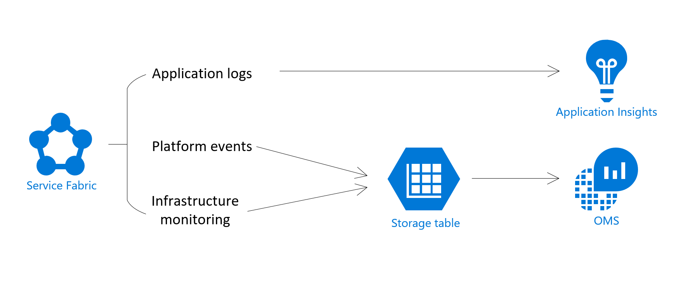

# Monitoring and diagnostics for Azure Service Fabric

This article provides an overview of monitoring and diagnostics for Azure Service Fabric. Monitoring and diagnostics are critical to developing, testing, and deploying workloads in any cloud environment. Monitoring enables you to track how your applications are used, your resource utilization, and the overall health of your cluster. You can use this information to diagnose and correct any issues, and prevent issues from occurring in the future. 

## Application monitoring
Application monitoring tracks how features and components of your application are being used. You want to monitor your applications to make sure issues that impact users are caught. Monitoring your applications can be useful in the following scenarios:
* Determining application load and user traffic - do you need to scale your services to meet user demands or address a potential bottleneck in your application?
* Identifying issues with service communication and remoting across your cluster
* Figuring out what your users are doing with your application - collecting telemetry in your applications can help guide future feature development and better diagnostics for app errors
* Monitoring what is happening inside your running containers

Service Fabric supports many options to instrument your application code with the proper traces and telemetry. We recommend that you use Application Insights (AI). AI's integration with Service Fabric includes tooling experiences for Visual Studio and Azure portal, as well as Service Fabric specific metrics, providing a comprehensive out-of-the-box logging experience. Though many logs are automatically created and collected for you with AI, we recommend that you add further custom logging to your applications to create a richer diagnostics experience. See more about getting started with Application Insights with Service Fabric at [Event analysis with Application Insights](service-fabric-diagnostics-event-analysis-appinsights.md).

## Platform (Cluster) monitoring
Monitoring your Service Fabric cluster is critical in ensuring that the platform and all workloads are running as intended. One of Service Fabric's goals is to keep applications resilient to hardware failures. This goal is achieved through the platform's system services' ability to detect infrastructure issues and rapidly failover workloads to other nodes in the cluster. But in this particular case, what if the system services themselves have issues? Or if in attempting to move a workload, rules for the placement of services are violated? Monitoring the cluster allows you to stay informed about activity taking place in your cluster, which helps in diagnosing issues and fixing them effectively. Some key things you want to be looking out for are:
* Is Service Fabric behaving the way you expect, in terms of placing your applications and balancing work around the cluster? 
* Are user actions taken on your cluster acknowledged and executed on as expected? This is especially relevant when scaling a cluster.
* Is Service Fabric handling your data and your service-service communication inside the cluster correctly?

Service Fabric provides a comprehensive set of events out of the box. These [Service Fabric events](service-fabric-diagnostics-events.md) can be accessed through the EventStore APIs or the operational channel (event channel exposed by the platform). 
* EventStore - the EventStore (available on Windows in versions 6.2 and later, Linux still in progress as of this article's last updated date), exposes these events via a set of APIs (accessible via REST endpoints or through the client library). Read more about the EventStore at the [EventStore Overview](service-fabric-diagnostics-eventstore.md).
* Service Fabric event channels - On Windows, Service Fabric events are available from a single ETW provider with a set of relevant `logLevelKeywordFilters` used to pick between Operational and Data & Messaging channels - this is the way in which we separate out outgoing Service Fabric events to be filtered on as needed. On Linux, Service Fabric events come through LTTng and are put into one Storage table, from where they can be filtered as needed. These channels contain curated, structured events that can be used to better understand the state of your cluster. Diagnostics are enabled by default at the cluster creation time, which create an Azure Storage table where the events from these channels are sent for you to query in the future. 

We recommend using the EventStore for quick analysis and to get a snapshot idea of how your cluster is operating, and if things are happening as expected. For collecting the logs and events being generated by your cluster, we generally recommend using the [Azure Diagnostics extension](service-fabric-diagnostics-event-aggregation-wad.md). This integrates well with Service Fabric Analytics, OMS Log Analytics' Service Fabric specific solution, which provides a custom dashboard for monitoring Service Fabric clusters and allows you to query your cluster's events and set up alerts. Read more about this at [Event analysis with OMS](service-fabric-diagnostics-event-analysis-oms.md). 

 You can read more about monitoring your cluster at [Platform level event and log generation](service-fabric-diagnostics-event-generation-infra.md).

## Performance monitoring
Monitoring your underlying infrastructure is a key part of understanding the state of your cluster and your resource utilization. Measuring system performance depends on several factors, each of which is typically measured through a Key Performance Indicators (KPIs). Service Fabric relevant KPIs can be mapped to metrics that can be collected from the nodes in your cluster, as performance counters.
These KPIs can help with:
* Understanding resource utilization and load - for the purpose of scaling your cluster, or optimizing your service processes.
* Predicting infrastructure issues - many issues are preceded by sudden changes (drops) in performance, so you can use KPIs such as network I/O and CPU utilization to predict and diagnose infrastructural issues.

A list of performance counters that should be collected at the infrastructure level can be found at [Performance metrics](service-fabric-diagnostics-event-generation-perf.md). 

Service Fabric provides a set of performance counters for the Reliable Services and Actors programming models. If you are using either of these models, these performance counters can provide KPIs that help ensure that your actors are spinning up and down correctly, or that your reliable service requests are being handled fast enough. For more information, see [Monitoring for Reliable Service Remoting](service-fabric-reliable-serviceremoting-diagnostics.md#performance-counters) and [Performance monitoring for Reliable Actors](service-fabric-reliable-actors-diagnostics.md#performance-counters). In addition to this, Application Insights also has a set of performance metrics it will collect, if configured with your application.

Use the [OMS agent](service-fabric-diagnostics-oms-agent.md) to collect the appropriate performance counters, and view these KPIs in OMS Log Analytics.

## Health monitoring
The Service Fabric platform includes a health model, which provides extensible health reporting for the status of entities in a cluster. Each node, application, service, partition, replica, or instance, has a continuously updatable health status. The health status can either be "OK", "Warning", or "Error". The health status is changed through health reports that are emitted for each entity, based on issues in the cluster. The health status of your entities can be checked at any time in Service Fabric Explorer (SFX) as shown below, or can be queried via the platforms's Health API. You can also customize health reports and modify the health status of an entity by adding your own health reports or using the Health API. More details on the health model can be found at [Introduction to Service Fabric health monitoring](service-fabric-health-introduction.md).

In addition to seeing latest health reports in SFX, each report is also available as an event. Health events can be collected through the operational channel (see [Event aggregation with Azure Diagnostics](service-fabric-diagnostics-event-aggregation-wad.md#log-collection-configurations)), and stored in Log Analytics for alerting and querying in the future. This helps detect issues that may impact your application availability, so we recommend that you set up alerts for appropriate failure scenarios (custom alerts through Log Analytics).

## Other logging solutions

Although the two solutions we recommended, [OMS](service-fabric-diagnostics-event-analysis-oms.md) and [Application Insights](service-fabric-diagnostics-event-analysis-appinsights.md) have built in integration with Service Fabric, many events are written out through etw providers and are extensible with other logging solutions. You should also look into the [Elastic Stack](https://www.elastic.co/products) (especially if you are considering running a cluster in an offline environment), [Splunk](https://www.splunk.com/), [Dynatrace](https://www.dynatrace.com/), or any other platform of your preference. 

The key points for any platform you choose should include how comfortable you are with the user interface and querying options, the ability to visualize data and create easily readable dashboards, and the additional tools they provide to enhance your monitoring, such as automated alerting.

## Next steps

* For getting started with instrumenting your applications, see [Application level event and log generation](service-fabric-diagnostics-event-generation-app.md).
* Learn more about monitoring the platform and the events Service Fabric provides for you at [Platform level event and log generation](service-fabric-diagnostics-event-generation-infra.md).
* Go through the steps to set up AI for your application with [Monitor and diagnose an ASP.NET Core application on Service Fabric](service-fabric-tutorial-monitoring-aspnet.md).
* Learn how to set up OMS Log Analytics for monitoring containers - [Monitoring and Diagnostics for Windows Containers in Azure Service Fabric](service-fabric-tutorial-monitoring-wincontainers.md).
* Learn about general monitoring recommendations for Azure resources - [Best Practices - Monitoring and diagnostics](https://docs.microsoft.com/azure/architecture/best-practices/monitoring). 
