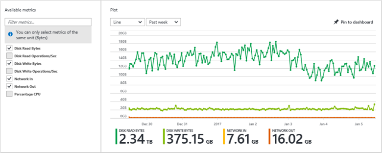

# Monitoring and diagnostics for Azure Service Fabric

Monitoring and diagnostics are critical to developing, testing, and deploying applications and services in any environment. Service Fabric solutions work best when you plan and implement monitoring and diagnostics that help ensure applications and services are working as expected in a local development environment or in production.

The main goals of monitoring and diagnostics are to:
* Detect and diagnose hardware and infrastructure issues
* Detect software and app issues, reduce service downtime
* Understand resource consumption and help drive operations decisions
* Optimize application, service, and infrastructure performance
* Generate business insights and identify areas of improvement

The overall workflow of monitoring and diagnostics consists of three steps:

1. **Event generation**: this includes events (logs, traces, custom events) at both the infrastructure (cluster) and application / service level
2. **Event aggregation**: generated events need to be collected and aggregated before they can be displayed
3. **Analysis**: events need to be visualized and accessible in some format, to allow for analysis and display as needed

Multiple products are available that cover these three areas, and you are free to choose different technologies for each. It is important to make sure that the various pieces work together to deliver an end-to-end monitoring solution for your cluster.

## Event generation

The first step in the monitoring and diagnostics workflow is the creation and generation of events and logs. These events, logs, and traces are generated at two levels: the infrastructure layer (anything from the cluster, the machines, or Service Fabric actions) or the application layer (any instrumentation added to apps and services deployed to the cluster). Events at each of these levels are customizable, though Service Fabric does provide some instrumentation by default.

Read more about [infrastructure level events](service-fabric-diagnostics-event-generation-infra.md) and [application level events](service-fabric-diagnostics-event-generation-app.md) to understand what is provided and how to add further instrumentation.

After making a decision on the logging provider you would like to use, you need to make sure your logs are being aggregated and stored correctly.

## Event aggregation

For collecting the logs and events being generated by your applications and your cluster, we typically recommend using [Azure Diagnostics](service-fabric-diagnostics-event-aggregation-wad.md) (more similar to agent-based log collection) or [EventFlow](service-fabric-diagnostics-event-aggregation-eventflow.md) (in-process log collection).

Collecting application logs using Azure Diagnostics extension is a good option for Service Fabric services if the set of log sources and destinations does not change often and there is a straightforward mapping between the sources and their destinations. The reason for this is configuring Azure Diagnostics happens at the Resource Manager layer, so making significant changes to the configuration requires updating/redeploying the cluster. Additionally, it is best utilized in making sure your logs are being stored somewhere a little more permanent, from where they can be accessed by various analysis platforms. This means that it ends up being less efficient of a pipeline than going with an option like EventFlow.

Using [EventFlow](https://github.com/Azure/diagnostics-eventflow) allows you to have services send their logs directly to an analysis and visualization platform, and/or to storage. Other libraries (ILogger, Serilog, etc.) might be used for the same purpose, but EventFlow has the benefit of having been designed specifically for in-process log collection and to support Service Fabric services. This tends to have several potential advantages:

* Easy configuration and deployment
    * The configuration of diagnostic data collection is just part of the service configuration. It is easy to always keep it "in sync" with the rest of the application
    * Per-application or per-service configuration is easily achievable
    * Configuring data destinations through EventFlow is just a matter of adding the appropriate NuGet package and changing the *eventFlowConfig.json* file
* Flexibility
    * The application can send the data wherever it needs to go, as long as there is a client library that supports the targeted data storage system. New destinations can be added as desired
    * Complex capture, filtering, and data-aggregation rules can be implemented
* Access to internal application data and context
    * The diagnostic subsystem running inside the application/service process can easily augment the traces with contextual information

One thing to note is that these two options are not mutually exclusive and while it is possible to get a similar job done with using one or the other, it could also make sense for you to set up both. In most situations, combining an agent with in-process collection could lead to a more reliable monitoring workflow. The Azure Diagnostics extension (agent) could be your chosen path for infrastructure level logs while you could use EventFlow (in-process collection) for your application level logs. Once you have figured out what works best for you, it is time to think about how you want your data to be displayed and analyzed.

## Event analysis

There are several great platforms that exist in the market when it comes to the analysis and visualization of monitoring and diagnostics data. The two that we recommend are [OMS](service-fabric-diagnostics-event-analysis-oms.md) and [Application Insights](service-fabric-diagnostics-event-analysis-appinsights.md) due to their better integration with Service Fabric, but you should also look into the [Elastic Stack](https://www.elastic.co/products) (especially if you are considering running a cluster in an offline environment), [Splunk](https://www.splunk.com/), or any other platform of your preference.

The key points for any platform you choose should include how comfortable you are with the user interface and querying options, the ability to visualize data and create easily readable dashboards, and the additional tools they provide to enhance your monitoring, such as automated alerting.

In addition to the platform you choose, when you set up a Service Fabric cluster as an Azure resource, you also get access to Azure's out-of-the-box monitoring for machines, which can be useful for specific performance and metric monitoring.

### Azure Monitor

You can use [Azure Monitor](../monitoring-and-diagnostics/monitoring-overview.md) to monitor many of the Azure resources on which a Service Fabric cluster is built. A set of metrics for the [virtual machine scale set](../monitoring-and-diagnostics/monitoring-supported-metrics.md#microsoftcomputevirtualmachinescalesets) and individual [virtual machines](../monitoring-and-diagnostics/monitoring-supported-metrics.md#microsoftcomputevirtualmachinescalesetsvirtualmachines) is automatically collected and displayed in the Azure portal. To view the collected information, in the Azure portal, select the resource group that contains the Service Fabric cluster. Then, select the virtual machine scale set that you want to view. In the **Monitoring** section, select **Metrics** to view a graph of the values.

To customize the charts, follow the instructions in [Metrics in Microsoft Azure](../monitoring-and-diagnostics/insights-how-to-customize-monitoring.md). You also can create alerts based on these metrics, as described in [Create alerts in Azure Monitor for Azure services](../monitoring-and-diagnostics/insights-alerts-portal.md). You can send alerts to a notification service by using web hooks, as described in [Configure a web hook on an Azure metric alert](../monitoring-and-diagnostics/insights-webhooks-alerts.md). Azure Monitor supports only one subscription. If you need to monitor multiple subscriptions, or if you need additional features, [Log Analytics](https://azure.microsoft.com/documentation/services/log-analytics/), part of Microsoft Operations Management Suite, provides a holistic IT management solution both for on-premises and cloud-based infrastructures. You can route data from Azure Monitor directly to Log Analytics, so you can see metrics and logs for your entire environment in a single place.

## Next steps

### Watchdogs

A watchdog is a separate service that can watch health and load across services, and report health for anything in the health model hierarchy. This can help prevent errors that would not be detected based on the view of a single service. Watchdogs are also a good place to host code that performs remedial actions without user interaction (for example, cleaning up log files in storage at certain time intervals). You can find a sample watchdog service implementation [here](https://github.com/Azure-Samples/service-fabric-watchdog-service).

Get started with understanding how events and logs get generated at the [infrastructure level](service-fabric-diagnostics-event-generation-infra.md) and the [application level](service-fabric-diagnostics-event-generation-app.md).