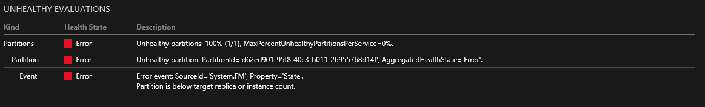

<properties
   pageTitle="Troubleshooting with event tracing | Microsoft Azure"
   description="The most common issues encountered while deploying services on Microsoft Azure Service Fabric."
   services="service-fabric"
   documentationCenter=".net"
   authors="mattrowmsft"
   manager="timlt"
   editor=""/>

<tags
   ms.service="service-fabric"
   ms.devlang="dotnet"
   ms.topic="article"
   ms.tgt_pltfrm="NA"
   ms.workload="NA"
   ms.date="03/31/2016"
   ms.author="mattrow"/>

# Troubleshoot common issues when you deploy services on Azure Service Fabric

When you're running services on your developer computer, it is easy to use [Visual Studio's debugging tools](service-fabric-diagnostics-how-to-monitor-and-diagnose-services-locally.md). For remote clusters, [health reports](service-fabric-view-entities-aggregated-health.md) are always a good place to start. The easiest ways to access these reports are through PowerShell or [SFX](service-fabric-visualizing-your-cluster.md). This article assumes that you are debugging a remote cluster and have a basic understanding of how to use either of these tools.

##Application crash
The "Partition is below target replica or instance count" report is a good indication that your service is crashing. To find out where your service is crashing takes a little more investigation. When your service is running at scale, your best friend will be a set of well-thought-out traces.  We suggest that you try [Azure Diagnostics](service-fabric-diagnostics-how-to-setup-wad.md) for collecting those traces and using a solution such as [Elastic Search](service-fabric-diagnostic-how-to-use-elasticsearch.md) for viewing and searching the traces.

###During service or actor initialization
Any exceptions before the service type is initialized will cause the process to crash. For these types of crashes, the application event log will show the error from your service.
These are the most common exceptions to see before the service is initialized.

***System.IO.FileNotFoundException***

This error is often due to missing assembly dependencies. Check the CopyLocal property in Visual Studio or the global assembly cache for the node.

***System.Runtime.InteropServices.COMException***
 *at System.Fabric.Interop.NativeRuntime+IFabricRuntime.RegisterStatefulServiceFactory(IntPtr, IFabricStatefulServiceFactory)*
 
 This indicates that the registered service type name does not match the service manifest.

[Azure Diagnostics](service-fabric-diagnostics-how-to-setup-wad.md) can be configured to upload the application event log for all your nodes automatically.

###RunAsync() or OnActivateAsync()
If the crash happens during the initialization or running of your registered service type or actor, the exception will be caught by Azure Service Fabric. You can view these from the EventSource providers detailed in the "Next steps" section.

## Next steps

Learn more about existing diagnostics provided by Service Fabric:

* [Reliable Actors diagnostics](service-fabric-reliable-actors-diagnostics.md)
* [Reliable Services diagnostics](service-fabric-reliable-services-diagnostics.md)
