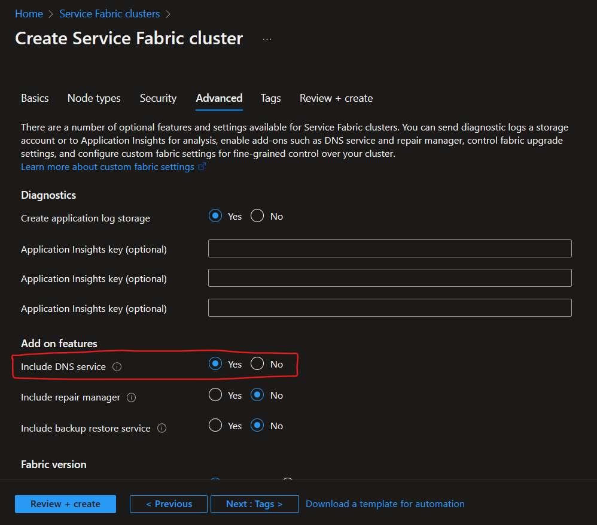
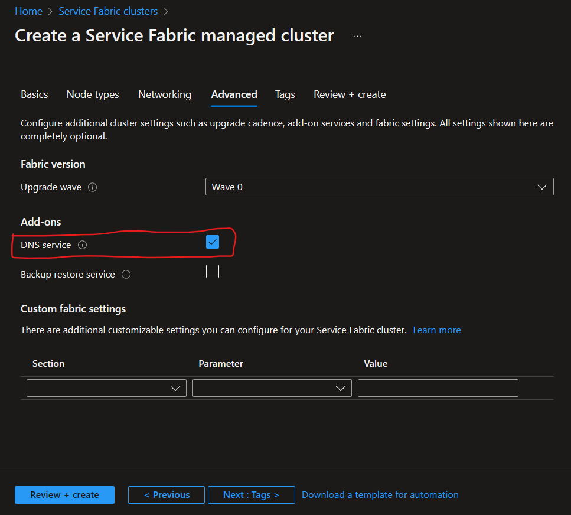
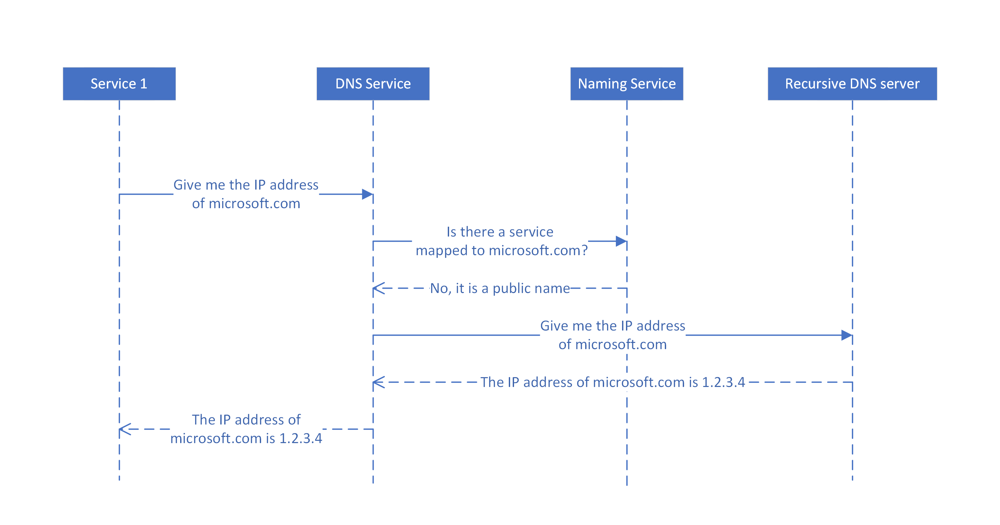

# DNS service in Azure Service Fabric
DNS service is an optional system service that you can enable in your cluster to discover other services using the DNS protocol.

Many services, especially containerized services, are addressable through a pre-existing URL. Being able to resolve these services using the standard DNS protocol, rather than the Service Fabric Naming Service protocol, is desirable. DNS service enables you to map DNS names to a service name and hence resolve endpoint IP addresses. Such functionality maintains the portability of containerized services across different platforms and can make  "lift and shift" scenarios easier, by letting you use existing service URLs rather than rewriting code to use the Naming Service.

DNS service maps DNS names to service names, which in turn are resolved by the Naming Service to return the service endpoint. The DNS name for the service is provided at the time of creation. The following diagram shows how DNS service works for stateless services. For brevity, the diagrams only show one endpoint for the services, although each service can have multiple endpoints. 


Beginning with Service Fabric version 6.3, the Service Fabric DNS protocol has been extended to include a scheme for addressing partitioned stateful services. These extensions make it possible to resolve specific partition IP addresses using a combination of stateful service DNS name and the partition name. All three partitioning schemes are supported:

- Named partitioning
- Ranged partitioning
- Singleton partitioning

The following diagram shows how DNS service works for partitioned stateful services.

 

For more information on partitioned queries, refer to the [section below](#making-dns-queries-on-a-stateful-service-partition).

## OS support
DNS service is supported on both Windows and Linux clusters, although support for Linux is currently limited to containerized services and cannot be enabled through Azure portal. Windows, however, supports all of the service types and deployment models. 

## Enabling DNS service
> [!NOTE]
> Enabling DNS service will override some DNS settings on the nodes. If you experience issues connecting to the internet, check your DNS settings.

### New clusters
#### Clusters using ARM templates
To deploy a new cluster with ARM templates, you can either use the [sample templates](https://github.com/Azure-Samples/service-fabric-cluster-templates) or write your own. If not done already, DNS service can be enabled in the templates by using the minimum supported API versions and by adding the appropriate settings. Details on how to accomplish this can be [seen below](#existing-clusters) in points 1 and 2 of the numbered list. 

#### Clusters using Azure portal
If you are creating a standard cluster in the portal, DNS service is enabled by default in the **Include DNS service** option under the **Add on features** section.



If you are creating a managed cluster in the portal, DNS service is enabled by default in the **DNS service** option under the **Add on features** section.



### Existing clusters
If you are updating an existing managed cluster to enable DNS service, you can do so from the portal by visiting the **Add-on services** page from the cluster resource page. Otherwise, you can enable DNS service using alternative methods that are referenced below:
  - Use the ARM template that was used to deploy the cluster, if applicable.
  - Navigate to the cluster on [Azure Resource Explorer](https://resources.azure.com/) and update the cluster resource, as seen in the steps further below (from step 2 and onward).
  - Navigate to the cluster on the portal and click **Export Template**. To learn more, see [Export the template from resource group](../azure-resource-manager/templates/export-template-portal.md).

After you have a template, you can enable DNS service with the following steps:

1. For standard clusters, check that the `apiVersion` is set to `2017-07-01-preview` or later for the `Microsoft.ServiceFabric/clusters` resource, and, if not, update it as shown in the following example:

    ```json
    {
        "apiVersion": "2017-07-01-preview",
        "type": "Microsoft.ServiceFabric/clusters",
        "name": "[parameters('clusterName')]",
        "location": "[parameters('clusterLocation')]",
        ...
    }
    ```
   For managed clusters, check that the `apiVersion` is set to `2020-01-01-preview` or later for the `Microsoft.ServiceFabric/managedClusters` resource, and, if not, update it as shown in the following example:

    ```json
    {
        "apiVersion": "2020-01-01-preview",
        "type": "Microsoft.ServiceFabric/managedClusters",
        "name": "[parameters('clusterName')]",
        "location": "[parameters('clusterLocation')]",
        ...
    }
    ```

2. Now enable DNS service in one of the following ways:

   - To enable DNS service with default settings, add it to the `addonFeatures` section inside the `properties` section as shown in the following example:

        ```json
        "properties": {
          ...
          "addonFeatures": [
            "DnsService"
            ],
          ...
        }
        ```

   - To enable the service with other than default settings, add a `DnsService` section to the `fabricSettings` section inside the `properties` section. In this case, you don't need to add the DnsService to `addonFeatures`. To learn more about the properties that can be set for DNS service, see [DNS service settings](./service-fabric-cluster-fabric-settings.md#dnsservice).

       ```json
      "properties": {
        ...
        "fabricSettings": [
          ...
          {
            "name": "DnsService",
            "parameters": [
              {
                "name": "IsEnabled",
                "value": "true"
              },
              {
                "name": "<key>",
                "value": "<value>"
              }
            ]
          },
          ...
        ]
      }
       ```
3. Once you have updated the cluster template with your changes, apply them and let the upgrade complete. When the upgrade completes, the DNS system service starts running in your cluster. The service name is `fabric:/System/DnsService`, and you can find it under the **System** service section in Service Fabric explorer.

> [!NOTE]
> When upgrading DNS from disabled to enabled, Service Fabric Explorer may not reflect the new state. To solve, restart the nodes by modifying the upgrade policy in your template.

## Setting the DNS name for your service
You can set DNS names for your services with ARM templates, with default services in the ApplicationManifest.xml file, or with PowerShell commands.

The DNS name for your service is resolvable throughout the cluster, so it is important to ensure the uniqueness of the DNS name across the cluster.

It is highly recommended that you use a naming scheme of `<ServiceName>.<AppName>`; for example, `service1.application1`. If an application is deployed using Docker compose, services are automatically assigned DNS names using this naming scheme.

### Setting the DNS name with ARM template
If you are using ARM templates to deploy your services, you can add the `serviceDnsName` property to the appropriate section and assign a value to it. Examples can be seen below:

#### Standard clusters
For standard clusters, check that the `apiVersion` is set to `2019-11-01-preview` or later for the `Microsoft.ServiceFabric/clusters/applications/services` resource, and, if not, update it as shown in the following example:

```json
{
  "apiVersion": "2019-11-01-preview",
  "type": "Microsoft.ServiceFabric/clusters/applications/services",
  "name": "[concat(parameters('clusterName'), '/', parameters('applicationName'), '/', parameters('serviceName'))]",
  "location": "[variables('clusterLocation')]",
  "dependsOn": [
    "[concat('Microsoft.ServiceFabric/clusters/', parameters('clusterName'), '/applications/', parameters('applicationName'))]"
  ],
  "properties": {
    "provisioningState": "Default",
    "serviceKind": "Stateless",
    "serviceTypeName": "[parameters('serviceTypeName')]",
    "instanceCount": "-1",
    "partitionDescription": {
      "partitionScheme": "Singleton"
    },
    "correlationScheme": [],
    "serviceLoadMetrics": [],
    "servicePlacementPolicies": [],
    "serviceDnsName": "[parameters('serviceDnsName')]"
  }
}
```

#### Managed clusters
For managed clusters, check that the `apiVersion` is set to `2022-10-01-preview` or later for the `Microsoft.ServiceFabric/managedclusters/applications/services` resource, and, if not, update it as shown in the following example:

```json
{
  "apiVersion": "2022-10-01-preview",
  "type": "Microsoft.ServiceFabric/managedclusters/applications/services",
  "name": "[concat(parameters('clusterName'), '/', parameters('applicationName'), '/', parameters('serviceName'))]",
  "location": "[variables('clusterLocation')]",
  "dependsOn": [
    "[concat('Microsoft.ServiceFabric/managedclusters/', parameters('clusterName'), '/applications/', parameters('applicationName'))]"
  ],
  "properties": {
    "serviceKind": "Stateless",
    "serviceTypeName": "[parameters('serviceTypeName')]",
    "instanceCount": "-1",
    "partitionDescription": {
      "partitionScheme": "Singleton"
    },
    "correlationScheme": [],
    "serviceLoadMetrics": [],
    "servicePlacementPolicies": [],
    "serviceDnsName": "[parameters('serviceDnsName')]"
  }
}
```

### Setting the DNS name for a default service in the ApplicationManifest.xml
Open your project in Visual Studio, or your favorite editor, and open the ApplicationManifest.xml file. Go to the default services section, and for each service add the `ServiceDnsName` attribute. The following example shows how to set the DNS name of the service to `stateless1.application1`

```xml
<Service Name="Stateless1" ServiceDnsName="stateless1.application1">
  <StatelessService ServiceTypeName="Stateless1Type" InstanceCount="[Stateless1_InstanceCount]">
    <SingletonPartition />
  </StatelessService>
</Service>
```

The following example sets the DNS name for a stateful service to `stateful1.application1`. The service uses a named partitioning scheme. Notice that the partition names are lower-case. This is a requirement for partitions that will be targeted in DNS queries; for more information, see [Making DNS queries on a stateful service partition](#making-dns-queries-on-a-stateful-service-partition).

```xml
<Service Name="Stateful1" ServiceDnsName="stateful1.application1" />
  <StatefulService ServiceTypeName="Stateful1Type" TargetReplicaSetSize="2" MinReplicaSetSize="2">
    <NamedPartition>
      <Partition Name="partition1" />
      <Partition Name="partition2" />
    </NamedPartition>
  </StatefulService>
</Service>
```

### Setting the DNS name for a service with PowerShell
You can set the DNS name for a service when creating it by using the `New-ServiceFabricService` PowerShell command. The following example creates a new stateless service with the DNS name `stateless1.application1`:

```powershell
New-ServiceFabricService `
    -Stateless `
    -PartitionSchemeSingleton `
    -ApplicationName fabric:/application1 `
    -ServiceName fabric:/application1/stateless1 `
    -ServiceTypeName Stateless1Type `
    -InstanceCount 1 `
    -ServiceDnsName stateless1.application1
```

You can also update an existing service by using the `Update-ServiceFabricService` PowerShell command. The following example updates an existing stateless service to add the DNS name `stateless1.application1`:

```powershell
Update-ServiceFabricService `
    -Stateless `
    -ServiceName fabric:/application1/stateless1 `
    -ServiceDnsName stateless1.application1
```

### Verify that a DNS name is set in Service Fabric Explorer
Once the service is deployed with the DNS name, Service Fabric Explorer will show the DNS name for the service, as shown in the following figure:


> [!NOTE]
> This view may be different depending on the version of Service Fabric Explorer used, however, the DNS name field should be visible in some form on the service page. 

## Making DNS queries on a stateful service partition
Beginning with Service Fabric version 6.3, DNS service supports queries for service partitions. To enable support for partitioned service queries, the [DNS service settings](./service-fabric-cluster-fabric-settings.md#dnsservice) must be updated to set option `EnablePartitionedQuery` to `true`.

For partitions that will be used in DNS queries, the following naming restrictions apply:

   - Partition names should be DNS-compliant.
   - Multi-label partition names including dot or '.' should not be used.
   - Partition names should be lower-case.

DNS queries that target a partition are formatted as follows:

```
    <First-Label-Of-Partitioned-Service-DNSName><PartitionPrefix><Target-Partition-Name><PartitionSuffix>.<Remaining-Partitioned-Service-DNSName>
```
Where:

- *First-Label-Of-Partitioned-Service-DNSName* is the first part of your service DNS name.
- *PartitionPrefix* is a value that can be set in the DnsService section of the cluster manifest or through the cluster's ARM template. The default value is "--". To learn more, see  [DNS service settings](./service-fabric-cluster-fabric-settings.md#dnsservice).
- *Target-Partition-Name* is the name of the partition.
- *PartitionSuffix* is a value that can be set in the DnsService section of the cluster manifest or through the cluster's ARM template. The default value is empty string. To learn more, see  [DNS service settings](./service-fabric-cluster-fabric-settings.md#dnsservice).
- *Remaining-Partitioned-Service-DNSName* is the remaining part of your service DNS name.

The following examples show DNS queries for partitioned services running on a cluster that has default settings for `PartitionPrefix` and `PartitionSuffix`:

- To resolve partition "0" of a service with DNS name `backendrangedschemesvc.application` that uses a ranged partitioning scheme, use `backendrangedschemesvc--0.application`.
- To resolve partition "first" of a service with DNS name `backendnamedschemesvc.application` that uses a named partitioning scheme, use `backendnamedschemesvc--first.application`.

DNS service returns the IP address of the endpoint associated with the primary replica of the partition. If no partition is specified, DNS service will randomly select a partition.

## Using DNS names in your services
If you deploy services with DNS names, you can find the IP address of the exposed endpoints by referencing the DNS name. DNS service works for stateless services, and, in Service Fabric version 6.3 and later, for stateful services. For stateful services running on versions of Service Fabric prior to 6.3, you can use the built-in [reverse proxy service](./service-fabric-reverseproxy.md) for HTTP calls to call a particular service partition.

Dynamic ports are not supported by DNS service. You can use the reverse proxy service to resolve services that use dynamic ports.

The following code shows how to call a stateless service through DNS. It is simply a regular HTTP call where you provide the DNS name, the port, and any optional path as part of the URL.

```csharp
public class ValuesController : Controller
{
    // GET api
    [HttpGet]
    public async Task<string> Get()
    {
        string result = "";
        try
        {
            Uri uri = new Uri("http://stateless1.application1:8080/api/values");
            HttpClient client = new HttpClient();
            var response = await client.GetAsync(uri);
            result = await response.Content.ReadAsStringAsync();

        }
        catch (Exception e)
        {
            Console.Write(e.Message);
        }

        return result;
    }
}
```

The following code shows a call on a specific partition of a stateful service. In this case, the DNS name contains the partition name (partition1). The call assumes a cluster with default values for `PartitionPrefix` and `PartitionSuffix`.

```csharp
public class ValuesController : Controller
{
    // GET api
    [HttpGet]
    public async Task<string> Get()
    {
        string result = "";
        try
        {
            Uri uri = new Uri("http://stateful1--partition1.application1:8080/api/values");
            HttpClient client = new HttpClient();
            var response = await client.GetAsync(uri);
            result = await response.Content.ReadAsStringAsync();

        }
        catch (Exception e)
        {
            Console.Write(e.Message);
        }

        return result;
    }
}
```

## Recursive queries
For DNS names that DNS service can't resolve on its own (for example, a public DNS name), it will forward the query to pre-existing recursive DNS servers on the nodes. 

 

Prior to Service Fabric 9.0, these servers were queried serially until a response was received, with a fixed timeout period of 5 seconds in between. If a server didn't respond within the timeout period, the next server (if available) would be queried. In the case that these DNS servers were encountering any issues, completion of DNS queries would take longer than 5 seconds, which is not ideal. 

Beginning in Service Fabric 9.0, support for parallel recursive queries was added. With parallel queries, all recursive DNS servers can be contacted at once, where the first response wins. This results in quicker responses in the scenario previously mentioned. This option is not enabled by default.

Fine-grained options are also introduced in Service Fabric 9.0 to control the behavior of the recursive queries, including the timeout periods and query attempts. These options can be set in the [DNS service settings](./service-fabric-cluster-fabric-settings.md#dnsservice):

- **RecursiveQuerySerialMaxAttempts** - The number of serial queries that will be attempted, at most. If this number is higher than the number of forwarding DNS servers, querying will stop once all the servers have been attempted exactly once. 
- **RecursiveQuerySerialTimeout** - The timeout value in seconds for each attempted serial query.
- **RecursiveQueryParallelMaxAttempts** - The number of times parallel queries will be attempted. Parallel queries are executed after the max attempts for serial queries have been exhausted. 
- **RecursiveQueryParallelTimeout** - The timeout value in seconds for each attempted parallel query.

## Limitations and known issues
* Dynamic ports are not supported by DNS service. To resolve services exposed on dynamic ports, use the [reverse proxy service](./service-fabric-reverseproxy.md).
* Support for Linux is currently limited to containerized services. Process-based services on Linux currently cannot use DNS service.
* DNS service for Linux clusters cannot be enabled through Azure portal.
* If a DNS name is changed for a service, the name updates may not be immediately visible in some scenarios. To resolve the issue, DNS service instances should be restarted across the cluster. 

## Next steps
Learn more about service communication within the cluster with [connect and communicate with services](service-fabric-connect-and-communicate-with-services.md)
