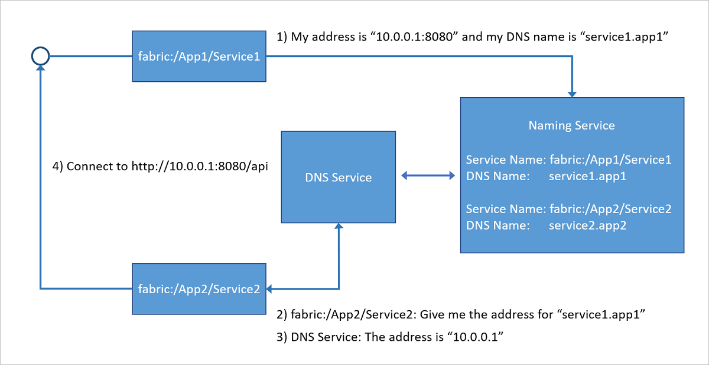
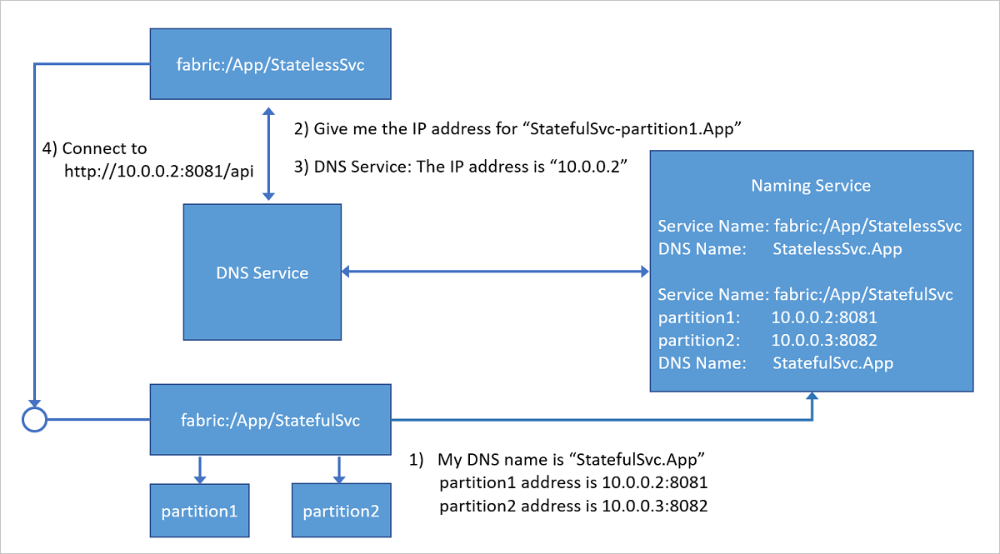
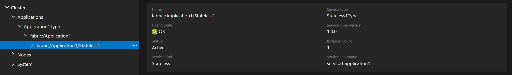

# DNS Service in Azure Service Fabric
The DNS Service is an optional system service that you can enable in your cluster to discover other services using the DNS protocol. 

Many services, especially containerized services, are addressable through a pre-existing URL. Being able to resolve these services using the standard DNS protocol, rather than the Service Fabric Naming Service protocol, is desirable. The DNS service enables you to map DNS names to a service name and hence resolve endpoint IP addresses. Such functionality maintains the portability of containerized services across different platforms and can make  "lift and shift" scenarios easier, by letting you use existing service URLs rather than having to rewrite code to leverage the Naming Service. 

The DNS service maps DNS names to service names, which in turn are resolved by the Naming Service to return the service endpoint. The DNS name for the service is provided at the time of creation. The following diagram shows how the DNS service works for stateless services.



Beginning with Service Fabric version 6.3, the Service Fabric DNS protocol has been extended to include a scheme for addressing partitioned stateful services. These extensions make it possible to resolve specific partition IP addresses using a combination of stateful service DNS name and the partition name. All three partitioning schemes are supported:

- Named partitioning
- Ranged partitioning
- Singleton partitioning

The following diagram shows how the DNS service works for partitioned stateful services.



Dynamic ports are not supported by the DNS service. To resolve services exposed on dynamic ports, use the [reverse proxy service](./service-fabric-reverseproxy.md).

## Enabling the DNS service
When you create a cluster using the portal, the DNS service is enabled by default in the **Include DNS service** check box on the **Cluster configuration** menu:


If you're not using the portal to create your cluster or if you're updating an existing cluster, you'll need to enable the DNS service in a template:

- To deploy a new cluster, you can either use the [sample templates](https://github.com/Azure/azure-quickstart-templates/tree/master/service-fabric-secure-cluster-5-node-1-nodetype) or create your own Resource Manager template. 
- To update an existing cluster, you can navigate to the cluster's resource group on the portal and click **Automation Script** to work with a template that reflects the current state of the cluster and other resources in the group. To learn more, see [Export the template from resource group](https://docs.microsoft.com/azure/azure-resource-manager/resource-manager-export-template#export-the-template-from-resource-group).

After you have a template, you can enable the DNS service with the following steps:

1. Check that the `apiversion` is set to `2017-07-01-preview` or later for the `Microsoft.ServiceFabric/clusters` resource, and, if not, update it as shown in the following example:

    ```json
    {
        "apiVersion": "2017-07-01-preview",
        "type": "Microsoft.ServiceFabric/clusters",
        "name": "[parameters('clusterName')]",
        "location": "[parameters('clusterLocation')]",
        ...
    }
    ```

2. Now enable the DNS service in one of the following ways:

   - To enable the DNS service with default settings, add it to the `addonFeatures` section inside the `properties` section as shown in the following example:

       ```json
           "properties": {
              ...

              "addonFeatures": [
                "DnsService"
              ],
              ...
           }
       ```
   - To enable the service with other than default settings, add a `DnsService` section to the `fabricSettings` section inside the `properties` section. In this case, you don't need to add the DnsService to `addonFeatures`. To learn more about the properties that can be set for the DNS Service, see [DNS Service settings](./service-fabric-cluster-fabric-settings.md#dnsservice).

       ```json
           "properties": {
             ...  
             "fabricSettings": [
               ...
               {
                 "name": "DnsService",
                 "parameters": [
                   {
                     "name": "IsEnabled",
                     "value": "true"
                   },
                   {
                     "name": "PartitionSuffix",
                     "value": "--"
                   },
                   {
                     "name": "PartitionPrefix",
                     "value": "--"
                   }
                 ]
               },
               ...
              ]
            }
       ```
1. Once you have updated the cluster template with your changes, apply them and let the upgrade complete. When the upgrade completes, the DNS system service starts running in your cluster. The service name is `fabric:/System/DnsService`, and you can find it under the **System** service section in Service Fabric explorer. 


## Setting the DNS name for your service
You can set a DNS name for your services either declaratively for default services in the ApplicationManifest.xml file or through PowerShell commands.

The DNS name for your service is resolvable throughout the cluster so it is important to ensure the uniqueness of the DNS name across the cluster. 

It is highly recommended that you use a naming scheme of `<ServiceDnsName>.<AppInstanceName>`; for example, `service1.application1`. If an application is deployed using Docker compose, services are automatically assigned DNS names using this naming scheme.

### Setting the DNS name for a default service in the ApplicationManifest.xml
Open your project in Visual Studio, or your favorite editor, and open the ApplicationManifest.xml file. Go to the default services section, and for each service add the `ServiceDnsName` attribute. The following example shows how to set the DNS name of the service to `service1.application1`

```xml
    <Service Name="Stateless1" ServiceDnsName="service1.application1">
      <StatelessService ServiceTypeName="Stateless1Type" InstanceCount="[Stateless1_InstanceCount]">
        <SingletonPartition />
      </StatelessService>
    </Service>
```
Once the application is deployed, the service instance in the Service Fabric explorer shows the DNS name for this instance, as shown in the following figure: 



The following example sets the DNS name for a stateful service to `statefulsvc.app`. The service uses a named partitioning scheme. Notice that the partition names are lower-case. This is a requirement for partitions that will be targeted in DNS queries; for more information, see [Making DNS queries on a stateful service partition](https://docs.microsoft.com/en-us/azure/service-fabric/service-fabric-dnsservice#preview-making-dns-queries-on-a-stateful-service-partition).

```xml
    <Service Name="Stateful1" ServiceDnsName="statefulsvc.app" />
      <StatefulService ServiceTypeName="ProcessingType" TargetReplicaSetSize="2" MinReplicaSetSize="2">
        <NamedPartition>
         <Partition Name="partition1" />
         <Partition Name="partition2" />
        </NamedPartition>
      </StatefulService>
    </Service>
```

### Setting the DNS name for a service using Powershell
You can set the DNS name for a service when creating it using the `New-ServiceFabricService` Powershell command. The following example creates a new stateless service with the DNS name `service1.application1`

```powershell
    New-ServiceFabricService `
    -Stateless `
    -PartitionSchemeSingleton `
    -ApplicationName `fabric:/application1 `
    -ServiceName fabric:/application1/service1 `
    -ServiceTypeName Service1Type `
    -InstanceCount 1 `
    -ServiceDnsName service1.application1
```

## [Preview] Making DNS queries on a stateful service partition
Beginning with Service Fabric version 6.3, the Service Fabric DNS service supports queries for service partitions.

For partitions that will be used in DNS queries, the following naming restrictions apply:

   - Partition names should be DNS-compliant.
   - Multi-label partition names (that include dot, '.', in the name) should not be used.
   - Partition names should be lower-case.

DNS queries that target a partition are formatted as follows:

```
    <First-Label-Of-Partitioned-Service-DNSName><PartitionPrefix><Target-Partition-Name>< PartitionSuffix>.<Remaining- Partitioned-Service-DNSName>
```
Where:

- *First-Label-Of-Partitioned-Service-DNSName* is the first part of your service DNS name.
- *PartitionPrefix* is a value that can be set in the DnsService section of the cluster manifest or through the cluster's Resource Manager template. The default value is "-". To learn more, see  [DNS Service settings](./service-fabric-cluster-fabric-settings.md#dnsservice).
- *Target-Partition-Name* is the name of the partition. 
- *PartitionSuffix* is a value that can be set in the DnsService section of the cluster manifest or through the cluster's Resource Manager template. The default value is empty string. To learn more, see  [DNS Service settings](./service-fabric-cluster-fabric-settings.md#dnsservice).
- *Remaining-Partitioned-Service-DNSName* is the remaining part of your service DNS name.

The following examples show DNS queries for partitioned services running on a cluster that has default settings for `PartitionPrefix` and `PartitionSuffix`: 

- To resolve partition “0” of a service with DNS name `backendrangedschemesvc.application` that uses a ranged partitioning scheme, use `backendrangedschemesvc-0.application`.
- To resolve partition “first” of a service with DNS name `backendnamedschemesvc.application` that uses a named partitioning scheme, use `backendnamedschemesvc-first.application`.

The DNS service returns the IP address of the primary replica of the partition. If no partition is specified, the service returns the IP address of the primary replica of a randomly selected partition.

## Using DNS in your services
If you deploy more than one service, you can find the endpoints of other services to communicate with by using a DNS name. The DNS service works for stateless services, and, in Service Fabric version 6.3 and later, for stateful services. For stateful services running on versions of Service Fabric prior to 6.3, you can use the built-in [reverse proxy service](./service-fabric-reverseproxy.md) for http calls to call a particular service partition. 

Dynamic ports are not supported by the DNS service. You can use the reverse proxy service to resolve services that use dynamic ports.

The following code shows how to call a stateless service through DNS. It is simply a regular http call where you provide the DNS name, the port, and any optional path as part of the URL.

```csharp
public class ValuesController : Controller
{
    // GET api
    [HttpGet]
    public async Task<string> Get()
    {
        string result = "";
        try
        {
            Uri uri = new Uri("http://service1.application1:8080/api/values");
            HttpClient client = new HttpClient();
            var response = await client.GetAsync(uri);
            result = await response.Content.ReadAsStringAsync();
            
        }
        catch (Exception e)
        {
            Console.Write(e.Message);
        }

        return result;
    }
}
```

The following code shows a call on a specific partition of a stateful service. In this case, the DNS name contains the partition name (partition1). The call assumes a cluster with default values for `PartitionPrefix` and `PartitionSuffix`.

```csharp
public class ValuesController : Controller
{
    // GET api
    [HttpGet]
    public async Task<string> Get()
    {
        string result = "";
        try
        {
            Uri uri = new Uri("http://service2-partition1.application1:8080/api/values");
            HttpClient client = new HttpClient();
            var response = await client.GetAsync(uri);
            result = await response.Content.ReadAsStringAsync();
            
        }
        catch (Exception e)
        {
            Console.Write(e.Message);
        }

        return result;
    }
}
```

## Known Issues
* For Service Fabric versions 6.3 and higher, there is a problem with DNS lookups for service names containing a hyphen in the DNS name. For more information on this issue, please track the following [GitHub Issue](https://github.com/Azure/service-fabric-issues/issues/1197). A fix for this is coming in the next 6.3 update. 

## Next steps
Learn more about service communication within the cluster with  [connect and communicate with services](service-fabric-connect-and-communicate-with-services.md)

