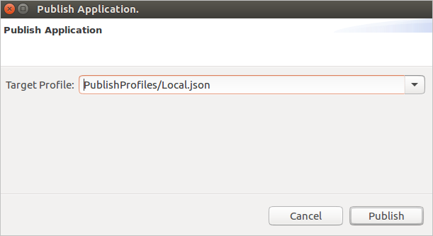
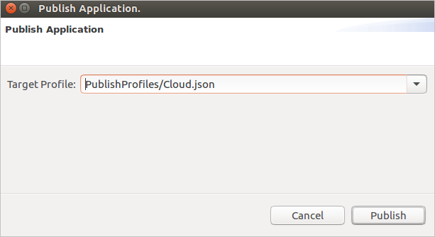
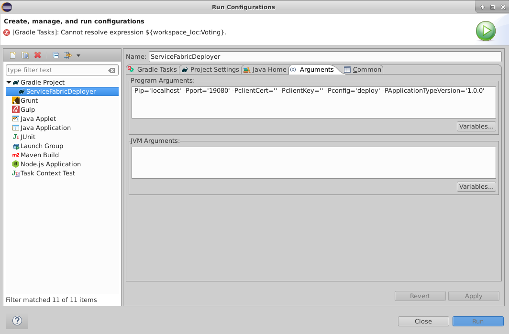

# Service Fabric plug-in for Eclipse Java application development
Eclipse is one of the most widely used integrated development environments (IDEs) for Java developers. In this article, we describe how to set up your Eclipse development environment to work with Azure Service Fabric. Learn how to install the Service Fabric plug-in, create a Service Fabric application, and deploy your Service Fabric application to a local or remote Service Fabric cluster in Eclipse. 

> [!NOTE]
> The Eclipse plugin is currently not supported on Windows. 

> [!IMPORTANT]
> Be sure JDK 8 is installed on the system and selected in Eclipse.

## Install or update the Service Fabric plug-in in Eclipse
You can install a Service Fabric plug-in in Eclipse. The plug-in can help simplify the process of building and deploying Java services.

> [!IMPORTANT]
> The  Service Fabric plug-in requires Eclipse Neon or a later version. See the instructions that follow this note for how to check your version of Eclipse. If you have an earlier version of Eclipse installed, you can download more recent versions from the [Eclipse site](https://www.eclipse.org). It is not recommended that you install on top of (overwrite) an existing installation of Eclipse. You can either remove it before running the installer or install the newer version in a different directory. 
> 
> On Ubuntu, we recommend installing directly from the Eclipse site rather than using a package installer (`apt` or `apt-get`). Doing so ensures that you get the most current version of Eclipse. 

Install Eclipse Neon or later from the [Eclipse site](https://www.eclipse.org).  Also install version 2.2.1 or later of Buildship (the Service Fabric plug-in is not compatible with older versions of Buildship):
-   To check the versions of installed components, in Eclipse, go to **Help** > **About Eclipse** > **Installation Details**.
-   To update Buildship, see [Eclipse Buildship: Eclipse Plug-ins for Gradle][buildship-update].
-   To check for and install updates for Eclipse, go to **Help** > **Check for Updates**.

Install the Service Fabric plug-in, in Eclipse, go to **Help** > **Install New Software**.
1. In the **Work with** box, enter `https://servicefabricdownloads.blob.core.windows.net/eclipse/`.
2. Click **Add**.

   ![Service Fabric plug-in for Eclipse][sf-eclipse-plugin-install]
3. Select the Service Fabric plug-in, and then click **Next**.
4. Complete the installation steps, and then accept the Microsoft Software License Terms.

If you already have the Service Fabric plug-in installed, install the latest version. 
1. To check for available updates, go to **Help** > **About Eclipse** > **Installation Details**. 
2. In the list of installed plug-ins, select Service Fabric, and then click **Update**. Available updates will be installed.
3. Once you update the Service Fabric plug-in, also refresh the Gradle project.  Right click **build.gradle**, then select **Refresh**.

> [!NOTE]
> If installing or updating the Service Fabric plug-in is slow, it might be due to an Eclipse setting. Eclipse collects metadata on all changes to update sites that are registered with your Eclipse instance. To speed up the process of checking for and installing a Service Fabric plug-in update, go to **Available Software Sites**. Clear the check boxes for all sites except for the one that points to the Service Fabric plug-in location ('https://servicefabricdownloads.blob.core.windows.net/eclipse/').

> [!NOTE]
>If Eclipse isn't working as expected on your Mac, or needs you run as super user), go to the **ECLIPSE_INSTALLATION_PATH** folder and navigate to the subfolder **Eclipse.app/Contents/MacOS**. Start Eclipse by running `./eclipse`.

## Create a Service Fabric application in Eclipse

1.  In Eclipse, go to **File** > **New** > **Other**. Select  **Service Fabric Project**, and then click **Next**.

    ![Service Fabric New Project page 1][create-application/p1]

2.  Enter a name for your project, and then click **Next**.

    ![Service Fabric New Project page 2][create-application/p2]

3.  In the list of templates, select **Service Template**. Select your service template type (Actor, Stateless, Container, or Guest Binary), and then click **Next**.

    ![Service Fabric New Project page 3][create-application/p3]

4.  Enter the service name and service details, and then click **Finish**.

    ![Service Fabric New Project page 4][create-application/p4]

5. When you create your first Service Fabric project, in the **Open Associated Perspective** dialog box, click **Yes**.

    ![Service Fabric New Project page 5][create-application/p5]

6.  Your new project looks like this:

    ![Service Fabric New Project page 6][create-application/p6]

## Build a Service Fabric application in Eclipse

1.  Right-click your new Service Fabric application, and then select **Service Fabric**.

    ![Service Fabric right-click menu][publish/RightClick]

2. In the context menu, select one of the following options:
    -   To build the application without cleaning, click **Build Application**.
    -   To do a clean build of the application, click **Rebuild Application**.
    -   To clean the application of built artifacts, click **Clean Application**.

## Deploy a Service Fabric application to the local cluster with Eclipse

After you have built your Service Fabric application, follow these steps to deploy it to the local cluster.

1. If you haven't started the local cluster, follow the instructions in [Set up a local cluster](./service-fabric-get-started-linux.md#set-up-a-local-cluster) to start your local cluster and make sure that it is running.
2. Right-click your Service Fabric application, and then select **Service Fabric**.

    ![Service Fabric right-click menu][publish/RightClick]

3.  From the context menu, click **Deploy Application**.
4.  You can follow the progress of the deploy operation in the Console window.
5.  To verify that your application is running, open Service Fabric Explorer on your local cluster in a browser window `http://localhost:19080/Explorer`. Expand the **Applications** node and make sure your application is running. 

To learn how to debug your application in Eclipse using the local cluster, see [Debug a Java service in Eclipse](./service-fabric-debugging-your-application-java.md).

You can also deploy your application to the local cluster with the **Publish Application** command:

1. Right-click your Service Fabric application, and then select **Service Fabric**.
2. From the context menu, click **Publish Application...**.
3. In the **Publish Application** window, choose **PublishProfiles/Local.json** as the Target Profile and click **Publish**.

    

    By default, the Local.json publishing profile is set up to publish to the local cluster. For more information about the connection and endpoint parameters present in publishing profiles, see the next section.

## Publish your Service Fabric application to Azure with Eclipse

To publish your application to the cloud, follow these steps:

1. To publish your application to a secure cluster in the cloud, you need an X.509 certificate to use to communicate with your cluster. In test and development environments, the certificate used is often the cluster certificate. In production environments, the certificate should be a client certificate that is distinct from the cluster certificate. You need both the certificate and the private key. The certificate (and key) file must be PEM-formatted. You can create a PEM file that contains the certificate and private key from a PFX file with the following openssl command:

    ```bash
    openssl pkcs12 -in your-cert-file.pfx -out your-cert-file.pem -nodes -passin pass:your-pfx-password
    ```

   If the PFX file is not password protected, use `--passin pass:` for the last parameter.

2. Open the **Cloud.json** file under the **PublishProfiles** directory. You need to configure the cluster endpoint and security credentials appropriately for your cluster.

   - The `ConnectionIPOrURL` field contains the IP address or URL of your cluster. Note that the value does not contain the URL scheme (`https://`).
   - By default the `ConnectionPort` field should be `19080`, unless you explicitly have changed this port for your cluster.
   - The `ClientKey` field should point to a PEM-formatted .pem or .key file on your local machine that contains the private key for your client or cluster certificate.
   - The `ClientCert` field should point to a PEM-formatted .pem or .crt file on your local machine that contains the certificate data for your client or cluster. certificate. 

     ```bash
     {
         "ClusterConnectionParameters":
         {
            "ConnectionIPOrURL": "lnxxug0tlqm5.westus.cloudapp.azure.com",
            "ConnectionPort": "19080",
            "ClientKey": "[path_to_your_pem_file_on_local_machine]",
            "ClientCert": "[path_to_your_pem_file_on_local_machine]"
         }
     }
     ```

2. Right-click your Service Fabric application, and then select **Service Fabric**.
3. From the context menu, click **Publish Application...**.
3. In the **Publish Application** window, choose **PublishProfiles/Cloud.json** as the Target Profile and click **Publish**.

    

4. You can follow the progress of the publish operation in the Console window.
5. To verify that your application is running, open Service Fabric Explorer on your Azure cluster in a browser window. For the example above, this would be: `https://lnxxug0tlqm5.westus.cloudapp.azure.com:19080/Explorer`. Expand the **Applications** node and make sure your application is running. 

On secure Linux clusters, if your application contains Reliable Services services, you will also need to configure a certificate that your services can use to call Service Fabric runtime APIs. To learn more, see [Configure a Reliable Services app to run on Linux clusters](./service-fabric-configure-certificates-linux.md#configure-a-reliable-services-app-to-run-on-linux-clusters).

For a quick walk through of how to deploy a Service Fabric Reliable Services application written in Java to a secure Linux cluster, see [Quickstart: Deploy a Java Reliable Services application](./service-fabric-quickstart-java-reliable-services.md).

## Deploy a Service Fabric application by using Eclipse run configurations

An alternate way to deploy your Service Fabric application is by using Eclipse run configurations.

1. In Eclipse, go to **Run** > **Run Configurations**.
2. Under **Gradle Project**, select the **ServiceFabricDeployer** run configuration.
3. In the right pane, on the **Arguments** tab, make sure the **ip**, **port**, **clientCert**, and **clientKey** parameters are set appropriately for your deployment. By default, the parameters are set to deploy to the local cluster as in the following screenshot. To publish your app to Azure you can modify the parameters to contain the endpoint details and security credentials for your Azure cluster. For more information, see the previous section, [Publish your Service Fabric application to Azure with Eclipse](#publish-your-service-fabric-application-to-azure-with-eclipse).

    

5. Make sure that **Working Directory** points to the application you want to deploy. To change the application, click the **Workspace** button, and then select the application you want.
6. Click **Apply**, and then click **Run**.

Your application builds and deploys within a few moments. You can monitor the deployment status in Service Fabric Explorer.  

## Add a Service Fabric service to your Service Fabric application

To add a Service Fabric service to an existing Service Fabric application, do the following steps:

1.  Right-click the project you want to add a service to, and then click **Service Fabric**.

    ![Service Fabric Add Service page 1][add-service/p1]

2.  Click **Add Service Fabric Service**, and complete the set of steps to add a service to the project.
3.  Select the service template you want to add to your project, and then click **Next**.

    ![Service Fabric Add Service page 2][add-service/p2]

4.  Enter the service name (and other details, as needed), and then click the **Add Service** button.  

    ![Service Fabric Add Service page 3][add-service/p3]

5.  After the service is added, your overall project structure looks similar to the following project:

    ![Service Fabric Add Service page 4][add-service/p4]

## Edit Manifest versions of your Service Fabric Java application

To edit manifest versions, right click on the project, go to **Service Fabric** and select **Edit Manifest Versions...** from the menu dropdown. In the wizard, you can update the manifest versions for application manifest, service manifest and the versions for **Code**, **Config** and **Data** packages.

If you check the option **Automatically update application and service versions** and then update a version, then the manifest versions will be automatically updated. To give an example, you first select the check-box, then update the version of **Code** version from 0.0.0 to 0.0.1 and click on **Finish**, then service manifest version and application manifest version will be automatically updated to 0.0.1.

## Upgrade your Service Fabric Java application

For an upgrade scenario, say you created the **App1** project by using the Service Fabric plug-in in Eclipse. You deployed it by using the plug-in to create an application named **fabric:/App1Application**. The application type is **App1ApplicationType**, and the application version is 1.0. Now, you want to upgrade your application without interrupting availability.

First, make any changes to your application, and then rebuild the modified service. Update the modified service’s manifest file (ServiceManifest.xml) with the updated versions for the service (and Code, Config, or Data, as relevant). Also, modify the application’s manifest (ApplicationManifest.xml) with the updated version number for the application and the modified service.  

To upgrade your application by using Eclipse, you can create a duplicate run configuration profile. Then, use it to upgrade your application as needed.

1.  Go to **Run** > **Run Configurations**. In the left pane, click the small arrow to the left of **Gradle Project**.
2.  Right-click **ServiceFabricDeployer**, and then select **Duplicate**. Enter a new name for this configuration, for example, **ServiceFabricUpgrader**.
3.  In the right panel, on the **Arguments** tab, change **-Pconfig='deploy'** to **-Pconfig='upgrade'**, and then click **Apply**.

This process creates and saves a run configuration profile you can use at any time to upgrade your application. It also gets the latest updated application type version from the application manifest file.

The application upgrade takes a few minutes. You can monitor the application upgrade in Service Fabric Explorer.

## Migrating old Service Fabric Java applications to be used with Maven
We have recently moved Service Fabric Java libraries from Service Fabric Java SDK to Maven repository. While the new applications you generate using Eclipse, will generate latest updated projects (which will be able to work with Maven), you can update your existing Service Fabric stateless or actor Java applications, which were using the Service Fabric Java SDK earlier, to use the Service Fabric Java dependencies from Maven. Please follow the steps mentioned [here](service-fabric-migrate-old-javaapp-to-use-maven.md) to ensure your older application works with Maven.

## Next steps

- For quick steps on building Java Reliable service application and deploying it locally and to Azure, see [Quickstart: Deploy a Java Reliable Services application](./service-fabric-quickstart-java-reliable-services.md).
- To learn how to debug a Java application on your local cluster, see [Debug a Java service in Eclipse](./service-fabric-debugging-your-application-java.md).
- To learn how to monitor and diagnose Service Fabric applications, see [Monitor and diagnose services in a local machine development setup](./service-fabric-diagnostics-how-to-monitor-and-diagnose-services-locally-linux.md).

<!-- Images -->

[sf-eclipse-plugin-install]: ./media/service-fabric-get-started-eclipse/service-fabric-eclipse-plugin.png

[create-application/p1]:./media/service-fabric-get-started-eclipse/create-application/p1.png
[create-application/p2]:./media/service-fabric-get-started-eclipse/create-application/p2.png
[create-application/p3]:./media/service-fabric-get-started-eclipse/create-application/p3.png
[create-application/p4]:./media/service-fabric-get-started-eclipse/create-application/p4.png
[create-application/p5]:./media/service-fabric-get-started-eclipse/create-application/p5.png
[create-application/p6]:./media/service-fabric-get-started-eclipse/create-application/p6.png

[publish/Publish]: ./media/service-fabric-get-started-eclipse/publish/Publish.png
[publish/RightClick]: ./media/service-fabric-get-started-eclipse/publish/RightClick.png

[add-service/p1]: ./media/service-fabric-get-started-eclipse/add-service/p1.png
[add-service/p2]: ./media/service-fabric-get-started-eclipse/add-service/p2.png
[add-service/p3]: ./media/service-fabric-get-started-eclipse/add-service/p3.png
[add-service/p4]: ./media/service-fabric-get-started-eclipse/add-service/p4.png

<!-- Links -->
[buildship-update]: https://projects.eclipse.org/projects/tools.buildship
