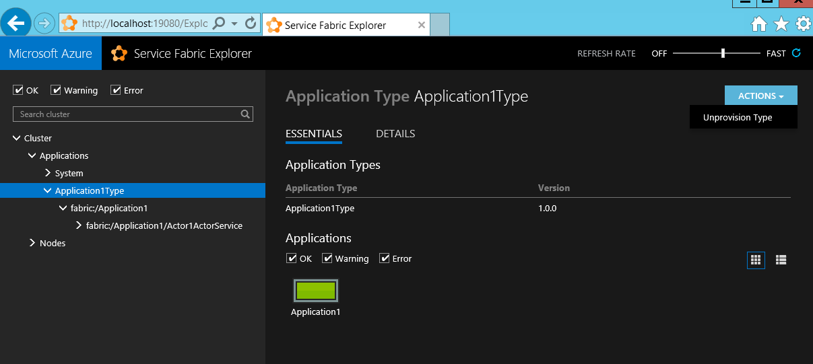

# Use Visual Studio to simplify writing and managing your Service Fabric applications
You can manage your Azure Service Fabric applications and services through Visual Studio. Once you've [set up your development environment](service-fabric-get-started.md), you can use Visual Studio to create Service Fabric applications, add services, or package, register, and deploy applications in your local development cluster.

## Deploy your Service Fabric application
By default, deploying an application combines the following steps into one simple operation:

1. Creating the application package
2. Uploading the application package to the image store
3. Registering the application type
4. Removing any running application instances
5. Creating a new application instance

In Visual Studio, pressing **F5** will also deploy your application and attach the debugger to all application instances. You can use **Ctrl+F5** to deploy an application without debugging, or you can publish to a local or remote cluster by using the publish profile. For more information, see [Publish an application to a remote cluster by using Visual Studio](service-fabric-publish-app-remote-cluster.md).

### Application Debug Mode
By default, Visual Studio removes existing instances of your application type when you stop debugging or (if you deployed the app without attaching the debugger), when you redeploy the application. In that case, all the application's data is removed. While debugging locally, you may want to keep data that you've already created when testing a new version of the application, you want to keep the application running or you want subsequent debug sessions to upgrade the application. Visual Studio Service Fabric Tools provide a property called **Application Debug Mode**, which controls whether the **F5** should uninstall the application, keep the application running after a debug session ends or enable the application to be upgraded on subsequent debugging sessions, rather than removed and redeployed.

#### To set the Application Debug Mode property
1. On the application project's shortcut menu, choose **Properties** (or press the **F4** key).
2. In the **Properties** window, set the **Application Debug Mode** property.

    ![Set Application Debug Mode Property][debugmodeproperty]

These are the **Application Debug Mode** options available.

1. **Auto Upgrade**: The application continues to run when the debug session ends. The next **F5** will treat the deployment as an upgrade by using unmonitored auto mode to quickly upgrade the application to a newer version with a date string appended. The upgrade process preserves any data that you entered in a previous debug session.
2. **Keep Application**: The application keeps running in the cluster when the debug session ends. On the next **F5** the application will be removed and the newly built application will be deployed to the cluster.
3. **Remove Application** causes the application to be removed when the debug session ends.

For **Auto Upgrade** data is preserved by applying the application upgrade capabilities of Service Fabric, but it is tuned to optimize for performance rather than safety. For more information about upgrading applications and how you might perform an upgrade in a real environment, see [Service Fabric application upgrade](service-fabric-application-upgrade.md).

![Example of new application version with date appended][preservedata]

> [!NOTE]
> This property doesn't exist prior to version 1.1 of the Service Fabric Tools for Visual Studio. Prior to 1.1, please use the **Preserve Data On Start** property to achieve the same behavior. The "Keep Application" option was introduced in version 1.2 of the Service Fabric Tools for Visual Studio.
>
>

## Add a service to your Service Fabric application
You can add new services to your application to extend its functionality.  To ensure that the service is included in your application package, add the service through the **New Fabric Service...** menu item.

![Add a new fabric service to your application][newservice]

Select a Service Fabric project type to add to your application, and specify a name for the service.  See [Choosing a framework for your service](service-fabric-choose-framework.md) to help you decide which service type to use.

![Select a Fabric Service project type to add to your application][addserviceproject]

The new service will be added to your solution and existing application package. The service references and a default service instance will be added to the application manifest. The service will be created and started the next time you deploy the application.

![The new service will be added to your application manifest][newserviceapplicationmanifest]

## Package your Service Fabric application
To deploy the application and its services to a cluster, you need to create an application package.  The package organizes the application manifest, service manifest(s), and other necessary files in a specific layout.  Visual Studio sets up and manages the package in the application project's folder, in the 'pkg' directory.  Clicking **Package** from the **Application** context menu creates or updates the application package.  You may want to do this if you deploy the application by using custom PowerShell scripts.

## Remove applications and application types using Cloud Explorer
You can perform basic cluster management operations from within Visual Studio using Cloud Explorer, which you can launch from the **View** menu. For instance, you can delete applications and unprovision application types on local or remote clusters.

> [!TIP]
> For richer cluster management functionality, see [Visualizing your cluster with Service Fabric Explorer](service-fabric-visualizing-your-cluster.md).
>
>

<!--Every topic should have next steps and links to the next logical set of content to keep the customer engaged-->
## Next steps
* [Service Fabric application model](service-fabric-application-model.md)
* [Service Fabric application deployment](service-fabric-deploy-remove-applications.md)
* [Managing application parameters for multiple environments](service-fabric-manage-multiple-environment-app-configuration.md)
* [Debugging your Service Fabric application](service-fabric-debugging-your-application.md)
* [Visualizing your cluster by using Service Fabric Explorer](service-fabric-visualizing-your-cluster.md)

<!--Image references-->
[addserviceproject]:./media/service-fabric-manage-application-in-visual-studio/addserviceproject.png
[manageservicefabric]: ./media/service-fabric-manage-application-in-visual-studio/manageservicefabric.png
[newservice]:./media/service-fabric-manage-application-in-visual-studio/newservice.png
[newserviceapplicationmanifest]:./media/service-fabric-manage-application-in-visual-studio/newserviceapplicationmanifest.png
[preservedata]:./media/service-fabric-manage-application-in-visual-studio/preservedata.png
[debugmodeproperty]:./media/service-fabric-manage-application-in-visual-studio/debugmodeproperty.png
