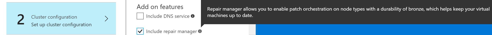
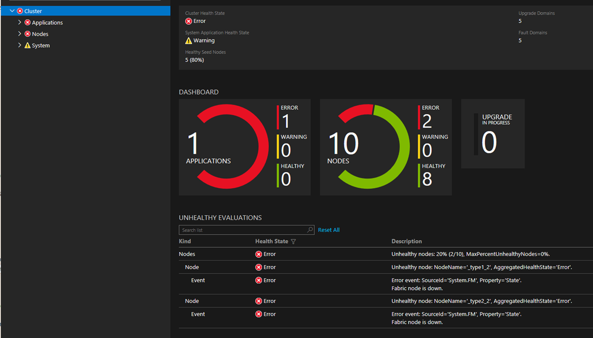

# Patch the Linux operating system in your Service Fabric cluster

> [!div class="op_single_selector"]
> * [Windows](service-fabric-patch-orchestration-application.md)
> * [Linux](service-fabric-patch-orchestration-application-linux.md)
>
>

The patch orchestration application is an Azure Service Fabric application that automates operating system patching on a Service Fabric cluster without downtime.

The patch orchestration app provides the following features:

- **Automatic operating system update installation**. Operating system updates are automatically downloaded and installed. Cluster nodes are rebooted as needed without cluster downtime.

- **Cluster-aware patching and health integration**. While applying updates, the patch orchestration app monitors the health of the cluster nodes. Cluster nodes are upgraded one node at a time or one upgrade domain at a time. If the health of the cluster goes down due to the patching process, patching is stopped to prevent aggravating the problem.

## Internal details of the app

The patch orchestration app is composed of the following subcomponents:

- **Coordinator Service**: This stateful service is responsible for:
    - Coordinating the OS Update job on the entire cluster.
    - Storing the result of completed OS Update operations.
- **Node Agent Service**: This stateless service runs on all Service Fabric cluster nodes. The service is responsible for:
    - Bootstrapping the Node Agent daemon on Linux.
    - Monitoring the daemon service.
- **Node Agent daemon**: This Linux daemon service runs at a higher-level privilege (root). In contrast, the Node Agent Service and the Coordinator Service run at a lower-level privilege. The service is responsible for performing the following Update jobs on all the cluster nodes:
    - Disabling automatic OS Update on the node.
    - Downloading and installing OS Update according to the policy the user has provided.
    - Restarting the machine post OS Update installation if needed.
    - Uploading the results of OS updates to the Coordinator Service.
    - Reporting health reports in case an operation has failed after exhausting all retries.

> [!NOTE]
> The patch orchestration app uses the Service Fabric repair manager system service to disable or enable the node and perform health checks. The repair task created by the patch orchestration app tracks the Update progress for each node.

## Prerequisites

### Ensure that your Azure VMs are running Ubuntu 16.04
At the time of writing this document, Ubuntu 16.04 (`Xenial Xerus`) is the only supported version.

### Ensure that the service fabric linux cluster is version 6.2.x and above

Patch orchestration app linux uses certain features of runtime that are only available in service fabric runtime version 6.2.x and above.

### Enable the repair manager service (if it's not running already)

The patch orchestration app requires the repair manager system service to be enabled on the cluster.

#### Azure clusters

Azure linux clusters in the silver and gold durability tier have the repair manager service enabled by default. Azure clusters in the bronze durability tier, by default, do not have the repair manager service enabled. If the service is already enabled, you can see it running in the system services section in the Service Fabric Explorer.

##### Azure portal
You can enable repair manager from Azure portal at the time of setting up of cluster. Select **Include Repair Manager** option under **Add-on features** at the time of cluster configuration.


##### Azure Resource Manager deployment model
Alternatively you can use the [Azure Resource Manager deployment model](https://docs.microsoft.com/azure/service-fabric/service-fabric-cluster-creation-via-arm) to enable the repair manager service on new and existing Service Fabric clusters. Get the template for the cluster that you want to deploy. You can either use the sample templates or create a custom Azure Resource Manager deployment model template. 

To enable the repair manager service using [Azure Resource Manager deployment model template](https://docs.microsoft.com/azure/service-fabric/service-fabric-cluster-creation-via-arm):

1. First check that the `apiversion` is set to `2017-07-01-preview` for the `Microsoft.ServiceFabric/clusters` resource. If it is different, then you need to update the `apiVersion` to the value `2017-07-01-preview` or higher:

    ```json
    {
        "apiVersion": "2017-07-01-preview",
        "type": "Microsoft.ServiceFabric/clusters",
        "name": "[parameters('clusterName')]",
        "location": "[parameters('clusterLocation')]",
        ...
    }
    ```

2. Now enable the repair manager service by adding the following `addonFeatures` section after the `fabricSettings` section:

    ```json
    "fabricSettings": [
        ...      
    ],
    "addonFeatures": [
        "RepairManager"
    ],
    ```

3. After you have updated your cluster template with these changes, apply them and let the upgrade finish. You can now see the repair manager system service running in your cluster. It is called `fabric:/System/RepairManagerService` in the system services section in the Service Fabric Explorer. 

### Standalone on-premises clusters

Standalone Service Fabric Linux clusters aren't supported at the time of writing this document.

### Disable automatic OS Update on all nodes

Automatic OS updates might lead to availability loss and or change in behavior of the running applications. The patch orchestration app, by default, tries to disable the automatic OS Update on each cluster node to prevent such scenarios.
For Ubuntu [unattended-upgrades](https://help.ubuntu.com/community/AutomaticSecurityUpdates) are disabled by patch orchestration app.

## Download the app package

Application along with installation scripts can be downloaded from [Archive link](https://go.microsoft.com/fwlink/?linkid=867984).

Application in sfpkg format can be downloaded from [sfpkg link](https://aka.ms/POA/POA_v2.0.2.sfpkg). This comes handy for [Azure Resource Manager based application deployment](service-fabric-application-arm-resource.md).

## Configure the app

The behavior of the patch orchestration app can be configured to meet your needs. Override the default values by passing in the application parameter during application creation or update. Application parameters can be provided by specifying `ApplicationParameter` to the `Start-ServiceFabricApplicationUpgrade` or `New-ServiceFabricApplication` cmdlets.

|**Parameter**        |**Type**                          | **Details**|
|:-|-|-|
|MaxResultsToCache    |Long                              | Maximum number of Update results, which should be cached. <br>Default value is 3000 assuming the: <br> - Number of nodes is 20. <br> - Number of updates happening on a node per month is five. <br> - Number of results per operation can be 10. <br> - Results for the past three months should be stored. |
|TaskApprovalPolicy   |Enum <br> { NodeWise, UpgradeDomainWise }                          |TaskApprovalPolicy indicates the policy that is to be used by the Coordinator Service to install updates across the Service Fabric cluster nodes.<br>                         Allowed values are: <br>                                                           <b>NodeWise</b>. Updates are installed one node at a time. <br>                                                           <b>UpgradeDomainWise</b>. Updates are installed one upgrade domain at a time. (At the maximum, all the nodes belonging to an upgrade domain can go for update.)
| UpdateOperationTimeOutInMinutes | Int <br>(Default: 180)                   | Specifies the timeout for any Update operation (download or install). If the operation is not completed within the specified timeout, it is aborted.       |
| RescheduleCount      | Int <br> (Default: 5)                  | The maximum number of times the service reschedules the OS update in case an operation fails persistently.          |
| RescheduleTimeInMinutes  | Int <br>(Default: 30) | The interval at which the service reschedules the OS update in case failure persists. |
| UpdateFrequency           | Comma-separated string (Default: "Weekly, Wednesday, 7:00:00")     | The frequency for installing OS updates on the cluster. The format and possible values are: <br>-   Monthly, DD, HH:MM:SS, for example, Monthly, 5, 12:22:32. <br> -   Weekly, DAY, HH:MM:SS, for example, Weekly, Tuesday, 12:22:32.  <br> -   Daily, HH:MM:SS, for example, Daily, 12:22:32.  <br> -  None indicates that update shouldn't be done.  <br><br> All the times are in UTC.|
| UpdateClassification | Comma-separated string (Default: “securityupdates”) | Type of updates that should be installed on the cluster nodes. Acceptable values are securityupdates, all. <br> -  securityupdates - would install only security updates <br> -  all - would install all available updates from apt.|
| ApprovedPatches | Comma-separated string (Default: "") | This is the list of approved updates that should be installed on cluster nodes. The comma-separated list contains approved packages and optionally desired target version.<br> for example: "apt-utils = 1.2.10ubuntu1, python3-jwt, apt-transport-https < 1.2.194, libsystemd0 >= 229-4ubuntu16" <br> The above would install <br> - apt-utils with version 1.2.10ubuntu1 if it is available in apt-cache. If that particular version isn't available, then it is a no-op. <br> - python3-jwt upgrades to latest available version. If the package is not present, then it is a no-op. <br> - apt-transport-https upgrades to highest version that is less than 1.2.194. If this version is not present, then it is a no-op. <br> - libsystemd0 upgrades to highest version that is greater than equal to 229-4ubuntu16. If such a version does not exist, then it is a no-op.|
| RejectedPatches | Comma-separated string (Default: "") | This is the list of updates that should not be installed on the cluster nodes <br> for example: "bash, sudo" <br> The preceding filters out bash, sudo from receiving any updates. |


> [!TIP]
> If you want OS Update to happen immediately, set `UpdateFrequency` relative to the application deployment time. For example, suppose that you have a five-node test cluster and plan to deploy the app at around 5:00 PM UTC. If you assume that the application upgrade or deployment takes 30 minutes at the maximum, set the UpdateFrequency as "Daily, 17:30:00."

## Deploy the app

1. Prepare the cluster by finishing all the prerequisite steps.
2. Deploy the patch orchestration app like any other Service Fabric app. You can deploy the app by using PowerShell or Azure Service Fabric CLI. Follow the steps in [Deploy and remove applications using PowerShell](https://docs.microsoft.com/azure/service-fabric/service-fabric-deploy-remove-applications) or [Deploy application using Azure Service Fabric CLI](https://docs.microsoft.com/azure/service-fabric/scripts/cli-deploy-application)
3. To configure the application at the time of deployment, pass the `ApplicationParamater` to the `New-ServiceFabricApplication` cmdlet or the scripts provided. For your convenience, powershell (Deploy.ps1) and bash (Deploy.sh) scripts are provided along with the application. To use the script:

    - Connect to a Service Fabric cluster.
    - Execute the Deploy script. Optionally pass the application parameter to the script. for example: .\Deploy.ps1 -ApplicationParameter @{ UpdateFrequency = "Daily, 11:00:00"} OR ./Deploy.sh "{\"UpdateFrequency\":\"Daily, 11:00:00\"}" 

> [!NOTE]
> Keep the script and the application folder PatchOrchestrationApplication in the same directory.

## Upgrade the app

To upgrade an existing patch orchestration app, follow the steps in [Service Fabric application upgrade using PowerShell](https://docs.microsoft.com/azure/service-fabric/service-fabric-application-upgrade-tutorial-powershell) or [Service Fabric application upgrade using Azure Service Fabric CLI](https://docs.microsoft.com/azure/service-fabric/service-fabric-sfctl-application#sfctl-application-upgrade)

## Remove the app

To remove the application, follow the steps in [Deploy and remove applications using PowerShell](https://docs.microsoft.com/azure/service-fabric/service-fabric-deploy-remove-applications) or [Remove an application using Azure Service Fabric CLI](https://docs.microsoft.com/azure/service-fabric/service-fabric-sfctl-application#sfctl-application-delete)

For your convenience, powershell (Undeploy.ps1) and bash (Undeploy.sh) scripts are provided along with the application. To use the script:

  - Connect to a Service Fabric cluster.
  - Execute the script Undeploy.ps1 or Undeploy.sh

> [!NOTE]
> Keep the script and the application folder PatchOrchestrationApplication in the same directory.

## View the Update results

The patch orchestration app exposes REST APIs to display the historical results to the user. Following is a sample result: 
```testadm@bronze000001:~$ curl -X GET http://10.0.0.5:20002/PatchOrchestrationApplication/v1/GetResults```
```json
[ 
  { 
    "NodeName": "_bronze_0", 
    "UpdateOperationResults": [ 
      { 
        "OperationResult": "succeeded", 
        "NodeName": "_bronze_0", 
        "OperationTime": "2017-11-21T12:39:29.0435917Z", 
        "UpdateDetails": [ 
          { 
            "UpdateId": "linux-cloud-tools-azure:amd64=4.11.0.1015.15", 
            "ResultCode": "succeeded" 
          }, 
          { 
            "UpdateId": "linux-headers-azure:amd64=4.11.0.1015.15", 
            "ResultCode": "succeeded" 
          }, 
          { 
            "UpdateId": "linux-image-azure:amd64=4.11.0.1015.15", 
            "ResultCode": "succeeded" 
          }, 
          { 
            "UpdateId": "linux-tools-azure:amd64=4.11.0.1015.15", 
            "ResultCode": "succeeded" 
          }, 
          { 
            "UpdateId": "python3-apport:amd64=2.20.1-0ubuntu2.13", 
            "ResultCode": "succeeded" 
          }, 
        ], 
        "OperationType": "installation", 
        "UpdateClassification": "securityupdates", 
        "UpdateFrequency": "Daily, 7:00:00", 
        "RebootRequired": true, 
        "ApprovedList": "", 
        "RejectedList": "" 
      } 
    ] 
  } 
] 
```

Fields of the JSON are described as follows:

Field | Values | Details
-- | -- | --
OperationResult | 0 - Succeeded<br> 1 - Succeeded With Errors<br> 2 - Failed<br> 3 - Aborted<br> 4 - Aborted With Timeout | Indicates the result of overall operation (typically involving installation of one or more updates).
ResultCode | Same as OperationResult | This field indicates result of installation operation for an individual update.
OperationType | 1 - Installation<br> 0 - Search and Download.| Installation is the only OperationType that would be shown in the results by default.
UpdateClassification | Default is "securityupdates" | Type of updates that is installed during the update operation
UpdateFrequency | Default is "Weekly, Wednesday, 7:00:00" | Update frequency configured for this update.
RebootRequired | true - reboot was required<br> false - reboot was not required | Indicates a reboot was required to complete installation of updates.
ApprovedList | Default is "" | List of approved patches for this update
RejectedList | Default is "" | List of rejected patches for this update

If no update is scheduled yet, the result JSON is empty.

Log in to the cluster to query Update results. Then find out the replica address for the primary of the Coordinator Service, and hit the URL from the browser:
http://&lt;REPLICA-IP&gt;:&lt;ApplicationPort&gt;/PatchOrchestrationApplication/v1/GetResults.

The REST endpoint for the Coordinator Service has a dynamic port. To check the exact URL, refer to the Service Fabric Explorer. For example, the results are available at
`http://10.0.0.7:20000/PatchOrchestrationApplication/v1/GetResults`.


## Diagnostics/health events

### Diagnostic logs

Patch orchestration app logs are collected as part of Service Fabric runtime logs.

In case you want to capture logs via diagnostic tool/pipeline of your choice. Patch orchestration application uses following fixed provider IDs to log events via [eventsource](https://docs.microsoft.com/dotnet/api/system.diagnostics.tracing.eventsource?view=netstandard-2.0)

- e39b723c-590c-4090-abb0-11e3e6616346
- fc0028ff-bfdc-499f-80dc-ed922c52c5e9
- 24afa313-0d3b-4c7c-b485-1047fd964b60
- 05dc046c-60e9-4ef7-965e-91660adffa68

### Health reports

The patch orchestration app also publishes health reports against the Coordinator Service or the Node Agent Service in the following cases:

#### An Update operation failed

If an Update operation fails on a node, a health report is generated against the Node Agent Service. Details of the health report contain the problematic node name.

After patching is successfully completed on the problematic node, the report is automatically cleared.

#### The Node Agent Daemon Service is down

If the Node Agent Daemon service is down on a node, a warning-level health report is generated against the Node Agent Service.

#### The repair manager service is not enabled

A warning-level health report is generated for the Coordinator Service if repair manager service is not found on the cluster.

## Frequently asked questions

Q. **Why do I see my cluster in an error state when the patch orchestration app is running?**

A. During the installation process, the patch orchestration app disables or restarts nodes. This operation can temporarily result in the health of the cluster going down.

Based on the policy for the application, either one node can go down during a patching operation *or* an entire upgrade domain can go down simultaneously.

By the end of the installation, the nodes are reenabled post restart.

In the following example, the cluster went to an error state temporarily because two nodes were down and the MaxPercentageUnhealthyNodes policy got violated. The error is temporary until the patching operation is ongoing.



If the issue persists, refer to the Troubleshooting section.

Q. **Patch orchestration app is in warning state**

A. Check to see if a health report posted against the application is the root cause. Usually, the warning contains details of the problem. If the issue is transient, the application is expected to auto-recover from this state.

Q. **What can I do if my cluster is unhealthy and I need to do an urgent operating system update?**

A. The patch orchestration app does not install updates while the cluster is unhealthy. To unblock the patch orchestration app workflow, bring your cluster to a healthy state.

Q. **Why does patching across clusters take so long to run?**

A. The time needed by the patch orchestration app is mostly dependent on the following factors:

- The policy of the Coordinator Service. 
  - The default policy, `NodeWise`, results in patching only one node at a time. Especially if there is a bigger cluster, we recommend that you use the `UpgradeDomainWise` policy to achieve faster patching across cluster.
- The number of updates available for download and installation. 
- The average time needed to download and install an update, which should not exceed a couple of hours.
- The performance of the VM and network bandwidth.

Q. **How does patch orchestration app decides which updates are security updates.**

A. Patch orchestration app uses distro-specific logic for determining which updates among the available updates are security updates. For example: In ubuntu the app searches for updates from archives $RELEASE-security, $RELEASE-updates ($RELEASE = xenial or the linux standard base release version). 

 
Q. **How can I lock on to a specific version of package?**

A. Use the ApprovedPatches settings to lock your packages to a particular version. 


Q. **What happens to automatic updates enabled in Ubuntu?**

A. As soon as you install patch orchestration app on your cluster, unattended-upgrades on your cluster node would be disabled. All the periodic update workflow would be driven by patch orchestration app.
To have consistency of environment across cluster, we recommend installing the updates via patch orchestration app only. 
 
Q. **Post upgrade does patch orchestration app do the cleanup of unused packages?**

A. Yes, cleanup happens as part of post-installation steps. 

Q. **Can Patch Orchestration app be used to patch my dev cluster (one-node cluster) ?**

A. No, Patch orchestration app cannot be used to patch one-node cluster. This limitation is by design, as [service fabric system services](https://docs.microsoft.com/azure/service-fabric/service-fabric-technical-overview#system-services) or any customer apps will face downtime and hence any repair job for patching would never get approved by repair manager.

## Troubleshooting

### A node is not coming back to up state

**The node might be stuck in a disabling state because**:

A safety check is pending. To remedy this situation, ensure that enough nodes are available in a healthy state.

**The node might be stuck in a disabled state because**:

- The node was disabled manually.
- The node was disabled due to an ongoing Azure infrastructure job.
- The node was disabled temporarily by the patch orchestration app to patch the node.

**The node might be stuck in a down state because**:

- The node was put in a down state manually.
- The node is undergoing a restart (which might be triggered by the patch orchestration app).
- The node is down due to a faulty VM or machine or network connectivity issues.

### Updates were skipped on some nodes

The patch orchestration app tries to install an update according to the rescheduling policy. The service tries to recover the node and skip the update according to the application policy.

In such a case, a warning-level health report is generated against the Node Agent Service. The result for update also contains the possible reason for the failure.

### The health of the cluster goes to error while the update installs

A faulty update can bring down the health of an application or cluster on a particular node or upgrade domain. The patch orchestration app discontinues any subsequent update operations until the cluster is healthy again.

An administrator must intervene and determine why the application or cluster became unhealthy due to a previously installed update.

## Disclaimer

The patch orchestration app collects telemetry to track usage and performance. The application’s telemetry follows the setting of the Service Fabric runtime’s telemetry setting (which is on by default).

## Release Notes

### Version 0.1.0
- Private preview release

### Version 2.0.0
- Public release

### Version 2.0.1
- Recompiled the app using latest Service Fabric SDK

### Version 2.0.2 (Latest)
- Fixed an issue with health warning getting left behind during restart.
