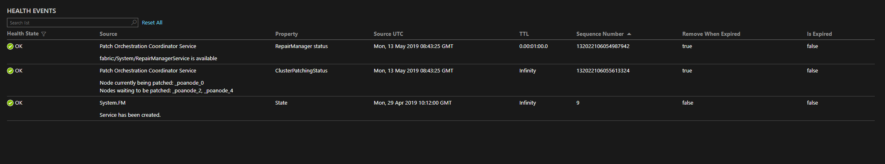
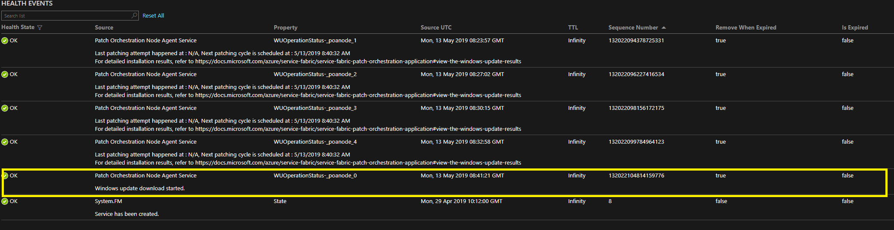
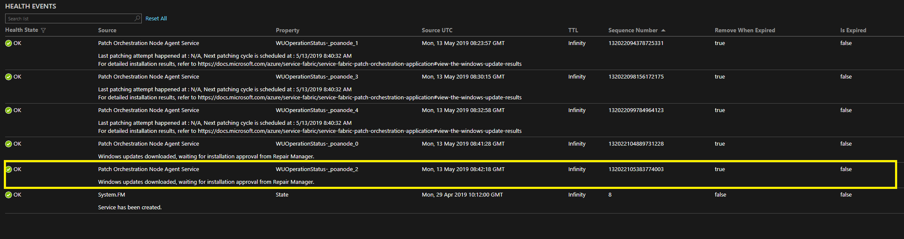
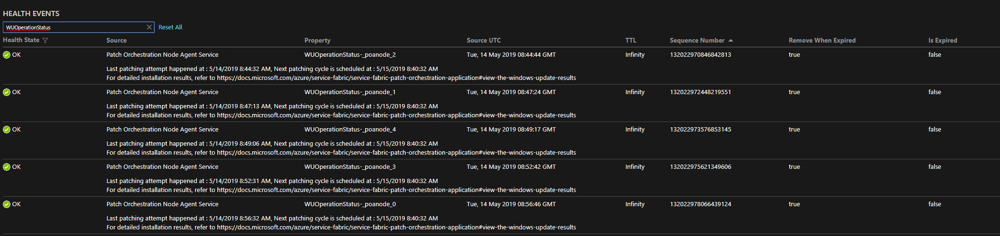

# Use Patch Orchestration Application

> [!IMPORTANT]
> As of April 30, 2019, Patch Orchestration Application version 1.2.* is no longer supported. Be sure to upgrade to the latest version.

Patch Orchestration Application (POA) is a wrapper around the Azure Service Fabric Repair Manager service, which enables configuration-based OS patch scheduling for non-Azure hosted clusters. POA isn't required for non-Azure hosted clusters, but scheduling patch installation by update domain is required to patch Service Fabric cluster hosts without incurring downtime.

POA is a Service Fabric application that automates operating system patching on a Service Fabric cluster without incurring downtime.

POA provides the following features:

- **Automatic operating system update installation**. Operating system updates are automatically downloaded and installed. Cluster nodes are rebooted as needed without incurring cluster downtime.

- **Cluster-aware patching and health integration**. While POA is applying updates, it monitors the health of the cluster nodes. Cluster nodes are updated one node at a time or one update domain at a time. If the health of the cluster goes down because of the patching process, patching is stopped to prevent aggravating the problem.

## Internal details of POA

POA is composed of the following subcomponents:

- **Coordinator Service**: This stateful service is responsible for:
    - Coordinating the Windows Update job on the entire cluster.
    - Storing the result of completed Windows Update operations.

- **Node Agent Service**: This stateless service runs on all Service Fabric cluster nodes. The service is responsible for:
    - Bootstrapping the Node Agent NTService.
    - Monitoring the Node Agent NTService.

- **Node Agent NTService**: This Windows NT service runs at a higher-level privilege (SYSTEM). In contrast, the Node Agent Service and the Coordinator Service run at a lower-level privilege (NETWORK SERVICE). The service is responsible for performing the following Windows Update jobs on all the cluster nodes:
    - Disabling automatic Windows updates on the node.
    - Downloading and installing Windows updates according to the policy the user has provided.
    - Restarting the machine post-Windows updates installation.
    - Uploading the results of Windows updates to the Coordinator Service.
    - Reporting health reports if an operation has failed after it exhausts all retries.

> [!NOTE]
> POA uses the Service Fabric Repair Manager service to disable or enable the node and perform health checks. The repair task created by POA tracks the Windows Update progress for each node.

## Prerequisites

> [!NOTE]
> The required minimum .NET Framework version is 4.6.

### Enable the Repair Manager service (if it's not running already)

POA requires the Repair Manager service to be enabled on the cluster.

#### Azure clusters

Azure clusters in the silver durability tier have the Repair Manager service enabled by default. Azure clusters in the gold durability tier might or might not have the Repair Manager service enabled, depending on when those clusters were created. Azure clusters in the bronze durability tier, by default, do not have the Repair Manager service enabled. If the service is already enabled, you can see it running in the system services section in Service Fabric Explorer.

##### The Azure portal
You can enable Repair Manager from the Azure portal when you set up the cluster. When you're configuring the cluster, select the **Include Repair Manager** option under **Add-on features**.


##### The Azure Resource Manager deployment model
Alternatively, you can use the [Azure Resource Manager deployment model](./service-fabric-cluster-creation-via-arm.md) to enable the Repair Manager service on new and existing Service Fabric clusters. Get the template for the cluster that you want to deploy. You can either use the sample templates or create a custom Azure Resource Manager deployment model template. 

To enable the Repair Manager service by using the [Azure Resource Manager deployment model template](./service-fabric-cluster-creation-via-arm.md), do the following:

1. Check to ensure that `apiVersion` is set to *2017-07-01-preview* for the *Microsoft.ServiceFabric/clusters* resource. If it's different, you need to update `apiVersion` to *2017-07-01-preview* or later:

    ```json
    {
        "apiVersion": "2017-07-01-preview",
        "type": "Microsoft.ServiceFabric/clusters",
        "name": "[parameters('clusterName')]",
        "location": "[parameters('clusterLocation')]",
        ...
    }
    ```

1. Enable the Repair Manager service by adding the following `addonFeatures` section after the `fabricSettings` section:

    ```json
    "fabricSettings": [
        ...      
    ],
    "addonFeatures": [
        "RepairManager"
    ],
    ```

3. After you've updated your cluster template with these changes, apply them and let the update finish. You can now see the Repair Manager service running in your cluster. It's called *fabric:/System/RepairManagerService* in the system services section in Service Fabric Explorer. 

### Standalone on-premises clusters

To enable the Repair Manager service on a new or existing Service Fabric cluster, you can use the [Configuration settings for standalone Windows cluster](./service-fabric-cluster-manifest.md).

To enable the Repair Manager service:

1. Check to ensure that `apiVersion` in [General cluster configurations](./service-fabric-cluster-manifest.md#general-cluster-configurations) is set to *04-2017* or later, as shown here:

    ```json
    {
        "name": "SampleCluster",
        "clusterConfigurationVersion": "1.0.0",
        "apiVersion": "04-2017",
        ...
    }
    ```

1. Enable the Repair Manager service by adding the following `addonFeatures` section after the `fabricSettings` section, as shown here:

    ```json
    "fabricSettings": [
        ...      
    ],
    "addonFeatures": [
        "RepairManager"
    ],
    ```

1. Update your cluster manifest with these changes by using the updated cluster manifest [create a new cluster](./service-fabric-cluster-creation-for-windows-server.md) or [upgrade the cluster configuration](./service-fabric-cluster-upgrade-windows-server.md). 

   After the cluster is running with an updated cluster manifest, you can see the Repair Manager service running in your cluster. It's called *fabric:/System/RepairManagerService*, and it's in the system services section in Service Fabric Explorer.

### Configure Windows updates for all nodes

Automatic Windows updates might lead to availability loss, because multiple cluster nodes can restart at the same time. POA, by default, tries to disable the automatic Windows updates on each cluster node. However, if the settings are managed by an administrator or a Group Policy, we recommend setting the Windows Update policy to “Notify before Download” explicitly.

## Download the application package

To download the application package, go to the [Patch Orchestration Application release page](https://github.com/microsoft/Service-Fabric-POA/releases/latest/) on GitHub.

## Configure POA behavior

You can configure POA behavior to meet your needs. Override the default values by passing in the application parameter while you're creating or updating the application. You can provide application parameters by specifying `ApplicationParameter` to the `Start-ServiceFabricApplicationUpgrade` or `New-ServiceFabricApplication` cmdlets.

| Parameter        | Type                          | Details |
|:-|-|-|
|MaxResultsToCache    |Long                              | The maximum number of Windows Update results that should be cached. <br><br>The default value is 3000, assuming that: <br> &nbsp;&nbsp;- The number of nodes is 20. <br> &nbsp;&nbsp;- The number of updates to a node per month is 5. <br> &nbsp;&nbsp;- The number of results per operation can be 10. <br> &nbsp;&nbsp;- The results for the past three months should be stored. |
|TaskApprovalPolicy   |Enum <br> { NodeWise, UpgradeDomainWise }                          |TaskApprovalPolicy indicates the policy that is to be used by the Coordinator Service to install Windows updates across the Service Fabric cluster nodes.<br><br>The allowed values are: <br>*NodeWise*: Windows updates are installed one node at a time. <br> *UpgradeDomainWise*: Windows updates are installed one update domain at a time. (At the most, all the nodes belonging to an update domain can go for a Windows update.)<br><br> To help decide which policy is best suited for your cluster, see the [FAQ](#frequently-asked-questions) section.
|LogsDiskQuotaInMB   |Long  <br> (Default: *1024*)               | The maximum size of patch orchestration app logs in MB, which can be persisted locally on nodes.
| WUQuery               | string<br>(Default: *IsInstalled=0*)                | Query to get Windows updates. For more information, see [WuQuery.](/windows/win32/api/wuapi/nf-wuapi-iupdatesearcher-search)
| InstallWindowsOSOnlyUpdates | *Boolean* <br> (default: false)                 | Use this flag to control which updates should be downloaded and installed. Following values are allowed <br>true - Installs only Windows operating system updates.<br>false - Installs all the available updates on the machine.          |
| WUOperationTimeOutInMinutes | Int <br>(Default: *90*)                   | Specifies the timeout for any Windows Update operation (search or download or install). If the operation is not completed within the specified timeout, it is aborted.       |
| WURescheduleCount     | Int <br> (Default: *5*)                  | The maximum number of times the service reschedules the Windows update if an operation fails persistently.          |
| WURescheduleTimeInMinutes | Int <br>(Default: *30*) | The interval at which the service reschedules the Windows updates if failure persists. |
| WUFrequency           | Comma-separated string (Default: *Weekly, Wednesday, 7:00:00*)     | The frequency for installing Windows updates. The format and possible values are: <br>- Monthly, DD, HH:MM:SS (example: *Monthly, 5, 12:22:32*). Permitted values for field _DD_ (day) are numbers from 1 through 28 and _last_. <br>- Weekly, Day, HH:MM:SS (example: *Weekly, Tuesday, 12:22:32*)  <br>- Daily, HH:MM:SS (example: *Daily, 12:22:32*)  <br>- MonthlyByWeekAndDay, Week, Day, HH:MM:SS (example: *MonthlyByWeekAndDay, 2, Friday, 21:00:00* indicates 9:00 PM UTC on Friday of the 2nd week of every month) <br>- *None* indicates that Windows updates shouldn't be done.  <br><br> Times are in UTC.|
| AcceptWindowsUpdateEula | Boolean <br>(Default: *true*) | By setting this flag, the application accepts the End-User License Agreement for Windows Update on behalf of the owner of the machine.              |

> [!TIP]
> If you want Windows updates to happen immediately, set `WUFrequency` relative to the application deployment time. For example, suppose that you have a five-node test cluster and plan to deploy the app at around 5:00 PM UTC. If you assume that the application upgrade or deployment takes 30 minutes at most, set the WUFrequency as *Daily, 17:30:00*.

## Deploy POA

1. Finish all the prerequisite steps to prepare the cluster.
1. Deploy POA like any other Service Fabric app. To deploy it by using PowerShell, see [Deploy and remove applications using PowerShell](./service-fabric-deploy-remove-applications.md).
1. To configure the application at the time of deployment, pass the `ApplicationParameter` to the `New-ServiceFabricApplication` cmdlet. For your convenience, we’ve provided the script Deploy.ps1 along with the application. To use the script:

    - Connect to a Service Fabric cluster by using `Connect-ServiceFabricCluster`.
    - Execute the PowerShell script Deploy.ps1 with the appropriate `ApplicationParameter` value.

> [!NOTE]
> Keep the script and the application folder *PatchOrchestrationApplication* in the same directory.

## Upgrade POA

To upgrade your POA version by using PowerShell, follow the instructions in [Service Fabric application upgrade using PowerShell](./service-fabric-application-upgrade-tutorial-powershell.md).

## Remove POA

To remove the application, follow the instructions in [Deploy and remove applications using PowerShell](./service-fabric-deploy-remove-applications.md).

For your convenience, we've provided the Undeploy.ps1 script along with the application. To use the script:

  - Connect to a Service Fabric cluster by using ```Connect-ServiceFabricCluster```.
  - Execute the PowerShell script Undeploy.ps1.

> [!NOTE]
> Keep the script and the application folder *PatchOrchestrationApplication* in the same directory.

## View the Windows Update results

POA exposes REST APIs to display the historical results to users. Here's an example of the result JSON:

```json
[
  {
    "NodeName": "_stg1vm_1",
    "WindowsUpdateOperationResults": [
      {
        "OperationResult": 0,
        "NodeName": "_stg1vm_1",
        "OperationTime": "2019-05-13T08:44:56.4836889Z",
        "OperationStartTime": "2019-05-13T08:44:33.5285601Z",
        "UpdateDetails": [
          {
            "UpdateId": "7392acaf-6a85-427c-8a8d-058c25beb0d6",
            "Title": "Cumulative Security Update for Internet Explorer 11 for Windows Server 2012 R2 (KB3185319)",
            "Description": "A security issue has been identified in a Microsoft software product that could affect your system. You can help protect your system by installing this update from Microsoft. For a complete listing of the issues that are included in this update, see the associated Microsoft Knowledge Base article. After you install this update, you may have to restart your system.",
            "ResultCode": 0,
            "HResult": 0
          }
        ],
        "OperationType": 1,
        "WindowsUpdateQuery": "IsInstalled=0",
        "WindowsUpdateFrequency": "Daily,10:00:00",
        "RebootRequired": false
      }
    ]
  },
  ...
]
```

The JSON fields are described in the following table:

Field | Values | Details
-- | -- | --
OperationResult | 0 - Succeeded<br> 1 - Succeeded With Errors<br> 2 - Failed<br> 3 - Aborted<br> 4 - Aborted With Timeout | Indicates the result of the overall operation, which ordinarily involves the installation of one or more updates.
ResultCode | Same as OperationResult | This field indicates the result of the installation operation for an individual update.
OperationType | 1 - Installation<br> 0 - Search and Download| By default, Installation is the only OperationType that's shown in the results.
WindowsUpdateQuery | Default is "IsInstalled=0" | The Windows Update query that was used to search for updates. For more information, see [WuQuery](/windows/win32/api/wuapi/nf-wuapi-iupdatesearcher-search).
RebootRequired | true - reboot was required<br> false - reboot was not required | Indicates whether a reboot was required to complete the installation of updates.
OperationStartTime | DateTime | Indicates the time at which operation(Download/Installation) started.
OperationTime | DateTime | Indicates the time at which operation(Download/Installation) was completed.
HResult | 0 - Successful<br> other - failure| Indicates the reason for the failure of the Windows update with updateID "7392acaf-6a85-427c-8a8d-058c25beb0d6".

If no update is scheduled yet, the result JSON is empty.

Sign in to the cluster to query Windows Update results. Find out the replica IP address for the primary address of the Coordinator Service, and open the following URL from the browser:
http://&lt;REPLICA-IP&gt;:&lt;ApplicationPort&gt;/PatchOrchestrationApplication/v1/GetWindowsUpdateResults.

The REST endpoint for the Coordinator Service has a dynamic port. To check the exact URL, refer to Service Fabric Explorer. For example, the results are available at
*http://10.0.0.7:20000/PatchOrchestrationApplication/v1/GetWindowsUpdateResults*.


If the reverse proxy is enabled on the cluster, you can access the URL from outside the cluster as well.

The endpoint that you need to hit is
*http://&lt;SERVERURL&gt;:&lt;REVERSEPROXYPORT&gt;/PatchOrchestrationApplication/CoordinatorService/v1/GetWindowsUpdateResults*.

To enable the reverse proxy on the cluster, follow the instructions in [Reverse proxy in Azure Service Fabric](./service-fabric-reverseproxy.md). 

> 
> [!WARNING]
> After the reverse proxy is configured, all microservices in the cluster that expose an HTTP endpoint are addressable from outside the cluster.

## Diagnostics and health events

This section discusses how to debug or diagnose issues with patch updates through POA on Service Fabric clusters.

> [!NOTE]
> To get many of the following called-out, self-diagnostic improvements, you should have POA version 1.4.0 or later installed.

The Node Agent NTService creates [repair tasks](/dotnet/api/system.fabric.repair.repairtask) for installing updates on the nodes. Each task is then prepared by the Coordinator Service according to the task approval policy. Finally, the prepared tasks are approved by Repair Manager, which doesn't approve any task if the cluster is in an unhealthy state. 

To help you understand how updates proceed on a node, let's go step by step:

1. NodeAgentNTService, running on every node, looks for available Windows updates at the scheduled time. If updates are available, it downloads them on the node.

1. After the updates are downloaded, the Node Agent NTService creates a corresponding repair task for the node with the name *POS___\<unique_id>*. You can view these repair tasks by using the [Get-ServiceFabricRepairTask](/powershell/module/servicefabric/get-servicefabricrepairtask) cmdlet or using SFX in the node details section. After the repair task is created, it quickly moves to [*Claimed* state](/dotnet/api/system.fabric.repair.repairtaskstate).

1. The Coordinator Service periodically looks for repair tasks in *Claimed* state and then updates them to *Preparing* state based on TaskApprovalPolicy. If TaskApprovalPolicy is configured to be NodeWise, a repair task that corresponds to a node is prepared only if no other repair task is currently in *Preparing*, *Approved*, *Executing*, or *Restoring* state. 

   Similarly, in the case of UpgradeWise TaskApprovalPolicy, there are tasks in the preceding states only for nodes that belong to the same update domain. After a repair task is moved to *Preparing* state, the corresponding Service Fabric node is [disabled](/powershell/module/servicefabric/disable-servicefabricnode) with the intent set to *Restart*.

   POA versions 1.4.0 and later post events with the ClusterPatchingStatus property on CoordinatorService to display the nodes that are being patched. The updates are installed on _poanode_0, as shown in the following image:

    [](media/service-fabric-patch-orchestration-application/clusterpatchingstatus.png#lightbox)

1. After the node is disabled, the repair task is moved to *Executing* state. 
   
   > [!NOTE]
   > A node that's stuck in *Disabled* state can block a new repair task, which halts the patching operation on the cluster.

1. When the repair task is in *Executing* state, the patch installation on that node begins. After the patch is installed, the node might or might not be restarted, depending on the patch. Next, the repair task is moved to *Restoring* state, which reenables the node. The repair task is then marked as completed.

   In POA versions 1.4.0 and later, you can find the status of the update by viewing the health events on NodeAgentService with the WUOperationStatus-\<NodeName> property. The highlighted sections in the following images show the status of Windows updates on nodes *poanode_0* and *poanode_2*:

   [](media/service-fabric-patch-orchestration-application/wuoperationstatusa.png#lightbox)

   [](media/service-fabric-patch-orchestration-application/wuoperationstatusb.png#lightbox)

   You can also get the details by using PowerShell. To do so, you connect to the cluster and fetch the state of the repair task by using [Get-ServiceFabricRepairTask](/powershell/module/servicefabric/get-servicefabricrepairtask). 
   
   In the following example, the "POS__poanode_2_125f2969-933c-4774-85d1-ebdf85e79f15" task is in *DownloadComplete* state. It means that updates have been downloaded on the *poanode_2* node, and the installation will be attempted when the task moves to *Executing* state.

   ``` powershell
    D:\service-fabric-poa-bin\service-fabric-poa-bin\Release> $k = Get-ServiceFabricRepairTask -TaskId "POS__poanode_2_125f2969-933c-4774-85d1-ebdf85e79f15"

    D:\service-fabric-poa-bin\service-fabric-poa-bin\Release> $k.ExecutorData
    {"ExecutorSubState":2,"ExecutorTimeoutInMinutes":90,"RestartRequestedTime":"0001-01-01T00:00:00"}
    ```

   If more issues remain to be found, sign in to your virtual machine (VM) or VMs and learn about them by using Windows event logs. The previously mentioned repair task can exist in only the following executor substates:

      ExecutorSubState | Description
    -- | -- 
      None=1 |  Implies that there wasn't an ongoing operation on the node. The state might be in transition.
      DownloadCompleted=2 | Implies that the download operation was completed with success, partial failure, or failure.
      InstallationApproved=3 | Implies that the download operation was completed earlier and Repair Manager has approved the installation.
      InstallationInProgress=4 | Corresponds to the state of execution of the repair task.
      InstallationCompleted=5 | Implies that the installation was completed with success, partial success, or failure.
      RestartRequested=6 | Implies that the patch installation was completed and there's a pending restart action on the node.
      RestartNotNeeded=7 |  Implies that the restart wasn't needed after the patch installation was completed.
      RestartCompleted=8 | Implies that the restart was completed successfully.
      OperationCompleted=9 | The Windows Update operation was completed successfully.
      OperationAborted=10 | Implies that the Windows Update operation was aborted.

1. In POA versions 1.4.0 and later, when a node update attempt finishes, an event with the "WUOperationStatus-[NodeName]" property is posted on NodeAgentService to notify you when the next attempt to download and install the Windows updates will begin. This is displayed in the following image:

     [](media/service-fabric-patch-orchestration-application/wuoperationstatusc.png#lightbox)

### Diagnostics logs

Patch orchestration application logs are collected as part of the Service Fabric runtime logs.

You can capture logs by using the diagnostic tool or pipeline of your choice. POA uses the following fixed provider IDs to log events via [event source](/dotnet/api/system.diagnostics.tracing.eventsource):

- e39b723c-590c-4090-abb0-11e3e6616346
- fc0028ff-bfdc-499f-80dc-ed922c52c5e9
- 24afa313-0d3b-4c7c-b485-1047fd964b60
- 05dc046c-60e9-4ef7-965e-91660adffa68

### Health reports

POA also publishes health reports against the Node Agent Service or the Coordinator Service in the following scenarios:

* The Node Agent NTService is down

   If the Node Agent NTService is down on a node, a warning-level health report is generated against the Node Agent Service.

* The Repair Manager service is not enabled

   If the Repair Manager service is not found on the cluster, a warning-level health report is generated for the Coordinator Service.

## Frequently asked questions

**Q: Why do I see my cluster in an error state when POA is running?**

A: During the installation process, POA disables or restarts nodes, which can temporarily result in an unhealthy cluster.

Depending on the application's policy, either one node can go down during a patching operation *or* an entire update domain can go down all at once.

By the end of the Windows updates installation, the nodes are reenabled post-restart.

In the following example, the cluster went to an error state temporarily because two nodes were down and the MaxPercentageUnhealthyNodes policy was violated. The error is temporary until the patching operation can begin.


If the issue persists, refer to the Troubleshooting section.

**Q: What can I do if POA is in a warning state?**

A: Check to see whether a health report posted against the application indicates the root cause. Usually, the warning contains details of the problem. If the issue is transient, the application is expected to recover automatically.

**Q: What can I do if my cluster is unhealthy and I need to do an urgent operating system update?**

A: POA does not install updates while the cluster is unhealthy. Try to bring your cluster to a healthy state to unblock the POA workflow.

**Q: Should I set TaskApprovalPolicy as "NodeWise" or "UpgradeDomainWise" for my cluster?**

A: The "UpgradeDomainWise" setting speeds up overall cluster repair by patching in parallel all the nodes that belong to an update domain. During the process, nodes that belong to an entire update domain are unavailable (in [*Disabled* state](/dotnet/api/system.fabric.query.nodestatus#System_Fabric_Query_NodeStatus_Disabled)).

In contrast, the "NodeWise" setting patches only one node at a time, which would imply that overall cluster patching might take longer. However, only one node at most would be unavailable (in *Disabled* state) during the patching process.

If your cluster can tolerate running on an N-1 number of update domains during patching cycle (where N is the total number of update domains on your cluster) you can set the policy as "UpgradeDomainWise." Otherwise, set it to "NodeWise."

**Q: How much time does it take to patch a node?**

A: Patching a node can take from minutes (for example, [Windows Defender definition updates](https://www.microsoft.com/en-us/wdsi/definitions)) to hours (for example, [Windows Cumulative updates](https://www.catalog.update.microsoft.com/Search.aspx?q=windows%20server%20cumulative%20update)). The time that's required to patch a node depends mostly on: 
 - The size of the updates.
 - The number of updates, which have to be applied in a patching window.
 - The time it takes to install the updates, reboot the node (if required), and finish the post-reboot installation steps.
 - The performance of the VM or machine, and network conditions.

**Q: How long does it take to patch an entire cluster?**

A: The time that's required to patch an entire cluster depends on:

- The time needed to patch a node.

- The policy of the Coordinator Service. The default policy, "NodeWise," results in patching only one node at a time, an approach that's slower than using "UpgradeDomainWise." 

   For example: If a node takes ~1 hour to be patched, patching a 20-node (same type of nodes) cluster with 5 update domains, each containing 4 nodes, requires:
    - For "NodeWise": ~20 hours.
    - For "UpgradeDomainWise": ~5 hours.

- The cluster load. Each patching operation requires relocating the customer workload to other available nodes in the cluster. A node that's being patched would be in [*Disabling* state](/dotnet/api/system.fabric.query.nodestatus#System_Fabric_Query_NodeStatus_Disabling) during this time. If the cluster is running near peak load, the disabling process would take longer. Therefore, the overall patching process might appear to be slow in such stressed conditions.

- Cluster health failures during patching. Any [degradation](/dotnet/api/system.fabric.health.healthstate#System_Fabric_Health_HealthState_Error) in the [health of the cluster](./service-fabric-health-introduction.md) would interrupt the patching process. This issue would add to the overall time required to patch the entire cluster.

**Q: Why do I see some updates in the Windows Update results that are obtained via REST API, but not under the Windows Update history on the machine?**

A: Some product updates appear only in their own update or patch history. For example, Windows Defender updates might or might not be displayed in Windows Update history on Windows Server 2016.

**Q: Can POA be used to patch my dev cluster (one-node cluster)?**

A: No, POA can't be used to patch a one-node cluster. This limitation is by design, because [Service Fabric system services](./service-fabric-technical-overview.md#system-services) or other customer apps would incur downtime. Therefore, patching repair jobs would never get approved by Repair Manager.

**Q: How do I patch cluster nodes on Linux?**

A: To learn about orchestrating updates on Linux, see [Azure virtual machine scale set automatic OS image upgrades](../virtual-machine-scale-sets/virtual-machine-scale-sets-automatic-upgrade.md).

**Q: Why is the update cycle taking so long?**

A: Query for the result JSON, enter the update cycle for all nodes, and then you can try to find out the time taken by update installation on every node by using OperationStartTime and OperationTime (OperationCompletionTime). 

If there's a large time window in which no update is taking place, the cluster might be in an error state and, consequently, Repair Manager can't approve any POA repair tasks. If the update installation is taking a long time on any node, that node might not have been updated in a while. A lot of updates might be pending installation, which can result in delays. 

It might also be possible that node patching is blocked because it's stuck in *Disabling* state. This usually happens because disabling the node might lead to quorum or data loss situations.

**Q: Why must the node be disabled when POA is patching it?**

A: POA disables the node with a *Restart* intent, which stops or reallocates all the Service Fabric services that are running on the node. POA does this to ensure that applications don't end up using a mix of new and old DLLs, so we recommend not patching a node without disabling it.

**Q: What is the maximum number of nodes that can be updated by using POA?**

A: POA uses Service Fabric Repair Manager to create repair tasks for nodes for updates. However, no more than 250 repair tasks can be present at the same time. Currently, POA creates repair tasks for each node at the same time, so POA can update no more than 250 nodes in a cluster. 

## Disclaimers

- POA accepts the End-User License Agreement for Windows Update on behalf of the user. Optionally, the setting can be turned off in the configuration of the application.

- POA collects telemetry to track usage and performance. The application’s telemetry follows the setting of the Service Fabric runtime’s telemetry setting (which is on by default).

## Troubleshooting

This section provides possible troubleshooting solutions to problems with patching nodes.

### A node is not coming back to up state

* The node might be stuck in *Disabling* state because:

  - A safety check is pending. To remedy this situation, ensure that enough nodes are available in a healthy state.

* The node might be stuck in *Disabled* state because:

  - It was disabled manually.
  - It was disabled because of an ongoing Azure infrastructure job.
  - It was disabled temporarily by POA to patch the node.

* The node might be stuck in a down state because:

  - It was placed in a down state manually.
  - It is undergoing a restart (which might be triggered by POA).
  - It has a faulty VM or machine, or it's having network connectivity issues.

### Updates were skipped on some nodes

POA tries to install a Windows update according to the rescheduling policy. The service tries to recover the node and skip the update according to the application policy.

In such a case, a warning-level health report is generated against the Node Agent Service. The Windows Update result also contains the possible reason for the failure.

### The health of the cluster goes to error while the update is being installed

A faulty Windows update can bring down the health of an application or cluster on a particular node or update domain. POA discontinues any subsequent Windows Update operation until the cluster is healthy again.

An administrator must intervene and determine why the application or cluster became unhealthy because of Windows Update.

## POA release notes

>[!NOTE]
> For POA versions 1.4.0 and later, you can find release notes and releases on the [Patch Orchestration Application release page](https://github.com/microsoft/Service-Fabric-POA/releases/) on GitHub.

### Version 1.1.0
- Public release

### Version 1.1.1
- Fixed a bug in SetupEntryPoint of NodeAgentService that prevented installation of NodeAgentNTService.

### Version 1.2.0

- Bug fixes around system restart workflow.
- Bug fix in creation of RM tasks due to which health check during preparing repair tasks wasn't happening as expected.
- Changed the startup mode for Windows service POANodeSvc from auto to delayed-auto.

### Version 1.2.1

- Bug fix in cluster scale-down workflow. Introduced garbage collection logic for POA repair tasks belonging to non-existent nodes.

### Version 1.2.2

- Miscellaneous bug fixes.
- Binaries are now signed.
- Added sfpkg link for the application.

### Version 1.3.0

- Setting InstallWindowsOSOnlyUpdates to false now installs all the available updates.
- Changed the logic of disabling automatic updates. This fixes a bug where Automatic updates were not getting disabled on Server 2016 and above.
- Parameterized placement constraint for both the microservices of POA for advanced use cases.

### Version 1.3.1
- Fixing regression where POA 1.3.0 won't work on Windows Server 2012 R2 or earlier because of a failure in disabling automatic updates. 
- Fixing bug where InstallWindowsOSOnlyUpdates configuration is always picked as True.
- Changing default value of InstallWindowsOSOnlyUpdates to False.

### Version 1.3.2
- Fixing an issue that affects the patching lifecycle on a node, if there are nodes with a name that's a subset of the current node name. For such nodes, it's possible that patching was missed or a reboot is pending.
