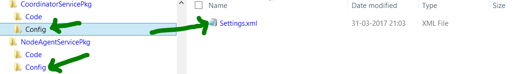
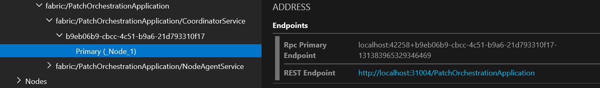

Patch Orchestration Application

Introduction:
=============

Patch Orchestration is a new Service Fabric application that allows you
to automate OS patching on a Service Fabric cluster on Azure or
on-premise without downtime.

Patch Orchestration Application features:

1.  **Automatic OS Update Installation**: Patch orchestration ensures
    that updates are automatically downloaded and installed (and node
    rebooted if needed by update) on all the cluster nodes without
    downtime.

2.  **Health Integration**: Patch orchestration, while applying updates,
    monitors the health of the cluster as it moves ahead updating node
    by node or UD by UD. At any point if it detects availability loss on
    the cluster, it stops the patching process to prevent aggravating
    the problem.

3.  **Support all SF clusters** – The application is generic enough to
    work in both Azure based SF clusters as well as standalone clusters.

4.  **Cluster Aware Patching** – Patching is done in a cluster aware
    method ensuring availability of Service Fabric cluster at all times.

Where can I get the Application?
================================

Download the application from [Download
link](http://download.microsoft.com/download/C/9/1/C91780A5-F4B8-46AE-ADD9-E76B9B0104F6/POS%20release%20v1.0/PrivatePreview-3April2017.zip)

EULA, Limitations and other disclaimers:
========================================

1.  Patch Orchestration Application accepts EULA of windows update on
    behalf of user. In case this is not desired, the setting can be
    turned off in setting.xml of NodeAgentService.

2.  Patch Orchestration Application collects telemetry for keeping track of
    usage and Performance, application’s telemetry follows the setting
    of Service Fabric runtime’s telemetry setting (which is on by
    default).

What does the Application do?
=============================

Patch Orchestration Application comprises of following subcomponents.

-   **Coordinator Service**: is a stateful service. The service is
    responsible for

    -   Coordinating the windows update job on the entire cluster

    -   Keeping track of the completed windows update operations.

-   **Node Agent Service**: is a stateless service, it runs on all
    servicefabric cluster nodes. The service is responsible for

    -   Bootstrapping of Node Agent NTService and local logging

    -   Monitoring the Node Agent NTService and clean up the local logs
        as per pre-defined quota.

-   **Node Agent NTService:** is a Windows NT service. Node Agent
    NTService runs at higher privileges (SYSTEM). In contrast, Node
    Agent Service and Coordinator Service runs at a lower level
    privilege (NETWORK SERVICE). The service is responsible for

    -   Performing windows update jobs on all the cluster nodes viz.

    -   Disabling automatic windows update on the node.

    -   Download, Installation of windows updates as per the policy user
        has provided.

    -   Restarting the machine post windows update installation

    -   Uploading the result of windows update to Coordinator Service.

    -   Report health report in case operation has failed after
        exhausting all retries.

        Patch Orchestration Application uses Service Fabric system
        service, Repair Manager to disable/enable the node and
        performing health checks. The repair tasks created by Patch
        Orchestration Application also helps in keeping track of Windows
        update progress for each node.

Prerequisites for using the Application:
========================================

Ensure Service Fabric Version is 5.5 or above
---------------------------------------------

Patch Orchestration Application can be run on clusters having Service
Fabric runtime version v5.5 or above.

Enable Repair Manager Service
-----------------------------

Patch Orchestration Service requires Repair Manager System Service to be
enabled on the cluster as a pre-requisite.

### Azure – Clusters managed by SFRP

As of date we support clusters which have atleast one node type of Gold
or Silver durability tier. Repair manager is present in such clusters by
default and no changes are required.

Support for Bronze tier clusters is coming soon (June 2017).

### Standalone On-Premise Clusters:

**In case, you’re using ClusterConfig.JSON to create the cluster. **

Use the steps mentioned in [Azure](#azure-clusters-managed-by-sfrp) to
do the changes in FabricSettings section.

For more details on how to do a cluster config upgrade. Refer
<https://docs.microsoft.com/en-us/azure/service-fabric/service-fabric-cluster-upgrade-windows-server>

**In case ClusterManifest xml is used to create the cluster.**

Add the below section under &lt;FabricSettings&gt; in your
ClusterManifest and perform a cluster config upgrade on your cluster to
enable Repair Manager
```xml
<Section Name="RepairManager">
<Parameter Name="EnableHealthChecks" Value="True">
<Parameter Name="TargetReplicaSetSize" Value="5" />
<Parameter Name="MinReplicaSetSize" Value="3" />
</Section>
```
<pre>
NOTE: In case you are working with a cluster with number of nodes in
primary node type less than 5 (recommended only for test scenarios),
change the TargetReplicaSetSize to 3.

Disable Automatic Windows Update on all nodes.
----------------------------------------------

Having automatic Windows update enabled on service fabric cluster may
lead to availability loss.
Patch Orchestration Service tries to disable the automatic Windows
Update on each cluster node.

However, in case the settings are managed by admin/ group policy, we
recommend setting the Windows Update policy to “Notify before Download”
explicitly.


Optional: Enable Windows Azure Diagnostics
------------------------------------------

Logs for Patch Orchestration Application would be generated on fixed
provider ID's. For collecting diagnostic data in a central location,
please enable Windows Azure Diagnostics (WAD) on your cluster, add
following providers for collecting logs.

-   7efcd534-199f-4c5a-ac61-85ce0c79d593

-   f8cc4b9d-805a-4c98-a2db-9c9b67c2c80f

-   de7dacf5-4038-434a-a265-5d0de80a9b1d

-   92d7bb4c-9b62-42a9-8cd3-95645c911645

Steps for enabling Windows Azure Diagnostics are available
[here.](https://docs.microsoft.com/en-us/azure/service-fabric/service-fabric-diagnostics-how-to-setup-wad)

Inside "WadCfg" section in ARM template, add the following. Do note in
case your SF cluster comprises of multiple nodetypes then the below
section has to be added for all the “WadCfg” sections which would be
present per nodetype.
<pre>
"PatchOrchestrationApplication": \[
  {
    "provider": "7efcd534-199f-4c5a-ac61-85ce0c79d593",
    "scheduledTransferPeriod": "PT5M",
    "DefaultEvents": {
      "eventDestination": "PatchOrchestrationApplicationTable"
    }
  },
  {
    "provider": "f8cc4b9d-805a-4c98-a2db-9c9b67c2c80f",
    "scheduledTransferPeriod": "PT5M",
    "DefaultEvents": {
    "eventDestination": " PatchOrchestrationApplicationTable"
    }
  },
  {
    "provider": "de7dacf5-4038-434a-a265-5d0de80a9b1d",
    "scheduledTransferPeriod": "PT5M",
    "DefaultEvents": {
    "eventDestination": " PatchOrchestrationApplicationTable"
    }
  },
  {
    "provider": "92d7bb4c-9b62-42a9-8cd3-95645c911645",
    "scheduledTransferPeriod": "PT5M",
    "DefaultEvents": {
    "eventDestination": " PatchOrchestrationApplicationTable"
    }
  },
\]


This step is optional because.

1.  Logs are collected locally on each node.

2.  Logs would be collected as part of Service Fabric logs starting from
    SF version 5.6 refresh

Optional: Enable reverse proxy
------------------------------

Enable reverse proxy on the cluster using the steps mentioned
[here](https://docs.microsoft.com/en-us/azure/service-fabric/service-fabric-reverseproxy)

This step is for easy access of Windows Updates results for the cluster.
<pre>
NOTE: Once Reverse Proxy is configured, all micro services
in the cluster that expose an HTTP endpoint are addressable from outside
the cluster. Do evaluate this from security perspective before enabling
reverse proxy on your cluster.


The results can be accessed from the primary of Coordinator Service
(requires logging onto VM) even if reverse proxy is not
enabled.

Configuring the Application
===========================

Following are the configurations, which can be set by the user to tweak
the behaviour of Patch Orchestration Application as per their needs.

The configurations for PatchOrchestrationApplication can be found under
Config folder of CoordinatorService and NodeAgentService.



Coordinator Service
-------------------

Following settings can be modified from Settings.xml of
CoordinatorService.

  |**Parameter**        |**Type**                          | **Details**|
  |:-:| | |
  |MaxResultsToCache    |Long                              | Maximum number of Windows Update results history which should be cached. <br>Default value is 3000 is assuming <br> - Number of nodes are 20 <br> - Number of updates happening on a node per month is 5 <br> - Number of results per operation can be 10 <br> - And results for past 3 months should be stored |
  |TaskApprovalPolicy   |Enum <br> { NodeWise, UpgradeDomainWise }                          |TaskApprovalPolicy indicates policy to be used by CoordinatorService to install windows updates across the SF cluster nodes<br>                         Allowed values are <br>                                                           <b>NodeWise</b> - Windows update will be installed one node at a time <br>                                                           <b>UpgradeDomainWise</b> - Windows update would be installed one upgrade domain at a time (at max all the nodes belonging to an upgrade domain can go for windows update)


Node Agent Service
------------------

Following settings can be modified from Settings.xml of NodeAgentService

  |**Parameter**       |**Type**           |**Details**|
  |:-:|-|-|
  |LogsDiskQuotaInMB   |Long  <br> (Default : 1024)               |Maximum size of PatchOrchestrationApplication logs in MB, which can be persisted locally on node


Node Agent NTService
--------------------

Settings.xml of NodeAgentService contains configurations for both
NodeAgentService and NodeAgentNTService. Following are the
configurations specific to NodeAgentNTService which are available under
&lt;Section Name="NTServiceSettings"&gt;


| **Parameter**         | **Type**              | **Details**           |
|:-|-|-|
| WUQuery               | string<br>(Default : "IsInstalled=0")                | Query to get windows updates, refer to criteria field at https://msdn.microsoft.com/en-us/library/windows/desktop/aa386526(v=vs.85).aspx for more details.
| InstallWindowsOSOnlyUpdates | Bool <br> (default : True)                 | This flag will only allow windows OS updates to be installed.            |
| WUOperationTimeOutInMinutes | Int <br>(Default : 90)                   | Windows Update Operation will throw a timeout exception if not able to complete execution in specified time.       |
| WURescheduleCount     | Int <br> (Default : 5)                  | This configuration decides the maximum number of times the service would reschedule the Windows Update in case operation fails persistently          |
| WURescheduleTimeInMinutes | Int <br>(Default : 30) | This configuration decides the interval at which service would reschedule the Windows Update in case failure persists |
| WUFrequency           | Comma separated string (Default : "Weekly,Wednesday,7:00:00")     | The frequency for installing Windows Update. The format and Possible Values are as below <br>-   Monthly,DD,HH:MM:SS Eg: Monthly,5,12:22:32 <br> -   Weekly,DAY,HH:MM:SS Eg: Weekly,Tuesday,12:22:32  <br> -   Daily,HH:MM:SS Eg: Daily,12:22:32  <br> -  None - Indicates that Windows Update shouldn't be done  <br> <pre>NOTE : All the time are in UTC</pre>|
| DisableAutoUpdateSettingInOS | Bool  <br> (Default : true)                | We recommend disabling Windows's  Automatic Update feature on ServiceFabric cluster. This can be done by Patch Orchestration  Application by keeping the below configuration flag to true.<br> In case the windows update setting is locked, admin might've to disable automatic windows update on all SF cluster nodes
| AcceptWindowsUpdateEula | Bool <br>(Default : true) | By setting this flag, we'll accept eula for windows update on behalf of owner of machine.              |


Steps to deploy the Application
===============================

 

1.  Prerequisites - Ensure that all prerequisites mentioned above are
    completed.

2.  Configure the parameters of Services in Settings.xml as applicable.

3.  Deploy the application - The application can be deployed from
    PowerShell using the steps mentioned at
    <https://docs.microsoft.com/en-us/azure/service-fabric/service-fabric-deploy-remove-applications>

    For ease of user, we’ve provided script Deploy.ps1 along with our
    application. To use it.

    -  Connect to Service Fabric cluster using <pre>Connect-ServiceFabricCluster

    -  Execute the powershell script Deploy.ps1 (the script and Application folder PatchOrchestrationApplication have to be kept in the same folder)

Steps to Upgrade the Application
================================

To update any configuration, once setting.xml is updated, you need to
update the version numbers in manifest files and upgrade the application
for the new setting to take effect.

For upgrading an existing Patch Orchestration Application using
PowerShell, refer to the application upgrade steps mentioned at
<https://docs.microsoft.com/en-us/azure/service-fabric/service-fabric-application-upgrade-tutorial-powershell>

Steps to Remove the Application
===============================

For removing the application, refer to steps mentioned at
<https://docs.microsoft.com/en-us/azure/service-fabric/service-fabric-deploy-remove-applications>

For ease of user, we have provided script Undeploy.ps1 along with our
application. To use it.

-  Connect to Service Fabric cluster using <pre>Connect-ServiceFabricCluster

-  Execute the powershell script Undeploy.ps1 (the script and
    Application folder PatchOrchestrationApplication have to be kept in
    the same folder)

Viewing the Windows Update Results
==================================

Patch Orchestration Application uses REST API to display the historical
results to the user.

Outside the Cluster
-------------------

If [Reverse proxy is enabled on the
cluster](#optional-enable-reverse-proxy) the result can be viewed from
below public URL
http://&lt;SERVERURL&gt;:&lt:REVERSEPROXYPORT&gt;/PatchOrchestrationApplication/CoordinatorService/GetWindowsUpdateResults

<pre>
NOTE : In case the cluster is Secure, you might have to provide the certificate
to the browser as applicable.

Within the Cluster
------------------

User can login to the node corresponding to primary replica of
CoordinatorService. The result can be accessed at following URL

http://localhost:&lt;ApplicationPort&gt;/PatchOrchestrationApplication/v1/GetWindowsUpdateResults

NOTE: The REST endpoint for CoordinatorService will have dynamic port,
to check the exact url refer to ServiceFabric explorer.

Eg: For below example, results would be available at
<http://localhost:31004/PatchOrchestrationApplication/v1/GetWindowsUpdateResults>



Diagnostics / Health events
===========================

Logging
-------

Logs for Patch Orchestration Application can be viewed from following
locations

##### Locally on each node

Logs are collected locally on each SF cluster node. The location to
access the logs are
\[SF\_Installation\_Drive\]:\\PatchOrchestrationApplication\\logs

Eg: If Service fabric were installed on “D” drive, the path would be
D:\\PatchOrchestrationApplication\\logs

##### Central Location

If WAD were configured as part of prerequisite steps, then logs for
Patch Orchestration Service would be available in Azure Storage.

##### Service Fabric Logs

If you are using Service Fabric version 5.6 refres (yet to be released)
or higher version, the logs of Patch Orchestration Application would be
available as part of Service Fabric product logs.

Health Reports
--------------

Apart from logging, Patch Orchestration Application would also publish
health reports against the CoordinatorService or NodeAgentService in
following cases

##### Windows Update Operation Failed

If Windows Update was tried on the node and the operation failed, health
report against the NodeAgentService would indicate the node name on
which failure has happened.

The report would be automatically cleared off once patching is done
successfully on the problematic node.

##### Node Agent NTService is down

If NodeAgentNTService were down on a node, warning level health report
would be generated against NodeAgentService

##### Repair Manager is not enabled

If RepairManager system service is not enabled on the cluster, warning
level health report would be generated against CoordinatorService.

Frequently Asked questions:

Q. **I see my Cluster in error state when PatchOrchestrationApplication
is running**.

A. While the patches are being installed, PatchOrchestrationApplication
would disable or restart nodes, which may temporarily result in health
of the cluster going down.

Based on [policy for CoordinatorService](#coordinator-service), either
one node can go down during a patching operation OR an entire upgrade
domain can go down simultaneously.

To prevent this, we recommend setting tolerance limit for
MaxPercentageUnhealthyNodes setting in cluster manifest.

Do note that by the end of Windows Update installation, the nodes would
be re-enabled post automated restart.

Eg: In below case Cluster went to error state due to 2 down nodes and
MaxPercentageUnhealthNodes was set to 0%.


 

In case issue persists, refer to [Troubleshooting
section](#troubleshooting-help)

 

Q. **Can I use this Application for standalone clusters**?

A. Yes

 

Q. **Patch Orchestration Application is in warning state**

A. Check if a [health report posted against the
application](#health-reports) is causing this. In most cases this would
be transient and Application is expected to auto-recover.

Q. **My cluster is unhealthy, however I need to do OS update urgently**

A. Patch Orchestration Application will not install updates while the
cluster is unhealthy. Please try to bring your cluster to healthy state.

 

Q. **Why does patching across cluster take so long to run?**

A. The time taken by Patch Orchestration Application is mostly dependent
on following factors:

1.  Policy of CoordinatorService – Default policy of NodeWise will result in patching only one node at a time, esp. in case of bigger clusters we recommend using UpgradeDomainWise policy to achieve faster patching across cluster.

2.  Number of updates available for download and install - Avg. time take for downloading and installing an update should not exceed couple of hours.

3.  Performance of the VM and network bandwidth.

Troubleshooting help
====================

**Node stuck in disabling state**

This can happen when a node scheduled for operation cannot be disabled
due to pending safety check. To remedy this situation ensure that enough
nodes are available in healthy state.

Possible reasons for disabled nodes.

1.  Disabled manually

2.  Disabled due to an ongoing MR job

3.  Disabled due to Patch Orchestration Application.

Possible reasons for down nodes.

1.  Node was put in down state manually

2.  Node is undergoing restart.

3.  Node is down due to faulty VM/Machine or network connectivity
    issues.

4.  Node is undergoing restart triggered by Patch Orchestration
    Application.

**Updates were skipped on some nodes**

Patch Orchestration Application tries to install windows update as per
re-scheduling policy. However, if the issue persists it will recover
(re-enable the node in case it was disabled during installation/restart
phase) the node and skip the update.

In such case a warning level health report would be generated, also
check the results for windows update for possible failure reason.

**Health of the cluster goes to error while update was getting
    installed**

In case a bad Windows Update brings down the health of
application/cluster, Patch Orchestration Service will not allow any
subsequent windows update operation until the cluster becomes healthy
again.

Admin will have to remove the Windows Update manually from affected
nodes in this case.
