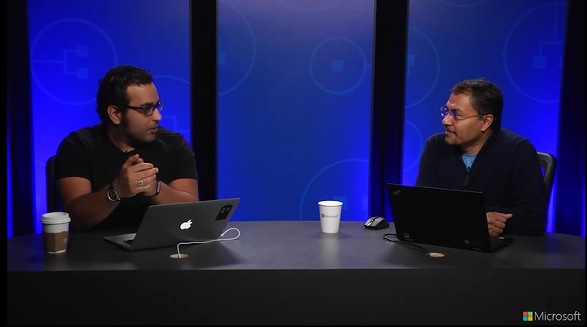
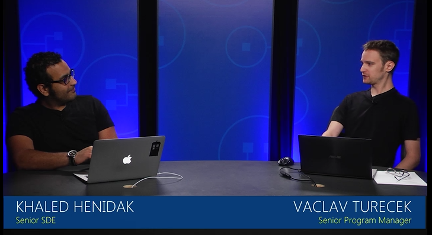
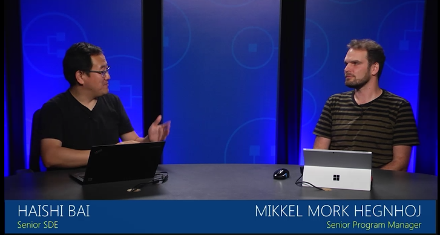

# Service Fabric patterns and scenarios
If you’re looking at building large-scale microservices using Azure Service Fabric, learn from the experts who designed and built this platform as a service (PaaS). Get started with proper architecture, and then learn how to optimize resources for your application. The [Service Fabric Patterns and Practices](https://mva.microsoft.com/en-US/training-courses/service-fabric-patterns-and-practices-16925?l=mudwqISGD_6005167344) course answers the questions most often asked by real-world customers about Service Fabric scenarios and application areas.
 
Find out how to design, develop, and operate your microservices on Service Fabric using best practices and proven, reusable patterns. Get an overview of Service Fabric and then dive deep into topics that cover cluster optimization and security, migrating legacy apps, IoT at scale, hosting game engines, and more. Look at continuous delivery for various workloads, and even get the details on Linux support and containers. 

## Introduction
Explore best practices, and learn about choosing platform as a service (PaaS) over infrastructure as a service (IaaS). Get the details on following proven application design principles.

| Video | PowerPoint deck |
|:-----:|:---------------:|
||[Introduction to Service Fabric}(https://mva.microsoft.com/en-US/training-courses/service-fabric-patterns-and-practices-16925?l=mudwqISGD_6005167344)|

## Cluster planning and management
Learn about capacity planning, cluster optimization, and cluster security, in this look at Azure Service Fabric.

## Hyper-scale web
Review concepts around hyper-scale web, including availability and reliability, hyper-scale, and state management.

## IoT
Explore the Internet of Things (IoT) in the context of Azure Service Fabric, including the Azure IoT pipeline, multi-tenancy, and IoT at scale.

## Gaming
Look at turn-based games, interactive games, and hosting existing game engines.

## Continuous delivery
Explore concepts, including continuous integration/continuous delivery with Visual Studio Team Services, build/package/publish workflow, multi-environment setup, and service package/share.

## Migration
Learn about migrating from a cloud service, in addition to migration of legacy apps.

## Containers and Linux support
Get the answer to the question, "Why containers?" Learn about the preview for Windows containers, Linux supports, and Linux containers orchestration. Plus, find out how to migrate .NET Core apps to Linux.

## Next steps
Now that you've learned about Service Fabric patterns and scenarios, read more about how to [create and manage clusters](service-fabric/service-fabric-deploy-anywhere.md), [migrate Cloud Services apps to Service Fabric](service-fabric-cloud-services-migration-worker-role-stateless-service.md), [set up continuous delivery](service-fabric-set-up-continuous-integration), and [support for containers](service-fabric-containers-overview.md).
