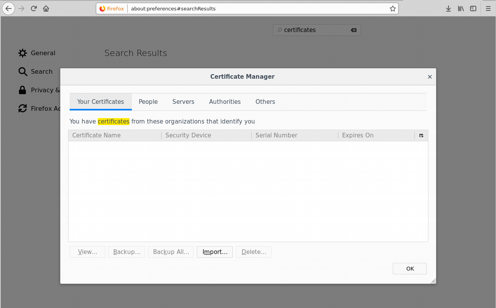

# Quickstart: Deploy Linux containers to Service Fabric

Azure Service Fabric is a distributed systems platform for deploying and managing scalable and reliable microservices and containers.

This quickstart shows how to deploy Linux containers to a Service Fabric cluster on Azure. Once complete, you have a voting application consisting of a Python web front end and a Redis back end running in a Service Fabric cluster. You also learn how to fail over an application and how to scale an application in your cluster.

![Voting app web page][quickstartpic]

## Prerequisites

To complete this quickstart:

1. Create a [free Azure account](https://azure.microsoft.com/free/) before you begin if you don't have a subscription.

2. Install the [Azure CLI](/cli/azure/install-azure-cli-apt)

3. Install the [Service Fabric SDK and CLI](service-fabric-get-started-linux.md#installation-methods)

4. Install [Git](https://git-scm.com/)


## Get the application package

To deploy containers to Service Fabric, you need a set of manifest files (the application definition), which describe the individual containers and the application.

In a console, use git to clone a copy of the application definition; then change directories to the `Voting` directory in your clone.

```bash
git clone https://github.com/Azure-Samples/service-fabric-containers.git

cd service-fabric-containers/Linux/container-tutorial/Voting
```

## Create a Service Fabric cluster

To deploy the application to Azure, you need a Service Fabric cluster to run the application. The following commands create a five-node cluster in Azure.  The commands also create a self-signed certificate, adds it to a key vault and downloads the certificate locally. The new certificate is used to secure the cluster when it deploys and is used to authenticate clients.

If you wish, you can modify the variable values to your preference. For example, westus instead of eastus for the location.

> [!NOTE]
> Key vault names should be universally unique, as they are accessed as https://{vault-name}.vault.azure.net.
>
```azurecli
#!/bin/bash

# Variables
ResourceGroupName='containertestcluster' 
ClusterName='containertestcluster' 
Location='eastus' 
Password='q6D7nN%6ck@6' 
Subject='containertestcluster.eastus.cloudapp.azure.com' 
VaultName='containertestvault' 
VmPassword='Mypa$$word!321'
VmUserName='sfadminuser'

# Login to Azure and set the subscription
az login

az account set --subscription <mySubscriptionID>

# Create resource group
az group create --name $ResourceGroupName --location $Location 

# Create secure five node Linux cluster. Creates a key vault in a resource group
# and creates a certificate in the key vault. The certificate's subject name must match 
# the domain that you use to access the Service Fabric cluster.  The certificate is downloaded locally.
az sf cluster create --resource-group $ResourceGroupName --location $Location --certificate-output-folder . --certificate-password $Password --certificate-subject-name $Subject --cluster-name $ClusterName --cluster-size 5 --os UbuntuServer1804 --vault-name $VaultName --vault-resource-group $ResourceGroupName --vm-password $VmPassword --vm-user-name $VmUserName
```

> [!Note]
> The web front end service is configured to listen on port 80 for incoming traffic. By default, port 80 is open on your cluster VMs and the Azure load balancer.
>

## Configure your environment

Service Fabric provides several tools that you can use to manage a cluster and its applications:

- Service Fabric Explorer, a browser-based tool.
- Service Fabric Command Line Interface (CLI), which runs on top of Azure CLI.
- PowerShell commands.

In this quickstart, you use the Service Fabric CLI and Service Fabric Explorer (a web based tool). To use Service Fabric Explorer, you need to import the certificate PFX file into the browser. By default, the PFX file has no password.

Mozilla Firefox is the default browser in Ubuntu 18.04. To import the certificate into Firefox, click the menu button in the upper right corner of your browser, then click **Options**. On the **Preferences** page, use the search box to search for "certificates". Click **View Certificates**, select the **Your Certificates** tab, click **Import** and follow the prompts to import the certificate.

   

## Deploy the Service Fabric application

1. Connect to the Service Fabric cluster in Azure using the CLI. The endpoint is the management endpoint for your cluster. You created the PEM file in the previous section. 

    ```bash
    sfctl cluster select --endpoint https://containertestcluster.eastus.cloudapp.azure.com:19080 --pem containertestcluster22019013100.pem --no-verify
    ```

2. Use the install script to copy the Voting application definition to the cluster, register the application type, and create an instance of the application.  The PEM certificate file should be located in the same directory as the *install.sh* file.

    ```bash
    ./install.sh
    ```

3. Open a web browser and navigate to the Service Fabric Explorer endpoint for your cluster. The endpoint has the following format:  **https://\<my-azure-service-fabric-cluster-url>:19080/Explorer**; for example, `https://containertestcluster.eastus.cloudapp.azure.com:19080/Explorer`. </br>

4. Expand the **Applications** node to see that there is now an entry for the Voting application type and the instance you created.

    ![Service Fabric Explorer][sfx]

5. To connect to the running container, open a web browser and navigate to the URL of your cluster; for example, `http://containertestcluster.eastus.cloudapp.azure.com:80`. You should see the Voting application in the browser.

    ![Voting app web page][quickstartpic]

> [!NOTE]
> You can also deploy Service Fabric applications with Docker compose. For example, the following command could be used to deploy and install the application on the cluster using Docker Compose.
>  ```bash
> sfctl compose create --deployment-name TestApp --file-path ../docker-compose.yml
> ```

## Fail over a container in a cluster

Service Fabric makes sure that your container instances automatically move to other nodes in the cluster if a failure occurs. You can also manually drain a node for containers and move then gracefully to other nodes in the cluster. Service Fabric provides several ways to scale your services. In the following steps, you use Service Fabric Explorer.

To fail over the front-end container, do the following steps:

1. Open Service Fabric Explorer in your cluster; for example, `https://containertestcluster.eastus.cloudapp.azure.com:19080/Explorer`.
2. Click the **fabric:/Voting/azurevotefront** node in the tree view and expand the partition node (represented by a GUID). Notice the node name in the treeview, which shows you the nodes that the container is currently running on; for example, `_nodetype_1`.
3. Expand the **Nodes** node in the tree view. Click the ellipsis (...) next to the node that is running the container.
4. Choose **Restart** to restart that node and confirm the restart action. The restart causes the container to fail over to another node in the cluster.

    ![Node view in Service Fabric Explorer][sfxquickstartshownodetype]

## Scale applications and services in a cluster

Service Fabric services can easily be scaled across a cluster to accommodate for the load on the services. You scale a service by changing the number of instances running in the cluster.

To scale the web front-end service, do the following steps:

1. Open Service Fabric Explorer in your cluster; for example,`https://containertestcluster.eastus.cloudapp.azure.com:19080`.
2. Click the ellipsis (three dots) next to the **fabric:/Voting/azurevotefront** node in the treeview and choose **Scale Service**.

    ![Service Fabric Explorer scale service start][containersquickstartscale]

    You can now choose to scale the number of instances of the web front-end service.

3. Change the number to **2** and click **Scale Service**.
4. Click the **fabric:/Voting/azurevotefront** node in the tree-view and expand the partition node (represented by a GUID).

    ![Service Fabric Explorer scale service finished][containersquickstartscaledone]

    You can now see that the service has two instances. In the tree view, you can see which nodes the instances run on.

Through this simple management task, you've doubled the resources available for the front-end service to process user load. It's important to understand that you don't need multiple instances of a service for it to run reliably. If a service fails, Service Fabric makes sure that a new service instance runs in the cluster.

## Clean up resources

Use the uninstall script (uninstall.sh) provided in the template to delete the application instance from the cluster and unregister the application type. This script takes some time to clean up the instance, so you should not run the install script immediately after this script. You can use Service Fabric Explorer to determine when the instance has been removed and the application type unregistered.

```bash
./uninstall.sh
```

The simplest way to delete the cluster and all the resources it consumes is to delete the resource group.

Sign in to Azure and select the subscription ID with which you want to remove the cluster. You can find your subscription ID by logging in to the Azure portal. Delete the resource group and all the cluster resources using the [az group delete command](/cli/azure/group).

```azurecli
az login
az account set --subscription <guid>
ResourceGroupName="containertestcluster"
az group delete --name $ResourceGroupName
```

If you are finished working with your cluster, you can remove the certificate from your certificate store. For example:
- On Windows: Use the [Certificates MMC snap-in](/dotnet/framework/wcf/feature-details/how-to-view-certificates-with-the-mmc-snap-in). Be sure to select **My user account** when adding the snap-in. Navigate to `Certificates - Current User\Personal\Certificates` and remove the certificate.
- On Mac: Use the Keychain app.
- On Ubuntu: Follow the steps you used to view certificates and remove the certificate.

## Next steps

In this quickstart, you've deployed a Linux container application to a Service Fabric cluster in Azure, performed fail-over on the application, and scaled the application in the cluster. To learn more about working with Linux containers in Service Fabric, continue to the tutorial for Linux container applications.

> [!div class="nextstepaction"]
> [Create a Linux container application](./service-fabric-tutorial-create-container-images.md)

[sfx]: ./media/service-fabric-quickstart-containers-linux/containersquickstartappinstance.png
[quickstartpic]: ./media/service-fabric-quickstart-containers-linux/votingapp.png
[sfxquickstartshownodetype]:  ./media/service-fabric-quickstart-containers-linux/containersquickstartrestart.png
[containersquickstartscale]: ./media/service-fabric-quickstart-containers-linux/containersquickstartscale.png
[containersquickstartscaledone]: ./media/service-fabric-quickstart-containers-linux/containersquickstartscaledone.png
