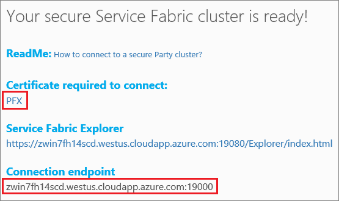

# Quickstart: deploy a Service Fabric Windows container application on Azure
Azure Service Fabric is a distributed systems platform for deploying and managing scalable and reliable microservices and containers. 

Running an existing application in a Windows container on a Service Fabric cluster doesn't require any changes to your application. This quickstart shows you how to deploy a pre-built Docker container image in a Service Fabric application. When you're finished, you'll have a running Windows Server 2016 Nano Server and IIS container. This quickstart describes deploying a Windows container, read [this quickstart](service-fabric-quickstart-containers-linux.md) to deploy a Linux container.

![IIS default web page][iis-default]

In this quickstart you learn how to:

* Package a Docker image container
* Configure communication
* Build and package the Service Fabric application
* Deploy the container application to Azure

## Prerequisites
* An Azure subscription (you can create a [free account](https://azure.microsoft.com/free/?WT.mc_id=A261C142F)).
* A development computer running:
  * Visual Studio 2015 or Visual Studio 2017.
  * [Service Fabric SDK and tools](service-fabric-get-started.md).

## Package a Docker image container with Visual Studio
The Service Fabric SDK and tools provide a service template to help you deploy a container to a Service Fabric cluster.

Start Visual Studio as "Administrator".  Select **File** > **New** > **Project**.

Select **Service Fabric application**, name it "MyFirstContainer", and click **OK**.

Select **Container** from the **Hosted Containers and Applications** templates.

In **Image Name**, enter "microsoft/iis:nanoserver", the [Windows Server Nano Server and IIS base image](https://hub.docker.com/r/microsoft/iis/). 

Name your service "MyContainerService", and click **OK**.

## Configure communication and container port-to-host port mapping
The service needs an endpoint for communication.  For this quickstart, the containerized service listens on port 80.  In Solution Explorer, open *MyFirstContainer/ApplicationPackageRoot/MyContainerServicePkg/ServiceManifest.xml*.  Update the existing `Endpoint` in the ServiceManifest.xml file and add the protocol, port, and uri scheme: 

```xml
<Resources>
    <Endpoints>
        <Endpoint Name="MyContainerServiceTypeEndpoint" UriScheme="http" Port="80" Protocol="http"/>
   </Endpoints>
</Resources>
```
Providing the `UriScheme` automatically registers the container endpoint with the Service Fabric Naming service for discoverability. A full ServiceManifest.xml example file is provided at the end of this article. 

Configure the container port-to-host port mapping so that incoming requests to the service on port 80 are mapped to port 80 on the container.  In Solution Explorer, open *MyFirstContainer/ApplicationPackageRoot/ApplicationManifest.xml* and specify a `PortBinding` policy in `ContainerHostPolicies`.  For this quickstart, `ContainerPort` is 80 and `EndpointRef` is "MyContainerServiceTypeEndpoint" (the endpoint defined in the service manifest).    

```xml
<ServiceManifestImport>
...
  <ConfigOverrides />
  <Policies>
    <ContainerHostPolicies CodePackageRef="Code">
      <PortBinding ContainerPort="80" EndpointRef="MyContainerServiceTypeEndpoint"/>
    </ContainerHostPolicies>
  </Policies>
</ServiceManifestImport>
```

A full ApplicationManifest.xml example file is provided at the end of this article.

## Create a cluster
To deploy the application to a cluster in Azure, you can join a party cluster. Party clusters are free, limited-time Service Fabric clusters hosted on Azure and run by the Service Fabric team where anyone can deploy applications and learn about the platform.  The cluster uses a single self-signed certificate for-node-to node as well as client-to-node security. Party clusters support containers. If you decide to set up and use your own cluster, the cluster must be running on a SKU that supports containers (such as Windows Server 2016 Datacenter with Containers).

Sign in and [join a Windows cluster](http://aka.ms/tryservicefabric). Download the PFX certificate to your computer by clicking the **PFX** link. Click the **How to connect to a secure Party cluster?** link and copy the certificate password. The certificate, certificate password, and the **Connection endpoint** value are used in following steps.



> [!Note]
> There are a limited number of Party clusters available per hour. If you get an error when you try to sign up for a Party cluster, you can wait for a period and try again, or you can follow these steps in the [Deploy a .NET app](https://docs.microsoft.com/azure/service-fabric/service-fabric-tutorial-deploy-app-to-party-cluster#deploy-the-sample-application) tutorial to create a Service Fabric cluster in your Azure subscription and deploy the application to it. The cluster created through Visual Studio supports containers. After you have deployed and verified the application in your cluster, you can skip ahead to [Complete example Service Fabric application and service manifests](#complete-example-service-fabric-application-and-service-manifests) in this quickstart. 
>

On a Windows computer, install the PFX in *CurrentUser\My* certificate store.

```powershell
PS C:\mycertificates> Import-PfxCertificate -FilePath .\party-cluster-873689604-client-cert.pfx -CertStoreLocation Cert:\CurrentUser\My -Password (ConvertTo-SecureString 873689604 -AsPlainText -Force)


  PSParentPath: Microsoft.PowerShell.Security\Certificate::CurrentUser\My

Thumbprint                                Subject
----------                                -------
3B138D84C077C292579BA35E4410634E164075CD  CN=zwin7fh14scd.westus.cloudapp.azure.com
```

Remember the thumbprint for the following step.  

## Deploy the application to Azure using Visual Studio
Now that the application is ready, you can deploy it to a cluster directly from Visual Studio.

Right-click **MyFirstContainer** in the Solution Explorer and choose **Publish**. The Publish dialog appears.

Copy the **Connection Endpoint** from the Party cluster page into the **Connection Endpoint** field. For example, `zwin7fh14scd.westus.cloudapp.azure.com:19000`. Click **Advanced Connection Parameters** and verify the connection parameter information.  *FindValue* and *ServerCertThumbprint* values must match the thumbprint of the certificate installed in the previous step. 


Click **Publish**.

Each application in the cluster must have a unique name.  Party clusters are a public, shared environment however and there may be a conflict with an existing application.  If there is a name conflict, rename the Visual Studio project and deploy again.

Open a browser and navigate to the **Connection endpoint** specified in the Party cluster page. You can optionally prepend the scheme identifier, `http://`, and append the port, `:80`, to the URL. For example, http://zwin7fh14scd.westus.cloudapp.azure.com:80. You should see the IIS default web page:
![IIS default web page][iis-default]

## Complete example Service Fabric application and service manifests
Here are the complete service and application manifests used in this quickstart.

### ServiceManifest.xml
```xml
<?xml version="1.0" encoding="utf-8"?>
<ServiceManifest Name="MyContainerServicePkg"
                 Version="1.0.0"
                 xmlns="http://schemas.microsoft.com/2011/01/fabric"
                 xmlns:xsd="http://www.w3.org/2001/XMLSchema"
                 xmlns:xsi="http://www.w3.org/2001/XMLSchema-instance">
  <ServiceTypes>
    <!-- This is the name of your ServiceType.
         The UseImplicitHost attribute indicates this is a guest service. -->
    <StatelessServiceType ServiceTypeName="MyContainerServiceType" UseImplicitHost="true" />
  </ServiceTypes>

  <!-- Code package is your service executable. -->
  <CodePackage Name="Code" Version="1.0.0">
    <EntryPoint>
      <!-- Follow this link for more information about deploying Windows containers to Service Fabric: https://aka.ms/sfguestcontainers -->
      <ContainerHost>
        <ImageName>microsoft/iis:nanoserver</ImageName>
      </ContainerHost>
    </EntryPoint>
    <!-- Pass environment variables to your container: -->
    <!--
    <EnvironmentVariables>
      <EnvironmentVariable Name="VariableName" Value="VariableValue"/>
    </EnvironmentVariables>
    -->
  </CodePackage>

  <!-- Config package is the contents of the Config directoy under PackageRoot that contains an 
       independently-updateable and versioned set of custom configuration settings for your service. -->
  <ConfigPackage Name="Config" Version="1.0.0" />

  <Resources>
    <Endpoints>
      <!-- This endpoint is used by the communication listener to obtain the port on which to 
           listen. Please note that if your service is partitioned, this port is shared with 
           replicas of different partitions that are placed in your code. -->
      <Endpoint Name="MyContainerServiceTypeEndpoint" UriScheme="http" Port="80" Protocol="http"/>
    </Endpoints>
  </Resources>
</ServiceManifest>
```
### ApplicationManifest.xml
```xml
<?xml version="1.0" encoding="utf-8"?>
<ApplicationManifest ApplicationTypeName="MyFirstContainerType"
                     ApplicationTypeVersion="1.0.0"
                     xmlns="http://schemas.microsoft.com/2011/01/fabric"
                     xmlns:xsd="http://www.w3.org/2001/XMLSchema"
                     xmlns:xsi="http://www.w3.org/2001/XMLSchema-instance">
  <Parameters>
    <Parameter Name="MyContainerService_InstanceCount" DefaultValue="-1" />
  </Parameters>
  <!-- Import the ServiceManifest from the ServicePackage. The ServiceManifestName and ServiceManifestVersion 
       should match the Name and Version attributes of the ServiceManifest element defined in the 
       ServiceManifest.xml file. -->
  <ServiceManifestImport>
    <ServiceManifestRef ServiceManifestName="MyContainerServicePkg" ServiceManifestVersion="1.0.0" />
    <ConfigOverrides />
    <Policies>
      <ContainerHostPolicies CodePackageRef="Code">
        <PortBinding ContainerPort="80" EndpointRef="MyContainerServiceTypeEndpoint"/>
      </ContainerHostPolicies>
    </Policies>
  </ServiceManifestImport>
  <DefaultServices>
    <!-- The section below creates instances of service types, when an instance of this 
         application type is created. You can also create one or more instances of service type using the 
         ServiceFabric PowerShell module.
         
         The attribute ServiceTypeName below must match the name defined in the imported ServiceManifest.xml file. -->
    <Service Name="MyContainerService" ServicePackageActivationMode="ExclusiveProcess">
      <StatelessService ServiceTypeName="MyContainerServiceType" InstanceCount="[MyContainerService_InstanceCount]">
        <SingletonPartition />
      </StatelessService>
    </Service>
  </DefaultServices>
</ApplicationManifest>
```

## Next steps
In this quickstart, you learned how to:

* Package a Docker image container
* Configure communication
* Build and package the Service Fabric application
* Deploy the container application to Azure

To learn more about working with Windows containers in Service Fabric, continue to the tutorial for Windows container apps.

> [!div class="nextstepaction"]
> [Create a Windows container app](./service-fabric-host-app-in-a-container.md)

[iis-default]: ./media/service-fabric-quickstart-containers/iis-default.png
[publish-dialog]: ./media/service-fabric-quickstart-containers/publish-dialog.png
