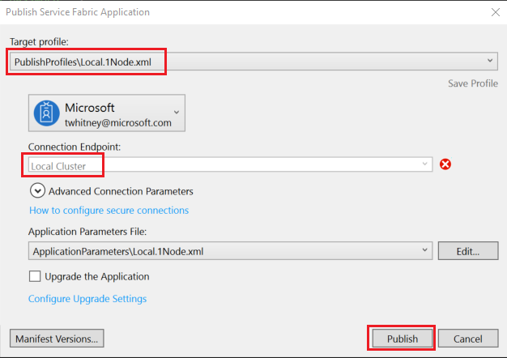

# Quickstart: Deploy Windows containers to Service Fabric

Azure Service Fabric is a distributed systems platform for deploying and managing scalable and reliable microservices and containers.

Running an existing application in a Windows container on a Service Fabric cluster doesn't require any changes to your application. This quickstart shows you how to deploy a pre-built Docker container image in a Service Fabric application. When you're finished, you'll have a running Windows Server Core 2016 Server and IIS container. This quickstart describes deploying a Windows container. Read [this quickstart](service-fabric-quickstart-containers-linux.md) to deploy a Linux container.

![IIS default web page][iis-default]

In this quickstart you learn how to:

* Package a Docker image container
* Configure communication
* Build and package the Service Fabric application
* Deploy the container application to Azure


[!INCLUDE [updated-for-az](../../includes/updated-for-az.md)]

## Prerequisites

* An Azure subscription (you can create a [free account](https://azure.microsoft.com/free/?WT.mc_id=A261C142F)).
* A development computer running:
  * Visual Studio 2019 or Windows 2019.
  * [Service Fabric SDK and tools](service-fabric-get-started.md).

## Package a Docker image container with Visual Studio

The Service Fabric SDK and tools provide a service template to help you deploy a container to a Service Fabric cluster.

Start Visual Studio as "Administrator".  Select **File** > **New** > **Project**.

Select **Service Fabric application**, name it "MyFirstContainer", and click **Create**.

Select **Container** from the **Hosted Containers and Applications** templates.

In **Image Name**, enter "mcr.microsoft.com/windows/servercore/iis:windowsservercore-ltsc2016", the [Windows Server Core Server and IIS base image](https://hub.docker.com/_/microsoft-windows-servercore-iis).

Configure the container port-to-host port mapping so that incoming requests to the service on port 80 are mapped to port 80 on the container.  Set **Container Port** to "80" and set **Host Port** to "80".  

Name your service "MyContainerService", and click **OK**.

![New service dialog][new-service]

## Specify the OS build for your container image

Containers built with a specific version of Windows Server may not run on a host running a different version of Windows Server. For example, containers built using Windows Server version 1709 don't run on hosts running Windows Server 2016. To learn more, see [Windows Server container OS and host OS compatibility](service-fabric-get-started-containers.md#windows-server-container-os-and-host-os-compatibility). 

With version 6.1 of the Service Fabric runtime and newer, you can specify multiple OS images per container and tag each with the build version of the OS that it should be deployed to. This helps to make sure that your application will run across hosts running different versions of Windows OS. To learn more, see [Specify OS build specific container images](service-fabric-get-started-containers.md#specify-os-build-specific-container-images). 

Microsoft publishes different images for versions of IIS built on different versions of Windows Server. To make sure that Service Fabric deploys a container compatible with the version of Windows Server running on the cluster nodes where it deploys your application, add the following lines to the *ApplicationManifest.xml* file. The build version for Windows Server 2016 is 14393 and the build version for Windows Server version 1709 is 16299.

```xml
    <ContainerHostPolicies CodePackageRef="Code"> 
      <ImageOverrides> 
        ...
	      <Image Name="mcr.microsoft.com/windows/servercore/iis:windowsservercore-1803" /> 
          <Image Name= "mcr.microsoft.com/windows/servercore/iis:windowsservercore-ltsc2016" Os="14393" /> 
          <Image Name="mcr.microsoft.com/windows/servercore/iis:windowsservercore-1709" Os="16299" /> 
      </ImageOverrides> 
    </ContainerHostPolicies> 
```

The service manifest continues to specify only one image for the nanoserver, `mcr.microsoft.com/windows/servercore/iis:windowsservercore-ltsc2016`.

Also in the *ApplicationManifest.xml* file, change **PasswordEncrypted** to **false**. The account and password are blank for the public container image that is on Docker Hub, so we turn off encryption because encrypting a blank password will generate a build error.

```xml
<RepositoryCredentials AccountName="" Password="" PasswordEncrypted="false" />
```

## Create a cluster

The following sample script creates a five-node Service Fabric cluster secured with an X.509 certificate. The command creates a self-signed certificate and uploads it to a new key vault. The certificate is also copied to a local directory. You can learn more about creating a cluster using this script in [Create a Service Fabric cluster](scripts/service-fabric-powershell-create-secure-cluster-cert.md).

If needed, install the Azure PowerShell using the instructions found in the [Azure PowerShell guide](/powershell/azure/).

Before you run the following script, in PowerShell run `Connect-AzAccount` to create a connection with Azure.

Copy the following script to the clipboard and open **Windows PowerShell ISE**.  Paste the contents into the empty Untitled1.ps1 window. Then provide values for the variables in the script: `subscriptionId`, `certpwd`, `certfolder`, `adminuser`, `adminpwd`, and so on.  The directory you specify for `certfolder` must exist before you run the script.

[!code-powershell[main](../../powershell_scripts/service-fabric/create-secure-cluster/create-secure-cluster.ps1 "Create a Service Fabric cluster")]

Once you've provided your values for the variables, press **F5** to run the script.

After the script runs and the cluster is created, find the `ClusterEndpoint` in the output. For example:

```powershell
...
ClusterEndpoint : https://southcentralus.servicefabric.azure.com/runtime/clusters/b76e757d-0b97-4037-a184-9046a7c818c0
```

### Install the certificate for the cluster

Now we'll install the PFX in *CurrentUser\My* certificate store. The PFX file will be in the directory you specified using the `certfolder` environment variable in the PowerShell script above.

Change to that directory, and then run the following PowerShell command, replacing the name of the PFX file that is in your `certfolder` directory, and the password that you specified in the `certpwd` variable. In this example, the current directory is set to the directory specified by the `certfolder` variable in the PowerShell script. From there the `Import-PfxCertificate` command is run:

```powershell
PS C:\mycertificates> Import-PfxCertificate -FilePath .\mysfclustergroup20190130193456.pfx -CertStoreLocation Cert:\CurrentUser\My -Password (ConvertTo-SecureString Password#1234 -AsPlainText -Force)
```

The command returns the Thumbprint:

```powershell
  ...
  PSParentPath: Microsoft.PowerShell.Security\Certificate::CurrentUser\My

Thumbprint                                Subject
----------                                -------
0AC30A2FA770BEF566226CFCF75A6515D73FC686  CN=mysfcluster.SouthCentralUS.cloudapp.azure.com
```

Remember the thumbprint value for the following step.

## Deploy the application to Azure using Visual Studio

Now that the application is ready, you can deploy it to a cluster directly from Visual Studio.

Right-click **MyFirstContainer** in the Solution Explorer and choose **Publish**. The Publish dialog appears.

Copy the content following **CN=** in the PowerShell window when you ran the `Import-PfxCertificate` command above, and add port `19000` to it. For example, `mysfcluster.SouthCentralUS.cloudapp.azure.com:19000`. Copy it into the **Connection Endpoint** field. Remember this value because you'll need it in a future step.

Click **Advanced Connection Parameters** and verify the connection parameter information.  *FindValue* and *ServerCertThumbprint* values must match the thumbprint of the certificate installed when you ran `Import-PfxCertificate` in the previous step.



Click **Publish**.

Each application in the cluster must have a unique name. If there's a name conflict, rename the Visual Studio project and deploy again.

Open a browser and navigate to the address that you put into the **Connection Endpoint** field in the previous step. You can optionally prepend the scheme identifier, `http://`, and append the port, `:80`, to the URL. For example, http:\//mysfcluster.SouthCentralUS.cloudapp.azure.com:80.

 You should see the IIS default web page:
![IIS default web page][iis-default]

## Clean up

You continue to incur charges while the cluster is running. Consider [deleting your cluster](./service-fabric-tutorial-delete-cluster.md).

## Next steps

In this quickstart, you learned how to:

* Package a Docker image container
* Configure communication
* Build and package the Service Fabric application
* Deploy the container application to Azure

To learn more about working with Windows containers in Service Fabric, continue to the tutorial for Windows container applications.

> [!div class="nextstepaction"]
> [Create a Windows container application](./service-fabric-host-app-in-a-container.md)

[iis-default]: ./media/service-fabric-quickstart-containers/iis-default.png
[publish-dialog]: ./media/service-fabric-quickstart-containers/publish-dialog.png
[new-service]: ./media/service-fabric-quickstart-containers/NewService.png
