# Quickstart: Deploy a .NET reliable services application to Service Fabric

Azure Service Fabric is a distributed systems platform for deploying and managing scalable and reliable microservices and containers.

This quickstart shows how to deploy your first .NET application to Service Fabric. When you're finished, you have a voting application with an ASP.NET Core web front end that saves voting results in a stateful back-end service in the cluster.

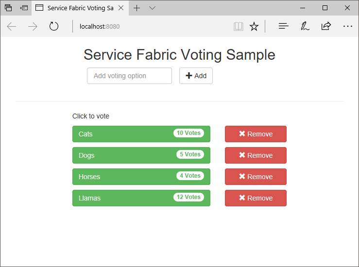

Using this application you learn how to:

* Create an application using .NET and Service Fabric
* Use ASP.NET core as a web front-end
* Store application data in a stateful service
* Debug your application locally
* Deploy the application to a cluster in Azure
* Scale-out the application across multiple nodes
* Perform a rolling application upgrade

## Prerequisites

To complete this quickstart:

1. [Install Visual Studio 2017](https://www.visualstudio.com/) with the **Azure development** and **ASP.NET and web development** workloads.
2. [Install Git](https://git-scm.com/)
3. [Install the Microsoft Azure Service Fabric SDK](http://www.microsoft.com/web/handlers/webpi.ashx?command=getinstallerredirect&appid=MicrosoftAzure-ServiceFabric-CoreSDK)
4. Run the following command to enable Visual Studio to deploy to the local Service Fabric cluster:
    ```powershell
    Set-ExecutionPolicy -ExecutionPolicy Unrestricted -Force -Scope CurrentUser
    ```

>[!NOTE]
> The sample application in this quickstart uses features that are not available on Windows 7.
>

## Download the sample

In a command window, run the following command to clone the sample app repository to your local machine.

```git
git clone https://github.com/Azure-Samples/service-fabric-dotnet-quickstart
```

## Run the application locally

Right-click the Visual Studio icon in the Start Menu and choose **Run as administrator**. In order to attach the debugger to your services, you need to run Visual Studio as administrator.

Open the **Voting.sln** Visual Studio solution from the repository you cloned.

By default, the Voting application is set to listen on port 8080.  The application port is set in the */VotingWeb/PackageRoot/ServiceManifest.xml* file.  You can change the application port by updating the **Port** attribute of the **Endpoint** element.  To deploy and run the application locally, the application port must be open and available on your computer.  If you change the application port, substitute the new application port value for "8080" throughout this article.

To deploy the application, press **F5**.

> [!NOTE]
> The first time you run and deploy the application, Visual Studio creates a local cluster for debugging. This operation may take some time. The cluster creation status is displayed in the Visual Studio output window.  In the output, you see the message "The application URL is not set or is not an HTTP/HTTPS URL so the browser will not be opened to the application."  This message does not indicate an error, but that a browser will not auto-launch.

When the deployment is complete, launch a browser and open this page: `http://localhost:8080` - the web front end of the application.


You can now add a set of voting options, and start taking votes. The application runs and stores all data in your Service Fabric cluster, without the need for a separate database.

## Walk through the voting sample application

The voting application consists of two services:

* Web front-end service (VotingWeb)- An ASP.NET Core web front-end service, which serves the web page and exposes web APIs to communicate with the backend service.
* Back-end service (VotingData)- An ASP.NET Core web service, which exposes an API to store the vote results in a reliable dictionary persisted on disk.

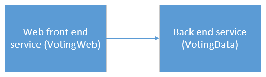

When you vote in the application the following events occur:

1. A JavaScript sends the vote request to the web API in the web front-end service as an HTTP PUT request.

2. The web front-end service uses a proxy to locate and forward an HTTP PUT request to the back-end service.

3. The back-end service takes the incoming request, and stores the updated result in a reliable dictionary, which gets replicated to multiple nodes within the cluster and persisted on disk. All the application's data is stored in the cluster, so no database is needed.

## Debug in Visual Studio

The application should be running OK, but you can use the debugger to see how key parts of the application work. When debugging the application in Visual Studio, you are using a local Service Fabric development cluster. You have the option to adjust your debugging experience to your scenario. In this application, data is stored in back-end service using a reliable dictionary. Visual Studio removes the application per default when you stop the debugger. Removing the application causes the data in the back-end service to also be removed. To persist the data between debugging sessions, you can change the **Application Debug Mode** as a property on the **Voting** project in Visual Studio.

To look at what happens in the code, complete the following steps:

1. Open the **/VotingWeb/Controllers/VotesController.cs** file and set a breakpoint in the web API's **Put** method (line 69) - You can search for the file in the Solution Explorer in Visual Studio.

2. Open the **/VotingData/Controllers/VoteDataController.cs** file and set a breakpoint in this web API's **Put** method (line 54).

3. Go back to the browser and click a voting option or add a new voting option. You hit the first breakpoint in the web front end's api controller.
    * This is where the JavaScript in the browser sends a request to the web API controller in the front-end service.

    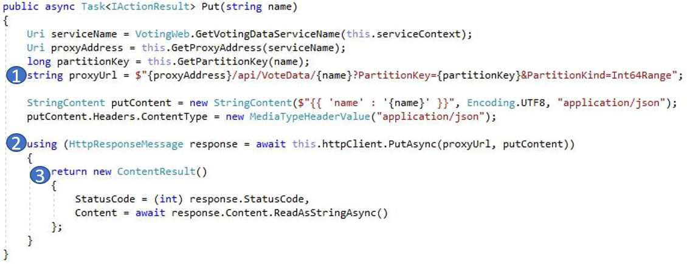

    * First, construct the URL to the ReverseProxy for our back-end service **(1)**.
    * Then, send the HTTP PUT Request to the ReverseProxy **(2)**.
    * Finally, return the response from the back-end service to the client **(3)**.

4. Press **F5** to continue
    - If prompted by the browser, grant ServiceFabricAllowedUsers group read and execute permissions for Debug Mode.
    - You are now at the break point in the back-end service.

    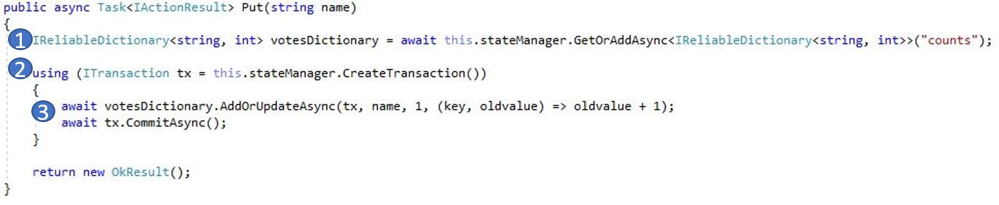

    * In the first line in the method **(1)** the `StateManager` gets or adds a reliable dictionary called `counts`.
    * All interactions with values in a reliable dictionary require a transaction, this using statement **(2)** creates that transaction.
    * In the transaction, update the value of the relevant key for the voting option and commit the operation **(3)**. Once the commit method returns, the data is updated in the dictionary and replicated to other nodes in the cluster. The data is now safely stored in the cluster, and the back-end service can fail over to other nodes, still having the data available.
5. Press **F5** to continue

To stop the debugging session, press **Shift+F5**.

## Deploy the application to Azure

To deploy the application to Azure, you need a Service Fabric cluster which runs the application.

### Join a Party cluster

Party clusters are free, limited-time Service Fabric clusters hosted on Azure and run by the Service Fabric team where anyone can deploy applications and learn about the platform. The cluster uses a single self-signed certificate for node-to-node as well as client-to-node security.

Sign in and [join a Windows cluster](http://aka.ms/tryservicefabric). Download the PFX certificate to your computer by clicking the **PFX** link. Click the **How to connect to a secure Party cluster?** link and copy the certificate password. The certificate, certificate password, and the **Connection endpoint** value are used in following steps.

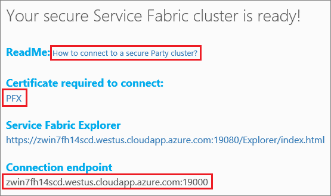

> [!Note]
> There are a limited number of Party clusters available per hour. If you get an error when you try to sign up for a Party cluster, you can wait for a period and try again, or you can follow these steps in the [Deploy a .NET app](https://docs.microsoft.com/azure/service-fabric/service-fabric-tutorial-deploy-app-to-party-cluster#deploy-the-sample-application) tutorial to create a Service Fabric cluster in your Azure subscription and deploy the application to it. If you don't already have an Azure subscription, you can create a [free account](https://azure.microsoft.com/free/?WT.mc_id=A261C142F). After you have deployed and verified the application in your cluster, you can skip ahead to [Scale applications and services in a cluster](#scale-applications-and-services-in-a-cluster) in this quickstart.
>

On your Windows machine, install the PFX in *CurrentUser\My* certificate store.

```powershell
PS C:\mycertificates> Import-PfxCertificate -FilePath .\party-cluster-873689604-client-cert.pfx -CertStoreLocation Cert:\CurrentUser\My -Password (ConvertTo-SecureString 873689604 -AsPlainText -Force)


   PSParentPath: Microsoft.PowerShell.Security\Certificate::CurrentUser\My

Thumbprint                                Subject
----------                                -------
3B138D84C077C292579BA35E4410634E164075CD  CN=zwin7fh14scd.westus.cloudapp.azure.com
```

Remember the thumbprint for a following step.

> [!Note]
> By default, the web front-end service is configured to listen on port 8080 for incoming traffic. Port 8080 is open in the Party Cluster.  If you need to change the application port, change it to one of the ports that are open in the Party Cluster.
>

### Deploy the application using Visual Studio

Now that the application is ready, you can deploy it to a cluster directly from Visual Studio.

1. Right-click **Voting** in the Solution Explorer and choose **Publish**. The Publish dialog appears.

2. Copy the **Connection Endpoint** from the Party cluster page into the **Connection Endpoint** field. For example, `zwin7fh14scd.westus.cloudapp.azure.com:19000`. Click **Advanced Connection Parameters** and ensure that the *FindValue* and *ServerCertThumbprint* values match the thumbprint of the certificate installed in a previous step.

    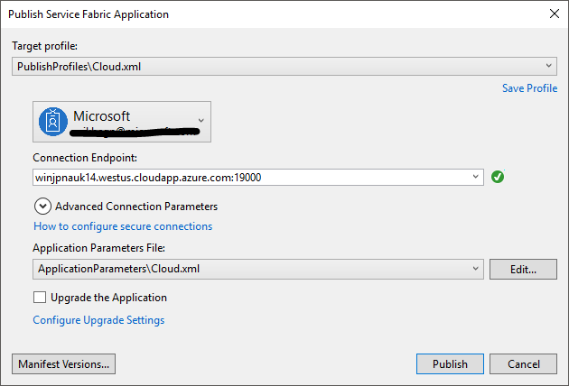

    Each application in the cluster must have a unique name.  Party clusters are a public, shared environment however and there may be a conflict with an existing application.  If there is a name conflict, rename the Visual Studio project and deploy again.

3. Click **Publish**.

4. Open a browser and type in the cluster address followed by ':8080' to get to the application in the cluster - for example, `http://zwin7fh14scd.westus.cloudapp.azure.com:8080`. You should now see the application running in the cluster in Azure.

    

## Scale applications and services in a cluster

Service Fabric services can easily be scaled across a cluster to accommodate for a change in the load on the services. You scale a service by changing the number of instances running in the cluster. You have multiple ways of scaling your services, you can use scripts or commands from PowerShell or Service Fabric CLI (sfctl). In this example, use Service Fabric Explorer.

Service Fabric Explorer runs in all Service Fabric clusters and can be accessed from a browser, by browsing to the clusters HTTP management port (19080), for example, `http://zwin7fh14scd.westus.cloudapp.azure.com:19080`.

You may receive a browser warning that the location is not trusted. This is because the certificate is self-signed. You may choose to ignore the warning and proceed.
1. When prompted by the browser, select the installed certificate to connect. The party cluster certificate you select from the list must match the party cluster that you are attempting to access. For example, win243uja6w62r.westus.cloudapp.azure.com.
2. If prompted by the browser, grant access to your CryptoAPI Private Key for this session.

To scale the web front-end service, do the following steps:

1. Open Service Fabric Explorer in your cluster - for example,`http://zwin7fh14scd.westus.cloudapp.azure.com:19080`.

2. In the tree view, expand **Applications**->**VotingType**->**fabric:/Voting**. Click on the ellipsis (three dots) next to the **fabric:/Voting/VotingWeb** node in the treeview and choose **Scale Service**.

    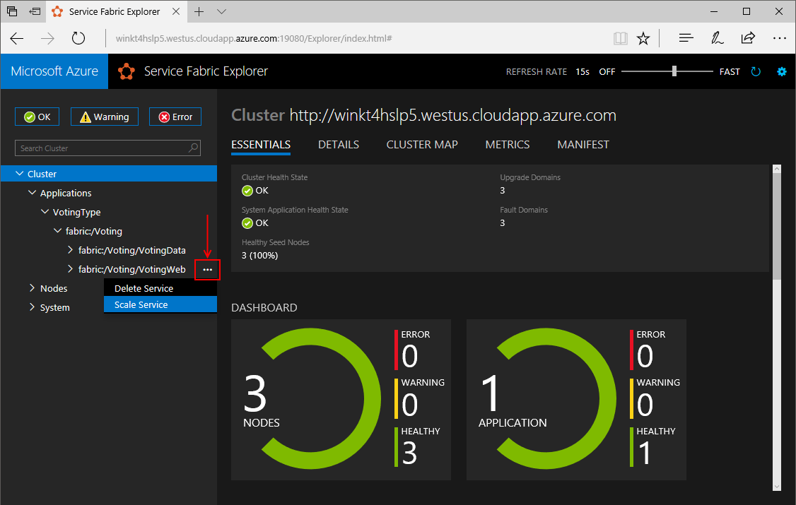

    You can now choose to scale the number of instances of the web front-end service.

3. Change the number to **2** and click **Scale Service**.
4. Click on the **fabric:/Voting/VotingWeb** node in the tree-view and expand the partition node (represented by a GUID).

    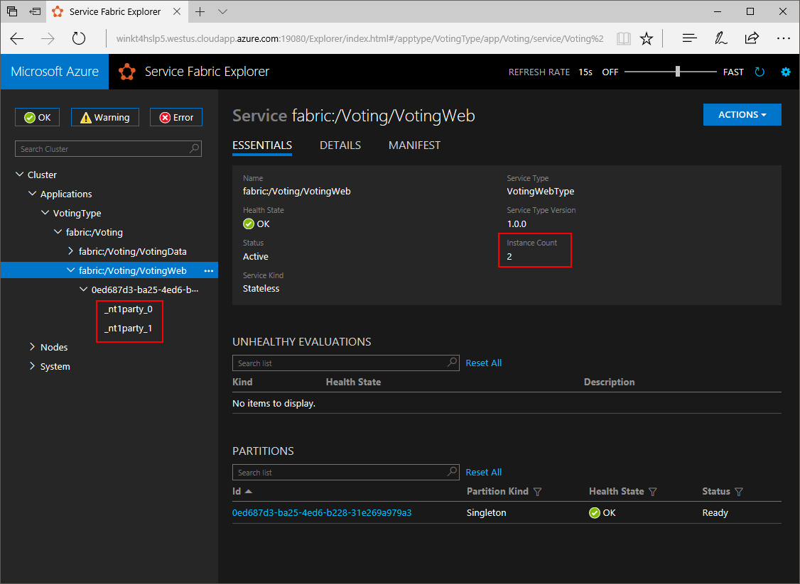

    After a delay, you can see that the service has two instances.  In the tree view you see which nodes the instances run on.

By this simple management task, the resources available doubled for the front-end service to process user load. It's important to understand that you do not need multiple instances of a service to have it run reliably. If a service fails, Service Fabric makes sure a new service instance runs in the cluster.

## Perform a rolling application upgrade

When deploying new updates to your application, Service Fabric rolls out the update in a safe way. Rolling upgrades gives you no downtime while upgrading as well as automated rollback should errors occur.

To upgrade the application, do the following:

1. Open the **/VotingWeb/Views/Home/Index.cshtml** file in Visual Studio.
2. Change the heading on the page by adding or updating the text. For example, change the heading to "Service Fabric Voting Sample v2".
3. Save the file.
4. Right-click **Voting** in the Solution Explorer and choose **Publish**. The Publish dialog appears.
5. Click the **Manifest Version** button to change the version of the service and application.
6. Change the version of the **Code** element under **VotingWebPkg** to "2.0.0", for example, and click **Save**.

    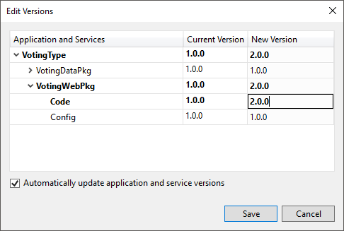
7. In the **Publish Service Fabric Application** dialog, check the Upgrade the Application checkbox, and click **Publish**.

    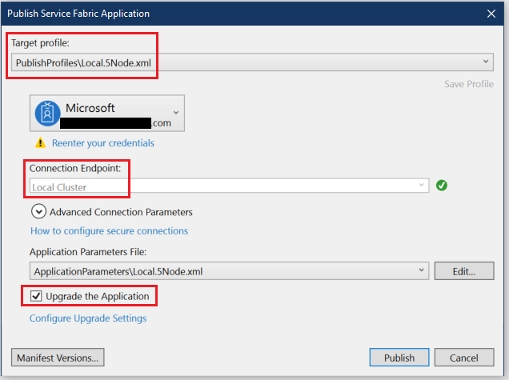

    While the upgrade is running, you can still use the application. Because you have two instances of the service running in the cluster, some of your requests may get an upgraded version of the application, while others may still get the old version.

8. Open your browser and browse to the cluster address on port 19080 - for example, `http://zwin7fh14scd.westus.cloudapp.azure.com:19080`.
9. Click on the **Applications** node in the tree view, and then **Upgrades in Progress** in the right-hand pane. You see how the upgrade rolls through the upgrade domains in your cluster, making sure each domain is healthy before proceeding to the next. An upgrade domain in the progress bar appears green when the health of the domain has been verified.
    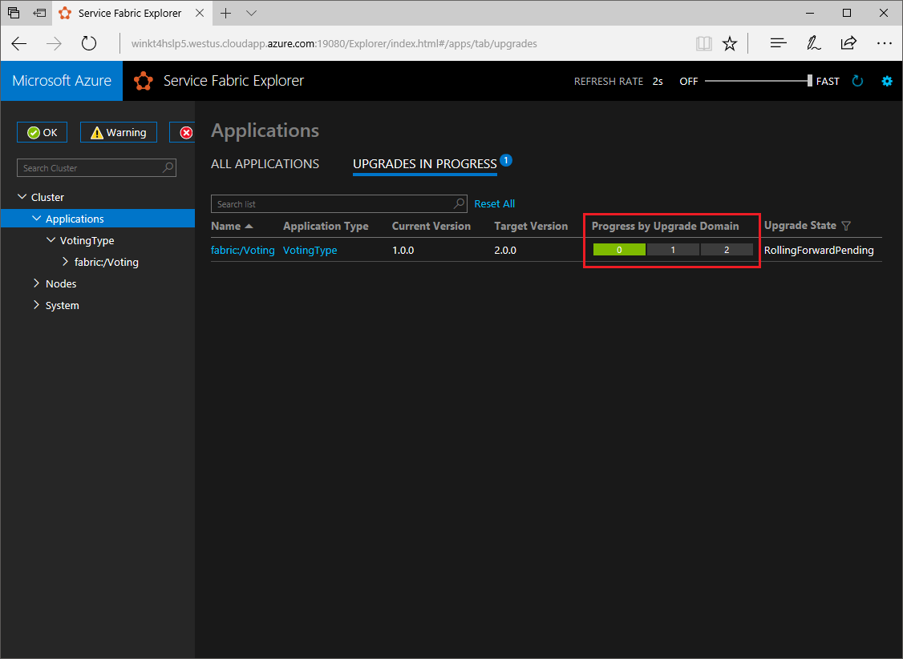

    Service Fabric makes upgrades safe by waiting two minutes after upgrading the service on each node in the cluster. Expect the entire update to take approximately eight minutes.

## Next steps

In this quickstart, you learned how to:

* Create an application using .NET and Service Fabric
* Use ASP.NET core as a web front-end
* Store application data in a stateful service
* Debug your application locally
* Deploy the application to a cluster in Azure
* Scale-out the application across multiple nodes
* Perform a rolling application upgrade

To learn more about Service Fabric and .NET, take a look at this tutorial:
> [!div class="nextstepaction"]
> [.NET application on Service Fabric](service-fabric-tutorial-create-dotnet-app.md)
