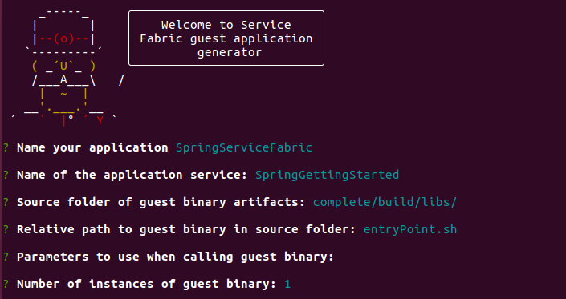
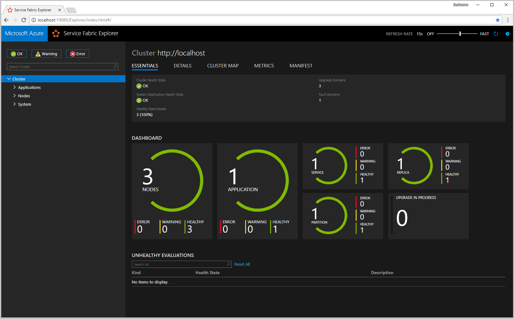
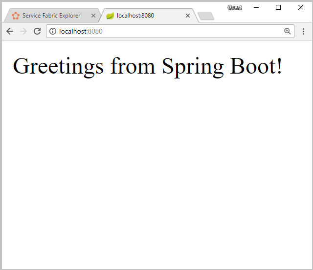
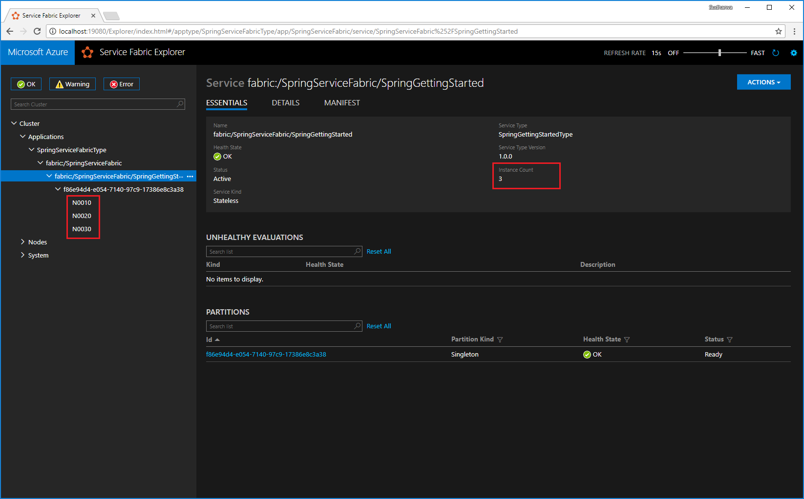
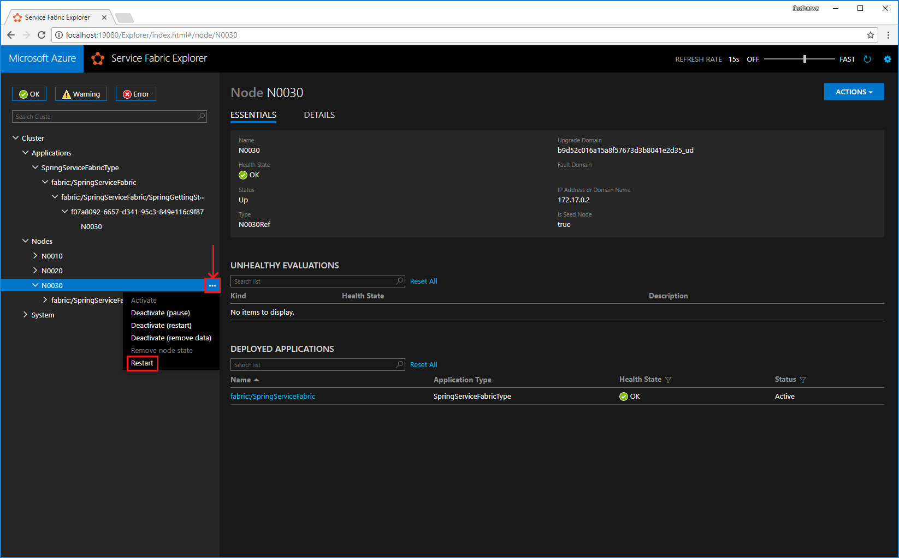
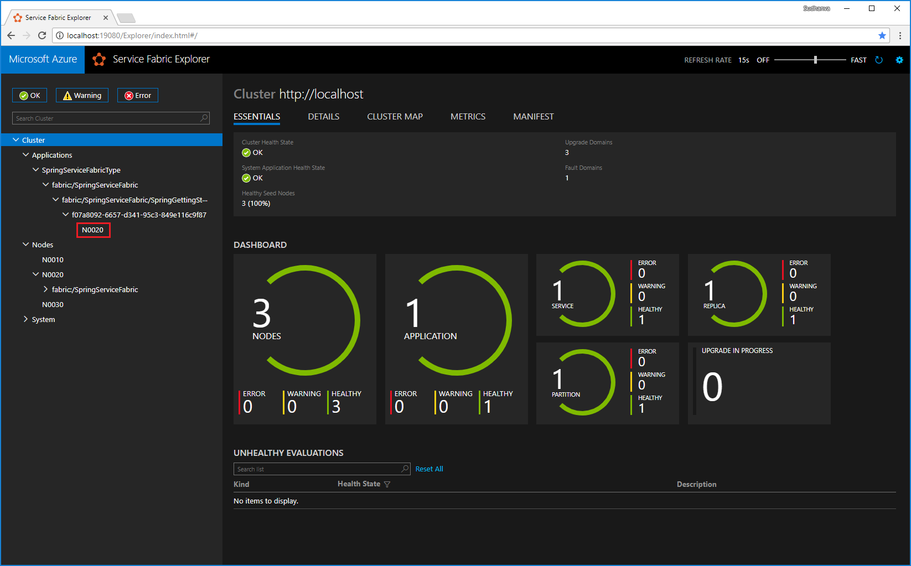

# Quickstart: Deploy a Java Spring Boot app on Azure Service Fabric

In this quickstart, you deploy a Java Spring Boot application to Azure Service Fabric by using familiar command-line tools on Linux or macOS. Azure Service Fabric is a distributed systems platform for deploying and managing microservices and containers. 

## Prerequisites

#### [Linux](#tab/linux)

- [Java environment](./service-fabric-get-started-linux.md#set-up-java-development) and [Yeoman](./service-fabric-get-started-linux.md#set-up-yeoman-generators-for-containers-and-guest-executables)
- [Service Fabric SDK & Service Fabric Command Line Interface (CLI)](./service-fabric-get-started-linux.md#installation-methods)
- [Git](https://git-scm.com/downloads)

#### [macOS](#tab/macos)

- [Java environment and Yeoman](./service-fabric-get-started-mac.md#create-your-application-on-your-mac-by-using-yeoman)
- [Service Fabric SDK & Service Fabric Command Line Interface (CLI)](./service-fabric-cli.md#cli-mac)
- [Git](https://git-scm.com/downloads)

--- 

## Download the sample

In a terminal window, run the following command to clone the Spring Boot [Getting Started](https://github.com/spring-guides/gs-spring-boot) sample app to your local machine.

```bash
git clone https://github.com/spring-guides/gs-spring-boot.git
```

## Build the Spring Boot application 
Inside the *gs-spring-boot/complete* directory, run the command below to build the application 

```bash
./gradlew build
``` 

## Package the Spring Boot application 
1. Inside the *gs-spring-boot* directory in your clone, run the `yo azuresfguest` command. 

1. Enter the following details for each prompt.

    

1. In the *SpringServiceFabric/SpringServiceFabric/SpringGettingStartedPkg/code* folder, create a file called *entryPoint.sh*. Add the following code to the *entryPoint.sh* file. 

    ```bash
    #!/bin/bash
    BASEDIR=$(dirname $0)
    cd $BASEDIR
    java -jar *spring-boot*.jar
    ```

1. Add the **Endpoints** resource in the *gs-spring-boot/SpringServiceFabric/SpringServiceFabric/SpringGettingStartedPkg/ServiceManifest.xml* file

    ```xml 
        <Resources>
          <Endpoints>
            <Endpoint Name="WebEndpoint" Protocol="http" Port="8080" />
          </Endpoints>
       </Resources>
    ```

    The *ServiceManifest.xml* now looks like this: 

    ```xml
    <?xml version="1.0" encoding="utf-8"?>
    <ServiceManifest Name="SpringGettingStartedPkg" Version="1.0.0"
                     xmlns="http://schemas.microsoft.com/2011/01/fabric" xmlns:xsd="https://www.w3.org/2001/XMLSchema" xmlns:xsi="https://www.w3.org/2001/XMLSchema-instance" >

       <ServiceTypes>
          <StatelessServiceType ServiceTypeName="SpringGettingStartedType" UseImplicitHost="true">
       </StatelessServiceType>
       </ServiceTypes>

       <CodePackage Name="code" Version="1.0.0">
          <EntryPoint>
             <ExeHost>
                <Program>entryPoint.sh</Program>
                <Arguments></Arguments>
                <WorkingFolder>CodePackage</WorkingFolder>
             </ExeHost>
          </EntryPoint>
       </CodePackage>
        <Resources>
          <Endpoints>
            <Endpoint Name="WebEndpoint" Protocol="http" Port="8080" />
          </Endpoints>
       </Resources>
     </ServiceManifest>
    ```

At this stage, you have created a Service Fabric application for the Spring Boot Getting Started sample that you can deploy to Service Fabric.

## Run the application locally

1. Start your local cluster on Ubuntu machines by running the following command:

    ```bash
    sudo /opt/microsoft/sdk/servicefabric/common/clustersetup/devclustersetup.sh
    ```

    If using a Mac, start the local cluster from the Docker image (this is assuming you have followed the [prerequisites](./service-fabric-get-started-mac.md#create-a-local-container-and-set-up-service-fabric) to set up your local cluster for Mac). 

    ```bash
    docker run --name sftestcluster -d -p 19080:19080 -p 19000:19000 -p 25100-25200:25100-25200 -p 8080:8080 mysfcluster
    ```

    The startup of the local cluster takes some time. To confirm that the cluster is fully up, access the Service Fabric Explorer at `http://localhost:19080`. The five healthy nodes indicate the local cluster is up and running. 
    
    

1. Open the *gs-spring-boot/SpringServiceFabric* folder.
1. Run the following command to connect to your local cluster.

    ```bash
    sfctl cluster select --endpoint http://localhost:19080
    ```
1. Run the *install.sh* script.

    ```bash
    ./install.sh
    ```

1. Open your favorite web browser and access the application by accessing `http://localhost:8080`.

    

You can now access the Spring Boot application that was deployed to a Service Fabric cluster.

For more information, see the Spring Boot [Getting Started](https://spring.io/guides/gs/spring-boot/) sample on the Spring website.

## Scale applications and services in a cluster

Services can be scaled across a cluster to accommodate for a change in load on the services. You scale a service by changing the number of instances running in the cluster. There are many ways of scaling your services, for example, you can use scripts or commands from Service Fabric CLI (sfctl). The following steps use Service Fabric Explorer.

Service Fabric Explorer runs in all Service Fabric clusters and can be accessed from a browser by browsing to the cluster's HTTP management port (19080); for example, `http://localhost:19080`.

To scale the web front-end service, do the following:

1. Open Service Fabric Explorer in your cluster - for example, `http://localhost:19080`.
1. Select the ellipsis (**...**) next to the **fabric:/SpringServiceFabric/SpringGettingStarted** node in the treeview and select **Scale Service**.

    

    You can now choose to scale the number of instances of the service.

1. Change the number to **3** and select **Scale Service**.

    An alternative way to scale the service using command line is as follows.

    ```bash
    # Connect to your local cluster
    sfctl cluster select --endpoint https://<ConnectionIPOrURL>:19080 --pem <path_to_certificate> --no-verify

    # Run Bash command to scale instance count for your service
    sfctl service update --service-id 'SpringServiceFabric~SpringGettingStarted' --instance-count 3 --stateless 
    ``` 

1. Select the **fabric:/SpringServiceFabric/SpringGettingStarted** node in the tree-view and expand the partition node (represented by a GUID).

    

    The service has three instances, and the tree view shows which nodes the instances run on.

Through this simple management task, you've doubled the resources available for the front-end service to process user load. It's important to understand that you don't need multiple instances of a service for it to run reliably. If a service fails, Service Fabric makes sure that a new service instance runs in the cluster.

## Fail over services in a cluster

To demonstrate service failover, a node restart is simulated by using Service Fabric Explorer. Ensure only one instance of your service is running.

1. Open Service Fabric Explorer in your cluster - for example, `http://localhost:19080`.
1. Select the ellipsis (**...**) next to the node running the instance of your service and Restart the node.

    
1. The instance of your service is moved to a different node and your application has no downtime.

    

## Next steps

In this quickstart, you learned how to:

* Deploy a Spring Boot application to Service Fabric
* Deploy the application to your local cluster
* Scale out the application across multiple nodes
* Perform failover of your service with no hit to availability

To learn more about working with Java apps in Service Fabric, continue to the tutorial for Java apps.

> [!div class="nextstepaction"]
> [Deploy a Java app](./service-fabric-tutorial-create-java-app.md)
