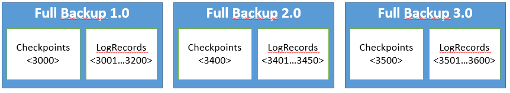
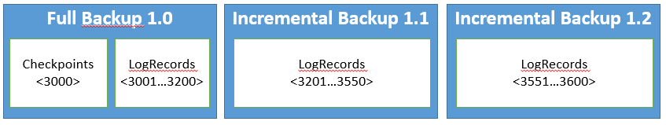

# Backup and restore Reliable Services and Reliable Actors
Azure Service Fabric is a high-availability platform that replicates the state across multiple nodes to maintain this high availability.  Thus, even if one node in the cluster fails, the services continue to be available. While this in-built redundancy provided by the platform may be sufficient for some, in certain cases it is desirable for the service to back up data (to an external store).

> [!NOTE]
> It is critical to backup and restore your data (and test that it works as expected) so you can recover from data loss scenarios.
> 

> [!NOTE]
> Microsoft recommends to use [Periodic backup and restore](service-fabric-backuprestoreservice-quickstart-azurecluster.md) for configuring data backup of Reliable Stateful services and Reliable Actors. 
> 


For example, a service may want to back up data in order to protect from the following scenarios:

- In the event of the permanent loss of an entire Service Fabric cluster.
- Permanent loss of a majority of the replicas of a service partition
- Administrative errors whereby the state accidentally gets deleted or corrupted. For example, this may happen if an administrator with sufficient privilege erroneously deletes the service.
- Bugs in the service that cause data corruption. For example, this may happen when a service code upgrade starts writing faulty data to a Reliable Collection. In such a case, both the code and the data may have to be reverted to an earlier state.
- Offline data processing. It might be convenient to have offline processing of data for business intelligence that happens separately from the service that generates the data.

The Backup/Restore feature allows services built on the Reliable Services API to create and restore backups. The backup APIs provided by the platform allow backup(s) of a service partition's state, without blocking read or write operations. The restore APIs allow a service partition's state to be restored from a chosen backup.

## Types of Backup
There are two backup options: Full and Incremental.
A full backup is a backup that contains all the data required to recreate the state of the replica: checkpoints and all log records.
Since it has the checkpoints and the log, a full backup can be restored by itself.

The problem with full backups arises when the checkpoints are large.
For example, a replica that has 16 GB of state will have checkpoints that add up approximately to 16 GB.
If we have a Recovery Point Objective of five minutes, the replica needs to be backed up every five minutes.
Each time it backs up it needs to copy 16 GB of checkpoints in addition to 50 MB (configurable using `CheckpointThresholdInMB`) worth of logs.



The solution to this problem is incremental backups, where back up only contains the changed log records since the last backup.



Since incremental backups are only changes since the last backup (does not include the checkpoints), they tend to be faster but they cannot be restored on their own.
To restore an incremental backup, the entire backup chain is required.
A backup chain is a chain of backups starting with a full backup and followed by a number of contiguous incremental backups.

## Backup Reliable Services
The service author has full control of when to make backups and where backups will be stored.

To start a backup, the service needs to invoke the inherited member function `BackupAsync`.  
Backups can be made only from primary replicas, and they require write status to be granted.

As shown below, `BackupAsync` takes in a `BackupDescription` object, where one can specify a full or incremental backup, as well as a callback function, `Func<< BackupInfo, CancellationToken, Task<bool>>>` that is invoked when the backup folder has been created locally and is ready to be moved out to some external storage.

```csharp

BackupDescription myBackupDescription = new BackupDescription(BackupOption.Incremental,this.BackupCallbackAsync);

await this.BackupAsync(myBackupDescription);

```

Request to take an incremental backup can fail with `FabricMissingFullBackupException`. This exception indicates that one of the following things is happening:

- the replica has never taken a full backup since it has become primary,
- some of the log records since the last backup has been truncated or
- replica passed the `MaxAccumulatedBackupLogSizeInMB` limit.

Users can increase the likelihood of being able to do incremental backups by configuring `MinLogSizeInMB` or `TruncationThresholdFactor`.
Increasing these values increases the per replica disk usage.
For more information, see [Reliable Services Configuration](service-fabric-reliable-services-configuration.md)

`BackupInfo` provides information regarding the backup, including the location of the folder where the runtime saved the backup (`BackupInfo.Directory`). The callback function can move the `BackupInfo.Directory` to an external store or another location.  This function also returns a bool that indicates whether it was able to successfully move the backup folder to its target location.

The following code demonstrates how the `BackupCallbackAsync` method can be used to upload the backup to Azure Storage:

```csharp
private async Task<bool> BackupCallbackAsync(BackupInfo backupInfo, CancellationToken cancellationToken)
{
    var backupId = Guid.NewGuid();

    await externalBackupStore.UploadBackupFolderAsync(backupInfo.Directory, backupId, cancellationToken);

    return true;
}
```

In the preceding example, `ExternalBackupStore` is the sample class that is used to interface with Azure Blob storage, and `UploadBackupFolderAsync` is the method that compresses the folder and places it in the Azure Blob store.

Note that:

  - There can be only one backup operation in-flight per replica at any given time. More than one `BackupAsync` call at a time will throw `FabricBackupInProgressException` to limit inflight backups to one.
  - If a replica fails over while a backup is in progress, the backup may not have been completed. Thus, once the failover finishes, it is the service's responsibility to restart the backup by invoking `BackupAsync` as necessary.

## Restore Reliable Services
In general, the cases when you might need to perform a restore operation fall into one of these categories:

  - The service partition lost data. For example, the disk for two out of three replicas for a partition (including the primary replica) gets corrupted or wiped. The new primary may need to restore data from a backup.
  - The entire service is lost. For example, an administrator removes the entire service and thus the service and the data need to be restored.
  - The service replicated corrupt application data (for example, because of an application bug). In this case, the service has to be upgraded or reverted to remove the cause of the corruption, and non-corrupt data has to be restored.

While many approaches are possible, we offer some examples on using `RestoreAsync` to recover from the above scenarios.

## Partition data loss in Reliable Services
In this case, the runtime would automatically detect the data loss and invoke the `OnDataLossAsync` API.

The service author needs to perform the following to recover:

  - Override the virtual base class method `OnDataLossAsync`.
  - Find the latest backup in the external location that contains the service's backups.
  - Download the latest backup (and uncompress the backup into the backup folder if it was compressed).
  - The `OnDataLossAsync` method provides a `RestoreContext`. Call the `RestoreAsync` API on the provided `RestoreContext`.
  - Return true if the restoration was a success.

Following is an example implementation of the `OnDataLossAsync` method:

```csharp
protected override async Task<bool> OnDataLossAsync(RestoreContext restoreCtx, CancellationToken cancellationToken)
{
    var backupFolder = await this.externalBackupStore.DownloadLastBackupAsync(cancellationToken);

    var restoreDescription = new RestoreDescription(backupFolder);

    await restoreCtx.RestoreAsync(restoreDescription);

    return true;
}
```

`RestoreDescription` passed in to the `RestoreContext.RestoreAsync` call contains a member called `BackupFolderPath`.
When restoring a single full backup, this `BackupFolderPath` should be set to the local path of the folder that contains your full backup.
When restoring a full backup and a number of incremental backups, `BackupFolderPath` should be set to the local path of the folder that not only contains the full backup, but also all the incremental backups.
`RestoreAsync` call can throw `FabricMissingFullBackupException` if the `BackupFolderPath` provided does not contain a full backup.
It can also throw `ArgumentException` if `BackupFolderPath` has a broken chain of incremental backups.
For example, if it contains the full backup, the first incremental and the third incremental backup but no the second incremental backup.

> [!NOTE]
> The RestorePolicy is set to Safe by default.  This means that the `RestoreAsync` API will fail with ArgumentException if it detects that the backup folder contains a state that is older than or equal to the state contained in this replica.  `RestorePolicy.Force` can be used to skip this safety check. This is specified as part of `RestoreDescription`.
> 

## Deleted or lost service
If a service is removed, you must first re-create the service before the data can be restored.  It is important to create the service with the same configuration, for example, partitioning scheme, so that the data can be restored seamlessly.  Once the service is up, the API to restore data (`OnDataLossAsync` above) has to be invoked on every partition of this service. One way of achieving this is by using [FabricClient.TestManagementClient.StartPartitionDataLossAsync](https://msdn.microsoft.com/library/mt693569.aspx) on every partition.  

From this point, implementation is the same as the above scenario. Each partition needs to restore the latest relevant backup from the external store. One caveat is that the partition ID may have now changed, since the runtime creates partition IDs dynamically. Thus, the service needs to store the appropriate partition information and service name to identify the correct latest backup to restore from for each partition.

> [!NOTE]
> It is not recommended to use `FabricClient.ServiceManager.InvokeDataLossAsync` on each partition to restore the entire service, since that may corrupt your cluster state.
> 

## Replication of corrupt application data
If the newly deployed application upgrade has a bug, that may cause corruption of data. For example, an application upgrade may start to update every phone number record in a Reliable Dictionary with an invalid area code.  In this case, the invalid phone numbers will be replicated since Service Fabric is not aware of the nature of the data that is being stored.

The first thing to do after you detect such an egregious bug that causes data corruption is to freeze the service at the application level and, if possible, upgrade to the version of the application code that does not have the bug.  However, even after the service code is fixed, the data may still be corrupt, and thus data may need to be restored.  In such cases, it may not be sufficient to restore the latest backup, since the latest backups may also be corrupt.  Thus, you have to find the last backup that was made before the data got corrupted.

If you are not sure which backups are corrupt, you could deploy a new Service Fabric cluster and restore the backups of affected partitions just like the above "Deleted or lost service" scenario.  For each partition, start restoring the backups from the most recent to the least. Once you find a backup that does not have the corruption, move/delete all backups of this partition that were more recent (than that backup). Repeat this process for each partition. Now, when `OnDataLossAsync` is called on the partition in the production cluster, the last backup found in the external store will be the one picked by the above process.

Now, the steps in the "Deleted or lost service" section can be used to restore the state of the service to the state before the buggy code corrupted the state.

Note that:

  - When you restore, there is a chance that the backup being restored is older than the state of the partition before the data was lost. Because of this, you should restore only as a last resort to recover as much data as possible.
  - The string that represents the backup folder path and the paths of files inside the backup folder can be greater than 255 characters, depending on the FabricDataRoot path and Application Type name's length. This can cause some .NET methods, like `Directory.Move`, to throw the `PathTooLongException` exception. One workaround is to directly call kernel32 APIs, like `CopyFile`.

## Back up and restore Reliable Actors


Reliable Actors Framework is built on top of Reliable Services. The ActorService, which hosts the actor(s) is a stateful reliable service. Hence, all the backup and restore functionality available in Reliable Services is also available to Reliable Actors (except behaviors that are state provider specific). Since backups will be taken on a per-partition basis, states for all actors in that partition will be backed up (and restoration is similar and will happen on a per-partition basis). To perform backup/restore, the service owner should create a custom actor service class that derives from ActorService class and then do backup/restore similar to Reliable Services as described above in previous sections.

```csharp
class MyCustomActorService : ActorService
{
    public MyCustomActorService(StatefulServiceContext context, ActorTypeInformation actorTypeInfo)
          : base(context, actorTypeInfo)
    {
    }
    
    //
    // Method overrides and other code.
    //
}
```

When you create a custom actor service class, you need to register that as well when registering the actor.

```csharp
ActorRuntime.RegisterActorAsync<MyActor>(
    (context, typeInfo) => new MyCustomActorService(context, typeInfo)).GetAwaiter().GetResult();
```

The default state provider for Reliable Actors is `KvsActorStateProvider`. Incremental backup is not enabled by default for `KvsActorStateProvider`. You can enable incremental backup by creating `KvsActorStateProvider` with the appropriate setting in its constructor and then passing it to ActorService constructor as shown in following code snippet:

```csharp
class MyCustomActorService : ActorService
{
    public MyCustomActorService(StatefulServiceContext context, ActorTypeInformation actorTypeInfo)
          : base(context, actorTypeInfo, null, null, new KvsActorStateProvider(true)) // Enable incremental backup
    {
    }
    
    //
    // Method overrides and other code.
    //
}
```

After incremental backup has been enabled, taking an incremental backup can fail with FabricMissingFullBackupException for one of following reasons and you will need to take a full backup before taking incremental backup(s):

  - The replica has never taken a full backup since it became primary.
  - Some of the log records were truncated since last backup was taken.

When incremental backup is enabled, `KvsActorStateProvider` does not use circular buffer to manage its log records and periodically truncates it. If no backup is taken by user for a period of 45 minutes, the system automatically truncates the log records. This interval can be configured by specifying `logTruncationIntervalInMinutes` in `KvsActorStateProvider` constructor (similar to when enabling incremental backup). The log records may also get truncated if primary replica needs to build another replica by sending all its data.

When doing restore from a backup chain, similar to Reliable Services, the BackupFolderPath should contain subdirectories with one subdirectory containing full backup and others subdirectories containing incremental backup(s). The restore API will throw FabricException with appropriate error message if the backup chain validation fails. 

> [!NOTE]
> `KvsActorStateProvider` currently ignores the option RestorePolicy.Safe. Support for this feature is planned in an upcoming release.
> 

## Testing Back up and Restore
It is important to ensure that critical data is being backed up, and can be restored from. This can be done by invoking the `Start-ServiceFabricPartitionDataLoss` cmdlet in PowerShell that can induce data loss in a particular partition to test whether the data backup and restore functionality for your service is working as expected.  It is also possible to programmatically invoke data loss and restore from that event as well.

> [!NOTE]
> You can find a sample implementation of backup and restore functionality in the Web Reference App on GitHub. Please look at the `Inventory.Service` service for more details.
> 
> 

## Under the hood: more details on backup and restore
Here's some more details on backup and restore.

### Backup
The Reliable State Manager provides the ability to create consistent backups without blocking any read or write operations. To do so, it utilizes a checkpoint and log persistence mechanism.  The Reliable State Manager takes fuzzy (lightweight) checkpoints at certain points to relieve pressure from the transactional log and improve recovery times.  When `BackupAsync` is called, the Reliable State Manager instructs all Reliable objects to copy their latest checkpoint files to a local backup folder.  Then, the Reliable State Manager copies all log records, starting from the "start pointer" to the latest log record into the backup folder.  Since all the log records up to the latest log record are included in the backup and the Reliable State Manager preserves write-ahead logging, the Reliable State Manager guarantees that all transactions that are committed (`CommitAsync` has returned successfully) are included in the backup.

Any transaction that commits after `BackupAsync` has been called may or may not be in the backup.  Once the local backup folder has been populated by the platform (that is, local backup is completed by the runtime), the service's backup callback is invoked.  This callback is responsible for moving the backup folder to an external location such as Azure Storage.

### Restore
The Reliable State Manager provides the ability to restore from a backup by using the `RestoreAsync` API.  
The `RestoreAsync` method on `RestoreContext` can be called only inside the `OnDataLossAsync` method.
The bool returned by `OnDataLossAsync` indicates whether the service restored its state from an external source.
If the `OnDataLossAsync` returns true, Service Fabric will rebuild all other replicas from this primary. Service Fabric ensures that replicas that will receive `OnDataLossAsync` call first transition to the primary role but are not granted read status or write status.
This implies that for StatefulService implementers, `RunAsync` will not be called until `OnDataLossAsync` finishes successfully.
Then, `OnDataLossAsync` will be invoked on the new primary.
Until a service completes this API successfully (by returning true or false) and finishes the relevant reconfiguration, the API will keep being called one at a time.

`RestoreAsync` first drops all existing state in the primary replica that it was called on. 
Then the Reliable State Manager creates all the Reliable objects that exist in the backup folder. 
Next, the Reliable objects are instructed to restore from their checkpoints in the backup folder. 
Finally, the Reliable State Manager recovers its own state from the log records in the backup folder and performs recovery. 
As part of the recovery process, operations starting from the "starting point" that have committed log records in the backup folder are replayed to the Reliable objects. This step ensures that the recovered state is consistent.

## Next steps
  - [Reliable Collections](service-fabric-work-with-reliable-collections.md)
  - [Reliable Services quickstart](service-fabric-reliable-services-quick-start.md)
  - [Reliable Services notifications](service-fabric-reliable-services-notifications.md)
  - [Reliable Services configuration](service-fabric-reliable-services-configuration.md)
  - [Developer reference for Reliable Collections](https://msdn.microsoft.com/library/azure/microsoft.servicefabric.data.collections.aspx)
  - [Periodic backup and restore in Azure Service Fabric](service-fabric-backuprestoreservice-quickstart-azurecluster.md)

