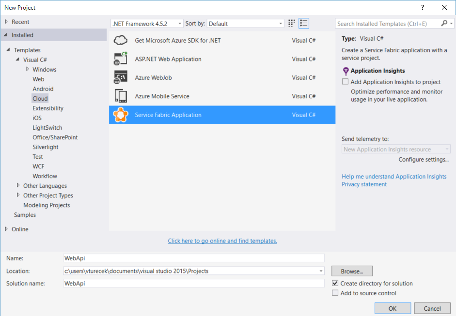
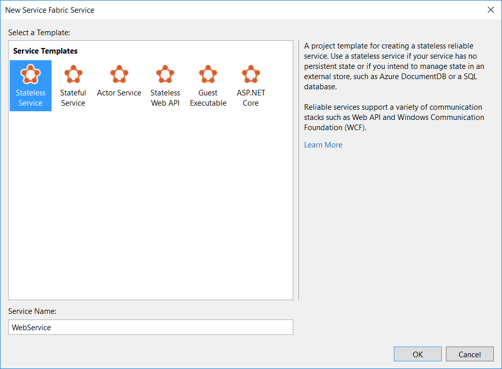
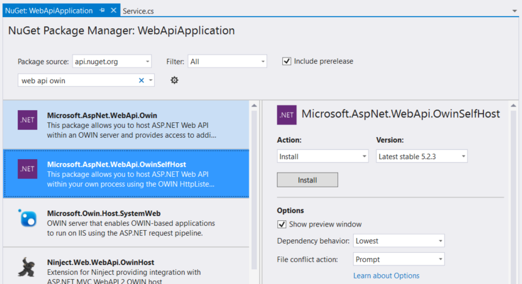
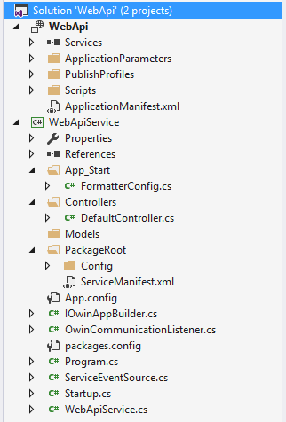
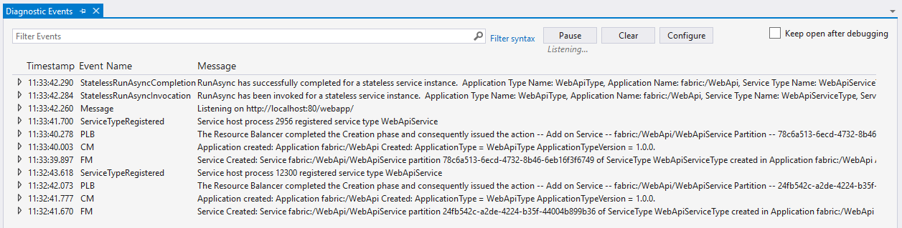

<properties
   pageTitle="Service communication with ASP.NET Web API | Microsoft Azure"
   description="Learn how to implement service communication step-by-step using ASP.NET Web API with OWIN self-hosting in the Reliable Services API."
   services="service-fabric"
   documentationCenter=".net"
   authors="vturecek"
   manager="timlt"
   editor=""/>

<tags
   ms.service="service-fabric"
   ms.devlang="dotnet"
   ms.topic="article"
   ms.tgt_pltfrm="na"
   ms.workload="required"
   ms.date="11/13/2015"
   ms.author="vturecek"/>

# Getting Started with Microsoft Azure Service Fabric Web API services with OWIN self-host

Service Fabric puts the power in your hands when deciding how you want your services to communicate with users and with each other. This tutorial focuses on implementing service communication using ASP.NET Web API with OWIN self-hosting in Service Fabric's *Reliable Services* API. We'll go in depth into the *Reliable Services* pluggable communication API and show you step-by-step how to set up a custom communication listener for you service with Web API used as an example. To see a complete example of a Web API communication listener, check out the [Service Fabric WebApplication sample on GitHub](https://github.com/Azure/servicefabric-samples/tree/master/samples/Services/VS2015/WebApplication).


## Intro to Web API in Service Fabric

ASP.NET Web API is a popular and powerful framework for building HTTP APIs on top of the .NET Framework. Head on over to [www.asp.net/webapi](http://www.asp.net/web-api/overview/getting-started-with-aspnet-web-api/tutorial-your-first-web-api) to learn more about Web API if you're not familiar with it already.

Web API in Service Fabric is the same ASP.NET Web API you know and love. The difference is in how you *host* a Web API application (hint: you won't be using IIS). To better understand the difference, let's break it into two parts:

 1. The Web API application (your controllers, models, etc.)
 2. The host (the web server, usually IIS)

The Web API application itself doesn't change here - it's no different from Web API applications you may have written in the past, and you should be able to simply move most of your application code right over. Hosting the application may be a little different from what you're used to if you're used to hosting on IIS. But before we get into the hosting part, let's start with the more familiar part: the Web API application.


## Create the application

Start by creating a new Service Fabric application, with a single stateless service, in Visual Studio 2015:





This gives us an empty Stateless Service that will host the Web API application. We're going to set the application up from scratch to see how it's all put together.

The first step is to pull in some NuGet packages for Web API. The package we want to use is **Microsoft.AspNet.WebApi.OwinSelfHost**. This package includes all the necessary Web API packages and the *host* packages - this will be important later.



With the packages installed, we can begin building out the basic Web API project structure. If you've used  Web API, the project structure should look very familiar. Start by creating the basic Web API directories:

 + App_Start
 + Controllers
 + Models

Add the basic Web API configuration classes in the App_Start directory. For now we'll just add an empty media type formatter config:

 + FormatterConfig.cs

```csharp

namespace WebApiService
{
    using System.Net.Http.Formatting;

    public static class FormatterConfig
    {
        public static void ConfigureFormatters(MediaTypeFormatterCollection formatters)
        {
        }
    }
}

```

Add a default controller in the Controllers directory:

 + DefaultController.cs

```csharp

namespace WebApiService.Controllers
{
    using System.Collections.Generic;
    using System.Web.Http;

    [RoutePrefix("api")]
    public class DefaultController : ApiController
    {
        // GET api/values
        [Route("values")]
        public IEnumerable<string> Get()
        {
            return new string[] { "value1", "value2" };
        }

        // GET api/values/5
        [Route("values/{id}")]
        public string Get(int id)
        {
            return "value";
        }

        // POST api/values
        [Route("values")]
        public void Post([FromBody]string value)
        {
        }

        // PUT api/values/5
        [Route("values/{id}")]
        public void Put(int id, [FromBody]string value)
        {
        }

        // DELETE api/values/5
        [Route("values/{id}")]
        public void Delete(int id)
        {
        }
    }
}

```

Finally, add a Startup class at the project root to register the routing, formatters, and any other configuration setup. This is also where Web API plugs in to the *host*, which will be revisited again later. While setting up the Startup class, create an interface called *IOwinAppBuilder* for the Startup class that defines the Configuration method. Although not technically required for Web API to work, it will allow more flexible use of the Startup class later.

 + Startup.cs

```csharp

namespace WebApiService
{
    using Owin;
    using System.Web.Http;

    public class Startup : IOwinAppBuilder
    {
        public void Configuration(IAppBuilder appBuilder)
        {
            HttpConfiguration config = new HttpConfiguration();

            config.MapHttpAttributeRoutes();
            FormatterConfig.ConfigureFormatters(config.Formatters);

            appBuilder.UseWebApi(config);
        }
    }
}

```

 + IOwinAppBuilder.cs

```csharp

namespace WebApiService
{
    using Owin;

    public interface IOwinAppBuilder
    {
        void Configuration(IAppBuilder appBuilder);
    }
}

```

That's it for the application part. At this point we've just set up the basic Web API project layout. Compared to Web API projects you may have written in the past or to the basic Web API template, it shouldn't look much different so far. Your business logic goes in the controllers and models as usual.

Now what do we do about hosting so we can actually run it?


## Service Hosting

In Service Fabric, your service runs in a *service host process* - an executable that runs your service code. When writing a service using the Reliable Services API, and in fact in most cases when you're writing a service on Service Fabric in .NET, your service project just compiles to an .EXE that registers your service type and runs your code. In fact, if you open **Program.cs** in the stateless service project, you should see:

```csharp

public class Program
{
    public static void Main(string[] args)
    {
        try
        {
            using (FabricRuntime fabricRuntime = FabricRuntime.Create())
            {
                fabricRuntime.RegisterServiceType("WebApiServiceType", typeof(Service));

                Thread.Sleep(Timeout.Infinite);
            }
        }
        catch (Exception e)
        {
            ServiceEventSource.Current.ServiceHostInitializationFailed(e);
            throw;
        }
    }
}

```

If that looks suspiciously like the entry point to a console application, that's because it is.

Details about the service host process and service registration is beyond the scope of this article, but it's important to know for now that **your service code is running in its own process**.

## Self-hosting Web API with an OWIN host

Given that your Web API application code is hosted in its own process, how do we hook it up to a web server? Enter [OWIN](http://owin.org/). OWIN is simply a contract between .NET web applications and web servers. Traditionally with ASP.NET - up to MVC 5 - the web application was tightly coupled to IIS through System.Web. However, Web API implements OWIN, which allows you to write a web application that is decoupled from the web server that hosts it. This allows you to use a *self-host* OWIN web server that you can start in your own process, which fits perfectly in the Service Fabric hosting model we just described.

In this article, we'll use Katana as the OWIN host for the Web API application. Katana is an open-source OWIN host implementation.

> [AZURE.NOTE] To learn more about Katana, head over to the [Katana site](http://www.asp.net/aspnet/overview/owin-and-katana/an-overview-of-project-katana), and for a quick overview of how to use Katana to self-host Web API, check out this article on how to [Use OWIN to Self-Host ASP.NET Web API 2](http://www.asp.net/web-api/overview/hosting-aspnet-web-api/use-owin-to-self-host-web-api).


## Set up the web server

The Reliable Services API provides a communication entry point where you can plug in communication stacks to allow users and clients to connect to the service:

```csharp

protected override IEnumerable<ServiceInstanceListener> CreateServiceInstanceListeners()
{
    ...
}

```

The web server - and any other communication stack you may use in the future, such as WebSockets - should use the ICommunicationListener interface to correctly integrate with the system. The reasons for this will become more apparent in the following steps.

First create a class called OwinCommunicationListener that implements ICommunicationListener:

 + OwinCommunicationListener.cs:

```csharp

namespace WebApi
{
    using System;
    using System.Fabric;
    using System.Fabric.Description;
    using System.Globalization;
    using System.Threading;
    using System.Threading.Tasks;
    using Microsoft.Owin.Hosting;
    using Microsoft.ServiceFabric.Services.Communication.Runtime;

    public class OwinCommunicationListener : ICommunicationListener
    {
        public void Abort()
        {
        }

        public Task CloseAsync(CancellationToken cancellationToken)
        {
        }

        public Task<string> OpenAsync(CancellationToken cancellationToken)
        {
        }
    }
}

```

The ICommunicationListener interface provides three methods to manage a communication listener for your service:

 + **OpenAsync**: start listening for requests.
 + **CloseAsync**: stop listening for requests, finish any in-flight requests, and shut down gracefully.
 + **Abort**: cancel everything and stop immediately.

To get started, add private class members for a URL path prefix and the **Startup** class that was created earlier. These will be initialized through the constructor and used later when setting up the listening URL. Also add private class members to save the listening address and the server handle that are created during initialization and later when the server is started, respectively.

```csharp

public class OwinCommunicationListener : ICommunicationListener
{
    private readonly IOwinAppBuilder startup;
    private readonly string appRoot;
    private IDisposable serverHandle;
    private string listeningAddress;
    private readonly ServiceInitializationParameters serviceInitializationParameters;

    public OwinCommunicationListener(string appRoot, IOwinAppBuilder startup, ServiceInitializationParameters serviceInitializationParameters)
    {
        this.startup = startup;
        this.appRoot = appRoot;
        this.serviceInitializationParameters = serviceInitializationParameters;
    }        

    ...

```

### Implementation

To set up the web server, we need a couple pieces of information:

 + **A URL path prefix**. Although optional, it's good to set this up now so you can safely host multiple web services in your application.
 + **A port**.

Before we grab a port for the web server, it's important to understand that Service Fabric provides an application layer that acts as a buffer between your application and the underlying operating system that it runs on. As such, Service Fabric provides a way to configure *endpoints* for your services. Service Fabric takes care of making sure the endpoint is available for your service to use so that you don't have to configure it yourself with the underlying OS environment. This allows you to easily host your Service Fabric application in different environments without having to make any changes to your application (for example, you can host the same application in Azure or in your own data center).

Configure an HTTP endpoint in PackageRoot\ServiceManifest.xml:

```xml

<Resources>
    <Endpoints>
        <Endpoint Name="ServiceEndpoint" Type="Input" Protocol="http" Port="80" />
    </Endpoints>
</Resources>

```

This step is important because the service host process runs under restricted credentials (Network Service on Windows), which means your service won't have access to set up an HTTP endpoint on its own. By using the endpoint configuration, Service Fabric knows to set up the proper ACL for the URL that the service will listen on while providing a standard place to configure endpoints.


Back in OwinCommunicationListener.cs, we can start implementing OpenAsync. This is where we start the web server. First, get the endpoint information and create the URL that the service will listen on.

```csharp

public Task<string> OpenAsync(CancellationToken cancellationToken)
{
    EndpointResourceDescription serviceEndpoint = serviceInitializationParameters.CodePackageActivationContext.GetEndpoint("ServiceEndpoint");
    int port = serviceEndpoint.Port;

    this.listeningAddress = String.Format(
        CultureInfo.InvariantCulture,
        "http://+:{0}/{1}",
        port,
        String.IsNullOrWhiteSpace(this.appRoot)
            ? String.Empty
            : this.appRoot.TrimEnd('/') + '/');
    ...

```

Note that "http://+" is used here. This is to make sure the web server is listening on all available addresses, including localhost, FQDN, and the machine IP.

Implementing OpenAsync is one of the most important reasons why the web server (or any communication stack) is implemented as an ICommunicationListener rather than just opening it directly from RunAsync() in the Service. The return value from OpenAsync is the address that the web server is listening on. When this address is returned to the system, it registers the address with the service. Service Fabric provides an API that allows clients or other services to then ask for this address by service name. This is important because  the service address is not static as services are moved around in the cluster for resource balancing and availability purposes. This is the mechanism that allows clients to resolve the listening address for a service.

With that in mind, OpenAsync starts the web server and return the address it's listening on. Note that it listens on "http://+", but before returning the address, the "+" is replaced with the IP or FQDN of the node it is currently on. The reason for this is that this address that is being returned by the method is what's registered with the system, and it's what clients and other service will see when they ask for the service's address. For clients to correctly connect to it, they need an actual IP or FQDN in the address.

```csharp

    ...

    this.serverHandle = WebApp.Start(this.listeningAddress, appBuilder => this.startup.Configuration(appBuilder));
    string publishAddress = this.listeningAddress.Replace("+", FabricRuntime.GetNodeContext().IPAddressOrFQDN);

    ServiceEventSource.Current.Message("Listening on {0}", publishAddress);

    return Task.FromResult(publishAddress);
}

```

Note that this references the **Startup** class that was passed in to the OwinCommunicationListener in the constructor. This Startup instance is used by the web server to bootstrap the Web API application.

The ServiceEventSource.Current.Message() line will appear in the diagnostics event window later when you run the application to let you know the web server has started successfully.

### CloseAsync and Abort

Finally, implement both CloseAsync and Abort to stop the web server. The web server can be stopped by disposing the server handle that was created during OpenAsync.

```csharp

public Task CloseAsync(CancellationToken cancellationToken)
{
    this.StopWebServer();

    return Task.FromResult(true);
}

public void Abort()
{
    this.StopWebServer();
}

private void StopWebServer()
{
    if (this.serverHandle != null)
    {
        try
        {
            this.serverHandle.Dispose();
        }
        catch (ObjectDisposedException)
        {
            // no-op
        }
    }
}

```

In this example implementation, both CloseAsync and Abort simply stop the web server. You may opt to perform a more gracefully coordinated shut down of the web server in CloseAsync; for example, waiting for in-flight requests to complete before returning.

## Start the web server

You're now ready to create and return an instance of OwinCommunicationListener to start the web server. Back in the Service class (Service.cs), override the **CreateServiceInstanceListeners()** method:

```csharp

protected override IEnumerable<ServiceInstanceListener> CreateServiceInstanceListeners()
{
    return new[]
    {
        new ServiceInstanceListener(initParams => new OwinCommunicationListener("webapp", new Startup(), initParams))
    };
}

```

This is where the Web API *application* and the OWIN *host* finally meet: The *host* (**OwinCommunicationListener**) is given an instance of the *application* (Web API via **Startup**), and Service Fabric manages its lifecycle. This same pattern can typically be followed with any communication stack.

## Putting it all together

In this example, you don't need to do anything in the RunAsync() method, so that override can simply be removed.

The final Service implementation should be very simple, as it only needs to create the communication listener:

```csharp

namespace WebApiService
{
    using System.Collections.Generic;
    using Microsoft.ServiceFabric.Services.Communication.Runtime;
    using Microsoft.ServiceFabric.Services.Runtime;

    public class WebApiService : StatelessService
    {
        protected override IEnumerable<ServiceInstanceListener> CreateServiceInstanceListeners()
        {
            return new[]
            {
                new ServiceInstanceListener(initParams => new OwinCommunicationListener("webapp", new Startup(), initParams))
            };
        }
    }
}

```

And the complete `OwinCommunicationListener` class:

```csharp

namespace WebApiService
{
    using System;
    using System.Fabric;
    using System.Fabric.Description;
    using System.Globalization;
    using System.Threading;
    using System.Threading.Tasks;
    using Microsoft.Owin.Hosting;
    using Microsoft.ServiceFabric.Services.Communication.Runtime;

    public class OwinCommunicationListener : ICommunicationListener
    {
        private readonly IOwinAppBuilder startup;
        private readonly string appRoot;
        private readonly ServiceInitializationParameters serviceInitializationParameters;
        private IDisposable serverHandle;
        private string listeningAddress;
        
        public OwinCommunicationListener(string appRoot, IOwinAppBuilder startup, ServiceInitializationParameters serviceInitializationParameters)
        {
            this.startup = startup;
            this.appRoot = appRoot;
            this.serviceInitializationParameters = serviceInitializationParameters;
        }

        public Task<string> OpenAsync(CancellationToken cancellationToken)
        {
            EndpointResourceDescription serviceEndpoint = serviceInitializationParameters.CodePackageActivationContext.GetEndpoint("ServiceEndpoint");
            int port = serviceEndpoint.Port;

            this.listeningAddress = String.Format(
                CultureInfo.InvariantCulture,
                "http://+:{0}/{1}",
                port,
                String.IsNullOrWhiteSpace(this.appRoot)
                    ? String.Empty
                    : this.appRoot.TrimEnd('/') + '/');

            this.serverHandle = WebApp.Start(this.listeningAddress, appBuilder => this.startup.Configuration(appBuilder));
            string publishAddress = this.listeningAddress.Replace("+", FabricRuntime.GetNodeContext().IPAddressOrFQDN);

            ServiceEventSource.Current.Message("Listening on {0}", publishAddress);

            return Task.FromResult(publishAddress);
        }

        public Task CloseAsync(CancellationToken cancellationToken)
        {
            ServiceEventSource.Current.Message("Close");

            this.StopWebServer();

            return Task.FromResult(true);
        }

        public void Abort()
        {
            ServiceEventSource.Current.Message("Abort");

            this.StopWebServer();
        }

        private void StopWebServer()
        {
            if (this.serverHandle != null)
            {
                try
                {
                    this.serverHandle.Dispose();
                }
                catch (ObjectDisposedException)
                {
                    // no-op
                }
            }
        }
    }
}

```

With all the pieces in place, your project should now look like a typical Web API application with the Reliable Services API entry points and an OWIN host:




## Run and connect through a web browser

If you haven't done so, [set up your development environment](service-fabric-get-started.md).


You can now build and deploy your service. Press **F5** in Visual Studio to build and deploy the application. In the Diagnostics Events window, you should see a message indicating the web server opened on **http://localhost:80/webapp/api**




> [AZURE.NOTE] If the port is already be open by another process on your machine, you may see an error here indicating the listener couldn't be opened. If that's the case, try using a different port in the Endpoint configuration in ServiceManifest.xml.


Once the service is running, open a browser and navigate to [http://localhost/webapp/api/values](http://localhost/webapp/api/values) to test it out.

## Scale it out

Scaling out stateless web apps typically means adding more machines and spinning up the web app on them. Service Fabric's orchestration engine can do this for you whenever new nodes are added to a cluster. When creating instances of a stateless service, you can specify the number of instances you want to create. Service Fabric will place that number of instances on nodes in the cluster accordingly, making sure not to create more than one instance on any one node. You can also instruct Service Fabric to always create an instance on every node by specifying "-1" for the instance count. This guarantees that whenever you add nodes to scale out your cluster, an instance of your stateless service will be created on the new nodes. This value is a property of the service instance, so it is set when creating a service instance either through PowerShell:

```powershell

New-ServiceFabricService -ApplicationName "fabric:/WebServiceApplication" -ServiceName "fabric:/WebServiceApplication/WebService" -ServiceTypeName "WebServiceType" -Stateless -PartitionSchemeSingleton -InstanceCount -1

```

Or when defining a default service in a Visual Studio Stateless Service project:

```xml

<DefaultServices>
  <Service Name="WebService">
    <StatelessService ServiceTypeName="WebServiceType" InstanceCount="-1">
      <SingletonPartition />
    </StatelessService>
  </Service>
</DefaultServices>

```

For more information on creating application and service instances, see [how to deploy and remove applications](service-fabric-deploy-remove-applications.md).

## ASP.NET 5

In ASP.NET 5, the concept and programming model of separating the *application* from the *host* in web applications remains the same. It can also be applied to other forms of communication. In addition, although the *host* may differ in ASP.NET 5, the Web API *application* layer remains the same, which is where the bulk of application logic actually lives.

## Next Steps

[Debugging your Service Fabric Application in Visual Studio](service-fabric-debugging-your-application.md)
