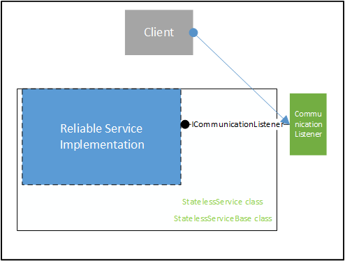

<properties
   pageTitle="Service Fabric Reliable Service Architecture"
   description="High-level overview of the reliable service architecture"
   services="service-fabric"
   documentationCenter=".net"
   authors="AlanWarwick"
   manager="timlt"
   editor=""/>

<tags
   ms.service="Service-Fabric"
   ms.devlang="dotnet"
   ms.topic="article"
   ms.tgt_pltfrm="NA"
   ms.workload="NA"
   ms.date="04/13/2015"
   ms.author="alanwar"/>

# Reliable Service Architecture

A Service Fabric Reliable Service may be stateful or stateless. Each type of service runs within a specific architecture described in this article.
See [Reliable Service Overview](../Service-Fabric/service-fabric-reliable-services-introduction.md) for more information about the differences between stateful and stateless services.

## Stateful Reliable Service

### Stateful Reliable Service Architecture Diagram

### Stateful Reliable Service

A stateful reliable service can derive from either the StatefulService or StatefulServiceBase class. Both of these base classes are provided by Service Fabric and
provide various levels of support and abstraction for your stateful service to interface with Service Fabric, and to participate as a service within the Service Fabric Cluster.
StatefulService derives from StatefulServiceBase; StatefulServiceBase offers services more flexibility but requires more understanding of the internals of Service Fabric.
See [Reliable Service Overview](../Service-Fabric/service-fabric-reliable-services-introduction.md) and [Reliable Service Advanced Usage](../Service-Fabric/service-fabric-reliable-services-advanced-usage.md) for more information on the specifics
of writing services using StatefulService and StatefulServiceBase classes.

Both base classes manage the lifetime and role of the service implementation. The service implementation may override virtual methods of either base class if the service implementation has work to do
at those points in the service implementation lifecycle or if it wants to create a communication listener object. Note that although a service implementation
may implement its own communication listener object exposing ICommunicationListener, in the diagram above, the communication listener is
implemented by Service Fabric as the service implementation uses a communication listener implemented by Service Fabric.

Your stateful reliable service uses the reliable state manager to take advantage of reliable collections. Reliable collections are local data structures that are highly available to your service,
that is, are always available regardless of service failovers. Each type of reliable collection is implemented by a reliable state provider.
For more information on reliable collections see [the Reliable Collections overview](service-fabric-reliable-services-reliable-collections.md)

### Reliable State Manager And Providers

The reliable state manager is the object that manages reliable state providers and has functionality to create, delete, enumerate and ensure that the reliable state providers are
persisted and highly available. A reliable state provider instance represents an instance of a persisted and highly available data structure such as a
dictionary or a queue. Each reliable state provider exposes an interface that is used by your stateful service to interact with the reliable state provider. For example
IReliableDictionary is used to interface with the reliable dictionary while IReliableQueue is used to interface with the reliable queue. All reliable state providers implement the
IReliableState interface.

The reliable state manager has an interface named IReliableStateManager which allows access to it by the stateful service implementation. Interfaces to reliable state providers
are returned through IReliableStateManager.  

The reliable state manager is architected with a dynamic plug-in architecture so that new types of reliable collections can be plugged in dynamically.

The reliable dictionary and reliable queue are built upon the implementation of a high performance versioned differential store.

### Transactional Replicator

The transactional replicator component is responsible for ensuring that the state of the your service, that is the state within the reliable state manager and the reliable collections,
is consistent across all replicas running your service and that state is also persisted in the log. The reliable state manager interfaces with the transactional replicator
via a private mechanism.

The transactional replicator uses a network protocol to communicate state with other replicas of the service instance so that all replicas have up to date state information.

The transactional replicator uses a log to persist state information so that the state information survives process or node crashes. The interface to the log is via a private mechanism.

### Log

The log component provides a high performance persistent store that can be optimized for writing to spinning or solid state disks and also optimized for most efficient use of disk space. The design
of the log is for the persistent storage (ie, hard disks)
to be local to the nodes that are running your stateful service to allow for low latencies and high throughput as compared to persistent storage that is not local to the node.

The log component uses two types of log files. There is a node-wide shared log file which should be on a disk that is only used for that log file. This file is placed in the Service Fabric node
work directory. Each replica for your service also has a dedicated log file and is placed within the service's work directory. The shared log is a transitional area for the state information
while the dedicated log file is its ultimate destination where it is persisted. In this design the state information is first written to the shared log file and then lazily destaged to the dedicated log
file in the background. In this way the write to the shared log would have the lowest latency and highest throughput to allow the service to make progress faster.

However when the log component is configured for optimizing for solid state disks using the OptimizeForLocalSSD setting, the state information is written directly to the dedicated
log file and bypasses the shared log file. Since solid state disks do not suffer from delays due to head movement contention, there is no penalty for writing directly to the dedicated log file.

When the log component is optimized to minimize the use of disk space using the OptimizeLogForLowerDiskUsage, the dedicated log files are created as NTFS sparse files.  Since log files typically
are not always completely full of state information, the use of sparse files allows overprovisioning of the disk space available to more replicas. If not configured in this way the log file space
is preallocated and the log component can write directly to the file with the highest performance.

Aside from a minimal user mode interface to the log, the log is written as a kernel mode driver. By running as a kernel mode driver the log can provide the highest performance to all services that
use it.

For more information about configuring the log see [configuring stateful Reliable Services](../Service-Fabric/service-fabric-reliable-services-configuration.md).

## Stateless Reliable Service

### Stateless Reliable Service Architecture Diagram

### Stateless Reliable Service

Stateless service implementations derive from the StatelessService or StatelessServiceBase class where the StatelessServiceBase class allows more flexibility than the StatelessService.
Both base classes manages the lifetime and role of the your service. The service implementation may override virtual methods of either base class if your service has work to do
at those points in the service lifecycle or if it wants to create a communication listener object. Note that although your service may implement its own communication
listener object exposing ICommunicationListener, in the diagram above, the communication listener is implemented by Service Fabric as that service implementation uses a
communication listener implemented by Service Fabric.

See [Reliable Service Overview](../Service-Fabric/service-fabric-reliable-services-introduction.md) and [Reliable Service Advanced Usage](../Service-Fabric/service-fabric-reliable-services-advanced-usage.md) for more information on the specifics
of writing services using StatelessService and StatelessServiceBase classes.

<!--Every topic should have next steps and links to the next logical set of content to keep the customer engaged-->
## Next steps

For more information about Service Fabric, see:

[Reliable Service Overview](../Service-Fabric/service-fabric-reliable-services-introduction.md)

[Quick Start](service-fabric-reliable-services-quick-start.md)

[Reliable Collections Overview](service-fabric-reliable-services-reliable-collections.md)

[Reliable Service Advanced Usage](../Service-Fabric/service-fabric-reliable-services-advanced-usage.md)

[Reliable Service Configuration](../Service-Fabric/service-fabric-reliable-services-configuration.md)  
 