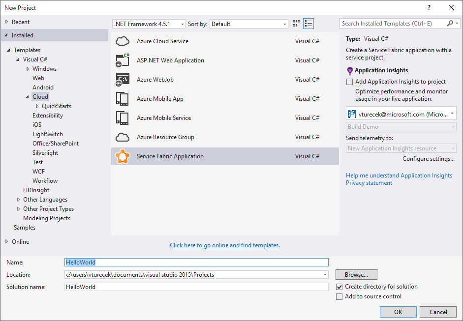
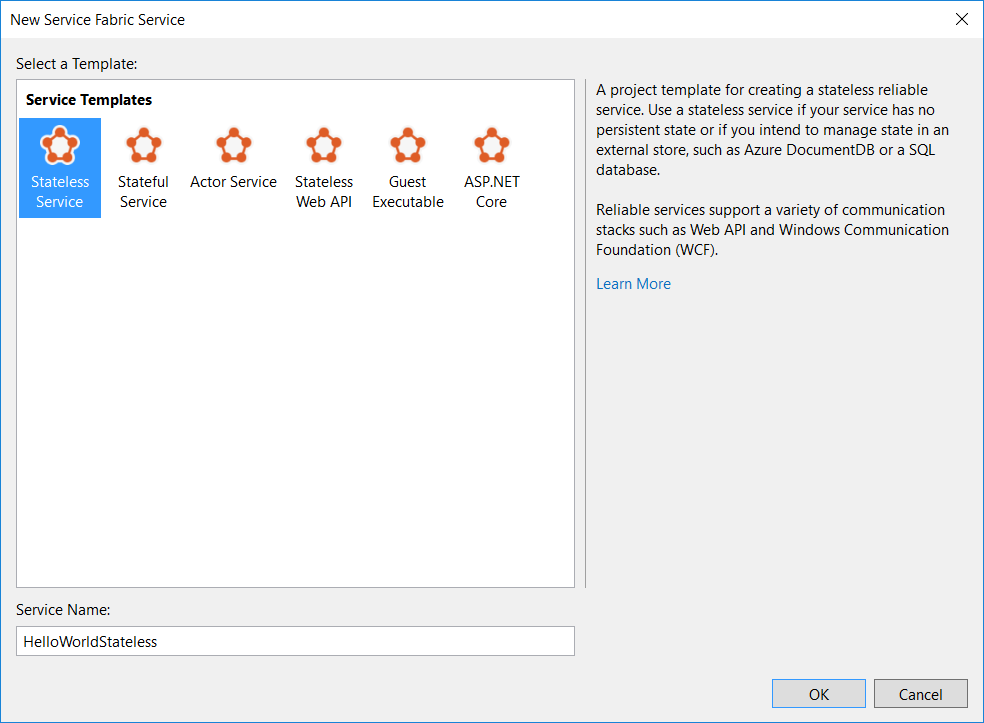
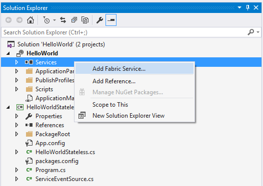
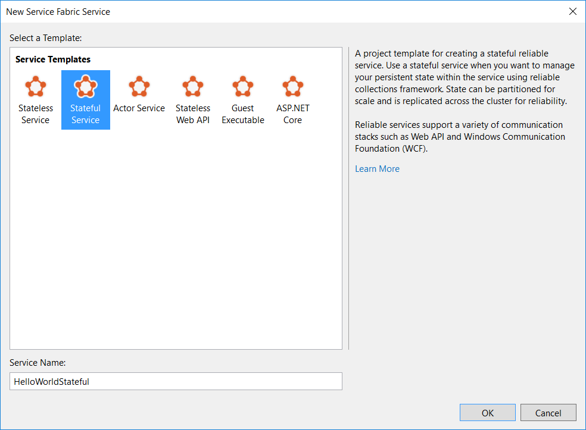
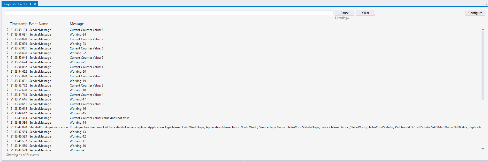

# Get started with Reliable Services
> [!div class="op_single_selector"]
> * [C# on Windows](service-fabric-reliable-services-quick-start.md)
> * [Java on Linux](service-fabric-reliable-services-quick-start-java.md)
> 
> 

An Azure Service Fabric application contains one or more services that run your code. This guide shows you how to create both stateless and stateful Service Fabric applications with [Reliable Services](service-fabric-reliable-services-introduction.md).  

## Basic concepts
To get started with Reliable Services, you only need to understand a few basic concepts:

* **Service type**: This is your service implementation. It is defined by the class you write that extends `StatelessService` and any other code or dependencies used therein, along with a name and a version number.
* **Named service instance**: To run your service, you create named instances of your service type, much like you create object instances of a class type. A service instance has a name in the form of a URI using the "fabric:/" scheme, such as "fabric:/MyApp/MyService".
* **Service host**: The named service instances you create need to run inside a host process. The service host is just a process where instances of your service can run.
* **Service registration**: Registration brings everything together. The service type must be registered with the Service Fabric runtime in a service host to allow Service Fabric to create instances of it to run.  

## Create a stateless service
A stateless service is a type of service that is currently the norm in cloud applications. It is considered stateless because the service itself does not contain data that needs to be stored reliably or made highly available. If an instance of a stateless service shuts down, all of its internal state is lost. In this type of service, state must be persisted to an external store, such as Azure Tables or a SQL database, for it to be made highly available and reliable.

Launch Visual Studio 2015 or Visual Studio 2017 as an administrator, and create a new Service Fabric application project named *HelloWorld*:



Then create a stateless service project using **.NET Core 2.0** named *HelloWorldStateless*:



Your solution now contains two projects:

* *HelloWorld*. This is the *application* project that contains your *services*. It also contains the application manifest that describes the application, as well as a number of PowerShell scripts that help you to deploy your application.
* *HelloWorldStateless*. This is the service project. It contains the stateless service implementation.

## Implement the service
Open the **HelloWorldStateless.cs** file in the service project. In Service Fabric, a service can run any business logic. The service API provides two entry points for your code:

* An open-ended entry point method, called *RunAsync*, where you can begin executing any workloads, including long-running compute workloads.

```csharp
protected override async Task RunAsync(CancellationToken cancellationToken)
{
    ...
}
```

* A communication entry point where you can plug in your communication stack of choice, such as ASP.NET Core. This is where you can start receiving requests from users and other services.

```csharp
protected override IEnumerable<ServiceInstanceListener> CreateServiceInstanceListeners()
{
    ...
}
```

In this tutorial, we will focus on the `RunAsync()` entry point method. This is where you can immediately start running your code.
The project template includes a sample implementation of `RunAsync()` that increments a rolling count.

> [!NOTE]
> For details about how to work with a communication stack, see [Service Fabric Web API services with OWIN self-hosting](service-fabric-reliable-services-communication-webapi.md)
> 
> 

### RunAsync
```csharp
protected override async Task RunAsync(CancellationToken cancellationToken)
{
    // TODO: Replace the following sample code with your own logic
    //       or remove this RunAsync override if it's not needed in your service.

    long iterations = 0;

    while (true)
    {
        cancellationToken.ThrowIfCancellationRequested();

        ServiceEventSource.Current.ServiceMessage(this.Context, "Working-{0}", ++iterations);

        await Task.Delay(TimeSpan.FromSeconds(1), cancellationToken);
    }
}
```

The platform calls this method when an instance of a service is placed and ready to execute. For a stateless service, that simply means when the service instance is opened. A cancellation token is provided to coordinate when your service instance needs to be closed. In Service Fabric, this open/close cycle of a service instance can occur many times over the lifetime of the service as a whole. This can happen for various reasons, including:

* The system moves your service instances for resource balancing.
* Faults occur in your code.
* The application or system is upgraded.
* The underlying hardware experiences an outage.

This orchestration is managed by the system to keep your service highly available and properly balanced.

`RunAsync()` should not block synchronously. Your implementation of RunAsync should return a Task or await on any long-running or blocking operations to allow the runtime to continue. Note in the `while(true)` loop in the previous example, a Task-returning `await Task.Delay()` is used. If your workload must block synchronously, you should schedule a new Task with `Task.Run()` in your `RunAsync` implementation.

Cancellation of your workload is a cooperative effort orchestrated by the provided cancellation token. The system will wait for your task to end (by successful completion, cancellation, or fault) before it moves on. It is important to honor the cancellation token, finish any work, and exit `RunAsync()` as quickly as possible when the system requests cancellation.

In this stateless service example, the count is stored in a local variable. But because this is a stateless service, the value that's stored exists only for the current lifecycle of its service instance. When the service moves or restarts, the value is lost.

## Create a stateful service
Service Fabric introduces a new kind of service that is stateful. A stateful service can maintain state reliably within the service itself, co-located with the code that's using it. State is made highly available by Service Fabric without the need to persist state to an external store.

To convert a counter value from stateless to highly available and persistent, even when the service moves or restarts, you need a stateful service.

In the same *HelloWorld* application, you can add a new service by right-clicking on the Services references in the application project and selecting **Add ->  New Service Fabric Service**.



Select **.NET Core 2.0 -> Stateful Service** and name it *HelloWorldStateful*. Click **OK**.



Your application should now have two services: the stateless service *HelloWorldStateless* and the stateful service *HelloWorldStateful*.

A stateful service has the same entry points as a stateless service. The main difference is the availability of a *state provider* that can store state reliably. Service Fabric comes with a state provider implementation called [Reliable Collections](service-fabric-reliable-services-reliable-collections.md), which lets you create replicated data structures through the Reliable State Manager. A stateful Reliable Service uses this state provider by default.

Open **HelloWorldStateful.cs** in *HelloWorldStateful*, which contains the following RunAsync method:

```csharp
protected override async Task RunAsync(CancellationToken cancellationToken)
{
    // TODO: Replace the following sample code with your own logic
    //       or remove this RunAsync override if it's not needed in your service.

    var myDictionary = await this.StateManager.GetOrAddAsync<IReliableDictionary<string, long>>("myDictionary");

    while (true)
    {
        cancellationToken.ThrowIfCancellationRequested();

        using (var tx = this.StateManager.CreateTransaction())
        {
            var result = await myDictionary.TryGetValueAsync(tx, "Counter");

            ServiceEventSource.Current.ServiceMessage(this.Context, "Current Counter Value: {0}",
                result.HasValue ? result.Value.ToString() : "Value does not exist.");

            await myDictionary.AddOrUpdateAsync(tx, "Counter", 0, (key, value) => ++value);

            // If an exception is thrown before calling CommitAsync, the transaction aborts, all changes are
            // discarded, and nothing is saved to the secondary replicas.
            await tx.CommitAsync();
        }

        await Task.Delay(TimeSpan.FromSeconds(1), cancellationToken);
    }
```

### RunAsync
`RunAsync()` operates similarly in stateful and stateless services. However, in a stateful service, the platform performs additional work on your behalf before it executes `RunAsync()`. This work can include ensuring that the Reliable State Manager and Reliable Collections are ready to use.

### Reliable Collections and the Reliable State Manager
```csharp
var myDictionary = await this.StateManager.GetOrAddAsync<IReliableDictionary<string, long>>("myDictionary");
```

[IReliableDictionary](https://msdn.microsoft.com/library/dn971511.aspx) is a dictionary implementation that you can use to reliably store state in the service. With Service Fabric and Reliable Collections, you can store data directly in your service without the need for an external persistent store. Reliable Collections make your data highly available. Service Fabric accomplishes this by creating and managing multiple *replicas* of your service for you. It also provides an API that abstracts away the complexities of managing those replicas and their state transitions.

Reliable Collections can store any .NET type, including your custom types, with a couple of caveats:

* Service Fabric makes your state highly available by *replicating* state across nodes, and Reliable Collections store your data to local disk on each replica. This means that everything that is stored in Reliable Collections must be *serializable*. By default, Reliable Collections use [DataContract](https://msdn.microsoft.com/library/system.runtime.serialization.datacontractattribute%28v=vs.110%29.aspx) for serialization, so it's important to make sure that your types are [supported by the Data Contract Serializer](https://msdn.microsoft.com/library/ms731923%28v=vs.110%29.aspx) when you use the default serializer.
* Objects are replicated for high availability when you commit transactions on Reliable Collections. Objects stored in Reliable Collections are kept in local memory in your service. This means that you have a local reference to the object.
  
   It is important that you do not mutate local instances of those objects without performing an update operation on the reliable collection in a transaction. This is because changes to local instances of objects will not be replicated automatically. You must re-insert the object back into the dictionary or use one of the *update* methods on the dictionary.

The Reliable State Manager manages Reliable Collections for you. You can simply ask the Reliable State Manager for a reliable collection by name at any time and at any place in your service. The Reliable State Manager ensures that you get a reference back. We don't recommended that you save references to reliable collection instances in class member variables or properties. Special care must be taken to ensure that the reference is set to an instance at all times in the service lifecycle. The Reliable State Manager handles this work for you, and it's optimized for repeat visits.

### Transactional and asynchronous operations
```csharp
using (ITransaction tx = this.StateManager.CreateTransaction())
{
    var result = await myDictionary.TryGetValueAsync(tx, "Counter-1");

    await myDictionary.AddOrUpdateAsync(tx, "Counter-1", 0, (k, v) => ++v);

    await tx.CommitAsync();
}
```

Reliable Collections have many of the same operations that their `System.Collections.Generic` and `System.Collections.Concurrent` counterparts do, except LINQ. Operations on Reliable Collections are asynchronous. This is because write operations with Reliable Collections perform I/O operations to replicate and persist data to disk.

Reliable Collection operations are *transactional*, so that you can keep state consistent across multiple Reliable Collections and operations. For example, you may dequeue a work item from a Reliable Queue, perform an operation on it, and save the result in a Reliable Dictionary, all within a single transaction. This is treated as an atomic operation, and it guarantees that either the entire operation will succeed or the entire operation will roll back. If an error occurs after you dequeue the item but before you save the result, the entire transaction is rolled back and the item remains in the queue for processing.

## Run the application
We now return to the *HelloWorld* application. You can now build and deploy your services. When you press **F5**, your application will be built and deployed to your local cluster.

After the services start running, you can view the generated Event Tracing for Windows (ETW) events in a **Diagnostic Events** window. Note that the events displayed are from both the stateless service and the stateful service in the application. You can pause the stream by clicking the **Pause** button. You can then examine the details of a message by expanding that message.

> [!NOTE]
> Before you run the application, make sure that you have a local development cluster running. Check out the [getting started guide](service-fabric-get-started.md) for information on setting up your local environment.
> 
> 



## Next steps
[Debug your Service Fabric application in Visual Studio](service-fabric-debugging-your-application.md)

[Get started: Service Fabric Web API services with OWIN self-hosting](service-fabric-reliable-services-communication-webapi.md)

[Learn more about Reliable Collections](service-fabric-reliable-services-reliable-collections.md)

[Deploy an application](service-fabric-deploy-remove-applications.md)

[Application upgrade](service-fabric-application-upgrade.md)

[Developer reference for Reliable Services](https://msdn.microsoft.com/library/azure/dn706529.aspx)

