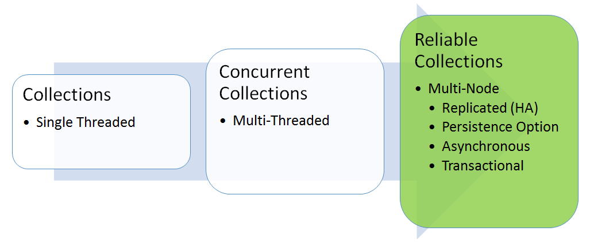

# Introduction to Reliable Collections in Azure Service Fabric stateful services

Reliable Collections enable you to write highly available, scalable, and low-latency cloud applications as though you were writing single computer applications. The classes in the **Microsoft.ServiceFabric.Data.Collections** namespace provide a set of collections that automatically make your state highly available. Developers need to program only to the Reliable Collection APIs and let Reliable Collections manage the replicated and local state.

The key difference between Reliable Collections and other high-availability technologies (such as Redis, Azure Table service, and Azure Queue service) is that the state is kept locally in the service instance while also being made highly available. This means that:

* All reads are local, which results in low latency and high-throughput reads.
* All writes incur the minimum number of network IOs, which results in low latency and high-throughput writes.

Reliable Collections can be thought of as the natural evolution of the **System.Collections** classes: a new set of collections that are designed for the cloud and multi-computer applications without increasing complexity for the developer. As such, Reliable Collections are:

* Replicated: State changes are replicated for high availability.
* Persisted: Data is persisted to disk for durability against large-scale outages (for example, a datacenter power outage).
* Because writes are persisted and replicated, you cannot create a volatile ReliableDictionary, ReliableQueue, or other reliable collection that only persists data in memory.
* Asynchronous: APIs are asynchronous to ensure that threads are not blocked when incurring IO.
* Transactional: APIs utilize the abstraction of transactions so you can manage multiple Reliable Collections within a service easily.

Reliable Collections provide strong consistency guarantees out of the box to make reasoning about application state easier.
Strong consistency is achieved by ensuring transaction commits finish only after the entire transaction has been logged on a majority quorum of replicas, including the primary.
To achieve weaker consistency, applications can acknowledge back to the client/requester before the asynchronous commit returns.

The Reliable Collections APIs are an evolution of concurrent collections APIs
(found in the **System.Collections.Concurrent** namespace):

* Asynchronous: Returns a task since, unlike concurrent collections, the operations are replicated and persisted.
* No out parameters: Uses `ConditionalValue<T>` to return a `bool` and a value instead of out parameters. `ConditionalValue<T>` is like `Nullable<T>` but does not require T to be a struct.
* Transactions: Uses a transaction object to enable the user to group actions on multiple Reliable Collections in a transaction.

Today, **Microsoft.ServiceFabric.Data.Collections** contains three collections:

* [Reliable Dictionary](https://msdn.microsoft.com/library/azure/dn971511.aspx): Represents a replicated, transactional, and asynchronous collection of key/value pairs. Similar to **ConcurrentDictionary**, both the key and the value can be of any type.
* [Reliable Queue](https://msdn.microsoft.com/library/azure/dn971527.aspx): Represents a replicated, transactional, and asynchronous strict first-in, first-out (FIFO) queue. Similar to **ConcurrentQueue**, the value can be of any type.
* [Reliable Concurrent Queue](service-fabric-reliable-services-reliable-concurrent-queue.md): Represents a replicated, transactional, and asynchronous best effort ordering queue for high throughput. Similar to the **ConcurrentQueue**, the value can be of any type.

## Next steps

* [Reliable Collection Guidelines & Recommendations](service-fabric-reliable-services-reliable-collections-guidelines.md)
* [Working with Reliable Collections](service-fabric-work-with-reliable-collections.md)
* [Transactions and Locks](service-fabric-reliable-services-reliable-collections-transactions-locks.md)
* Managing Data
  * [Backup and Restore](service-fabric-reliable-services-backup-restore.md)
  * [Notifications](service-fabric-reliable-services-notifications.md)
  * [Reliable Collection serialization](service-fabric-reliable-services-reliable-collections-serialization.md)
  * [Serialization and Upgrade](service-fabric-application-upgrade-data-serialization.md)
  * [Reliable State Manager configuration](service-fabric-reliable-services-configuration.md)
* Others
  * [Reliable Services quick start](service-fabric-reliable-services-quick-start.md)
  * [Developer reference for Reliable Collections](https://msdn.microsoft.com/library/azure/microsoft.servicefabric.data.collections.aspx)
