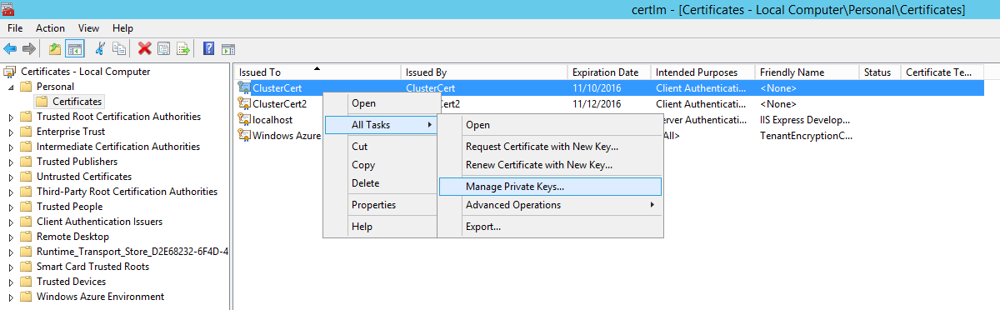
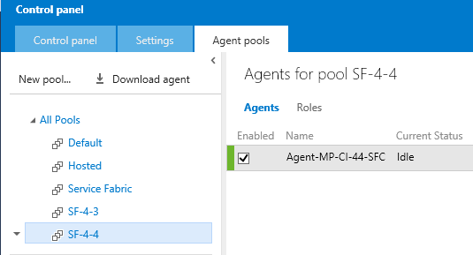

<properties
   pageTitle="Continuous integration for Service Fabric | Microsoft Azure"
   description="Get an overview of how to set up continuous integration for a Service Fabric application by using Visual Studio Team Services (VSTS)."
   services="service-fabric"
   documentationCenter="na"
   authors="cawams"
   manager="timlt"
   editor="" />
<tags
   ms.service="multiple"
   ms.devlang="dotnet"
   ms.topic="article"
   ms.tgt_pltfrm="na"
   ms.workload="multiple"
   ms.date="03/29/2016"
   ms.author="cawa" />

# Set up continuous integration for a Service Fabric application by using Visual Studio Team Services

This article describes the steps to set up continuous integration for an Azure Service Fabric application by using Visual Studio Team Services (VSTS), to ensure that your application is built, packaged, and deployed in an automated fashion. Note that these instructions re-create the cluster from scratch every time.

This document reflects the current procedure and is expected to change over time.

## Prerequisites

To get started, set up your project on Visual Studio Team Services:

1. If you haven't already created a Team Services account, set it up by using your [Microsoft account](http://www.microsoft.com/account).

2. Create a new project on Team Services by using the Microsoft account.

3. Push the source for your new or existing Service Fabric app to this project.

For more information about working with Team Services projects, see [Connect to Visual Studio](https://www.visualstudio.com/get-started/setup/connect-to-visual-studio-online).

## Set up your service principal

### Set up authentication for automation

Before you can set up the build machine, you need to create a [service principal](../resource-group-create-service-principal-portal.md) that the build agent will use to authenticate to Azure. You also need to create a certificate and upload it to Azure Key Vault, because Key Vault does not support service principal authentication. You can perform these steps from any machine. Your dev machine is a good choice.

### Install Azure PowerShell and sign in

1.  Install PowerShellGet.

    a. If you are running Windows 10 with the latest updates, you can skip this step (PowerShellGet is already installed).

    b. If not, install [Windows Management Framework 5.0](http://www.microsoft.com/download/details.aspx?id=48729), which includes PowerShellGet.

2.	Install and update the AzureRM module.
If you have any previous version of Azure PowerShell installed, remove it:

    a. Right-click the Start button, and then select **Add/Remove Programs**.

    b. Search for "Azure PowerShell" and uninstall it.

    c.  Open a PowerShell command prompt.

    d.	Install the AzureRM module by using the command `Install-Module AzureRM`.

    e.	Update the AzureRM module by using the command `Update-AzureRM`.

3.	Disable (or enable) Azure data collection.

    Azure cmdlets will prompt you to opt in or out of data collection until you make a choice. These prompts will block automation while waiting for user input. To suppress these prompts, make a choice ahead of time by running one of the following commands:

    - Enable-AzureRmDataCollection

    - Disable-AzureRmDataCollection

4.	Sign in to Azure PowerShell:

    a. Run the command `Login-AzureRmAccount`.

    b. In the dialog box that appears, enter your Azure credentials.

    c. Run the command `Get-AzureRmSubscription`.

    d. Find the subscription you want to use.

    e. Run the command `Select-AzureRmSubscription -SubscriptionId <ID for your subscription>`.

### Create a service principal

1. Follow [these instructions](https://blogs.msdn.microsoft.com/visualstudioalm/2015/10/04/automating-azure-resource-group-deployment-using-a-service-principal-in-visual-studio-online-buildrelease-management/) to create a service principal and service endpoint for your project.

2. Note the values that are printed at the end of the script's output. You will need them to set up your build definition.

### Create a certificate and upload it to a new Azure Key Vault

>[AZURE.NOTE] This example script generates a self-signed certificate, which is not a secure practice and is only acceptable for experimentation. Follow your organization's guidelines to obtain a legitimate certificate instead. These instructions also use a single certificate for both the server and the client. In production, you should use separate server and client certificates.

1. Download and extract [ServiceFabricContinuousIntegrationScripts.zip](https://gallery.technet.microsoft.com/Set-up-continuous-f8b251f6) to a folder on this machine.

2. In an admin PowerShell prompt, change to the directory `<extracted zip>/Manual`.

3. Run the PowerShell script `CreateAndUpload-Certificate.ps1` with the following parameters:

| Parameter | Value |
| --- | --- |
| KeyVaultLocation | Any value. This parameter must match the location in which you plan to create the cluster. |
| CertificateSecretName | Any value. |
| CertificateDnsName | Must match the DNS name of your cluster. Example: `mycluster.westus.azure.cloudapp.net` |
| SecureCertificatePassword | Any value. This parameter is used when you import the certificate on your build machine. |
| KeyVaultResourceGroupName | Any value. However, don't use the resource group name that you plan to use for your cluster. |
| KeyVaultName | Any value. |
| PfxFileOutputPath| Any value. This file is used to import the certificate onto your build machine. |

When the script finishes, it outputs the following three values. Note these values, because they are used as build variables.

 - `ServiceFabricCertificateThumbprint`
 - `ServiceFabricKeyVaultId`
 - `ServiceFabricCertificateSecretId`

## Set up your build machine

### Install Visual Studio 2015

If you have already provisioned a machine (or plan to provide your own), install [Visual Studio 2015](https://www.visualstudio.com/downloads/download-visual-studio-vs.aspx) on the selected machine.

If you don't yet have a machine, you can quickly provision an Azure virtual machine (VM) with Visual Studio 2015 preinstalled. To do this:

1. Sign in to the [Azure portal](https://portal.azure.com).

2. Select the **New** command in the upper-left corner of the screen.

3. Select **Marketplace**.

4. Search for **Visual Studio 2015**.

5. Select **Compute** > **Virtual Machine** > **From Gallery**.

6. Select the image **Visual Studio Enterprise 2015 Update 1 With Azure SDK 2.8 on Windows Server 2012 R2**.

    >[AZURE.NOTE] Azure SDK isn't a required component, but there currently aren't any images available that have only Visual Studio 2015 installed.

7.	Follow the instructions in the dialog box to create your VM.

### Install the Service Fabric SDK

Install the [Service Fabric SDK](https://azure.microsoft.com/campaigns/service-fabric/) on your machine.

### Install Azure PowerShell

To install Azure PowerShell, follow the steps in the previous section "Install Azure PowerShell and sign in". Skip the "Sign in to Azure PowerShell" step.

### Register the Azure PowerShell modules with the Network Service account

>[AZURE.NOTE] Do this *before* you start the build agent. Otherwise, it will not pick up the new environment variable.

1. Press the Windows logo key + R, type **regedit** and press Enter.

2. Right-click the node `HKEY_Users\.Default\Environment`, and then select **New** > **Expandable String Value**.

3. Enter `PSModulePath` for the name and `%PROGRAMFILES%\WindowsPowerShell\Modules` for the value. Replace `%PROGRAMFILES%` with the value of the `PROGRAMFILES` environment variable.

### Import your automation certificate

1.	Import the certificate onto your build machine. To do this:

    a. Copy the PFX file created by the script CreateAndUpload-Certificate.ps1 to your build machine.

    b. Open an admin PowerShell prompt and run the following commands, by using the password that you passed to `CreateAndUpload-Certificate.ps1` earlier.

        ```
        $password = Read-Host -AsSecureString
        Import-PfxCertificate -FilePath <path/to/cert.pfx> -CertStoreLocation Cert:\LocalMachine\My -Password $password -Exportable
        ```

2.	Run the certificate manager:

    a. Open Control Panel in Windows. Right-click the Start button, and then select **Control Panel**.

    b. Search for **certificate**.

    c. Select **Administrative Tools** > **Manage computer certificates**.

3.	Grant the Network Service account permission to use your automation certificate:

    a.	Under **Certificates - Local Computer**, expand **Personal**, and then select **Certificates**.

    b.	Find your certificate in the list.

    c.	Right-click your certificate, and then select **All Tasks** > **Manage Private Keys**.

    d.	Select the **Add** button, enter **Network Service**, and then select **Check Names**.

    e.	Select **OK**, and then close the certificate manager.

    

4.  Copy the certificate to the `Trusted People` folder.

    a. Your certificate was imported to **Personal/Certificates**, but we need to add it to **Trusted People**. Right-click on the certificate and select **Copy**. Then right-click on the **Trusted People** folder and select **Paste**.

### Register your build agent

1.	Download agent.zip. To do this:

    a.	Sign in to your team project, such as **https://[your-VSTS-account-name].visualstudio.com**.

    b.	Select the gear icon in the upper-right corner of your screen.

    c.	Select the **Agent pools** tab.

    d.	Select **Download agent** to download the agent.zip file.

    >[AZURE.NOTE] If the download doesn't start, check your popup blocker.

    e.	Copy agent.zip to the build machine that you created earlier.

    f.	Unzip agent.zip to `C:\agent` (or any location that has a short path) on your build machine.

    >[AZURE.NOTE] If you plan to use ASP.NET 5 Web Services, we recommend that you  choose the shortest name possible for this folder to avoid running into **PathTooLongExceptions** errors during deployment. When ASP.NET Core is released, it will mitigate this issue.

2.	From an admin command prompt, run `C:\agent\ConfigureAgent.cmd`. The script prompts you for the following parameters:

|Parameter|Value|
|---|---|
|Agent Name|Accept the default value, `Agent-[machine name]`.|
|TFS Url|Enter the URL to your team project, such as `https://[your-VSTS-account-name].visualstudio.com`.|
|Agent Pool|Enter the name of your agent pool. (If you haven't created an agent pool, accept the default value.)|
|Work folder|Accept the default value. This is the folder where the build agent will actually build your application. If you plan to use ASP.NET 5 Web Services, we recommend that you choose the shortest name possible for this folder to avoid running into PathTooLongExceptions errors during deployment.|
|Install as Windows Service?|Default value is N. Change the value to **Y**.|
|User account to run the service|Accept the default value, `NT AUTHORITY\NetworkService`.|
|Password for `NT AUTHORITY\Network Service`|The network service account does not have a password, but will refuse blank passwords. Enter any non-empty string for the password (whatever you enter will be ignored).|
|Un-configure existing agent?|Accept the default value, **N**.|

3.  When you're prompted for credentials, enter the credentials for your Microsoft account that has rights to your team project.

4.  Verify that your build agent was registered and configure its capabilities. To do this:

    a. Go back to your web browser, (`https://[your-VSTS-account-name].visualstudio.com/_admin/_AgentPool`), and refresh the page.

    b. Select the agent pool that you selected when you ran ConfigureAgent.ps1 earlier.

    c. Verify that your build agent shows up in the list and has a green status highlight. If the highlight is red, the build agent is having trouble connecting to Team Services.

    

    d. Select the build agent, then select the **Capabilities** tab.

    e. Add a capability named **azureps** with any value. This indicates to VSTS that this machine has Azure PowerShell installed on it, which is required to use some of the VSTS-provided build tasks.


## Create your build definition

>[AZURE.NOTE] The build definition that you create from these instructions will not support multiple concurrent builds, even on separate machines. This is because each build would compete for the same resource group/cluster. If you want to run multiple build agents, you will need to modify the following instructions/scripts to prevent this interference.

### Add a Service Fabric Azure Resource Manager template to your application

1. Download `azuredeploy.json` and `azuredeploy.parameters.json` from [this sample](https://github.com/Azure/azure-quickstart-templates/tree/master/service-fabric-secure-cluster-5-node-1-nodetype-wad).

2. Open `azuredeploy.parameters.json` and edit the following parameters:

    |Parameter|Value|
    |---|---|
    |clusterLocation|Must match the location of your key vault. Example: `westus`|
    |clusterName|Must match the DNS name of your certificate. For example, if the cert's DNS name is `mycluster.westus.cloudapp.net`, then `clusterName` must be `mycluster`.|
    |adminPassword|8-123 characters, with at least 3 of the following types of characters: Upper-case, lower-case, numeric, special character.|
    |certificateThumbprint|From the output of `CreateAndUpload-Certificate.ps1`|
    |sourceVaultValue|From the output of `CreateAndUpload-Certificate.ps1`|
    |certificateUrlvalue|From the output of `CreateAndUpload-Certificate.ps1`|

3. Add the new files to source control, and push to VSTS.

### Create the build definition

1.	Create an empty build definition. To do this:

    a.	Open your project in Visual Studio Team Services.

    b.	Select the **Build** tab.

    c.	Select the green **+** sign to create a new build definition.

    d.	Select **Empty**, and then select **Next**.

    e.  Verify that the right repository and branch are selected.

    f.  Select the agent queue to which you registered your build agent, and then select the **Continuous Integration** check box.

2.	On the **Variables** tab, create the following variables with these values.

    |Variable|Value|Secret|Allow at queue time|
    |---|---|---|---|
    |BuildConfiguration|Release||X|
    |BuildPlatform|x64||||

3.  Save the build definition and give it a name. You can change this name later if you want.

### Add a "Restore NuGet packages" step

1. On the **Build** tab, choose the **Add build step…** command.

2. Choose **Package** > **NuGet Installer**

3. Choose the pencil icon by the build step's name and rename it to **Restore NuGet packages**.

4. Choose the **…** button next to the **Solution** field and then choose your .sln file.

5. Save the build definition.

### Add a "Build" step

1.	On the **Build** tab, select the **Add build step…** command.

2.	Select **Build** > **MSBuild**.

3.	Select the pencil icon by the build step's name, and then rename it to **Build**.

4. Select these values:

    |Setting Name|Value|
    |---|---|
    |Solution|Click the **…** button and select the `.sln` file for your solution.|
    |Platform|`$(BuildPlatform)`|
    |Configuration|`$(BuildConfiguration)`|

5.	Save the build definition.

### Add a "Package" step

1.	On the **Build** tab, select the **Add build step…** command.

2.	Select **Build** > **MSBuild**.

3.	Select the pencil icon next to the build step's name, and then rename it to **Package**.

4. Select these values:

    |Setting Name|Value|
    |---|---|
    |Solution|Click the **…** button and select your application project's `.sfproj` file.|
    |Platform|`$(BuildPlatform)`|
    |Configuration|`$(BuildConfiguration)`|
    |MSBuild Arguments|`/t:Package`|

5.	Save the build definition.

### Add a "Remove cluster resource group" step

If a previous build did not clean up after itself (for example, if the build was canceled before it could clean up), there might be an existing resource group that might conflict with the new one. To avoid conflicts, clean up any leftover resource group (and its associated resources) before you create a new one.

1.	On the **Build** tab, select the **Add build step…** command.

2.	Select **Deploy** > **Azure Resource Group Deployment**.

3.	Select the pencil icon next to the build step's name, and then rename it to **Remove cluster resource group**.

4. Select these values:

    |Setting Name|Value|
    |---|---|
    |AzureConnectionType|**Azure Resource Manager**|
    |Azure RM Subscription|Select the connection endpoint that you created in the **Create a Service Principal** section.|
    |Action|**Delete Resource Group**|
    |Resource Group|Enter any unused name. You must use the same name in the next step.|

5.	Save the build definition.

### Add a "Provision secure cluster" step

1.	On the **Build** tab, select the **Add build step…** command.

2.	Select **Deploy** > **Azure Resource Group Deployment**.

3.	Select the pencil icon next to the build step's name, and then rename it to **Provision secure cluster**.

4. Select these values:

    |Setting Name|Value|
    |---|---|
    |AzureConnectionType|**Azure Resource Manager**|
    |Azure RM Subscription|Select the connection endpoint that you created in the **Create a Service Principal** section.|
    |Action|**Create or Update Resource Group**|
    |Resource Group|Must match the name that you used in the previous step.|
    |Location|Must match the location of your key vault.|
    |Template|Click the **…** button and select `azuredeploy.json`|
    |Template Parameters|Click the **…** button and select `azuredeploy.parameters.json`|

5.	Save the build definition.

### Add a "Deploy" step

1.	On the **Build** tab, select the **Add build step…** command.

2.	Select **Utility** > **PowerShell**.

3.	Select the pencil icon next to the build step's name, and then rename it to **Deploy**.

4. Select these values:

    |Setting Name|Value|
    |---|---|
    |Type|**File Path**|
    |Script filename|Click the **…** button and navigate to the **Scripts** directory inside your application project. Select `Deploy-FabricApplication.ps1`.|
    |Arguments|`-PublishProfileFile path/to/MySolution/MyApplicationProject/PublishProfiles/MyPublishProfile.xml -ApplicationPackagePath path/to/MySolution/MyApplicationProject/pkg/$(BuildConfiguration)`|

5.	Save the build definition.

### Try it

Select **Queue Build** to start a build. Builds will also be triggered upon push or check-in.

## Alternative solutions

The previous instructions create a new cluster for each build and remove it at the end of the build. If you'd rather have each build perform an application upgrade (to an existing cluster) instead, use the following steps:

1.	Manually create a test cluster through the Azure portal or Azure PowerShell by following [these instructions](service-fabric-cluster-creation-via-portal.md).

2.	Configure your publish profile to support application upgrade by following [these instructions](service-fabric-visualstudio-configure-upgrade.md).

4.	Remove the **Remove Cluster Resource Group** and **Provision Cluster** build steps from your build definition.

## Next steps

To learn more about continuous integration with Service Fabric applications, read the following articles:

 - [Build documentation home](https://msdn.microsoft.com/Library/vs/alm/Build/overview)
 - [Deploy a build agent](https://msdn.microsoft.com/Library/vs/alm/Build/agents/windows)
 - [Create and configure a build definition](https://msdn.microsoft.com/Library/vs/alm/Build/vs/define-build)
