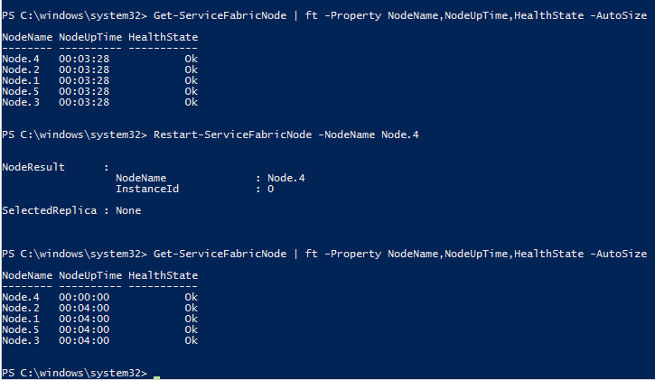

# Testability actions
In order to simulate an unreliable infrastructure, Azure Service Fabric provides you, the developer, with ways to simulate various real-world failures and state transitions. These are exposed as testability actions. The actions are the low-level APIs that cause a specific fault injection, state transition, or validation. By combining these actions, you can write comprehensive test scenarios for your services.

Service Fabric provides some common test scenarios composed of these actions. We highly recommend that you utilize these built-in scenarios, which are carefully chosen to test common state transitions and failure cases. However, actions can be used to create custom test scenarios when you want to add coverage for scenarios that are not covered by the built-in scenarios yet or that are custom tailored for your application.

C# implementations of the actions are found in the System.Fabric.dll assembly. The System Fabric PowerShell module is found in the Microsoft.ServiceFabric.Powershell.dll assembly. As part of runtime installation, the ServiceFabric PowerShell module is installed to allow for ease of use.

## Graceful vs. ungraceful fault actions
Testability actions are classified into two major buckets:

* Ungraceful faults: These faults simulate failures like machine restarts and process crashes. In such cases of failures, the execution context of process stops abruptly. This means no cleanup of the state can run before the application starts up again.
* Graceful faults: These faults simulate graceful actions like replica moves and drops triggered by load balancing. In such cases, the service gets a notification of the close and can clean up the state before exiting.

For better quality validation, run the service and business workload while inducing various graceful and ungraceful faults. Ungraceful faults exercise scenarios where the service process abruptly exits in the middle of some workflow. This tests  the recovery path once the service replica is restored by Service Fabric. This will help test data consistency and whether the service state is maintained correctly after failures. The other set of failures (the graceful failures) test that the service correctly reacts to replicas being moved around by Service Fabric. This tests handling of cancellation in the RunAsync method. The service needs to check for the cancellation token being set, correctly save its state, and exit the RunAsync method.

## Testability actions list
| Action | Description | Managed API | PowerShell cmdlet | Graceful/ungraceful faults |
| --- | --- | --- | --- | --- |
| CleanTestState |Removes all the test state from the cluster in case of a bad shutdown of the test driver. |CleanTestStateAsync |Remove-ServiceFabricTestState |Not applicable |
| InvokeDataLoss |Induces data loss into a service partition. |InvokeDataLossAsync |Invoke-ServiceFabricPartitionDataLoss |Graceful |
| InvokeQuorumLoss |Puts a given stateful service partition into quorum loss. |InvokeQuorumLossAsync |Invoke-ServiceFabricQuorumLoss |Graceful |
| MovePrimary |Moves the specified primary replica of a stateful service to the specified cluster node. |MovePrimaryAsync |Move-ServiceFabricPrimaryReplica |Graceful |
| MoveSecondary |Moves the current secondary replica of a stateful service to a different cluster node. |MoveSecondaryAsync |Move-ServiceFabricSecondaryReplica |Graceful |
| RemoveReplica |Simulates a replica failure by removing a replica from a cluster. This will close the replica and will transition it to role 'None', removing all of its state from the cluster. |RemoveReplicaAsync |Remove-ServiceFabricReplica |Graceful |
| RestartDeployedCodePackage |Simulates a code package process failure by restarting a code package deployed on a node in a cluster. This aborts the code package process, which will restart all the user service replicas hosted in that process. |RestartDeployedCodePackageAsync |Restart-ServiceFabricDeployedCodePackage |Ungraceful |
| RestartNode |Simulates a Service Fabric cluster node failure by restarting a node. |RestartNodeAsync |Restart-ServiceFabricNode |Ungraceful |
| RestartPartition |Simulates a datacenter blackout or cluster blackout scenario by restarting some or all replicas of a partition. |RestartPartitionAsync |Restart-ServiceFabricPartition |Graceful |
| RestartReplica |Simulates a replica failure by restarting a persisted replica in a cluster, closing the replica and then reopening it. |RestartReplicaAsync |Restart-ServiceFabricReplica |Graceful |
| StartNode |Starts a node in a cluster that is already stopped. |StartNodeAsync |Start-ServiceFabricNode |Not applicable |
| StopNode |Simulates a node failure by stopping a node in a cluster. The node will stay down until StartNode is called. |StopNodeAsync |Stop-ServiceFabricNode |Ungraceful |
| ValidateApplication |Validates the availability and health of all Service Fabric services within an application, usually after inducing some fault into the system. |ValidateApplicationAsync |Test-ServiceFabricApplication |Not applicable |
| ValidateService |Validates the availability and health of a Service Fabric service, usually after inducing some fault into the system. |ValidateServiceAsync |Test-ServiceFabricService |Not applicable |

## Running a testability action using PowerShell
This tutorial shows you how to run a testability action by using PowerShell. You will learn how to run a testability action against a local (one-box) cluster or an Azure cluster. Microsoft.Fabric.Powershell.dll--the Service Fabric PowerShell module--is installed automatically when you install the Microsoft Service Fabric MSI. The module is loaded automatically when you open a PowerShell prompt.

Tutorial segments:

* [Run an action against a one-box cluster](#run-an-action-against-a-one-box-cluster)
* [Run an action against an Azure cluster](#run-an-action-against-an-azure-cluster)

### Run an action against a one-box cluster
To run a testability action against a local cluster, first connect to the cluster and open the PowerShell prompt in administrator mode. Let us look at the **Restart-ServiceFabricNode** action.

```powershell
Restart-ServiceFabricNode -NodeName Node1 -CompletionMode DoNotVerify
```

Here the action **Restart-ServiceFabricNode** is being run on a node named "Node1". The completion mode specifies that it should not verify whether the restart-node action actually succeeded. Specifying the completion mode as "Verify" will cause it to verify whether the restart action actually succeeded. Instead of directly specifying the node by its name, you can specify it via a partition key and the kind of replica, as follows:

```powershell
Restart-ServiceFabricNode -ReplicaKindPrimary  -PartitionKindNamed -PartitionKey Partition3 -CompletionMode Verify
```


```powershell
$connection = "localhost:19000"
$nodeName = "Node1"

Connect-ServiceFabricCluster $connection
Restart-ServiceFabricNode -NodeName $nodeName -CompletionMode DoNotVerify
```

**Restart-ServiceFabricNode** should be used to restart a Service Fabric node in a cluster. This will stop the Fabric.exe process, which will restart all of the system service and user service replicas hosted on that node. Using this API to test your service helps uncover bugs along the failover recovery paths. It helps simulate node failures in the cluster.

The following screenshot shows the **Restart-ServiceFabricNode** testability command in action.



The output of the first **Get-ServiceFabricNode** (a cmdlet from the Service Fabric PowerShell module) shows that the local cluster has five nodes: Node.1 to Node.5. After the testability action (cmdlet) **Restart-ServiceFabricNode** is executed on the node, named Node.4, we see that the node's uptime has been reset.

### Run an action against an Azure cluster
Running a testability action (by using PowerShell) against an Azure cluster is similar to running the action against a local cluster. The only difference is that before you can run the action, instead of connecting to the local cluster, you need to connect to the Azure cluster first.

## Running a testability action using C&#35;
To run a testability action by using C#, first you need to connect to the cluster by using FabricClient. Then obtain the parameters needed to run the action. Different parameters can be used to run the same action.
Looking at the RestartServiceFabricNode action, one way to run it is by using the node information (node name and node instance ID) in the cluster.

```csharp
RestartNodeAsync(nodeName, nodeInstanceId, completeMode, operationTimeout, CancellationToken.None)
```

Parameter explanation:

* **CompleteMode** specifies that the mode should not verify whether the restart action actually succeeded. Specifying the completion mode as "Verify" will cause it to verify whether the restart action actually succeeded.  
* **OperationTimeout** sets the amount of time for the operation to finish before a TimeoutException exception is thrown.
* **CancellationToken** enables a pending call to be canceled.

Instead of directly specifying the node by its name, you can specify it via a partition key and the kind of replica.

For further information, see PartitionSelector and ReplicaSelector.

```csharp
// Add a reference to System.Fabric.Testability.dll and System.Fabric.dll
using System;
using System.Collections.Generic;
using System.Linq;
using System.Text;
using System.Threading.Tasks;
using System.Fabric.Testability;
using System.Fabric;
using System.Threading;
using System.Numerics;

class Test
{
    public static int Main(string[] args)
    {
        string clusterConnection = "localhost:19000";
        Uri serviceName = new Uri("fabric:/samples/PersistentToDoListApp/PersistentToDoListService");
        string nodeName = "N0040";
        BigInteger nodeInstanceId = 130743013389060139;

        Console.WriteLine("Starting RestartNode test");
        try
        {
            //Restart the node by using ReplicaSelector
            RestartNodeAsync(clusterConnection, serviceName).Wait();

            //Another way to restart node is by using nodeName and nodeInstanceId
            RestartNodeAsync(clusterConnection, nodeName, nodeInstanceId).Wait();
        }
        catch (AggregateException exAgg)
        {
            Console.WriteLine("RestartNode did not complete: ");
            foreach (Exception ex in exAgg.InnerExceptions)
            {
                if (ex is FabricException)
                {
                    Console.WriteLine("HResult: {0} Message: {1}", ex.HResult, ex.Message);
                }
            }
            return -1;
        }

        Console.WriteLine("RestartNode completed.");
        return 0;
    }

    static async Task RestartNodeAsync(string clusterConnection, Uri serviceName)
    {
        PartitionSelector randomPartitionSelector = PartitionSelector.RandomOf(serviceName);
        ReplicaSelector primaryofReplicaSelector = ReplicaSelector.PrimaryOf(randomPartitionSelector);

        // Create FabricClient with connection and security information here
        FabricClient fabricclient = new FabricClient(clusterConnection);
        await fabricclient.FaultManager.RestartNodeAsync(primaryofReplicaSelector, CompletionMode.Verify);
    }

    static async Task RestartNodeAsync(string clusterConnection, string nodeName, BigInteger nodeInstanceId)
    {
        // Create FabricClient with connection and security information here
        FabricClient fabricclient = new FabricClient(clusterConnection);
        await fabricclient.FaultManager.RestartNodeAsync(nodeName, nodeInstanceId, CompletionMode.Verify);
    }
}
```

## PartitionSelector and ReplicaSelector
### PartitionSelector
PartitionSelector is a helper exposed in testability and is used to select a specific partition on which to perform any of the testability actions. It can be used to select a specific partition if the partition ID is known beforehand. Or, you can provide the partition key and the operation will resolve the partition ID internally. You also have the option of selecting a random partition.

To use this helper, create the PartitionSelector object and select the partition by using one of the Select* methods. Then pass in the PartitionSelector object to the API that requires it. If no option is selected, it defaults to a random partition.

```csharp
Uri serviceName = new Uri("fabric:/samples/InMemoryToDoListApp/InMemoryToDoListService");
Guid partitionIdGuid = new Guid("8fb7ebcc-56ee-4862-9cc0-7c6421e68829");
string partitionName = "Partition1";
Int64 partitionKeyUniformInt64 = 1;

// Select a random partition
PartitionSelector randomPartitionSelector = PartitionSelector.RandomOf(serviceName);

// Select a partition based on ID
PartitionSelector partitionSelectorById = PartitionSelector.PartitionIdOf(serviceName, partitionIdGuid);

// Select a partition based on name
PartitionSelector namedPartitionSelector = PartitionSelector.PartitionKeyOf(serviceName, partitionName);

// Select a partition based on partition key
PartitionSelector uniformIntPartitionSelector = PartitionSelector.PartitionKeyOf(serviceName, partitionKeyUniformInt64);
```

### ReplicaSelector
ReplicaSelector is a helper exposed in testability and is used to help select a replica on which to perform any of the testability actions. It can be used to select a specific replica if the replica ID is known beforehand. In addition, you have the option of selecting a primary replica or a random secondary. ReplicaSelector derives from PartitionSelector, so you need to select both the replica and the partition on which you wish to perform the testability operation.

To use this helper, create a ReplicaSelector object and set the way you want to select the replica and the partition. You can then pass it into the API that requires it. If no option is selected, it defaults to a random replica and random partition.

```csharp
Guid partitionIdGuid = new Guid("8fb7ebcc-56ee-4862-9cc0-7c6421e68829");
PartitionSelector partitionSelector = PartitionSelector.PartitionIdOf(serviceName, partitionIdGuid);
long replicaId = 130559876481875498;

// Select a random replica
ReplicaSelector randomReplicaSelector = ReplicaSelector.RandomOf(partitionSelector);

// Select the primary replica
ReplicaSelector primaryReplicaSelector = ReplicaSelector.PrimaryOf(partitionSelector);

// Select the replica by ID
ReplicaSelector replicaByIdSelector = ReplicaSelector.ReplicaIdOf(partitionSelector, replicaId);

// Select a random secondary replica
ReplicaSelector secondaryReplicaSelector = ReplicaSelector.RandomSecondaryOf(partitionSelector);
```

## Next steps
* [Testability scenarios](service-fabric-testability-scenarios.md)
* How to test your service
  * [Simulate failures during service workloads](service-fabric-testability-workload-tests.md)
  * [Service-to-service communication failures](service-fabric-testability-scenarios-service-communication.md)

