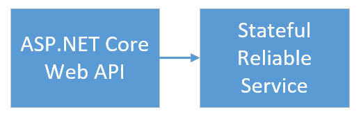
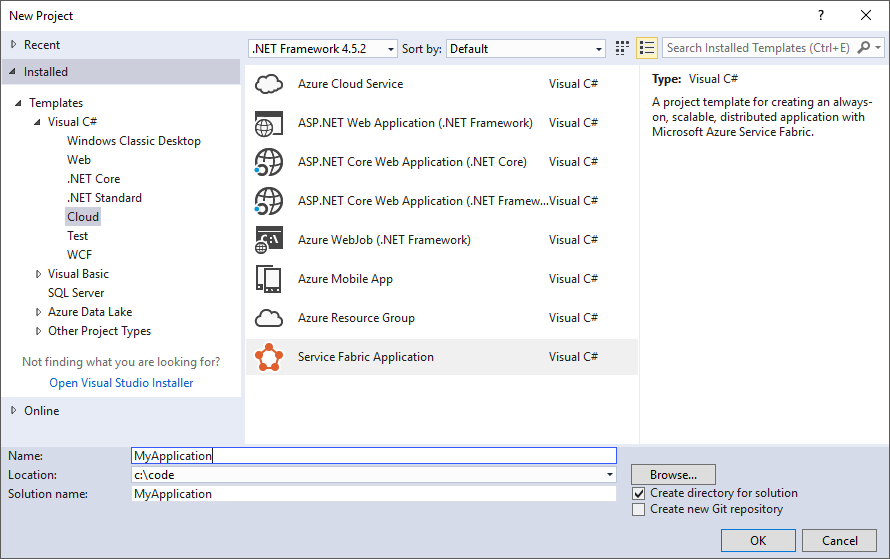
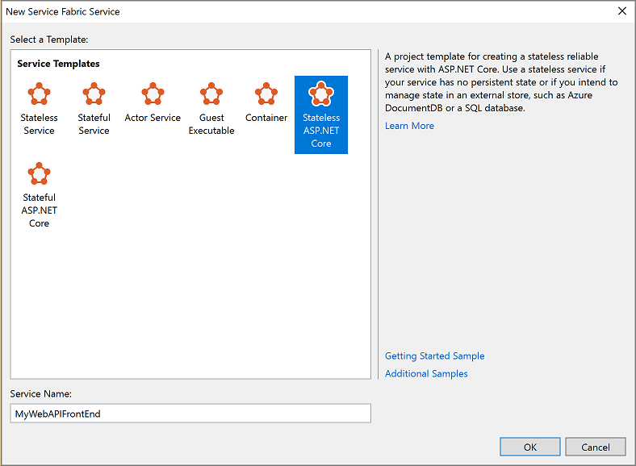
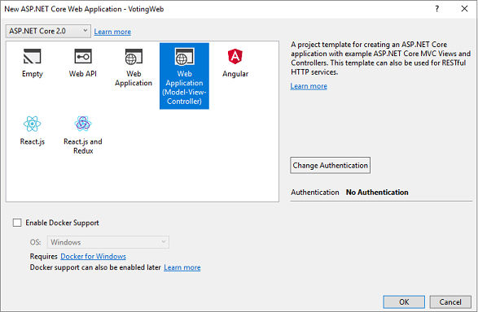
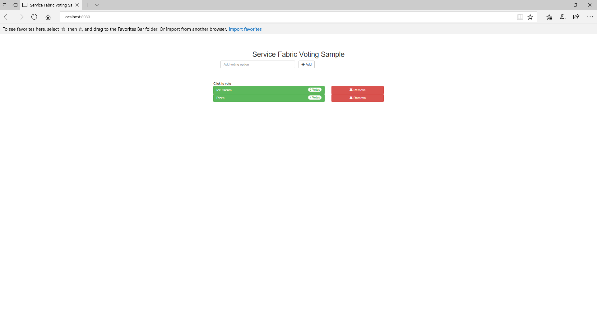
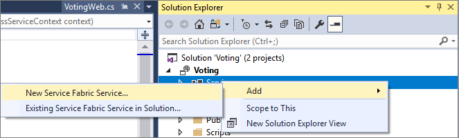
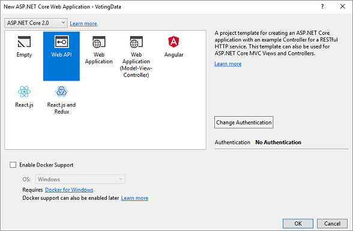
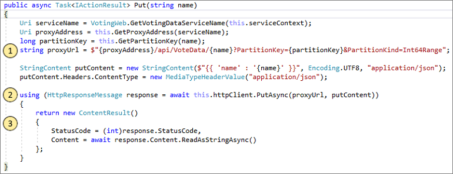
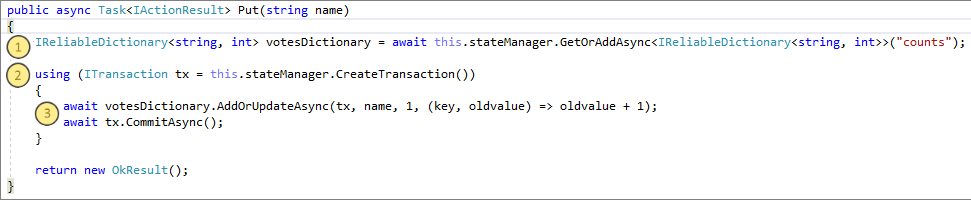

# Create and deploy an application with an ASP.NET Core Web API front-end service and a stateful back-end service
This tutorial is part one of a series.  You will learn how to create an Azure Service Fabric application with an ASP.NET Core Web API front end and a stateful back-end service to store your data. When you're finished, you have a voting application with an ASP.NET Core web front-end that saves voting results in a stateful back-end service in the cluster. If you don't want to manually create the voting application, you can [download the source code](https://github.com/Azure-Samples/service-fabric-dotnet-quickstart/) for the completed application and skip ahead to [Walk through the voting sample application](#walkthrough_anchor).



In part one of the series, you learn how to:

> [!div class="checklist"]
> * Create an ASP.NET Core Web API service as a stateful reliable service
> * Create an ASP.NET Core Web Application service as a stateless web service
> * Use the reverse proxy to communicate with the stateful service

In this tutorial series you learn how to:
> [!div class="checklist"]
> * Build a .NET Service Fabric application
> * [Deploy the application to a remote cluster](service-fabric-tutorial-deploy-app-to-party-cluster.md)
> * [Configure CI/CD using Visual Studio Team Services](service-fabric-tutorial-deploy-app-with-cicd-vsts.md)
> * [Set up monitoring and diagnostics for the application](service-fabric-tutorial-monitoring-aspnet.md)

## Prerequisites
Before you begin this tutorial:
- If you don't have an Azure subscription, create a [free account](https://azure.microsoft.com/free/?WT.mc_id=A261C142F)
- [Install Visual Studio 2017](https://www.visualstudio.com/) and install the **Azure development** and **ASP.NET and web development** workloads.
- [Install the Service Fabric SDK](service-fabric-get-started.md)

## Create an ASP.NET Web API service as a reliable service
First, create the web front-end of the voting application using ASP.NET Core. ASP.NET Core is a lightweight, cross-platform web development framework that you can use to create modern web UI and web APIs. 
To get a complete understanding of how ASP.NET Core integrates with Service Fabric, we strongly recommend reading through the [ASP.NET Core in Service Fabric Reliable Services](service-fabric-reliable-services-communication-aspnetcore.md) article. For now, you can follow this tutorial to get started quickly. To learn more about ASP.NET Core, see the [ASP.NET Core Documentation](https://docs.microsoft.com/aspnet/core/).

> [!NOTE]
> This tutorial is based on the [ASP.NET Core tools for Visual Studio 2017](https://docs.microsoft.com/aspnet/core/tutorials/first-mvc-app/start-mvc). The .NET Core tools for Visual Studio 2015 are no longer being updated.

1. Launch Visual Studio as an **administrator**.

2. Create a project with **File**->**New**->**Project**

3. In the **New Project** dialog, choose **Cloud > Service Fabric Application**.

4. Name the application **Voting** and press **OK**.

   

5. On the **New Service Fabric Service** page, choose **Stateless ASP.NET Core**, and name your service **VotingWeb**.
   
    

6. The next page provides a set of ASP.NET Core project templates. For this tutorial, choose **Web Application**. 
   
   

   Visual Studio creates an application and a service project and displays them in Solution Explorer.

   

### Add AngularJS to the VotingWeb service
Add [AngularJS](http://angularjs.org/) to your service using the built-in [Bower support](/aspnet/core/client-side/bower). Open *bower.json* and add entries for angular and angular-bootstrap, then save your changes.

```json
{
  "name": "asp.net",
  "private": true,
  "dependencies": {
    "bootstrap": "3.3.7",
    "jquery": "2.2.0",
    "jquery-validation": "1.14.0",
    "jquery-validation-unobtrusive": "3.2.6",
    "angular": "v1.6.5",
    "angular-bootstrap": "v1.1.0"
  }
}
```
Upon saving the *bower.json* file, Angular is installed in your project's *wwwroot/lib* folder. Additionally, it is listed within the *Dependencies/Bower* folder.

### Update the site.js file
Open the *wwwroot/js/site.js* file.  Replace its contents with the JavaScript used by the Home views:

```javascript
var app = angular.module('VotingApp', ['ui.bootstrap']);
app.run(function () { });

app.controller('VotingAppController', ['$rootScope', '$scope', '$http', '$timeout', function ($rootScope, $scope, $http, $timeout) {

    $scope.refresh = function () {
        $http.get('api/Votes?c=' + new Date().getTime())
            .then(function (data, status) {
                $scope.votes = data;
            }, function (data, status) {
                $scope.votes = undefined;
            });
    };

    $scope.remove = function (item) {
        $http.delete('api/Votes/' + item)
            .then(function (data, status) {
                $scope.refresh();
            })
    };

    $scope.add = function (item) {
        var fd = new FormData();
        fd.append('item', item);
        $http.put('api/Votes/' + item, fd, {
            transformRequest: angular.identity,
            headers: { 'Content-Type': undefined }
        })
            .then(function (data, status) {
                $scope.refresh();
                $scope.item = undefined;
            })
    };
}]);
```

### Update the Index.cshtml file
Open the *Views/Home/Index.cshtml* file, the view specific to the Home controller.  Replace its contents with the following, then save your changes.

```html
@{
    ViewData["Title"] = "Service Fabric Voting Sample";
}

<div ng-controller="VotingAppController" ng-init="refresh()">
    <div class="container-fluid">
        <div class="row">
            <div class="col-xs-8 col-xs-offset-2 text-center">
                <h2>Service Fabric Voting Sample</h2>
            </div>
        </div>

        <div class="row">
            <div class="col-xs-8 col-xs-offset-2">
                <form class="col-xs-12 center-block">
                    <div class="col-xs-6 form-group">
                        <input id="txtAdd" type="text" class="form-control" placeholder="Add voting option" ng-model="item" />
                    </div>
                    <button id="btnAdd" class="btn btn-default" ng-click="add(item)">
                        <span class="glyphicon glyphicon-plus" aria-hidden="true"></span>
                        Add
                    </button>
                </form>
            </div>
        </div>

        <hr />

        <div class="row">
            <div class="col-xs-8 col-xs-offset-2">
                <div class="row">
                    <div class="col-xs-4">
                        Click to vote
                    </div>
                </div>
                <div class="row top-buffer" ng-repeat="vote in votes.data">
                    <div class="col-xs-8">
                        <button class="btn btn-success text-left btn-block" ng-click="add(vote.key)">
                            <span class="pull-left">
                                {{vote.key}}
                            </span>
                            <span class="badge pull-right">
                                {{vote.value}} Votes
                            </span>
                        </button>
                    </div>
                    <div class="col-xs-4">
                        <button class="btn btn-danger pull-right btn-block" ng-click="remove(vote.key)">
                            <span class="glyphicon glyphicon-remove" aria-hidden="true"></span>
                            Remove
                        </button>
                    </div>
                </div>
            </div>
        </div>
    </div>
</div>
```

### Update the _Layout.cshtml file
Open the *Views/Shared/_Layout.cshtml* file, the default layout for the ASP.NET app.  Replace its contents with the following, then save your changes.

```html
<!DOCTYPE html>
<html ng-app="VotingApp" xmlns:ng="http://angularjs.org">
<head>
    <meta charset="utf-8" />
    <meta name="viewport" content="width=device-width, initial-scale=1.0" />
    <title>@ViewData["Title"]</title>

    <link href="~/lib/bootstrap/dist/css/bootstrap.min.css" rel="stylesheet" />
    <link href="~/css/site.css" rel="stylesheet" />

</head>
<body>
    <div class="container body-content">
        @RenderBody()
    </div>

    <script src="~/lib/jquery/dist/jquery.js"></script>
    <script src="~/lib/bootstrap/dist/js/bootstrap.js"></script>
    <script src="~/lib/angular/angular.js"></script>
    <script src="~/lib/angular-bootstrap/ui-bootstrap-tpls.js"></script>
    <script src="~/js/site.js"></script>

    @RenderSection("Scripts", required: false)
</body>
</html>
```

### Update the VotingWeb.cs file
Open the *VotingWeb.cs* file, which creates the ASP.NET Core WebHost inside the stateless service using the WebListener web server.  Add the `using System.Net.Http;` directive to the top of the file.  Replace the `CreateServiceInstanceListeners()` function with the following, then save your changes.

```csharp
protected override IEnumerable<ServiceInstanceListener> CreateServiceInstanceListeners()
{
    return new ServiceInstanceListener[]
    {
        new ServiceInstanceListener(serviceContext =>
            new WebListenerCommunicationListener(serviceContext, "ServiceEndpoint", (url, listener) =>
            {
                ServiceEventSource.Current.ServiceMessage(serviceContext, $"Starting WebListener on {url}");

                return new WebHostBuilder().UseWebListener()
                            .ConfigureServices(
                                services => services
                                    .AddSingleton<StatelessServiceContext>(serviceContext)
                                    .AddSingleton<HttpClient>())
                            .UseContentRoot(Directory.GetCurrentDirectory())
                            .UseStartup<Startup>()
                            .UseApplicationInsights()
                            .UseServiceFabricIntegration(listener, ServiceFabricIntegrationOptions.None)
                            .UseUrls(url)
                            .Build();
            }))
    };
}
```

### Add the VotesController.cs file
Add a controller which defines voting actions. Right-click on the **Controllers** folder, then select **Add->New item->Class**.  Name the file "VotesController.cs" and click **Add**.  Replace the file contents with the following, then save your changes.  Later, in [Update the VotesController.cs file](#updatevotecontroller_anchor), this file will be modified to read and write voting data from the back-end service.  For now, the controller returns static string data to the view.

```csharp
using System;
using System.Threading.Tasks;
using Microsoft.AspNetCore.Mvc;
using System.Collections.Generic;
using Newtonsoft.Json;
using System.Text;
using System.Net.Http;
using System.Net.Http.Headers;

namespace VotingWeb.Controllers
{
    [Produces("application/json")]
    [Route("api/Votes")]
    public class VotesController : Controller
    {
        private readonly HttpClient httpClient;

        public VotesController(HttpClient httpClient)
        {
            this.httpClient = httpClient;
        }

        // GET: api/Votes
        [HttpGet]
        public async Task<IActionResult> Get()
        {
            List<KeyValuePair<string, int>> votes= new List<KeyValuePair<string, int>>();
            votes.Add(new KeyValuePair<string, int>("Pizza", 3));
            votes.Add(new KeyValuePair<string, int>("Ice cream", 4));

            return Json(votes);
        }
     }
}
```


### Deploy and run the application locally
You can now go ahead and run the application. In Visual Studio, press `F5` to deploy the application for debugging. `F5` fails if you didn't previously open Visual Studio as **administrator**.

> [!NOTE]
> The first time you run and deploy the application locally, Visual Studio creates a local cluster for debugging.  Cluster creation may take some time. The cluster creation status is displayed in the Visual Studio output window.

At this point, your web app should look like this:



To stop debugging the application, go back to Visual Studio and press **Shift+F5**.

## Add a stateful back-end service to your application
Now that we have an ASP.NET Web API service running in our application, let's go ahead and add a stateful reliable service to store some data in our application.

Service Fabric allows you to consistently and reliably store your data right inside your service by using reliable collections. Reliable collections are a set of highly available and reliable collection classes that are familiar to anyone who has used C# collections.

In this tutorial, you create a service which stores a counter value in a reliable collection.

1. In Solution Explorer, right-click **Services** within the application project and choose **Add > New Service Fabric Service**.
   
    

2. In the **New Service Fabric Service** dialog, choose **Stateful ASP.NET Core**, and name the service **VotingData** and press **OK**.

    

    Once your service project is created, you have two services in your application. As you continue to build your application, you can add more services in the same way. Each can be independently versioned and upgraded.

3. The next page provides a set of ASP.NET Core project templates. For this tutorial, choose **Web API**.

    

    Visual Studio creates a service project and displays them in Solution Explorer.

    

### Add the VoteDataController.cs file

In the **VotingData** project right-click on the **Controllers** folder, then select **Add->New item->Class**. Name the file "VoteDataController.cs" and click **Add**. Replace the file contents with the following, then save your changes.

```csharp
using System;
using System.Collections.Generic;
using System.Linq;
using System.Threading.Tasks;
using Microsoft.AspNetCore.Mvc;
using Microsoft.ServiceFabric.Data;
using System.Threading;
using Microsoft.ServiceFabric.Data.Collections;

namespace VotingData.Controllers
{
    [Route("api/[controller]")]
    public class VoteDataController : Controller
    {
        private readonly IReliableStateManager stateManager;

        public VoteDataController(IReliableStateManager stateManager)
        {
            this.stateManager = stateManager;
        }

        // GET api/VoteData
        [HttpGet]
        public async Task<IActionResult> Get()
        {
            var ct = new CancellationToken();

            var votesDictionary = await this.stateManager.GetOrAddAsync<IReliableDictionary<string, int>>("counts");

            using (ITransaction tx = this.stateManager.CreateTransaction())
            {
                var list = await votesDictionary.CreateEnumerableAsync(tx);

                var enumerator = list.GetAsyncEnumerator();

                var result = new List<KeyValuePair<string, int>>();

                while (await enumerator.MoveNextAsync(ct))
                {
                    result.Add(enumerator.Current);
                }

                return Json(result);
            }
        }

        // PUT api/VoteData/name
        [HttpPut("{name}")]
        public async Task<IActionResult> Put(string name)
        {
            var votesDictionary = await this.stateManager.GetOrAddAsync<IReliableDictionary<string, int>>("counts");

            using (ITransaction tx = this.stateManager.CreateTransaction())
            {
                await votesDictionary.AddOrUpdateAsync(tx, name, 1, (key, oldvalue) => oldvalue + 1);
                await tx.CommitAsync();
            }

            return new OkResult();
        }

        // DELETE api/VoteData/name
        [HttpDelete("{name}")]
        public async Task<IActionResult> Delete(string name)
        {
            var votesDictionary = await this.stateManager.GetOrAddAsync<IReliableDictionary<string, int>>("counts");

            using (ITransaction tx = this.stateManager.CreateTransaction())
            {
                if (await votesDictionary.ContainsKeyAsync(tx, name))
                {
                    await votesDictionary.TryRemoveAsync(tx, name);
                    await tx.CommitAsync();
                    return new OkResult();
                }
                else
                {
                    return new NotFoundResult();
                }
            }
        }
    }
}
```


## Connect the services
In this next step, we will connect the two services and make the front-end Web application get and set voting information from the back-end service.

Service Fabric provides complete flexibility in how you communicate with reliable services. Within a single application, you might have services that are accessible via TCP. Other services that might be accessible via an HTTP REST API and still other services could be accessible via web sockets. For background on the options available and the tradeoffs involved, see [Communicating with services](service-fabric-connect-and-communicate-with-services.md).

In this tutorial, we are using [ASP.NET Core Web API](service-fabric-reliable-services-communication-aspnetcore.md).

<a id="updatevotecontroller" name="updatevotecontroller_anchor"></a>

### Update the VotesController.cs file
In the **VotingWeb** project, open the *Controllers/VotesController.cs* file.  Replace the `VotesController` class definition contents with the following, then save your changes.

```csharp
    public class VotesController : Controller
    {
        private readonly HttpClient httpClient;
        string serviceProxyUrl = "http://localhost:19081/Voting/VotingData/api/VoteData";
        string partitionKind = "Int64Range";
        string partitionKey = "0";

        public VotesController(HttpClient httpClient)
        {
            this.httpClient = httpClient;
        }

        // GET: api/Votes
        [HttpGet]
        public async Task<IActionResult> Get()
        {
            IEnumerable<KeyValuePair<string, int>> votes;

            HttpResponseMessage response = await this.httpClient.GetAsync($"{serviceProxyUrl}?PartitionKind={partitionKind}&PartitionKey={partitionKey}");

            if (response.StatusCode != System.Net.HttpStatusCode.OK)
            {
                return this.StatusCode((int)response.StatusCode);
            }

            votes = JsonConvert.DeserializeObject<List<KeyValuePair<string, int>>>(await response.Content.ReadAsStringAsync());

            return Json(votes);
        }

        // PUT: api/Votes/name
        [HttpPut("{name}")]
        public async Task<IActionResult> Put(string name)
        {
            string payload = $"{{ 'name' : '{name}' }}";
            StringContent putContent = new StringContent(payload, Encoding.UTF8, "application/json");
            putContent.Headers.ContentType = new MediaTypeHeaderValue("application/json");

            string proxyUrl = $"{serviceProxyUrl}/{name}?PartitionKind={partitionKind}&PartitionKey={partitionKey}";

            HttpResponseMessage response = await this.httpClient.PutAsync(proxyUrl, putContent);

            return new ContentResult()
            {
                StatusCode = (int)response.StatusCode,
                Content = await response.Content.ReadAsStringAsync()
            };
        }

        // DELETE: api/Votes/name
        [HttpDelete("{name}")]
        public async Task<IActionResult> Delete(string name)
        {
            HttpResponseMessage response = await this.httpClient.DeleteAsync($"{serviceProxyUrl}/{name}?PartitionKind={partitionKind}&PartitionKey={partitionKey}");

            if (response.StatusCode != System.Net.HttpStatusCode.OK)
            {
                return this.StatusCode((int)response.StatusCode);
            }

            return new OkResult();

        }
    }
```
<a id="walkthrough" name="walkthrough_anchor"></a>

## Walk through the voting sample application
The voting application consists of two services:
- Web front-end service (VotingWeb)- An ASP.NET Core web front-end service, which serves the web page and exposes web APIs to communicate with the backend service.
- Back-end service (VotingData)- An ASP.NET Core web service, which exposes an API to store the vote results in a reliable dictionary persisted on disk.


When you vote in the application the following events occur:
1. A JavaScript sends the vote request to the web API in the web front-end service as an HTTP PUT request.

2. The web front-end service uses a proxy to locate and forward an HTTP PUT request to the back-end service.

3. The back-end service takes the incoming request, and stores the updated result in a reliable dictionary, which gets replicated to multiple nodes within the cluster and persisted on disk. All the application's data is stored in the cluster, so no database is needed.

## Debug in Visual Studio
When debugging application in Visual Studio, you are using a local Service Fabric development cluster. You have the option to adjust your debugging experience to your scenario. In this application, we store data in our back-end service, using a reliable dictionary. Visual Studio removes the application per default when you stop the debugger. Removing the application causes the data in the back-end service to also be removed. To persist the data between debugging sessions, you can change the **Application Debug Mode** as a property on the **Voting** project in Visual Studio.

To look at what happens in the code, complete the following steps:
1. Open the **VotesController.cs** file and set a breakpoint in the web API's **Put** method (line 47) - You can search for the file in the Solution Explorer in Visual Studio.

2. Open the **VoteDataController.cs** file and set a breakpoint in this web API's **Put** method (line 50).

3. Go back to the browser and click a voting option or add a new voting option. You hit the first breakpoint in the web front-end's api controller.
    
    1. This is where the JavaScript in the browser sends a request to the web API controller in the front-end service.
    
    

    2. First we construct the URL to the ReverseProxy for our back-end service **(1)**.
    3. Then we send the HTTP PUT Request to the ReverseProxy **(2)**.
    4. Finally the we return the response from the back-end service to the client **(3)**.

4. Press **F5** to continue
    1. You are now at the break point in the back-end service.
    
    

    2. In the first line in the method **(1)** we are using the `StateManager` to get or add a reliable dictionary called `counts`.
    3. All interactions with values in a reliable dictionary require a transaction, this using statement **(2)** creates that transaction.
    4. In the transaction, we then update the value of the relevant key for the voting option and commits the operation **(3)**. Once the commit method returns, the data is updated in the dictionary and replicated to other nodes in the cluster. The data is now safely stored in the cluster, and the back-end service can fail over to other nodes, still having the data available.
5. Press **F5** to continue

To stop the debugging session, press **Shift+F5**.


## Next steps
In this part of the tutorial, you learned how to:

> [!div class="checklist"]
> * Create an ASP.NET Core Web API service as a stateful reliable service
> * Create an ASP.NET Core Web Application service as a stateless web service
> * Use the reverse proxy to communicate with the stateful service

Advance to the next tutorial:
> [!div class="nextstepaction"]
> [Deploy the application to Azure](service-fabric-tutorial-deploy-app-to-party-cluster.md)