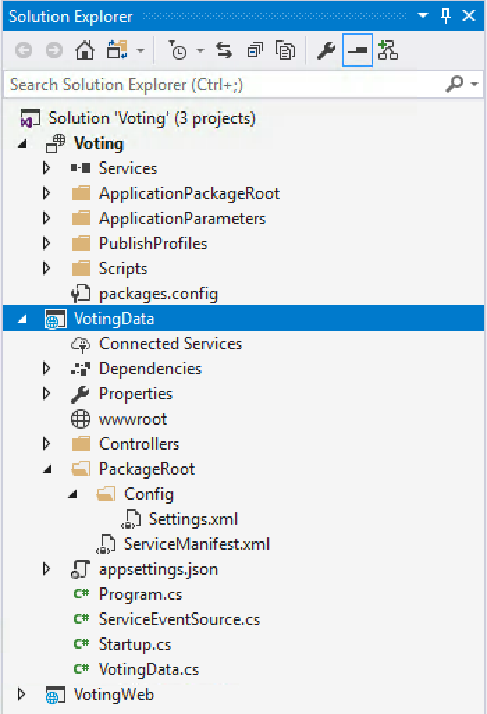

# Tutorial: Build a .NET Service Fabric application

This tutorial is **part one** in a series. In this tutorial, learn how to create an Azure Service Fabric application that has an ASP.NET Core Web API front end and a stateful back-end service to store your data. When you're finished, you have a voting application that has an ASP.NET Core web front end that saves voting results in a stateful back-end service in the cluster.

This tutorial series requires a Windows developer computer. If you don't want to manually create the voting application, you can [download the source code](https://github.com/Azure-Samples/service-fabric-dotnet-quickstart/) for the completed application and skip ahead to [Walk through the voting sample application](#walk-through-the-voting-sample-application). You also can view a [video walkthrough](/Events/Connect/2017/E100) of this tutorial.

:::image type="content" source="media/service-fabric-tutorial-create-dotnet-app/application-diagram.png" alt-text="Diagram that shows an AngularJS+ASP.NET API front end connecting to a stateful back-end service in Service Fabric." border="false":::

In this tutorial, you learn how to:

> [!div class="checklist"]
>
> * Create an ASP.NET Core Web API service as a stateful reliable service
> * Create an ASP.NET Core Web Application service as a stateless web service
> * Use the reverse proxy to communicate with the stateful service

The tutorial series shows you how to:

* Build a .NET Service Fabric application (*this tutorial*)
* [Deploy the application to a remote cluster](service-fabric-tutorial-deploy-app-to-party-cluster.md)
* [Add an HTTPS endpoint to an ASP.NET Core front-end service](service-fabric-tutorial-dotnet-app-enable-https-endpoint.md)
* [Configure CI/CD by using Azure Pipelines](service-fabric-tutorial-deploy-app-with-cicd-vsts.md)
* [Set up monitoring and diagnostics for the application](service-fabric-tutorial-monitoring-aspnet.md)

## Prerequisites

Before you begin this tutorial:

* If you don't have an Azure subscription, create a [free account](https://azure.microsoft.com/free/?WT.mc_id=A261C142F).
* [Install Visual Studio 2019](https://www.visualstudio.com/) version 15.5 or later with the **Azure development** and **ASP.NET and web development** workloads.
* [Install the Service Fabric SDK](service-fabric-get-started.md).

## Create an ASP.NET Web API service as a reliable service

First, create the web front end of the voting application by using ASP.NET Core. ASP.NET Core is a lightweight, cross-platform web development framework that you can use to create modern web UI and web APIs.

To get a complete understanding of how ASP.NET Core integrates with Service Fabric, we strongly recommend reading through the [ASP.NET Core in Service Fabric Reliable Services](service-fabric-reliable-services-communication-aspnetcore.md) article. For now, you can follow this tutorial to get started quickly. To learn more about ASP.NET Core, see the [ASP.NET Core Documentation](/aspnet/core/).

1. Open Visual Studio as Administrator.

1. Select **File** > **New** > **Project** to create a new project.

1. On **New Project**, select **Cloud** > **Service Fabric Application**.

1. Name the application **Voting**, and then select **OK**.

   

1. On the **New Service Fabric Service** pane, select **Stateless ASP.NET Core**, name your service **VotingWeb**, and then select **OK**.

   :::image type="content" source="media/service-fabric-tutorial-create-dotnet-app/new-project-dialog-2.png" alt-text="Screenshot that shows choosing an ASP.NET web service on the new service pane.":::

1. The next pane provides a set of ASP.NET Core project templates. For this tutorial, select **Web Application (Model-View-Controller)**, and then select **OK**.

   

   Visual Studio creates an application and a service project and displays them in Solution Explorer.

   

### Update the site.js file

Open *wwwroot/js/site.js*. Replace the file contents with the following JavaScript used by the Home views, and then save your changes.

```javascript
var app = angular.module('VotingApp', ['ui.bootstrap']);
app.run(function () { });

app.controller('VotingAppController', ['$rootScope', '$scope', '$http', '$timeout', function ($rootScope, $scope, $http, $timeout) {

    $scope.refresh = function () {
        $http.get('api/Votes?c=' + new Date().getTime())
            .then(function (data, status) {
                $scope.votes = data;
            }, function (data, status) {
                $scope.votes = undefined;
            });
    };

    $scope.remove = function (item) {
        $http.delete('api/Votes/' + item)
            .then(function (data, status) {
                $scope.refresh();
            })
    };

    $scope.add = function (item) {
        var fd = new FormData();
        fd.append('item', item);
        $http.put('api/Votes/' + item, fd, {
            transformRequest: angular.identity,
            headers: { 'Content-Type': undefined }
        })
            .then(function (data, status) {
                $scope.refresh();
                $scope.item = undefined;
            })
    };
}]);
```

### Update the Index.cshtml file

Open **Views/Home/Index.cshtml**, the view specific to the Home controller. Replace its contents with the following, and then save your changes.

```html
@{
    ViewData["Title"] = "Service Fabric Voting Sample";
}

<div ng-controller="VotingAppController" ng-init="refresh()">
    <div class="container-fluid">
        <div class="row">
            <div class="col-xs-8 col-xs-offset-2 text-center">
                <h2>Service Fabric Voting Sample</h2>
            </div>
        </div>

        <div class="row">
            <div class="col-xs-8 col-xs-offset-2">
                <form class="col-xs-12 center-block">
                    <div class="col-xs-6 form-group">
                        <input id="txtAdd" type="text" class="form-control" placeholder="Add voting option" ng-model="item"/>
                    </div>
                    <button id="btnAdd" class="btn btn-default" ng-click="add(item)">
                        <span class="glyphicon glyphicon-plus" aria-hidden="true"></span>
                        Add
                    </button>
                </form>
            </div>
        </div>

        <hr/>

        <div class="row">
            <div class="col-xs-8 col-xs-offset-2">
                <div class="row">
                    <div class="col-xs-4">
                        Click to vote
                    </div>
                </div>
                <div class="row top-buffer" ng-repeat="vote in votes.data">
                    <div class="col-xs-8">
                        <button class="btn btn-success text-left btn-block" ng-click="add(vote.Key)">
                            <span class="pull-left">
                                {{vote.key}}
                            </span>
                            <span class="badge pull-right">
                                {{vote.value}} Votes
                            </span>
                        </button>
                    </div>
                    <div class="col-xs-4">
                        <button class="btn btn-danger pull-right btn-block" ng-click="remove(vote.Key)">
                            <span class="glyphicon glyphicon-remove" aria-hidden="true"></span>
                            Remove
                        </button>
                    </div>
                </div>
            </div>
        </div>
    </div>
</div>
```

### Update the _Layout.cshtml file

Open *Views/Shared/_Layout.cshtml*, the default layout for the ASP.NET app. Replace its contents with the following, and then save your changes.

```html
<!DOCTYPE html>
<html ng-app="VotingApp" xmlns:ng="https://angularjs.org">
<head>
    <meta charset="utf-8"/>
    <meta name="viewport" content="width=device-width, initial-scale=1.0"/>
    <title>@ViewData["Title"]</title>

    <link href="~/lib/bootstrap/dist/css/bootstrap.css" rel="stylesheet"/>
    <link href="~/css/site.css" rel="stylesheet"/>

</head>
<body>
<div class="container body-content">
    @RenderBody()
</div>

<script src="~/lib/jquery/dist/jquery.js"></script>
<script src="~/lib/bootstrap/dist/js/bootstrap.js"></script>
<script src="https://cdnjs.cloudflare.com/ajax/libs/angular.js/1.7.2/angular.min.js"></script>
<script src="https://cdnjs.cloudflare.com/ajax/libs/angular-ui-bootstrap/2.5.0/ui-bootstrap-tpls.js"></script>
<script src="~/js/site.js"></script>

@RenderSection("Scripts", required: false)
</body>
</html>
```

### Update the VotingWeb.cs file

Open the *VotingWeb.cs* file, which creates the ASP.NET Core WebHost inside the stateless service using the WebListener web server.

Add the `using System.Net.Http;` directive to the top of the file.

Replace the `CreateServiceInstanceListeners()` function with the following code, and then save your changes.

```csharp
protected override IEnumerable<ServiceInstanceListener> CreateServiceInstanceListeners()
{
    return new ServiceInstanceListener[]
    {
        new ServiceInstanceListener(
            serviceContext =>
                new KestrelCommunicationListener(
                    serviceContext,
                    "ServiceEndpoint",
                    (url, listener) =>
                    {
                        ServiceEventSource.Current.ServiceMessage(serviceContext, $"Starting Kestrel on {url}");

                        return new WebHostBuilder()
                            .UseKestrel()
                            .ConfigureServices(
                                services => services
                                    .AddSingleton<HttpClient>(new HttpClient())
                                    .AddSingleton<FabricClient>(new FabricClient())
                                    .AddSingleton<StatelessServiceContext>(serviceContext))
                            .UseContentRoot(Directory.GetCurrentDirectory())
                            .UseStartup<Startup>()
                            .UseServiceFabricIntegration(listener, ServiceFabricIntegrationOptions.None)
                            .UseUrls(url)
                            .Build();
                    }))
    };
}
```

Also add the following `GetVotingDataServiceName` method below `CreateServiceInstanceListeners()`, and then save your changes. `GetVotingDataServiceName` returns the service name when polled.

```csharp
internal static Uri GetVotingDataServiceName(ServiceContext context)
{
    return new Uri($"{context.CodePackageActivationContext.ApplicationName}/VotingData");
}
```

### Add the VotesController.cs file

Add a controller to define voting actions. Right-click the **Controllers** folder, and then select **Add** > **New item** > **Visual C#** > **ASP.NET Core** > **Class**. Name the file **VotesController.cs**, and then select **Add**.

Replace the *VotesController.cs* file contents with the following, and then save your changes. Later, in [Update the VotesController.cs file]([Update the VotesController.cs file](#update-the-votescontrollercs-file)), this file is modified to read and write voting data from the back-end service. For now, the controller returns static string data to the view.

```csharp
namespace VotingWeb.Controllers
{
    using System;
    using System.Collections.Generic;
    using System.Fabric;
    using System.Fabric.Query;
    using System.Linq;
    using System.Net.Http;
    using System.Net.Http.Headers;
    using System.Text;
    using System.Threading.Tasks;
    using Microsoft.AspNetCore.Mvc;
    using Newtonsoft.Json;

    [Produces("application/json")]
    [Route("api/Votes")]
    public class VotesController : Controller
    {
        private readonly HttpClient httpClient;

        public VotesController(HttpClient httpClient)
        {
            this.httpClient = httpClient;
        }

        // GET: api/Votes
        [HttpGet]
        public async Task<IActionResult> Get()
        {
            List<KeyValuePair<string, int>> votes= new List<KeyValuePair<string, int>>();
            votes.Add(new KeyValuePair<string, int>("Pizza", 3));
            votes.Add(new KeyValuePair<string, int>("Ice cream", 4));

            return Json(votes);
        }
     }
}
```

### Configure the listening port

When the VotingWeb front-end service is created, Visual Studio randomly selects a port for the service to listen on. The VotingWeb service acts as the front-end for this application and accepts external traffic, so let's bind that service to a fixed and well-know port. The [service manifest](service-fabric-application-and-service-manifests.md) declares the service endpoints.

In Solution Explorer, open  *VotingWeb/PackageRoot/ServiceManifest.xml*. In the `Resources` section, find the `Endpoint` element, and then change the `Port` value to `8080`. To deploy and run the application locally, the application listening port must be open and available on your computer.

```xml
<Resources>
    <Endpoints>
      <!-- This endpoint is used by the communication listener to obtain the port on which to 
           listen. Please note that if your service is partitioned, this port is shared with 
           replicas of different partitions that are placed in your code. -->
      <Endpoint Protocol="http" Name="ServiceEndpoint" Type="Input" Port="8080" />
    </Endpoints>
  </Resources>
```

Also update the `Application URL` property value in the Voting project so that a web browser opens to the correct port when you debug your application. In Solution Explorer, select the **Voting** project, and then update the `Application URL` property to `8080`.

### Deploy and run the Voting application locally

You can now run the Voting application for debugging. In Visual Studio, select F5 to deploy the application to your local Service Fabric cluster in debug mode. The application fails if you didn't previously open Visual Studio as **administrator**.

> [!NOTE]
> The first time you run and deploy the application locally, Visual Studio creates a local Service Fabric cluster for debugging. Cluster creation may take some time. The cluster creation status is displayed in the Visual Studio output window.

After the Voting application is deployed to your local Service Fabric cluster, your web app opens in a browser tab automatically and looks similar to this example:


To stop debugging the application, go back to Visual Studio and select Shift+F5.

## Add a stateful back-end service to your application

Now that an ASP.NET Web API service is running in the application, go ahead and add a stateful reliable service to store some data in the application.

Service Fabric allows you to consistently and reliably store your data right inside your service by using reliable collections. Reliable collections are a set of highly available and reliable collection classes that are familiar to anyone who has experience using C# collections.

In this tutorial, you create a service that stores a counter value in a reliable collection.

1. In Solution Explorer, right-click **Services** within the Voting application project and select **Add** > **New Service Fabric Service**.

1. In the **New Service Fabric Service** dialog, select **Stateful ASP.NET Core**, name the service **VotingData**, and then select **OK**.

    After your service project is created, you have two services in your application. As you continue to build your application, you can add more services the same way. Each can be independently versioned and upgraded.

1. The next page provides a set of ASP.NET Core project templates. For this tutorial, select **API**.

    Visual Studio creates the VotingData service project and displays it in Solution Explorer.

    

### Add the VoteDataController.cs file

In the **VotingData** project, right-click the **Controllers** folder, and then select **Add** > **New item** > **Class**. Name the file **VoteDataController.cs** and select **Add**. Replace the file contents with the following, and then save your changes.

```csharp
namespace VotingData.Controllers
{
    using System.Collections.Generic;
    using System.Threading;
    using System.Threading.Tasks;
    using Microsoft.AspNetCore.Mvc;
    using Microsoft.ServiceFabric.Data;
    using Microsoft.ServiceFabric.Data.Collections;

    [Route("api/[controller]")]
    public class VoteDataController : Controller
    {
        private readonly IReliableStateManager stateManager;

        public VoteDataController(IReliableStateManager stateManager)
        {
            this.stateManager = stateManager;
        }

        // GET api/VoteData
        [HttpGet]
        public async Task<IActionResult> Get()
        {
            CancellationToken ct = new CancellationToken();

            IReliableDictionary<string, int> votesDictionary = await this.stateManager.GetOrAddAsync<IReliableDictionary<string, int>>("counts");

            using (ITransaction tx = this.stateManager.CreateTransaction())
            {
                Microsoft.ServiceFabric.Data.IAsyncEnumerable<KeyValuePair<string, int>> list = await votesDictionary.CreateEnumerableAsync(tx);

                Microsoft.ServiceFabric.Data.IAsyncEnumerator<KeyValuePair<string, int>> enumerator = list.GetAsyncEnumerator();

                List<KeyValuePair<string, int>> result = new List<KeyValuePair<string, int>>();

                while (await enumerator.MoveNextAsync(ct))
                {
                    result.Add(enumerator.Current);
                }

                return this.Json(result);
            }
        }

        // PUT api/VoteData/name
        [HttpPut("{name}")]
        public async Task<IActionResult> Put(string name)
        {
            IReliableDictionary<string, int> votesDictionary = await this.stateManager.GetOrAddAsync<IReliableDictionary<string, int>>("counts");

            using (ITransaction tx = this.stateManager.CreateTransaction())
            {
                await votesDictionary.AddOrUpdateAsync(tx, name, 1, (key, oldvalue) => oldvalue + 1);
                await tx.CommitAsync();
            }

            return new OkResult();
        }

        // DELETE api/VoteData/name
        [HttpDelete("{name}")]
        public async Task<IActionResult> Delete(string name)
        {
            IReliableDictionary<string, int> votesDictionary = await this.stateManager.GetOrAddAsync<IReliableDictionary<string, int>>("counts");

            using (ITransaction tx = this.stateManager.CreateTransaction())
            {
                if (await votesDictionary.ContainsKeyAsync(tx, name))
                {
                    await votesDictionary.TryRemoveAsync(tx, name);
                    await tx.CommitAsync();
                    return new OkResult();
                }
                else
                {
                    return new NotFoundResult();
                }
            }
        }
    }
}
```

## Connect the services

In this next step, connect the two services and make the front-end Web application get and set voting information from the back-end service.

Service Fabric provides complete flexibility in how you communicate with reliable services. Within a single application, you might have services that are accessible via TCP. Other services that might be accessible via an HTTP REST API and still other services could be accessible via web sockets. For background on the options available and the tradeoffs involved, see [Communicating with services](service-fabric-connect-and-communicate-with-services.md).

This tutorial uses [ASP.NET Core Web API](service-fabric-reliable-services-communication-aspnetcore.md) and the [Service Fabric reverse proxy](service-fabric-reverseproxy.md) so the VotingWeb front-end web service can communicate with the back-end VotingData service. The reverse proxy is configured by default to use port 19081 and should work for this tutorial. The reverse proxy port is set in the Azure Resource Manager template used to set up the cluster. To find which port is used, look in the cluster template in the **Microsoft.ServiceFabric/clusters** resource:

```json
"nodeTypes": [
          {
            ...
            "httpGatewayEndpointPort": "[variables('nt0fabricHttpGatewayPort')]",
            "isPrimary": true,
            "vmInstanceCount": "[parameters('nt0InstanceCount')]",
            "reverseProxyEndpointPort": "[parameters('SFReverseProxyPort')]"
          }
        ],
```

To find the reverse proxy port used in your local development cluster, view the **HttpApplicationGatewayEndpoint** element in the local Service Fabric cluster manifest:

1. To open the Service Fabric Explorer tool, open a browser and go to `http://localhost:19080`.
1. Select **Cluster** > **Manifest**.
1. Make a note of the `HttpApplicationGatewayEndpoint` element port. By default, the port is **19081**. If it isn't **19081**, change the port in the `GetProxyAddress` method of the following *VotesController.cs* code.

### Update the VotesController.cs file

In the **VotingWeb** project, open the *Controllers/VotesController.cs* file. Replace the `VotesController` class definition contents with the following, and then save your changes. If the reverse proxy port you discovered in the pervious step isn't **19081**, change the port used in the `GetProxyAddress` method from **19081** to the port that you discovered.

```csharp
public class VotesController : Controller
{
    private readonly HttpClient httpClient;
    private readonly FabricClient fabricClient;
    private readonly StatelessServiceContext serviceContext;

    public VotesController(HttpClient httpClient, StatelessServiceContext context, FabricClient fabricClient)
    {
        this.fabricClient = fabricClient;
        this.httpClient = httpClient;
        this.serviceContext = context;
    }

    // GET: api/Votes
    [HttpGet("")]
    public async Task<IActionResult> Get()
    {
        Uri serviceName = VotingWeb.GetVotingDataServiceName(this.serviceContext);
        Uri proxyAddress = this.GetProxyAddress(serviceName);

        ServicePartitionList partitions = await this.fabricClient.QueryManager.GetPartitionListAsync(serviceName);

        List<KeyValuePair<string, int>> result = new List<KeyValuePair<string, int>>();

        foreach (Partition partition in partitions)
        {
            string proxyUrl =
                $"{proxyAddress}/api/VoteData?PartitionKey={((Int64RangePartitionInformation) partition.PartitionInformation).LowKey}&PartitionKind=Int64Range";

            using (HttpResponseMessage response = await this.httpClient.GetAsync(proxyUrl))
            {
                if (response.StatusCode != System.Net.HttpStatusCode.OK)
                {
                    continue;
                }

                result.AddRange(JsonConvert.DeserializeObject<List<KeyValuePair<string, int>>>(await response.Content.ReadAsStringAsync()));
            }
        }

        return this.Json(result);
    }

    // PUT: api/Votes/name
    [HttpPut("{name}")]
    public async Task<IActionResult> Put(string name)
    {
        Uri serviceName = VotingWeb.GetVotingDataServiceName(this.serviceContext);
        Uri proxyAddress = this.GetProxyAddress(serviceName);
        long partitionKey = this.GetPartitionKey(name);
        string proxyUrl = $"{proxyAddress}/api/VoteData/{name}?PartitionKey={partitionKey}&PartitionKind=Int64Range";

        StringContent putContent = new StringContent($"{{ 'name' : '{name}' }}", Encoding.UTF8, "application/json");
        putContent.Headers.ContentType = new MediaTypeHeaderValue("application/json");

        using (HttpResponseMessage response = await this.httpClient.PutAsync(proxyUrl, putContent))
        {
            return new ContentResult()
            {
                StatusCode = (int) response.StatusCode,
                Content = await response.Content.ReadAsStringAsync()
            };
        }
    }

    // DELETE: api/Votes/name
    [HttpDelete("{name}")]
    public async Task<IActionResult> Delete(string name)
    {
        Uri serviceName = VotingWeb.GetVotingDataServiceName(this.serviceContext);
        Uri proxyAddress = this.GetProxyAddress(serviceName);
        long partitionKey = this.GetPartitionKey(name);
        string proxyUrl = $"{proxyAddress}/api/VoteData/{name}?PartitionKey={partitionKey}&PartitionKind=Int64Range";

        using (HttpResponseMessage response = await this.httpClient.DeleteAsync(proxyUrl))
        {
            if (response.StatusCode != System.Net.HttpStatusCode.OK)
            {
                return this.StatusCode((int) response.StatusCode);
            }
        }

        return new OkResult();
    }


    /// <summary>
    /// Constructs a reverse proxy URL for a given service.
    /// Example: http://localhost:19081/VotingApplication/VotingData/
    /// </summary>
    /// <param name="serviceName"></param>
    /// <returns></returns>
    private Uri GetProxyAddress(Uri serviceName)
    {
        return new Uri($"http://localhost:19081{serviceName.AbsolutePath}");
    }

    /// <summary>
    /// Creates a partition key from the given name.
    /// Uses the zero-based numeric position in the alphabet of the first letter of the name (0-25).
    /// </summary>
    /// <param name="name"></param>
    /// <returns></returns>
    private long GetPartitionKey(string name)
    {
        return Char.ToUpper(name.First()) - 'A';
    }
}
```

<a id="walkthrough" name="walkthrough_anchor"></a>

## Walk through the voting sample application

The voting application consists of two services:

* Web front-end service (VotingWeb) - An ASP.NET Core web front-end service that serves the web page and exposes web APIs to communicate with the back-end service.
* Back-end service (VotingData) - An ASP.NET Core web service that exposes an API to store the vote results in a reliable dictionary persisted on disk.


When you vote in the application, the following events occur:

1. A JavaScript file sends the vote request to the web API in the web front-end service as an HTTP PUT request.

1. The web front-end service uses a proxy to locate and forward an HTTP PUT request to the back-end service.

1. The back-end service takes the incoming request, and stores the updated result in a reliable dictionary, which gets replicated to multiple nodes within the cluster and persisted on disk. All the application's data is stored in the cluster, so no database is needed.

## Debug in Visual Studio

When debugging application in Visual Studio, you're using a local Service Fabric development cluster. You can adjust your debugging experience to your scenario. In this application, store data in the back-end service using a reliable dictionary. Visual Studio removes the application per default when you stop the debugger. Removing the application causes the data in the back-end service to also be removed. To persist the data between debugging sessions, you can change the **Application Debug Mode** as a property on the **Voting** project in Visual Studio.

To look at what happens in the code, complete the following steps:

1. Open the *VotingWeb\VotesController.cs* file and set a breakpoint in the web API's **Put** method (line 72).

1. Open the *VotingData\VoteDataController.cs* file and set a breakpoint in this web API's **Put** method (line 54).

1. Select F5 to start the application in debug mode.

1. Go back to the browser and select a voting option or add a new voting option. You hit the first breakpoint in the web front-end's API controller.

   1. The JavaScript in the browser sends a request to the web API controller in the front-end service.

      

   1. First, construct the URL to the ReverseProxy for the back-end service **(1)**.
   1. Then send the HTTP PUT request to the ReverseProxy **(2)**.
   1. Finally, the return the response from the back-end service to the client **(3)**.

1. Select F5 to continue.

   1. You're now at the break point in the back-end service.

      

   1. In the first line in the method **(1)** use the `StateManager` to get or add a reliable dictionary called `counts`.
   1. All interactions with values in a reliable dictionary require a transaction, this using statement **(2)** creates that transaction.
   1. In the transaction, update the value of the relevant key for the voting option and commits the operation **(3)**. When the commit method returns, the data is updated in the dictionary and replicated to other nodes in the cluster. The data is now safely stored in the cluster, and the back-end service can fail over to other nodes, still having the data available.
1. Select F5 to continue.

To stop the debugging session, select Shift+F5.

## Next step

Advance to the next tutorial:
> [!div class="nextstepaction"]
> [Deploy the application to Azure](service-fabric-tutorial-deploy-app-to-party-cluster.md)
