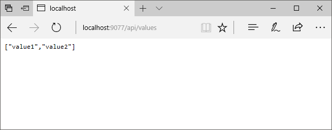
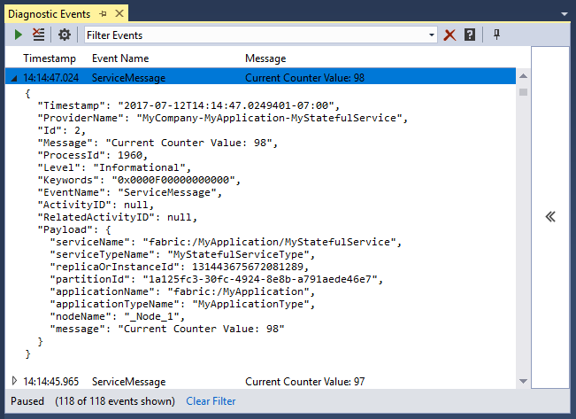
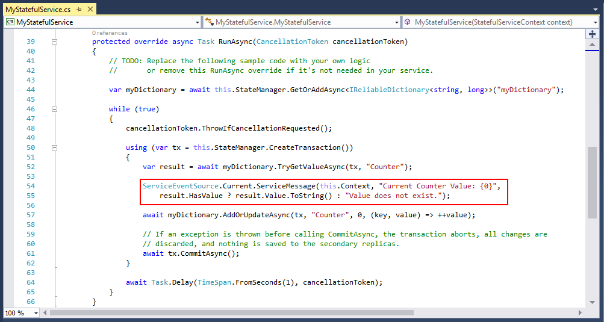
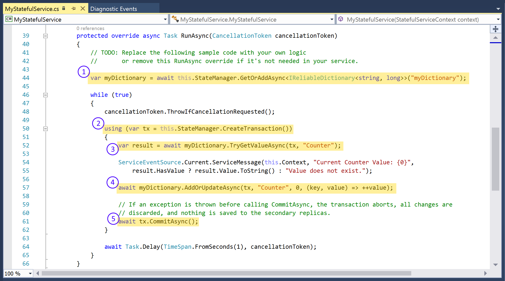
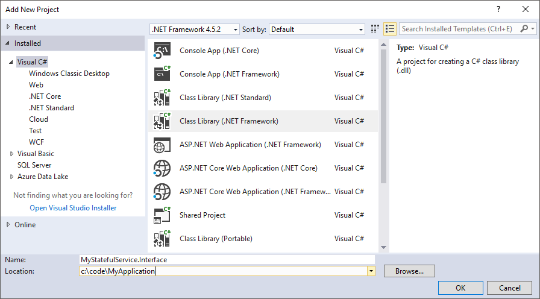
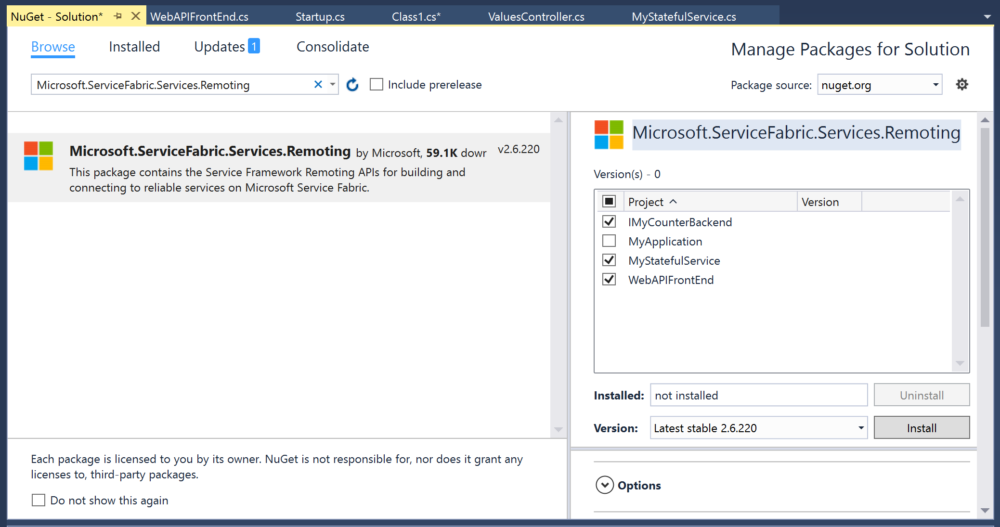
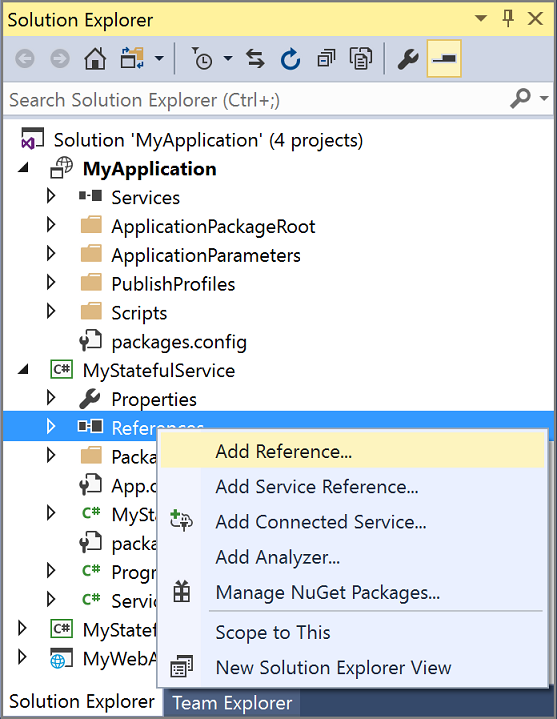

# Create and Deploy an application with an ASP.NET Core Web API front-end service and a stateful back-end service
This tutorial shows you how to create an Azure Service Fabric application with an ASP.NET Core Web API front end and a stateful back-end service to store your data.


In this tutorial, you learn how to:

> [!div class="checklist"]
> * Create an ASP.NET Core Web API service as a reliable service
> * Create a stateful reliable service
> * Implement service remoting and using a service proxy

The tutorial is split across three articles, this article is the first in the series.

## Prerequisites
Before you begin this tutorial:
- If you don't have an Azure subscription, create a [free account](https://azure.microsoft.com/free/?WT.mc_id=A261C142F)
- [Install Visual Studio 2017](https://www.visualstudio.com/) and install the **Azure development** and **ASP.NET and web development** workloads.
- [Install the Service Fabric SDK](service-fabric-get-started.md)

## Create an ASP.NET Web API service as a reliable service
ASP.NET Core is a lightweight, cross-platform web development framework that you can use to create modern web UI and web APIs. 
To get a complete understanding of how ASP.NET Core integrates with Service Fabric, we strongly recommend reading through the [ASP.NET Core in Service Fabric Reliable Services](service-fabric-reliable-services-communication-aspnetcore.md) article. For now you can follow this tutorial to get started quickly. To learn more about ASP.NET Core, see the [ASP.NET Core Documentation](https://docs.microsoft.com/aspnet/core/).

> [!NOTE]
> This tutorial is based on the [ASP.NET Core tools for Visual Studio 2017](https://docs.microsoft.com/aspnet/core/tutorials/first-mvc-app/start-mvc). The .NET Core tools for Visual Studio 2015 are no longer being updated.

1. Launch Visual Studio as an **administrator**.

2. Create a project with **File**->**New**->**Project**

3. In the **New Project** dialog, choose **Cloud > Service Fabric Application**.

4. Name the application **MyApplication** and press **OK**.

   

5. On the **New Service Fabric Service** page, choose **Stateless ASP.NET Core**, and name your service **MyWebAPIFrontEnd**.
   
    

6. The next page provides a set of ASP.NET Core project templates. For this tutorial, choose **Web API**. However, you can apply the same concepts to building a full web application.
   
   

   Visual Studio creates an application and a service project and displays them in Solution Explorer.

   

### Deploy and debug the application locally
You can now go ahead and debug the application and look at the default behavior that the ASP.NET Core Web API template provides.

In Visual Studio, press `F5` to deploy the application for debugging. `F5` fails if you didn't previously open Visual Studio as **administrator**.

> [!NOTE]
> The first time you run and deploy the application locally, Visual Studio creates a local cluster for debugging, which may take some time. The cluster creation status is displayed in the Visual Studio output window.

When the cluster is ready, you get a notification from the Service Fabric Local Cluster Manager application in the system tray.

1. To debug the application, press F5 in Visual Studio.
2. When deployment is complete, Visual Studio launches the browser to the root of the ASP.NET Web API service. The ASP.NET Core Web API template doesn't provide default behavior for the root, so you get an error in the browser.
3. Add `/api/values` to the URL in the browser. This request invokes the `Get` method on the ValuesController in the Web API template. It returns the default response that is provided by the template, a JSON array that contains two strings:
   


> [!NOTE]
> To change the default Visual Studio 2017 behavior when debugging an application, you can change the properties of the Service Fabric application project **MyApplication**.
> For this tutorial, setting the Application Debug Mode to **Refresh Application** and adding **'/api/values'** to the Application URL property optimizes the debugging experience.
> 

To stop debugging the application, go back to Visual Studio and press **Shift+F5**.

### Understanding the Service Fabric application and service
Your Visual Studio solution now contains two projects.
1. The Service Fabric application project - **MyApplication**
    - This project does not contain any code directly. Instead, it references a set of service projects. In addition, it contains other types of content to specify how your application is composed and deployed.
2. The service project - **MyWebAPIFrontEnd**
    - This project is your ASP.NET Core Web API project, containing the code and configuration for your service. Looking at the ValuesController.cs code file in the Controllers folder, you notice it is a regular ASP.NET Core Web API controller. There are no specific requirements to the code you write as part of your controllers, when running an ASP.NET Core Web API as a reliable service in Service Fabric.

For more information about the application model in Service Fabric, see [Model an application in Service Fabric](service-fabric-application-model.md).

For more information about the contents of the service project, see [Getting started with reliable services](service-fabric-reliable-services-quick-start.md).

## Add a stateful back-end service to your application
Now that we have an ASP.NET Web API service running in our application, let's go ahead and add a stateful reliable service to store some data in our application.

Service Fabric allows you to consistently and reliably store your data right inside your service by using reliable collections. Reliable collections are a simple set of highly available and reliable collection classes that is familiar to anyone who has used C# collections.

In this tutorial you create a service, which stores a counter value in a reliable collection.

1. In Solution Explorer, right-click **Services** within the application project and choose **Add > New Service Fabric Service**.
   
    

2. In the **New Service Fabric Service** dialog, choose **Stateful Service**, and name the service **MyStatefulService** and press **OK**.

    

    Once your service project is created, you have two services in your application. As you continue to build your application, you can add more services in the same way. Each can be independently versioned and upgraded.

### Deploy and debug the application locally
With the new service added to the application, let us debug the full application and look at the default behavior of the new service.

To debug the application, press F5 in Visual Studio.

> [!NOTE]
> If you choose to use **Refresh Application** as the Application Debug Mode, you are prompted to grant the local Service Fabric cluster access to the build output folder of your application.
> 

Both services in your application are build, deployed and stated in your local Service Fabric cluster. Once the services start, Visual Studio still launches your browser, but also automatically brings up the **Diagnostics Event viewer**, where you can see trace-output from your services.
   


The Diagnostics Events viewer shows you trace messages from all services that are part of the Visual Studio solution being debugged. By pausing the Diagnostics Event viewer, you are able to expand one of the service massages, to inspect its properties. By doing so, you can see which service in the cluster emitted the message, which node that service instance is currently running on and other information.



You see that the service messages are coming from the stateful service we created, as the **serviceTypeName** is **MyStatefulServiceType**. You can also see that it is sending messages with the text "Current counter is...". This message is being emitted by this highlighted line of code in the `RunAsync` method of the **MyStatefulService.cs**, that you see in the following screenshot.



For more information about emitting diagnostics information from your services and applications, see [Monitoring and diagnostics for Azure Service Fabric](service-fabric-diagnostics-overview.md).

To stop debugging the application, go back to Visual Studio and press **Shift+F5**.

### Understanding the MyStatefulService Code
To understand how it's using a reliable dictionary to store the data in the cluster, let's spend a little time looking at the code in the **MyStatefulService** service.

The are five lines of code in the service that are related to creating, updating, and reading from the reliable dictionary.



1. Whenever the `RunAsync` method of the service is being run (which happens when the service starts), this line of code gets or adds a reliable dictionary with the name `myDictionary` to the service.
2. All interaction with values in a reliable dictionary requires a transaction, this using statement being entered in this line of code creates that transaction.
3. This line of code gets the value associated with the key specified in the method call for example, `Counter`.
4. This line of code updates the value associated with the key `Counter`, by incrementing the value.
5. This method call commits the transaction, and returns once the updated value is stored across a quorum of nodes in your cluster.

For more detailed information about reliable dictionaries and reliable collections, see [Introduction to Reliable Collections in Azure Service Fabric stateful services](service-fabric-reliable-services-reliable-collections.md).

## Connect the services
In this next step we will connect the two services, and make the front-end Web API return the current value from the back-end services reliable dictionary.

Service Fabric provides complete flexibility in how you communicate with reliable services. Within a single application, you might have services that are accessible via TCP. Other services that might be accessible via an HTTP REST API and still other services could be accessible via web sockets. For background on the options available and the tradeoffs involved, see [Communicating with services](service-fabric-connect-and-communicate-with-services.md).

In this tutorial, we are using [Service remoting with reliable services](service-fabric-reliable-services-communication-remoting.md).

In the service remoting approach (modeled on remote procedure calls or RPCs), you define an interface to act as the public contract for the service. Then, you use that interface to generate a proxy class for interacting with the service.

### Create the remoting interface
We start by creating the interface to act as the contract between the two services. The interface must be referenced by all services that use it, so we create it in a separate Class Library project.

1. In the Solution Explorer, right-click your solution and choose **Add** > **New Project**.
2. Choose the **Visual C#** entry in the left navigation pane and then select the **Class Library (.NET Framework)** template. Ensure that the .NET Framework version is set to **4.5.2** or higher.
   
    

3. Name the Class Library **MyStatefulService.Interface** and click **OK**.

4. Right-click the solution in the Solution Explorer, and choose **Manage NuGet Packages for Solution**.

5. Choose **Browse** and search for **Microsoft.ServiceFabric.Services.Remoting**. Choose to install it for the three service projects in the solution: 
   
    

6. In the class library, create an interface with a single method, `GetCountAsync`, and extend the interface from `Microsoft.ServiceFabric.Services.Remoting.IService`. The remoting interface must derive from this interface to indicate that it is a Service Remoting interface. 
   
    ```c#
    using Microsoft.ServiceFabric.Services.Remoting;  
    using System.Threading.Tasks;
    ...
    namespace MyStatefulService.Interface
    {           
        public interface ICounter: IService
        {
            Task<long> GetCountAsync();
        }
    }
    ```
7. Right click the **MyStatefulService.Interface** project in Solution Explorer and select **Properties**. Select the **Build** tab, then select a the **x64** value in the **Platform target** dropdown. 

8. Save all your changes.

### Implement the interface in your stateful service
Now that we have defined the interface, we need to implement it in the stateful service.

1. Add a reference to the class library project that contains the interface from the **MyStatefulService** project.
   
    

    

2. Open the `MyStatefulService.cs` file and extend it to implement the `ICounter` interface, which we created.
   
    ```c#
    using MyStatefulService.Interface;
    ...
   
    public class MyStatefulService : StatefulService, ICounter
    {        
          // ...
    }
    ```

3. Now implement the single method that is defined in the `ICounter` interface, `GetCountAsync`.
   
    ```c#
    public async Task<long> GetCountAsync()
    {
        var myDictionary =
          await this.StateManager.GetOrAddAsync<IReliableDictionary<string, long>>("myDictionary");
   
        using (var tx = this.StateManager.CreateTransaction())
        {          
            var result = await myDictionary.TryGetValueAsync(tx, "Counter");
            return result.HasValue ? result.Value : 0;
        }
    }
    ```

    - This method returns the stored value of the `Counter` key in the reliable dictionary named `myDictionary`. 

### Expose the stateful service using service remoting
With the `ICounter` interface implemented, the final step is to open the service remoting endpoint. For stateful services, Service Fabric provides an overridable method called `CreateServiceReplicaListeners`. With this method, you can specify one or more communication listeners, based on the type of communication that you want to enable for your service.

In this case, we replace the existing `CreateServiceReplicaListeners` method and provide an instance of `ServiceRemotingListener`, which creates an RPC endpoint that is callable from clients through `ServiceProxy`.  

Change the **CreateServiceReplicaListeners** method in the **MyStatefulService.cs** file, and add a using statement to the `Microsoft.ServiceFabric.Services.Remoting.Runtime` namespace.

```c#
using Microsoft.ServiceFabric.Services.Remoting.Runtime;

...

protected override IEnumerable<ServiceReplicaListener> CreateServiceReplicaListeners()
{
    return new List<ServiceReplicaListener>()
    {
        new ServiceReplicaListener(
            (context) =>
                this.CreateServiceRemotingListener(context))
    };
}
```

Our stateful service is now ready to receive traffic from other services over RPC, using Service Remoting.

### Call the stateful back-end service from the front-end service
Now that our back-end service has exposed an interface, all that remains is adding the code to communicate with it from the ASP.NET web api service. To communicate using Service Remoting, we are using a Service Proxy from our Values controller.

1. In Solution Explorer, expand the **MyWebAPIFrontEnd**, right-click on **Dependencies**, and select **Add Reference**.  Select **MyStatefulService.Interface** and click **OK**.
   
2. In the **Controllers** folder, open the `ValuesController.cs` file. Add the following using statements to the file:

    ```c#
    using MyStatefulService.Interface;
    using Microsoft.ServiceFabric.Services.Client;
    using Microsoft.ServiceFabric.Services.Remoting.Client;
    ```
    
3. The `Get` method currently just returns a hard-coded string array of "value1" and "value2"--which matches what we saw earlier in the browser. Replace this implementation with the following code:
   
    ```
    public async Task<IEnumerable<string>> Get()
    {
        ICounter counter =
            ServiceProxy.Create<ICounter>(new Uri("fabric:/MyApplication/MyStatefulService"), new ServicePartitionKey(0));
   
        long count = await counter.GetCountAsync();
   
        return new string[] { count.ToString() };
    }
    ```
 
    The first line of code in this method creates the ServiceProxy object to the stateful service using the ICounter interface. When creating a ServiceProxy, you need to provide two pieces of information: a partition ID and the name of the service.
   
    Stateful services can be partitioned to scale by shading the data into different buckets, based on a key such as a customer ID or postal code. In our trivial application, the stateful service only has one partition, so the key doesn't matter. Any key that you provide leads to the same partition. To learn more about partitioning services, see [How to partition Service Fabric Reliable Services](service-fabric-concepts-partitioning.md).
   
    The service name is a URI of the form fabric:/&lt;application_name&gt;/&lt;service_name&gt;.
   
    With these two pieces of information, Service Fabric can uniquely identify the machine that requests should be sent to. The `ServiceProxy` class also seamlessly handles the case where the machine that hosts the stateful service partition fails and another machine must be promoted to take its place. This abstraction makes writing the client code to deal with other services simpler.
   
    Once we have the proxy, we invoke the `GetCountAsync` method and return its result.

4. Press F5 again to run the modified application. As before, Visual Studio automatically launches the browser to the root of the web project. Add the "api/values" path, and you should see the current counter value returned.
   
    
   
    Refresh the browser periodically to see the counter value update.

To stop debugging the application, go back to Visual Studio and press **Shift+F5**.

## Next steps
In this part of the tutorial, you learned how to:

> [!div class="checklist"]
> * Create an ASP.NET Core Web API service as a reliable service
> * Create a stateful reliable service
> * Implement service remoting and using a service proxy

Advance to the next tutorial:
> [!div class="nextstepaction"]
> [Deploy the application to Azure](service-fabric-tutorial-deploy-app-to-party-cluster.md)