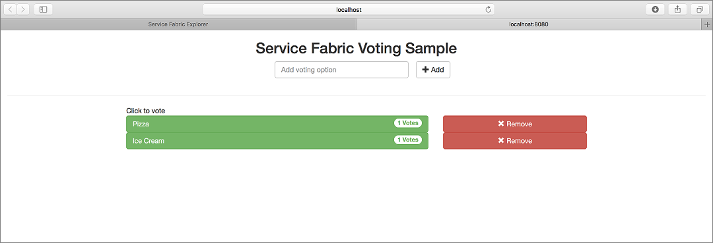
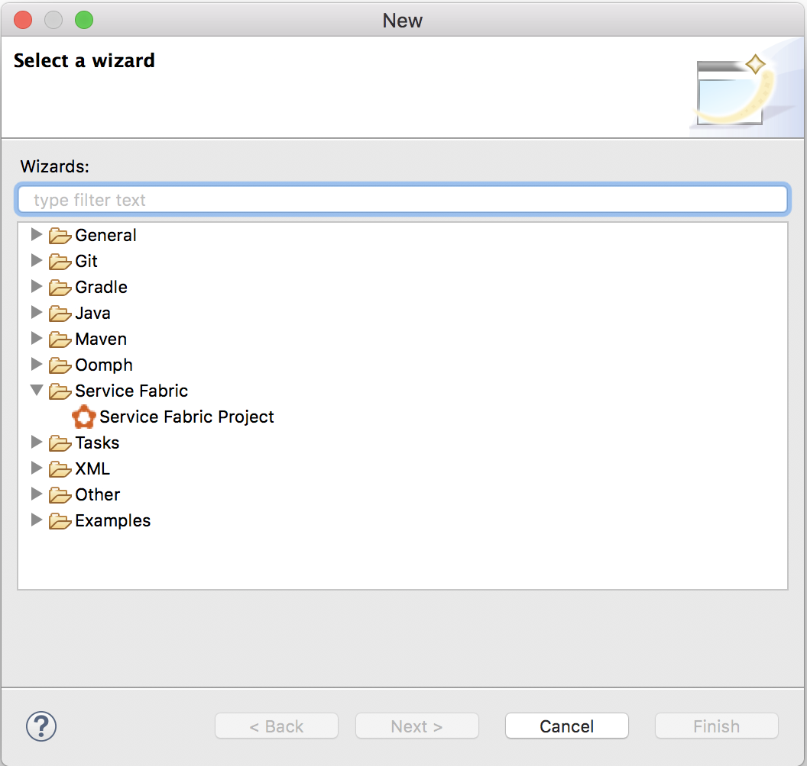
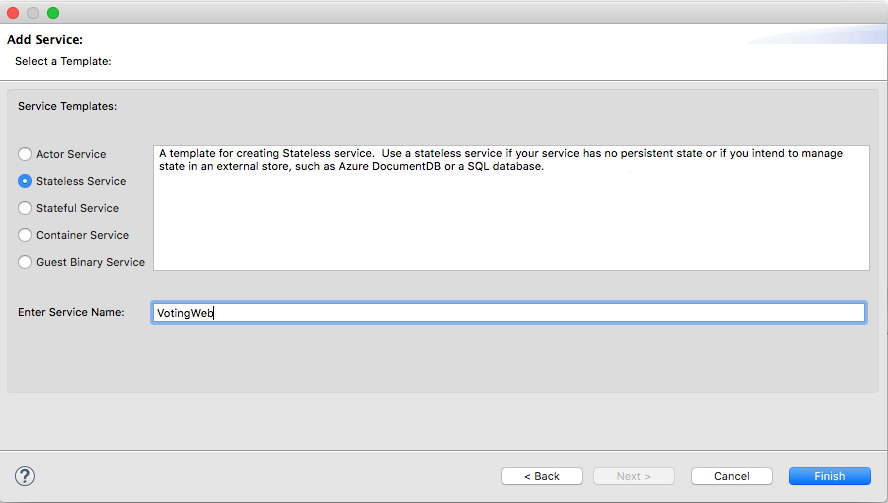
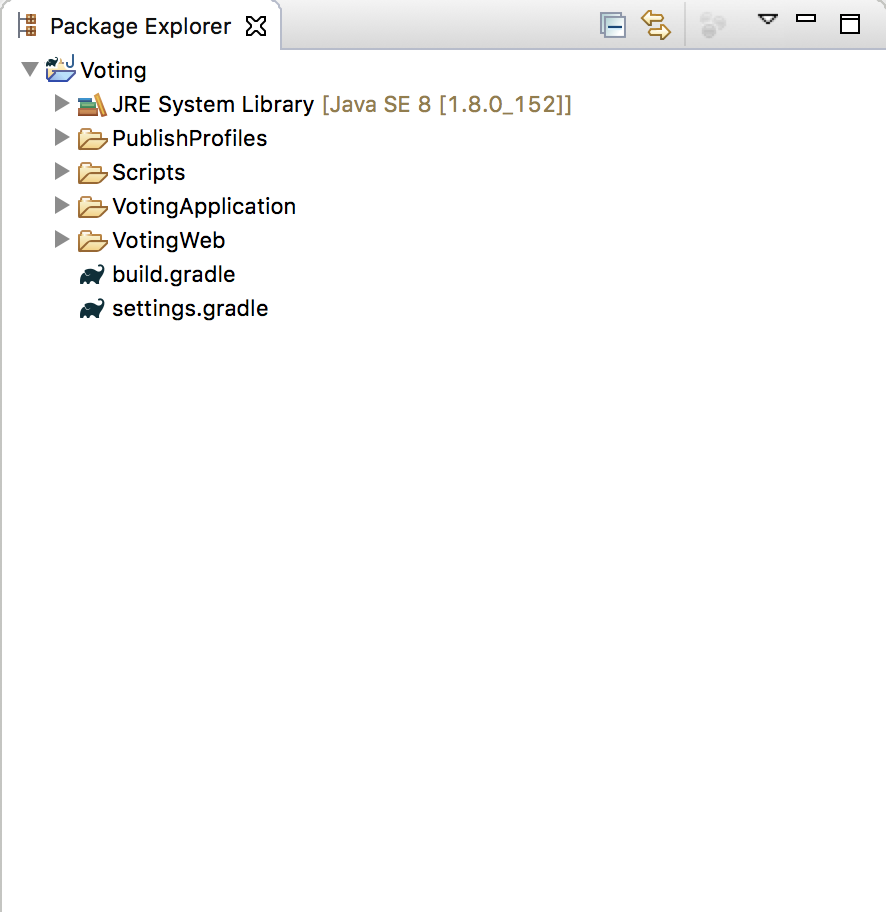
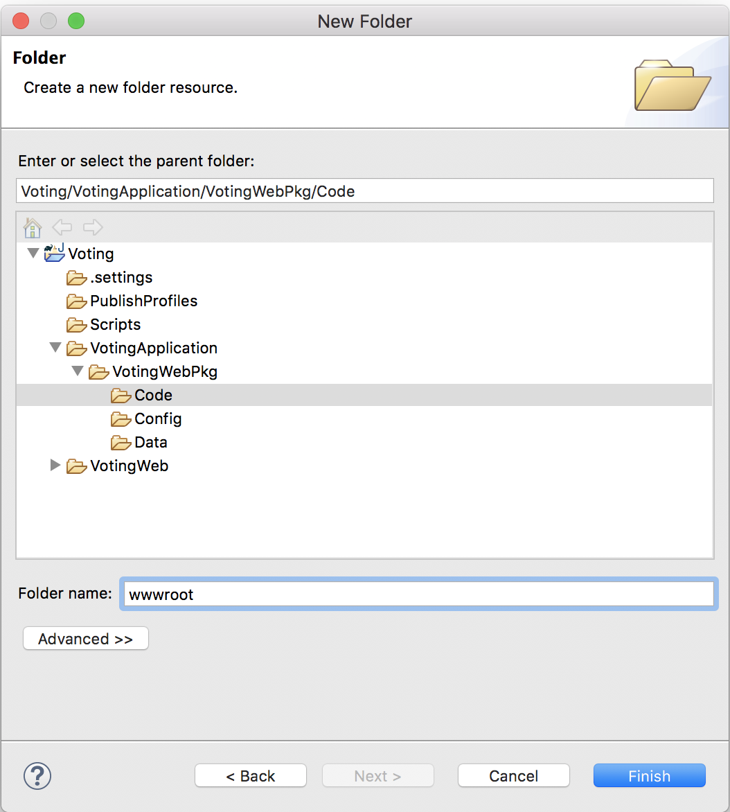

# Tutorial: Create an application with a Java API front-end service and a stateful back-end service on Azure Service Fabric

This tutorial is part one of a series. When you are finished, you have a Voting application with a Java web front end that saves voting results in a stateful back-end service on Azure Service Fabric. This tutorial series requires that you have a working Mac OSX or Linux developer machine. If you don't want to manually create the voting application, you can [download the source code for the completed application](https://github.com/Azure-Samples/service-fabric-java-quickstart) and skip ahead to [Walk through the voting sample application](service-fabric-tutorial-create-java-app.md#walk-through-the-voting-sample-application). Also, consider following the [Quickstart for Java reliable services.](service-fabric-quickstart-java-reliable-services.md).



In this tutorial series you learn how to:
> [!div class="checklist"]
> * Build a Java Service Fabric Reliable Services application
> * [Deploy and debug the application on a local cluster](service-fabric-tutorial-debug-log-local-cluster.md)
> * [Deploy application to an Azure cluster](service-fabric-tutorial-java-deploy-azure.md)
> * [Set up monitoring and diagnostics for the application](service-fabric-tutorial-java-elk.md)
> * [Set up CI/CD](service-fabric-tutorial-java-jenkins.md)


In part one of the series, you learn how to:

> [!div class="checklist"]
> * Create a Java stateful reliable service
> * Create a Java stateless web application service
> * Use service remoting to communicate with the stateful service
> * Deploy application on a local Service Fabric cluster

## Prerequisites

Before you begin this tutorial:

* If you don't have an Azure subscription, create a [free account](https://azure.microsoft.com/free/?WT.mc_id=A261C142F).
* Set up your development environment for [Mac](service-fabric-get-started-mac.md) or [Linux](service-fabric-get-started-linux.md). Follow the instructions to install the Eclipse plug-in, Gradle, the Service Fabric SDK, and the Service Fabric CLI (sfctl).

## Create the front-end Java stateless service

First, create the web front end of the Voting application. A web UI powered by AngularJS sends requests to the Java stateless service, which runs a lightweight HTTP server. This service processes each request and sends a remote procedure call to the stateful service to store the votes. 

1. Open Eclipse.

2. Create a project with **File** > **New** > **Other** > **Service Fabric** > **Service Fabric Project**.

    

3. In the **ServiceFabric Project Wizard** dialog, name the Project **Voting** and select **Next**.

     

4. On the **Add Service** page, select **Stateless Service**, and name your service **VotingWeb**. Select **Finish** to create the project.

    

    Eclipse creates an application and a service project and displays them in Package Explorer.

    

The table gives a short description of each item in the package explorer from the previous screenshot. 

| **Package Explorer Item** | **Description** |
| --- | --- |
| PublishProfiles | Contains JSON files describing profile details of local and Azure Service Fabric clusters. The contents of these files is used by the plugin when deploying the application. |
| Scripts | Contains helper scripts that can be used from the command line to quickly manage your application with a cluster. |
| VotingApplication | Contains the Service Fabric application that is pushed to the Service Fabric cluster. |
| VotingWeb | Contains the front-end stateless service source files along with the related gradle build file. |
| build.gradle | Gradle file used to manage the project. |
| settings.gradle | Contains names of Gradle projects in this folder. |

### Add HTML and Javascript to the VotingWeb service

To add a UI that can be rendered by the stateless service, add an HTML file. This HTML file is then rendered by the lightweight HTTP server embedded into the stateless Java service.

1. Expand the *VotingApplication* directory to reach the *VotingApplication/VotingWebPkg/Code* directory.

2. Right-click on the *Code* directory and select **New** > **Folder**.

3. Name the folder *wwwroot* and select **Finish**.

    

4. Add a file to the **wwwroot** called **index.html** and paste the following contents into this file.

```html
<!DOCTYPE html>
<html>
<script src="https://ajax.googleapis.com/ajax/libs/angularjs/1.6.4/angular.min.js"></script>
<script src="https://cdnjs.cloudflare.com/ajax/libs/angular-ui-bootstrap/0.13.4/ui-bootstrap-tpls.min.js"></script>
<link rel="stylesheet" href="https://maxcdn.bootstrapcdn.com/bootstrap/3.3.7/css/bootstrap.min.css">
<body>

<script>
var app = angular.module('VotingApp', ['ui.bootstrap']);
app.controller("VotingAppController", ['$rootScope', '$scope', '$http', '$timeout', function ($rootScope, $scope, $http, $timeout) {
    $scope.votes = [];
    
    $scope.refresh = function () {
        $http.get('getStatelessList')
            .then(function successCallback(response) {
        $scope.votes = Object.assign(
            {},
            ...Object.keys(response.data) .
            map(key => ({[decodeURI(key)]: response.data[key]}))
        )
        },
        function errorCallback(response) {
            alert(response);
        });
    };

    $scope.remove = function (item) {
       $http.get("removeItem", {params: { item: encodeURI(item) }})
            .then(function successCallback(response) {
                $scope.refresh();
            },
            function errorCallback(response) {
                alert(response);
            });
    };

    $scope.add = function (item) {
        if (!item) {return;}
        $http.get("addItem", {params: { item: encodeURI(item) }})
            .then(function successCallback(response) {
                $scope.refresh();
            },
            function errorCallback(response) {
                alert(response);
            });
    };
}]);
</script>

<div ng-app="VotingApp" ng-controller="VotingAppController" ng-init="refresh()">
    <div class="container-fluid">
        <div class="row">
            <div class="col-xs-8 col-xs-offset-2 text-center">
                <h2>Service Fabric Voting Sample</h2>
            </div>
        </div>

        <div class="row">
            <div class="col-xs-offset-2">
                <form style="width:50% ! important;" class="center-block">
                    <div class="col-xs-6 form-group">
                        <input id="txtAdd" type="text" class="form-control" placeholder="Add voting option" ng-model="item" />
                    </div>
                    <button id="btnAdd" class="btn btn-default" ng-click="add(item)">
                        <span class="glyphicon glyphicon-plus" aria-hidden="true"></span>
                        Add
                    </button>
                </form>
            </div>
        </div>

        <hr />

        <div class="row">
            <div class="col-xs-8 col-xs-offset-2">
                <div class="row">
                    <div class="col-xs-4">
                        Click to vote
                    </div>
                </div>
                <div class="row top-buffer" ng-repeat="(key, value)  in votes">
                    <div class="col-xs-8">
                        <button class="btn btn-success text-left btn-block" ng-click="add(key)">
                            <span class="pull-left">
                                {{key}}
                            </span>
                            <span class="badge pull-right">
                                {{value}} Votes
                            </span>
                        </button>
                    </div>
                    <div class="col-xs-4">
                        <button class="btn btn-danger pull-right btn-block" ng-click="remove(key)">
                            <span class="glyphicon glyphicon-remove" aria-hidden="true"></span>
                            Remove
                        </button>
                    </div>
                </div>
            </div>
        </div>
    </div>
</div>

</body>
</html>
```

### Update the VotingWeb.java file

In the **VotingWeb** subproject, open the *VotingWeb/src/statelessservice/VotingWeb.java* file. The **VotingWeb** service is the gateway into the stateless service and is responsible for setting up the communication listener for the front-end API.

Replace the existing **createServiceInstanceListeners** method in the file with the following and save your changes.

```java
@Override
protected List<ServiceInstanceListener> createServiceInstanceListeners() {

    EndpointResourceDescription endpoint = this.getServiceContext().getCodePackageActivationContext().getEndpoint(webEndpointName);
    int port = endpoint.getPort();

    List<ServiceInstanceListener> listeners = new ArrayList<ServiceInstanceListener>();
    listeners.add(new ServiceInstanceListener((context) -> new HttpCommunicationListener(context, port)));
    return listeners;
}
```

### Add the HTTPCommunicationListener.java file

The HTTP communication listener acts as a controller that sets up the HTTP server and exposes the APIs defining voting actions. Right-click on the *statelessservice* package in the *VotingWeb/src/statelessservice* folder, then select **New** > **File**.  Name the file *HttpCommunicationListener.java* and select **Finish**.

Replace the file contents with the following, then save your changes.  Later, in Update the HttpCommunicationListener.java file, this file is modified to render, read, and write voting data from the back-end service.  For now, the listener simply returns the static HTML for the Voting app.

```java
// ------------------------------------------------------------
//  Copyright (c) Microsoft Corporation.  All rights reserved.
//  Licensed under the MIT License (MIT). See License.txt in the repo root for license information.
// ------------------------------------------------------------

package statelessservice;

import com.google.gson.Gson;
import com.sun.net.httpserver.HttpExchange;
import com.sun.net.httpserver.HttpHandler;
import com.sun.net.httpserver.Headers;

import java.io.File;
import java.io.OutputStream;
import java.io.FileInputStream;

import java.net.InetSocketAddress;
import java.net.URI;

import java.util.HashMap;
import java.util.Map;
import java.util.concurrent.CompletableFuture;
import java.util.logging.Level;
import java.util.logging.Logger;

import microsoft.servicefabric.services.communication.runtime.CommunicationListener;
import microsoft.servicefabric.services.runtime.StatelessServiceContext;
import microsoft.servicefabric.services.client.ServicePartitionKey;
import microsoft.servicefabric.services.remoting.client.ServiceProxyBase;
import microsoft.servicefabric.services.communication.client.TargetReplicaSelector;
import system.fabric.CancellationToken;

public class HttpCommunicationListener implements CommunicationListener {

    private static final Logger logger = Logger.getLogger(HttpCommunicationListener.class.getName());

    private static final String HEADER_CONTENT_TYPE = "Content-Type";
    private static final int STATUS_OK = 200;
    private static final int STATUS_NOT_FOUND = 404;
    private static final int STATUS_ERROR = 500;
    private static final String RESPONSE_NOT_FOUND = "404 (Not Found) \n";
    private static final String MIME = "text/html";
    private static final String ENCODING = "UTF-8";

    private static final String ROOT = "wwwroot/";
    private static final String FILE_NAME = "index.html";
    private StatelessServiceContext context;
    private com.sun.net.httpserver.HttpServer server;
    private ServicePartitionKey partitionKey;
    private final int port;

    public HttpCommunicationListener(StatelessServiceContext context, int port) {
        this.partitionKey = new ServicePartitionKey(0);
        this.context = context;
        this.port = port;
    }

    // Called by openAsync when the class is instantiated
    public void start() {
        try {
            logger.log(Level.INFO, "Starting Server");
            server = com.sun.net.httpserver.HttpServer.create(new InetSocketAddress(this.port), 0);
        } catch (Exception ex) {
            logger.log(Level.SEVERE, null, ex);
            throw new RuntimeException(ex);
        }

        // Responsible for rendering the HTML layout described in the previous step
        server.createContext("/", new HttpHandler() {
            @Override
            public void handle(HttpExchange t) {
                try {
                    File file = new File(ROOT + FILE_NAME).getCanonicalFile();

                    if (!file.isFile()) {
                      // Object does not exist or is not a file: reject with 404 error.
                      t.sendResponseHeaders(STATUS_NOT_FOUND, RESPONSE_NOT_FOUND.length());
                      OutputStream os = t.getResponseBody();
                      os.write(RESPONSE_NOT_FOUND.getBytes());
                      os.close();
                    } else {
                      Headers h = t.getResponseHeaders();
                      h.set(HEADER_CONTENT_TYPE, MIME);
                      t.sendResponseHeaders(STATUS_OK, 0);
    
                      OutputStream os = t.getResponseBody();
                      FileInputStream fs = new FileInputStream(file);
                      final byte[] buffer = new byte[0x10000];
                      int count = 0;
                      while ((count = fs.read(buffer)) >= 0) {
                        os.write(buffer,0,count);
                      }

                      fs.close();
                      os.close();
                    }
                } catch (Exception e) {
                    logger.log(Level.WARNING, null, e);
                }
            }
        });

        /*
        [Replace this entire comment block in the 'Connect the services' section]
        */

        server.setExecutor(null);
        server.start();
    }

    //Helper method to parse raw HTTP requests
    private Map<String, String> queryToMap(String query){
        Map<String, String> result = new HashMap<String, String>();
        for (String param : query.split("&")) {
            String pair[] = param.split("=");
            if (pair.length>1) {
                result.put(pair[0], pair[1]);
            }else{
                result.put(pair[0], "");
            }
        }
        return result;
    }

    //Called closeAsync when the service is shut down
    private void stop() {
        if (null != server)
            server.stop(0);
    }

    //Called by the Service Fabric runtime when this service is created on a node
    @Override
    public CompletableFuture<String> openAsync(CancellationToken cancellationToken) {
        this.start();
                    logger.log(Level.INFO, "Opened Server");
        String publishUri = String.format("http://%s:%d/", this.context.getNodeContext().getIpAddressOrFQDN(), port);
        return CompletableFuture.completedFuture(publishUri);
    }

    //Called by the Service Fabric runtime when the service is shut down
    @Override
    public CompletableFuture<?> closeAsync(CancellationToken cancellationToken) {
        this.stop();
        return CompletableFuture.completedFuture(true);
    }

    //Called by the Service Fabric runtime to forcibly shut this listener down
    @Override
    public void abort() {
        this.stop();
    }
}
```

### Configure the listening port

When the VotingWeb service front-end service is created, Service Fabric selects a port for the service to listen on.  The VotingWeb service acts as the front end for this application and accepts external traffic, so let's bind that service to a fixed and well-know port. In Package Explorer, open  *VotingApplication/VotingWebPkg/ServiceManifest.xml*.  Find the **Endpoint** resource in the **Resources** section and change the **Port** value to 8080 (we'll continue using this port throughout the tutorial). To deploy and run the application locally, the application listening port must be open and available on your computer. Paste the following code snippet within the **ServiceManifest** element (i.e. just below the ```<DataPackage>``` element).

```xml
<Resources>
    <Endpoints>
        <!-- This endpoint is used by the communication listener to obtain the port on which to
            listen. Please note that if your service is partitioned, this port is shared with
            replicas of different partitions that are placed in your code. -->
        <Endpoint Name="WebEndpoint" Protocol="http" Port="8080" />
    </Endpoints>
  </Resources>
```

## Add a stateful back-end service to your application

Now that the skeleton of the Java Web API service is complete, let's go ahead and complete the stateful back-end service.

Service Fabric allows you to consistently and reliably store your data right inside your service by using reliable collections. Reliable collections are a set of highly available and reliable collection classes. The usage of these classes is familiar to anyone who has used Java collections.

1. In Package Explorer, right-click **Voting** within the application project and select **Service Fabric** > **Add Service Fabric Service**.

2. In the **Add Service** dialog, select **Stateful Service** and name the service **VotingDataService** and select **Add Service**.

    Once your service project is created, you have two services in your application. As you continue to build your application, you can add more services in the same way. Each can be independently versioned and upgraded.

3. Eclipse creates a service project and displays it in Package Explorer.

    

### Add the VotingDataService.java file

The *VotingDataService.java* file contains the methods that contain logic to retrieve, add, and remove votes from the reliable collections. Add the following **VotingDataService** class methods to the *VotingDataService/src/statefulservice/VotingDataService.java* file.

```java
package statefulservice;

import java.util.HashMap;
import java.util.ArrayList;
import java.util.List;
import java.util.concurrent.CompletableFuture;
import java.util.concurrent.atomic.AtomicInteger;

import microsoft.servicefabric.services.communication.runtime.ServiceReplicaListener;

import microsoft.servicefabric.services.runtime.StatefulService;

import microsoft.servicefabric.services.remoting.fabrictransport.runtime.FabricTransportServiceRemotingListener;

import microsoft.servicefabric.data.ReliableStateManager;
import microsoft.servicefabric.data.Transaction;
import microsoft.servicefabric.data.collections.ReliableHashMap;
import microsoft.servicefabric.data.utilities.AsyncEnumeration;
import microsoft.servicefabric.data.utilities.KeyValuePair;

import system.fabric.StatefulServiceContext;

import rpcmethods.VotingRPC;

class VotingDataService extends StatefulService implements VotingRPC {
    private static final String MAP_NAME = "votesMap";
    private ReliableStateManager stateManager;

    protected VotingDataService (StatefulServiceContext statefulServiceContext) {
        super (statefulServiceContext);
    }

    @Override
    protected List<ServiceReplicaListener> createServiceReplicaListeners() {
        this.stateManager = this.getReliableStateManager();
        ArrayList<ServiceReplicaListener> listeners = new ArrayList<>();

        listeners.add(new ServiceReplicaListener((context) -> {
            return new FabricTransportServiceRemotingListener(context,this);
        }));

        return listeners;
    }

    // Method that will be invoked via RPC from the front end to retrieve the complete set of votes in the map
    public CompletableFuture<HashMap<String,String>> getList() {
        HashMap<String, String> tempMap = new HashMap<String, String>();

        try {

            ReliableHashMap<String, String> votesMap = stateManager
                    .<String, String> getOrAddReliableHashMapAsync(MAP_NAME).get();

            Transaction tx = stateManager.createTransaction();
            AsyncEnumeration<KeyValuePair<String, String>> kv = votesMap.keyValuesAsync(tx).get();
            while (kv.hasMoreElementsAsync().get()) {
                KeyValuePair<String, String> k = kv.nextElementAsync().get();
                tempMap.put(k.getKey(), k.getValue());
            }

            tx.close();


        } catch (Exception e) {
            e.printStackTrace();
        }

        return CompletableFuture.completedFuture(tempMap);
    }

    // Method that will be invoked via RPC from the front end to add an item to the votes list or to increase the
    // vote count for a particular item
    public CompletableFuture<Integer> addItem(String itemToAdd) {
        AtomicInteger status = new AtomicInteger(-1);

        try {

            ReliableHashMap<String, String> votesMap = stateManager
                    .<String, String> getOrAddReliableHashMapAsync(MAP_NAME).get();

            Transaction tx = stateManager.createTransaction();
            votesMap.computeAsync(tx, itemToAdd, (k, v) -> {
                if (v == null) {
                    return "1";
                }
                else {
                    int numVotes = Integer.parseInt(v);
                    numVotes = numVotes + 1;
                    return Integer.toString(numVotes);
                }
            }).get();

            tx.commitAsync().get();
            tx.close();

            status.set(1);
        } catch (Exception e) {
            e.printStackTrace();
        }

        return CompletableFuture.completedFuture(new Integer(status.get()));
    }

    // Method that will be invoked via RPC from the front end to remove an item
    public CompletableFuture<Integer> removeItem(String itemToRemove) {
        AtomicInteger status = new AtomicInteger(-1);
        try {
            ReliableHashMap<String, String> votesMap = stateManager
                    .<String, String> getOrAddReliableHashMapAsync(MAP_NAME).get();

            Transaction tx = stateManager.createTransaction();
            votesMap.removeAsync(tx, itemToRemove).get();
            tx.commitAsync().get();
            tx.close();

            status.set(1);
        } catch (Exception e) {
            e.printStackTrace();
        }

        return CompletableFuture.completedFuture(new Integer(status.get()));
    }

}
```

The skeleton for the front-end stateless service and the backend service is now created.

## Create the communication interface to your application

 The next step is connecting the front-end stateless service and the backend service. Both the services utilize an interface called the VotingRPC that defines the operations of the Voting application. This interface is implemented by both the front-end and back-end services to enable remote procedure calls (RPC) between the two services. Unfortunately, Eclipse does not support the adding of Gradle subprojects, so the package that contains this interface has to be added manually.

1. Right-click on the **Voting** project in the Package Explorer and select **New** > **Folder**. Name the folder **VotingRPC/src/rpcmethods**.

    

3. Create a file under *Voting/VotingRPC/src/rpcmethods* named *VotingRPC.java* and paste the following inside the **VotingRPC.java** file. 

    ```java
    package rpcmethods;
    
    import java.util.ArrayList;
    import java.util.concurrent.CompletableFuture;
    import java.util.List;
    import java.util.HashMap;
    
    import microsoft.servicefabric.services.remoting.Service;
    
    public interface VotingRPC extends Service {
        CompletableFuture<HashMap<String, String>> getList();
    
        CompletableFuture<Integer> addItem(String itemToAdd);
    
        CompletableFuture<Integer> removeItem(String itemToRemove);
    }
    ```

4. Create an empty file named *build.gradle* in the *Voting/VotingRPC* directory and paste the following inside it. This gradle file is used to build and create the jar file that is imported by the other services. 

    ```gradle
    apply plugin: 'java'
    apply plugin: 'eclipse'
    
    sourceSets {
      main {
         java.srcDirs = ['src']
         output.classesDir = 'out/classes'
          resources {
           srcDirs = ['src']
         }
       }
    }
    
    clean.doFirst {
        delete "${projectDir}/out"
        delete "${projectDir}/VotingRPC.jar"
    }
    
    repositories {
        mavenCentral()
    }
    
    dependencies {
        compile ('com.microsoft.servicefabric:sf-actors:1.0.0')
    }
    
    jar {
        from configurations.compile.collect {
            (it.isDirectory() && !it.getName().contains("native")) ? it : zipTree(it)}

        manifest {
                attributes(
                'Main-Class': 'rpcmethods.VotingRPC')
            baseName "VotingRPC"
            destinationDir = file('./')
        }
    
        exclude 'META-INF/*.RSA', 'META-INF/*.SF','META-INF/*.DSA'
    }

    defaultTasks 'clean', 'jar'
    ```

5. In the *Voting/settings.gradle* file, add a line to include the newly created project in the build. 

    ```gradle
    include ':VotingRPC'
    ```

6. In the *Voting/VotingWeb/src/statelessservice/HttpCommunicationListener.java* file, replace the comment block with the following.  

    ```java
    server.createContext("/getStatelessList", new HttpHandler() {
        @Override
        public void handle(HttpExchange t) {
            try {
                t.sendResponseHeaders(STATUS_OK,0);
                OutputStream os = t.getResponseBody();
    
                HashMap<String,String> list = ServiceProxyBase.create(VotingRPC.class, new URI("fabric:/VotingApplication/VotingDataService"), partitionKey, TargetReplicaSelector.DEFAULT, "").getList().get();
                String json = new Gson().toJson(list);
                os.write(json.getBytes(ENCODING));
                os.close();
            } catch (Exception e) {
                logger.log(Level.WARNING, null, e);
            }
        }
    });
    
    server.createContext("/removeItem", new HttpHandler() {
        @Override
        public void handle(HttpExchange t) {
            try {
                OutputStream os = t.getResponseBody();
                URI r = t.getRequestURI();
    
                Map<String, String> params = queryToMap(r.getQuery());
                String itemToRemove = params.get("item");

                Integer num = ServiceProxyBase.create(VotingRPC.class, new URI("fabric:/VotingApplication/VotingDataService"), partitionKey, TargetReplicaSelector.DEFAULT, "").removeItem(itemToRemove).get();
    
                if (num != 1)
                {
                    t.sendResponseHeaders(STATUS_ERROR, 0);
                } else {
                    t.sendResponseHeaders(STATUS_OK,0);
                }
    
                String json = new Gson().toJson(num);
                os.write(json.getBytes(ENCODING));
                os.close();
            } catch (Exception e) {
                logger.log(Level.WARNING, null, e);
            }
    
        }
    });
    
    server.createContext("/addItem", new HttpHandler() {
        @Override
        public void handle(HttpExchange t) {
            try {
                URI r = t.getRequestURI();
                Map<String, String> params = queryToMap(r.getQuery());
                String itemToAdd = params.get("item");

                OutputStream os = t.getResponseBody();
                Integer num = ServiceProxyBase.create(VotingRPC.class, new URI("fabric:/VotingApplication/VotingDataService"), partitionKey, TargetReplicaSelector.DEFAULT, "").addItem(itemToAdd).get();
                if (num != 1)
                {
                    t.sendResponseHeaders(STATUS_ERROR, 0);
                } else {
                    t.sendResponseHeaders(STATUS_OK,0);
                }
    
                String json = new Gson().toJson(num);
                os.write(json.getBytes(ENCODING));
                os.close();
            } catch (Exception e) {
                logger.log(Level.WARNING, null, e);
            }
        }
    });
    ```
7. Add the appropriate import statement at the top of the *Voting/VotingWeb/src/statelessservice/HttpCommunicationListener.java* file. 

    ```java
    import rpcmethods.VotingRPC; 
    ```

At this stage, the functionality for the front end, backend, and RPC interfaces are complete. The next stage is to configure the Gradle scripts appropriately before deploying to a Service Fabric cluster. 

## Walk through the voting sample application
The voting application consists of two services:
- Web front-end service (VotingWeb)- A Java web front-end service that serves the web page and exposes APIs to communicate with the backend service.
- Back-end service (VotingDataService) - A Java web service, which defines methods that are invoked via Remote Procedure Calls (RPC) to persist votes.


When you perform an action in the application (add item, vote, remove item) the following events occur:
1. A JavaScript sends the appropriate request to the web API in the web front-end service as an HTTP request.

2. The web front-end service uses the built-in Service Remoting functionality of Service Fabric to locate and forward the request to the back-end service. 

3. The back-end service defines methods that update the result in a reliable dictionary. The contents of this reliable dictionary get replicated to multiple nodes within the cluster and persisted on disk. All the application's data is stored in the cluster. 

## Configure Gradle scripts 

In this section, the Gradle scripts for the project are configured. 

1. Replace the contents of the *Voting/build.gradle* file with the following.

    ```gradle
    apply plugin: 'java'
    apply plugin: 'eclipse'
    
    subprojects {
        apply plugin: 'java'
    }
    
    defaultTasks 'clean', 'jar', 'copyDeps'
    ```

2. Replace the contents of *Voting/VotingWeb/build.gradle* file with the following.

    ```gradle
    apply plugin: 'java'
    apply plugin: 'eclipse'
    
    sourceSets {
      main {
         java.srcDirs = ['src']
         output.classesDir = 'out/classes'
          resources {
           srcDirs = ['src']
         }
       }
    }
    
    clean.doFirst {
        delete "${projectDir}/../lib"
        delete "${projectDir}/out"
        delete "${projectDir}/../VotingApplication/VotingWebPkg/Code/lib"
        delete "${projectDir}/../VotingApplication/VotingWebPkg/Code/VotingWeb.jar"
    }
    
    repositories {
        mavenCentral()
    }
    
    dependencies {
        compile ('com.microsoft.servicefabric:sf-actors:1.0.0-preview1')
        compile project(':VotingRPC')
    }
    
    task explodeDeps(type: Copy, dependsOn:configurations.compile) { task ->
        configurations.compile.filter {!it.toString().contains("native")}.each{
            from it
        }
    
        configurations.compile.filter {it.toString().contains("native")}.each{
            from zipTree(it)
        }
        into "../lib/"
        include "lib*.so", "*.jar"
    }
    
    task copyDeps<< {
        copy {
            from("../lib/")
            into("../VotingApplication/VotingWebPkg/Code/lib")
            include('lib*.so')
        }
    }
    
    compileJava.dependsOn(explodeDeps)
    
    jar {
        from configurations.compile.collect {(it.isDirectory() && !it.getName().contains("native")) ? it : zipTree(it)}
    
        manifest {
            attributes(
                'Main-Class': 'statelessservice.VotingWebServiceHost')
            baseName "VotingWeb"
            destinationDir = file('../VotingApplication/VotingWebPkg/Code/')
        }
    
        exclude 'META-INF/*.RSA', 'META-INF/*.SF','META-INF/*.DSA'
    }
    
    defaultTasks 'clean', 'jar', 'copyDeps'
    ```

3. Replace the contents of *Voting/VotingDataService/build.gradle* file. 

    ```gradle
    apply plugin: 'java'
    apply plugin: 'eclipse'
    
    sourceSets {
      main {
         java.srcDirs = ['src']
         output.classesDir = 'out/classes'
          resources {
           srcDirs = ['src']
         }
       }
    }
    
    clean.doFirst {
        delete "${projectDir}/../lib"
        delete "${projectDir}/out"
        delete "${projectDir}/../VotingApplication/VotingDataServicePkg/Code/lib"
        delete "${projectDir}/../VotingApplication/VotingDataServicePkg/Code/VotingDataService.jar"
    }
    
    repositories {
        mavenCentral()
    }
    
    dependencies {
        compile ('com.microsoft.servicefabric:sf-actors:1.0.0-preview1')
        compile project(':VotingRPC')
    }
    
    task explodeDeps(type: Copy, dependsOn:configurations.compile) { task ->
        configurations.compile.filter {!it.toString().contains("native")}.each{
            from it
        }
    
        configurations.compile.filter {it.toString().contains("native")}.each{
            from zipTree(it)
        }
        into "../lib/"
        include "lib*.so", "*.jar"
    }
    
    compileJava.dependsOn(explodeDeps)
    
    task copyDeps<< {
        copy {
            from("../lib/")
            into("../VotingApplication/VotingDataServicePkg/Code/lib")
            include('lib*.so')
        }
    }
    
    jar {
        from configurations.compile.collect {
            (it.isDirectory() && !it.getName().contains("native")) ? it : zipTree(it)}
    
        manifest {
            attributes('Main-Class': 'statefulservice.VotingDataServiceHost')
    
            baseName "VotingDataService"
            destinationDir = file('../VotingApplication/VotingDataServicePkg/Code/')
        }
    
        exclude 'META-INF/*.RSA', 'META-INF/*.SF','META-INF/*.DSA'
    }
    
    defaultTasks 'clean', 'jar', 'copyDeps'
    ```

## Deploy application to local cluster

At this point, the application is ready to be deployed to a local Service Fabric cluster.

1. Right-click on the **Voting** project in the Package Explorer and select **Service Fabric** > **Build Application** to build your application.

2. Run your local Service Fabric cluster. This step depends on your development environment (Mac or Linux).

    If you are using a Mac, you run the local cluster with the following command: Replace the command passed into the **-v** parameter with the path to your own workspace.

    ```bash
    docker run -itd -p 19080:19080 -p 8080:8080 -p --name sfonebox mcr.microsoft.com/service-fabric/onebox:latest
    ```
    See more detailed instructions in the [OS X setup guide.](service-fabric-get-started-mac.md)

    If you are running on a Linux machine, you start the local cluster with the following command: 

    ```bash 
    sudo /opt/microsoft/sdk/servicefabric/common/clustersetup/devclustersetup.sh
    ```
    See more detailed instructions in the [Linux setup guide.](service-fabric-get-started-linux.md)

4. In the Package Explorer for Eclipse, right-click on the **Voting** project and select **Service Fabric** > **Publish Application** 
5. In the **Publish Application** window, select **Local.json** from the dropdown, and select **Publish**.
6. Go to your web browser and access http:\//localhost:8080 to view your running application on the local Service Fabric cluster. 

## Next steps

In this part of the tutorial, you learned how to:

> [!div class="checklist"]
> * Create Java service as a stateful reliable service
> * Create Java service as a stateless web service
> * Add a Java interface to handle the Remote Procedure Calls (RPC) between your services
> * Configure your Gradle scripts
> * Build and deploy your application to a local Service Fabric cluster

Advance to the next tutorial:
> [!div class="nextstepaction"]
> [Debug and log applications on local cluster](service-fabric-tutorial-debug-log-local-cluster.md)
