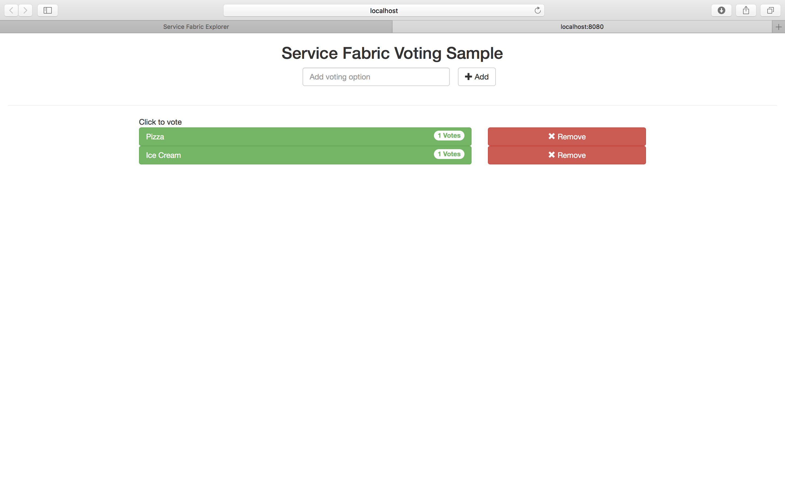

#  Debug a Java application deployed on a local Service Fabric cluster 
This tutorial is part two of a series. You will learn how to attach a remote debugger using Eclipse for the Service Fabric application built in part one of this tutorial. You will also learn how to redirect logs from the running applications to a location convenient for the developer.

In part three of the series, you learn how to:

> [!div class="checklist"]
> * Create resources to deploy a Linux cluster in Azure
> * Use Service Fabric party clusters 
> * Upgrade applications 
> * Scale the instances of both front-end and back-end services

In this tutorial series you learn how to:
> [!div class="checklist"]
> * Debug Java application using Eclipse
> * Redirect logs to a configurable location

## Prerequisites
Before you begin this tutorial:
- If you haven't completed part one of this [tutorial](service-fabric-tutorial-create-java-app.md) series, please do so as the Java application from that is used for this tutorial. Alternatively, if you have your own Service Fabric Java application, the steps for this tutorial series apply. 

## Debug Java application using Eclipse

1. Open the Eclipse IDE on your machine and click on **File -> Import ...**.
2. In the popup window select the **General -> Existing Projects into Workspace** option and press Next. 
3. In the Import Projects window, choose the **Select root directory** option and pick the **Voting** directory (if you followed tutorial series one, this will be in your eclipse-workspace directory). 
4. Update entryPoint.sh of the service you wish to debug, so that it starts the java process with remote debug parameters. For this tutorial we will use the stateless front-end: ``Voting/VotingApplication/VotingWebPkg/Code/entryPoint.sh``. Port 8001 is set for debugging in this example.
```bash
java -Xdebug -Xrunjdwp:transport=dt_socket,address=8001,server=y,suspend=y -Djava.library.path=$LD_LIBRARY_PATH -jar VotingWeb.jar
```
5. Update the Application Manifest by setting the instance count or the replica count for the service that is being debugged to 1. This setting avoids conflicts for the port that is used for debugging. For example, for stateless services, set ``InstanceCount="1"`` and for stateful services set the target and min replica set sizes to 1 as follows: `` TargetReplicaSetSize="1" MinReplicaSetSize="1"``.
6. In the Eclipse IDE, select **Run -> Debug Configurations -> Remote Java Application**, press the **New** button, set the properties as follows and click **Apply**.
```
Name: Voting
Project: Voting
Connection Type: Standard
Host: localhost
Port: 8001
```
7. Put a breakpoint on line 109 of the **Voting/VotingWeb/src/statelessservice/HttpCommunicationListener.java** file. 
8. In the Package Explorer, right click on the **Voting** project and click **Service Fabric -> Publish Application ...** 
9. In the **Publish Application** window, select **Local.json** from the dropdown and click **Publish**.
10. In the Eclipse IDE, select **Run -> Debug Configurations -> Remote Java Application**, click on the **Voting** configuration you created and click **Debug**.
10. Go to your web browser and access **localhost:8080** to hit the breakpoint and enter the **Debug perspective** in Eclipse.

If the application is crashing, you may also want to enable coredumps. Execute ``ulimit -c`` in a shell and if it returns 0, then coredumps are not enabled. To enable unlimited coredumps, execute the following command: ``ulimit -c unlimited``. You can also verify the status using the command ``ulimit -a``.  If you wanted to update the coredump generation path, execute ``echo '/tmp/core_%e.%p' | sudo tee /proc/sys/kernel/core_pattern``. 

## Redirect application logs to custom location

The steps below will walk through how to redirect your application logs from the default ```/var/log/syslog``` location to a custom location. 

1. Create a file named logging.properties in the following location ``Voting/VotingApplication/VotingWebPkg/Code/logging.properties`` and add the following 
```
handlers = java.util.logging.FileHandler

java.util.logging.FileHandler.level = ALL
java.util.logging.FileHandler.formatter = java.util.logging.SimpleFormatter
java.util.logging.FileHandler.limit = 1024000
java.util.logging.FileHandler.count = 10

# This value specifies your custom location. You will have to ensure this path has read and write access by the process running the SF Application
java.util.logging.FileHandler.pattern = /root/tmp/mysfapp%u.%g.log
```

2. Add the following parameter in the ```Voting/VotingApplication/VotingWebPkg/Code/entryPoint.sh``` for the Java execution command: 
```bash
-Djava.util.logging.config.file=logging.properties
```
The execution could look something like this
```bash
java -Xdebug -Xrunjdwp:transport=dt_socket,address=8001,server=y,suspend=y -Djava.library.path=$LD_LIBRARY_PATH -Djava.util.logging.config.file=logging.properties -jar VotingWeb.jar
```


## Update your existing application 

1. Update the ```VotingApplication/VotingWebPkg/Code/wwwroot/index.html``` file with the below. 
```html 
<!DOCTYPE html>
<html>
<script src="https://ajax.googleapis.com/ajax/libs/angularjs/1.6.4/angular.min.js"></script>
<script src="http://cdnjs.cloudflare.com/ajax/libs/angular-ui-bootstrap/0.13.4/ui-bootstrap-tpls.min.js"></script>
<link rel="stylesheet" href="https://maxcdn.bootstrapcdn.com/bootstrap/3.3.7/css/bootstrap.min.css">
<body>

<script>
var app = angular.module('VotingApp', ['ui.bootstrap']); 
app.controller("VotingAppController", ['$rootScope', '$scope', '$http', '$timeout', function ($rootScope, $scope, $http, $timeout) {
    $scope.votes = [];
    
    $scope.refresh = function () {
        $http.get('getStatelessList')
            .then(function successCallback(response) {
		$scope.votes = Object.assign(
		  {},
		  ...Object.keys(response.data) .
		    map(key => ({[decodeURI(key)]: response.data[key]}))
		)
  		},
  		function errorCallback(response) {
      		alert(response);
  		});
    };

    $scope.remove = function (item) {            
       $http.get("removeItem", {params: { item: encodeURI(item) }})
       		.then(function successCallback(response) {
     			$scope.refresh();
  			},
  			function errorCallback(response) {
      			alert(response);
  			});
    };

    $scope.add = function (item) {
        if (!item) {return;}        
       	$http.get("addItem", {params: { item: encodeURI(item) }})
   			.then(function successCallback(response) {
 				$scope.refresh();
			},
			function errorCallback(response) {
  				alert(response);
			});        
    };
}]);
</script>

<div ng-app="VotingApp" ng-controller="VotingAppController" ng-init="refresh()">
    <div class="container-fluid">
        <div class="row">
            <div class="col-xs-8 col-xs-offset-2 text-center">
                <h2>Service Fabric Voting Sample</h2>
            </div>
        </div>

        <div class="row">
            <div class="col-xs-offset-2">
                <form style="width:50% ! important;" class="center-block">
                    <div class="col-xs-6 form-group">
                        <input id="txtAdd" type="text" class="form-control" placeholder="Add voting option" ng-model="item" />
                    </div>
                    <button id="btnAdd" class="btn btn-default" ng-click="add(item)">
                        <span class="glyphicon glyphicon-plus" aria-hidden="true"></span>
                        Add
                    </button>
                </form>
            </div>
        </div>

        <hr />

        <div class="row">
            <div class="col-xs-8 col-xs-offset-2">
                <div class="row">
                    <div class="col-xs-4">
                        Click to vote
                    </div>
                </div>
                <div class="row top-buffer" ng-repeat="(key, value)  in votes">
                    <div class="col-xs-8">
                        <button class="btn btn-success text-left btn-block" ng-click="add(key)">
                            <span class="pull-left">
                                {{key}}
                            </span>
                            <span class="badge pull-right">
                                {{value}} Votes
                            </span>
                        </button>
                    </div>
                    <div class="col-xs-4">
                        <button class="btn btn-danger pull-right btn-block" ng-click="remove(key)">
                            <span class="glyphicon glyphicon-remove" aria-hidden="true"></span>
                            Remove
                        </button>
                    </div>
                </div>
            </div>
        </div>
    </div>
</div>

</body>
</html>
```

2. Update the **ApplicationTypeVersion** and **ServiceManifestVersion** version to **2.0.0** in the ```Voting/VotingApplication/ApplicationManifest.xml``` file. 

```xml
<?xml version="1.0" encoding="utf-8" standalone="no"?>
<ApplicationManifest xmlns="http://schemas.microsoft.com/2011/01/fabric" xmlns:xsi="http://www.w3.org/2001/XMLSchema-instance" ApplicationTypeName="VotingApplicationType" ApplicationTypeVersion="2.0.0">
  <Description>Voting Application</Description>
  <ServiceManifestImport>
    <ServiceManifestRef ServiceManifestName="VotingWebPkg" ServiceManifestVersion="2.0.0"/>
  </ServiceManifestImport>
  <ServiceManifestImport>
        <ServiceManifestRef ServiceManifestName="VotingDataServicePkg" ServiceManifestVersion="1.0.0"/>
    </ServiceManifestImport>
    <DefaultServices>
      <Service Name="VotingWeb">
         <StatelessService InstanceCount="1" ServiceTypeName="VotingWebType">
            <SingletonPartition/>
         </StatelessService>
      </Service>      
   <Service Name="VotingDataService">
            <StatefulService MinReplicaSetSize="3" ServiceTypeName="VotingDataServiceType" TargetReplicaSetSize="3">
                <UniformInt64Partition HighKey="9223372036854775807" LowKey="-9223372036854775808" PartitionCount="1"/>
            </StatefulService>
        </Service>
    </DefaultServices>      
</ApplicationManifest>
```

3. Update the **Version** field in the **ServiceManifest** and the **Version** field in the **CodePackage** tag in the ```Voting/VotingApplication/VotingWebPkg/ServiceManifest.xml``` file to **2.0.0**.
```xml
<CodePackage Name="Code" Version="2.0.0">
<EntryPoint>
    <ExeHost>
    <Program>entryPoint.sh</Program>
    </ExeHost>
</EntryPoint>
</CodePackage>
```
4. In Terminal, run the ```Voting/Scripts/upgrade.sh``` script to initialize an upgrade of your application. 
```bash
./upgrade.sh 2.0.0
``` 
5. In Service Fabric Explorer, if you click on the **Applications** dropdown and click on the **Upgrades in Progress** tab, you will see the status of your upgrade. 


6. If you access **localhost:8080**, you will see the Voting application with full functionality now up and running. 


At this stage, you have learned how to debug and access your application logs while developing your Service Fabric Java applications. 
## Next steps
In this part of the tutorial, you learned how to:

> [!div class="checklist"]
> * Debug Java application using Eclipse
> * Redirect logs to a configurable location

Advance to the next tutorial:
> [!div class="nextstepaction"]
> [Deploy application to Azure](service-fabric-tutorial-java-deploy-azure.md)