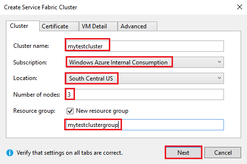
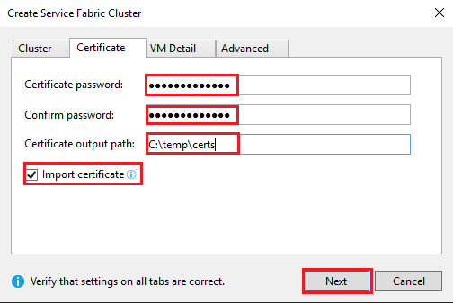
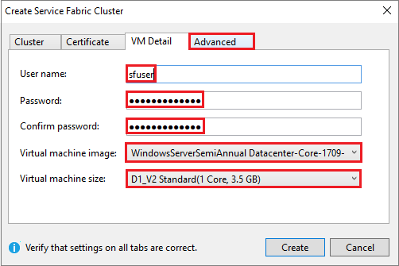
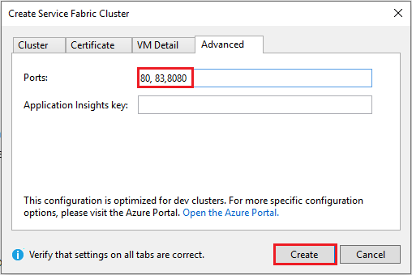
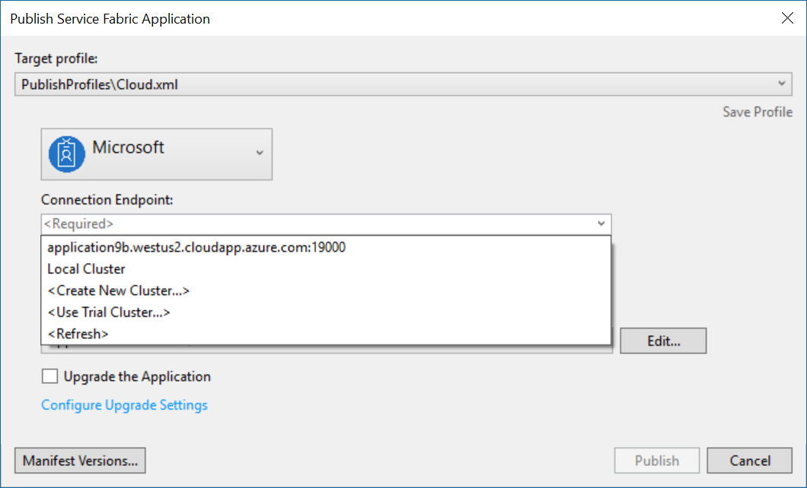
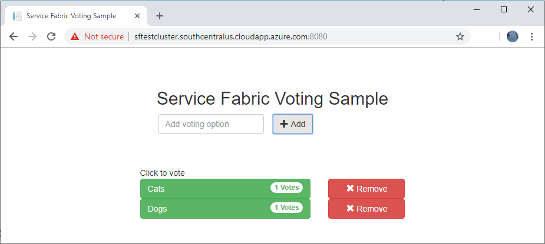

# Tutorial: Deploy a Service Fabric application to a cluster in Azure

This tutorial is part two of a series. It shows you how to deploy an Azure Service Fabric application to a new cluster in Azure.

In this tutorial, you learn how to:
> [!div class="checklist"]
> * Create a cluster.
> * Deploy an application to a remote cluster using Visual Studio.

In this tutorial series, you learn how to:
> [!div class="checklist"]
> * [Build a .NET Service Fabric application](service-fabric-tutorial-create-dotnet-app.md).
> * Deploy the application to a remote cluster.
> * [Add an HTTPS endpoint to an ASP.NET Core front-end service](service-fabric-tutorial-dotnet-app-enable-https-endpoint.md).
> * [Configure CI/CD by using Azure Pipelines](service-fabric-tutorial-deploy-app-with-cicd-vsts.md).
> * [Set up monitoring and diagnostics for the application](service-fabric-tutorial-monitoring-aspnet.md).

## Prerequisites

Before you begin this tutorial:

* If you don't have an Azure subscription, create a [free account](https://azure.microsoft.com/free/?WT.mc_id=A261C142F).
* [Install Visual Studio 2019](https://www.visualstudio.com/), and install the **Azure development** and **ASP.NET and web development** workloads.
* [Install the Service Fabric SDK](service-fabric-get-started.md).

> [!NOTE]
> A free account may not meet the requirements to create a virtual machine. This will prevent the completion of the tutorial. In addition, a non-work or non-school account may encounter permission issues while creating the certificate on the keyvault associated with the cluster. If you experience an error related to certificate creation use the Portal to create the cluster instead. 

## Download the voting sample application

If you didn't build the voting sample application in [part one of this tutorial series](service-fabric-tutorial-create-dotnet-app.md), you can download it. In a command window, run the following code to clone the sample application repository to your local machine.

```git
git clone https://github.com/Azure-Samples/service-fabric-dotnet-quickstart 
```

Open the application in Visual Studio, running as administrator, and build the application.

## Create a cluster

Now that the application is ready, you create a Service Fabric cluster and then deploy the application to the cluster. A [Service Fabric cluster](https://docs.microsoft.com/azure/service-fabric/service-fabric-deploy-anywhere) is a network-connected set of virtual or physical machines into which your microservices are deployed and managed.

In this tutorial, you create a new three node test cluster in the Visual Studio IDE and then publish the application to that cluster. See the [Create and manage a cluster tutorial](service-fabric-tutorial-create-vnet-and-windows-cluster.md) for information on creating a production cluster. You can also deploy the application to an existing cluster that you previously created through the [Azure portal](https://portal.azure.com), by using [PowerShell](./scripts/service-fabric-powershell-create-secure-cluster-cert.md) or [Azure CLI](./scripts/cli-create-cluster.md) scripts, or from an [Azure Resource Manager template](service-fabric-tutorial-create-vnet-and-windows-cluster.md).

> [!NOTE]
> The Voting application, and many other applications, use the Service Fabric reverse proxy to communicate between services. Clusters created from Visual Studio have the reverse proxy enabled by default. If you're deploying to an existing cluster, you must [enable the reverse proxy in the cluster](service-fabric-reverseproxy-setup.md) for the Voting application to work.


### Find the VotingWeb service endpoint

The front-end web service of the Voting application is listening on a specific port (8080 if you in followed the steps in [part one of this tutorial series](service-fabric-tutorial-create-dotnet-app.md). When the application deploys to a cluster in Azure, both the cluster and the application run behind an Azure load balancer. The application port must be opened in the Azure load balancer by using a rule. The rule sends inbound traffic through the load balancer to the web service. The port is found in the **VotingWeb/PackageRoot/ServiceManifest.xml** file in the **Endpoint** element. 

```xml
<Endpoint Protocol="http" Name="ServiceEndpoint" Type="Input" Port="8080" />
```

Take note of the service endpoint, which is needed in a later step.  If you're deploying to an existing cluster, open this port by creating a load-balancing rule and probe in the Azure load balancer using a [PowerShell script](./scripts/service-fabric-powershell-open-port-in-load-balancer.md) or via the load balancer for this cluster in the [Azure portal](https://portal.azure.com).

### Create a test cluster in Azure
In Solution Explorer, right-click on **Voting** and select **Publish**.

In **Connection Endpoint**, select **Create New Cluster**.  If you're deploying to an existing cluster, select the cluster endpoint from the list.  The Create Service Fabric Cluster dialog opens.

In the **Cluster** tab, enter the **Cluster name** (for example, "mytestcluster"), select your subscription, select a region for the cluster (such as South Central US), enter the number of cluster nodes (we recommend three nodes for a test cluster), and enter a resource group (such as "mytestclustergroup"). Click **Next**.



In the **Certificate** tab, enter the password and output path for the cluster certificate. A self-signed certificate is created as a PFX file and saved to the specified output path.  The certificate is used for both node-to-node and client-to-node security.  Don't use a self-signed certificate for production clusters.  This certificate is used by Visual Studio to authenticate with the cluster and deploy applications. Select **Import certificate** to install the PFX in the CurrentUser\My certificate store of your computer.  Click **Next**.



In the **VM Detail** tab, enter the **User name** and **Password** for the cluster admin account.  Select the **Virtual machine image** for the cluster nodes and the **Virtual machine size** for each cluster node.  Click the **Advanced** tab.



In **Ports**, enter the VotingWeb service endpoint from the previous step (for example, 8080).  When the cluster is created, these application ports are opened in the Azure load balancer to forward traffic to the cluster.  Click **Create** to create the cluster, which takes several minutes.



## Publish the application to the cluster

When the new cluster is ready, you can deploy the Voting application directly from Visual Studio.

In Solution Explorer, right-click on **Voting** and select **Publish**. The **Publish** dialog box appears.

In **Connection Endpoint**, select the endpoint for the cluster you created in the previous step.  For example, "mytestcluster.southcentral.cloudapp.azure.com:19000". If you select **Advanced Connection Parameters**, the certificate information should be auto-filled.  


Select **Publish**.

Once the application is deployed, open a browser and enter the cluster address followed by **:8080**. Or enter another port if one is configured. An example is `http://mytestcluster.southcentral.cloudapp.azure.com:8080`. You see the application running in the cluster in Azure. In the voting web page, try adding and deleting voting options and voting for one or more of these options.




## Next steps
In this part of the tutorial, you learned how to:

> [!div class="checklist"]
> * Create a cluster.
> * Deploy an application to a remote cluster using Visual Studio.

Advance to the next tutorial:
> [!div class="nextstepaction"]
> [Enable HTTPS](service-fabric-tutorial-dotnet-app-enable-https-endpoint.md)
