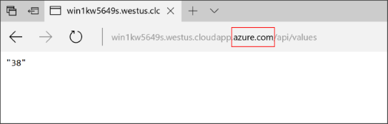
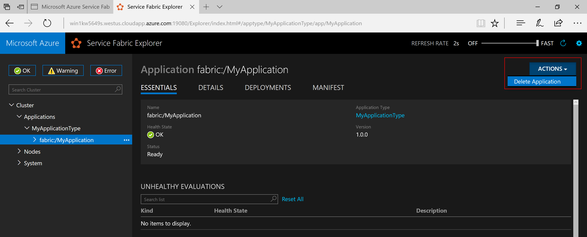
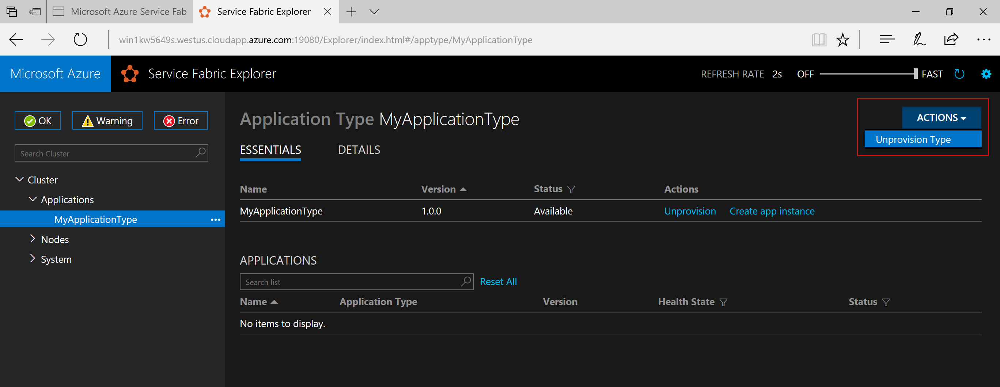

# Deploy an application to a Party Cluster in Azure
This tutorial shows you how to deploy an Azure Service Fabric application to a Party Cluster in Azure.

In this part of the tutorial, you learn how to:
> [!div class="checklist"]
> * Deploy an application to a remote cluster using Visual Studio
> * Remove an application from a cluster using Service Fabric Explorer

The tutorial is split across three articles, this article is the second in the series.

## Prerequisites
Before you begin this tutorial:
- If you don't have an Azure subscription, create a [free account](https://azure.microsoft.com/free/?WT.mc_id=A261C142F)
- [Install Visual Studio 2017](https://www.visualstudio.com/) and install the **Azure development** and **ASP.NET and web development** workloads.
- [Install the Service Fabric SDK](service-fabric-get-started.md)

## Set up a Party Cluster
Party clusters are free, limited-time Service Fabric clusters hosted on Azure and run by the Service Fabric team where anyone can deploy applications and learn about the platform. For free!

To get access to a Party Cluster, browse to this site: http://aka.ms/tryservicefabric and follow the instructions to get access to a cluster. You need a Facebook or GitHub account to get access to a Party Cluster.

> [!NOTE]
> Party clusters are not secured, so your applications and any data you put in them may be visible to others. Don't deploy anything you don't want others to see. Be sure to read over our Terms of Use for all the details.

## Make your application ready for deployment
As our ASP.NET Core web api service acts as the front end for this application and accept external traffic, we want to bind that service to a fixed and well-know port. Specifying the port in the services **ServiceManifest.xml** file.

1. In Solution Explorer, open up **WebAPIFrontEnd->PackageRoot->ServiceManifest.xml**.
2. Change the **Port** attribute of the existing **Endpoint** element to **80** and save your changes.

## Deploy the app to the Azure
Now that the application is ready, you can deploy it to the Party Cluster direct from Visual Studio.

1. Right-click **MyApplication** in the Solution Explorer and choose **Publish**.

    

2. Type in the Connection Endpoint of the Party Cluster in the **Connection Endpoint** field and click **Publish**.

    Once the publish has finished, you should be able to send a request to the application via a browser.

3. Open you preferred browser and type in the cluster address (the connection endpoint without the port information - for example, win1kw5649s.westus.cloudapp.azure.com), add `/api/values` to the url.

    You should now see the same result as you saw when running the application locally.

    

## Remove the application from a cluster using Service Fabric Explorer
Service Fabric Explorer is a graphical user interface to explore and manage applications in a Service Fabric cluster.

To remove the application we deployed to the Party Cluster:

1. Browse to the Service Fabric Explorer, using the link provided by the Party Cluster sign-up page. For example, http://win1kw5649s.westus.cloudapp.azure.com:19080/Explorer/index.html.

2. In Service Fabric Explorer, navigate to the **fabric://MyApplication** node in the treeview on the left-hand side.

3. Click the **Action** button in the right-hand **Essentials** pane, and choose **Delete Application**. Confirm deleting the application instance, which removes the instance of our application running in the cluster.

Applications are deployed as application types in a Service Fabric cluster, which enables you to have multiple instances and versions of the application running within the cluster. After having removed the running instance of our application, we can also remove the type, to complete the cleanup of the deployment.

For more information about the application model in Service Fabric, see [Model an application in Service Fabric](service-fabric-application-model.md).

1. Navigate to the **MyApplicationType** node in the treeview.

2. Click the **Action** button in the right-hand **Essentials** pane, and choose **Unprovision Type**. Confirm unprovisioning the application type.

This concludes the tutorial.

## Next steps
In this tutorial, you learned how to:

> [!div class="checklist"]
> * Deploy an application to a remote cluster using Visual Studio
> * Remove an application from a cluster using Service Fabric Explorer

Advance to the next tutorial:
> [!div class="nextstepaction"]
> [Set up continuous integration using Visual Studio Team Services](service-fabric-tutorial-deploy-app-with-cicd-vsts.md)