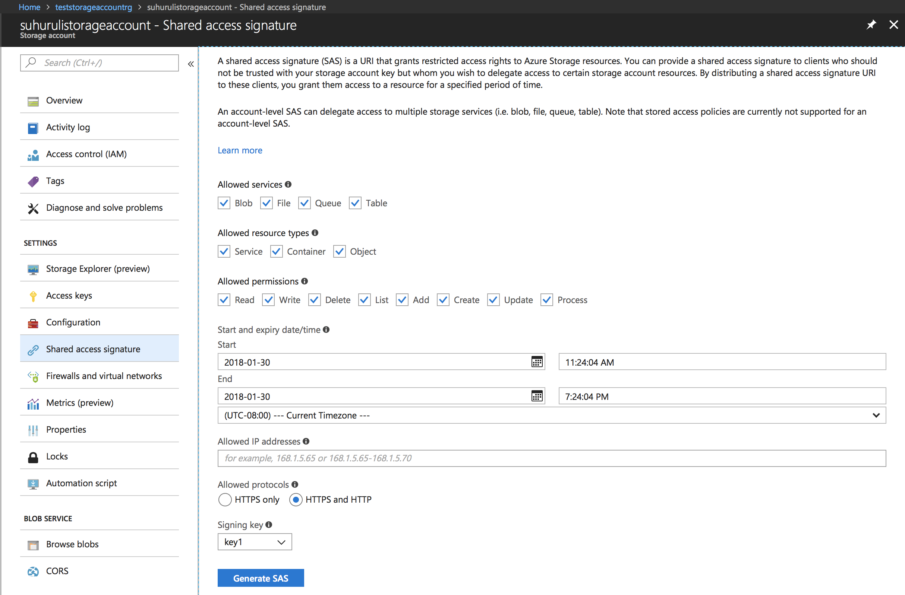
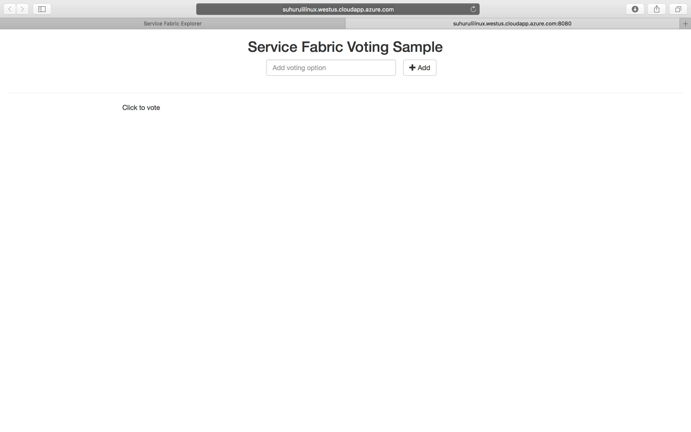

# Tutorial: Deploy a Java application to a Service Fabric cluster in Azure

This tutorial is part three of a series and shows you how to deploy a Service Fabric application to a cluster in Azure.

In part three of the series, you learn how to:

> [!div class="checklist"]
> * Create a secure Linux cluster in Azure
> * Deploy an application to the cluster

In this tutorial series you learn how to:

> [!div class="checklist"]
> * [Build a Java Service Fabric Reliable Services application](service-fabric-tutorial-create-java-app.md)
> * [Deploy and debug the application on a local cluster](service-fabric-tutorial-debug-log-local-cluster.md)
> * Deploy application to an Azure cluster
> * [Set up monitoring and diagnostics for the application](service-fabric-tutorial-java-elk.md)
> * [Set up CI/CD](service-fabric-tutorial-java-jenkins.md)

## Prerequisites

Before you begin this tutorial:

* If you don't have an Azure subscription, create a [free account](https://azure.microsoft.com/free/?WT.mc_id=A261C142F)
* [Install the Azure CLI](https://docs.microsoft.com/cli/azure/install-azure-cli?view=azure-cli-latest)
* Install the Service Fabric SDK for [Mac](service-fabric-get-started-mac.md) or [Linux](service-fabric-get-started-linux.md)
* [Install Python 3](https://wiki.python.org/moin/BeginnersGuide/Download)

## Create a Service Fabric cluster in Azure

The following steps create the necessary resources required to deploy your application to a Service Fabric cluster. Additionally, resources necessary to monitor the health of your solution using the ELK (Elasticsearch, Logstash, Kibana) stack are set up. Specifically, [Event Hubs](https://azure.microsoft.com/services/event-hubs/) is used as a sink for logs from Service Fabric. It is configured to send logs from the Service Fabric cluster to your Logstash instance.

1. Open a terminal and download the following package that contains necessary helper scripts and the templates to create the resources in Azure

    ```bash
    git clone https://github.com/Azure-Samples/service-fabric-java-quickstart.git
    ```

2. Sign in to your Azure account

    ```azurecli
    az login
    ```

3. Set your Azure subscription that you want to use to create the resources

    ```azurecli
    az account set --subscription [SUBSCRIPTION-ID]
    ```

4. From the *service-fabric-java-quickstart/AzureCluster* folder, run the following command to create a cluster certificate in Key Vault. This certificate is used to secure your Service Fabric cluster. Provide the region (must be the same as your Service Fabric cluster), key vault resource group name, key vault name, certificate password, and cluster DNS name.

    ```bash
    ./new-service-fabric-cluster-certificate.sh [REGION] [KEY-VAULT-RESOURCE-GROUP] [KEY-VAULT-NAME] [CERTIFICATE-PASSWORD] [CLUSTER-DNS-NAME-FOR-CERTIFICATE]

    Example: ./new-service-fabric-cluster-certificate.sh 'westus' 'testkeyvaultrg' 'testkeyvault' '<password>' 'testservicefabric.westus.cloudapp.azure.com'
    ```

    The preceding command returns the following information that should be noted for use later.

    ```output
    Source Vault Resource Id: /subscriptions/<subscription_id>/resourceGroups/testkeyvaultrg/providers/Microsoft.KeyVault/vaults/<name>
    Certificate URL: https://<name>.vault.azure.net/secrets/<cluster-dns-name-for-certificate>/<guid>
    Certificate Thumbprint: <THUMBPRINT>
    ```

5. Create a resource group for the storage account that stores your logs

    ```azurecli
    az group create --location [REGION] --name [RESOURCE-GROUP-NAME]

    Example: az group create --location westus --name teststorageaccountrg
    ```

6. Create a storage account which will be used to store the logs that will be produced

    ```azurecli
    az storage account create -g [RESOURCE-GROUP-NAME] -l [REGION] --name [STORAGE-ACCOUNT-NAME] --kind Storage

    Example: az storage account create -g teststorageaccountrg -l westus --name teststorageaccount --kind Storage
    ```

7. Access the [Azure portal](https://portal.azure.com) and navigate to the **Shared Access Signature** tab for your Storage account. Generate the SAS token as follows.

    

8. Copy the account SAS URL and set it aside for use when creating your Service Fabric cluster. It resembles the following URL:

    ```output
    ?sv=2017-04-17&ss=bfqt&srt=sco&sp=rwdlacup&se=2018-01-31T03:24:04Z&st=2018-01-30T19:24:04Z&spr=https,http&sig=IrkO1bVQCHcaKaTiJ5gilLSC5Wxtghu%2FJAeeY5HR%2BPU%3D
    ```

9. Create a resource group that contains the Event Hub resources. Event Hubs is used to send messages from Service Fabric to the server running the ELK resources.

    ```azurecli
    az group create --location [REGION] --name [RESOURCE-GROUP-NAME]

    Example: az group create --location westus --name testeventhubsrg
    ```

10. Create an Event Hubs resource using the following command. Follow the prompts to enter details for the namespaceName, eventHubName, consumerGroupName, sendAuthorizationRule, and receiveAuthorizationRule.

    ```azurecli
    az group deployment create -g [RESOURCE-GROUP-NAME] --template-file eventhubsdeploy.json

    Example:
    az group deployment create -g testeventhubsrg --template-file eventhubsdeploy.json
    Please provide string value for 'namespaceName' (? for help): testeventhubnamespace
    Please provide string value for 'eventHubName' (? for help): testeventhub
    Please provide string value for 'consumerGroupName' (? for help): testeventhubconsumergroup
    Please provide string value for 'sendAuthorizationRuleName' (? for help): sender
    Please provide string value for 'receiveAuthorizationRuleName' (? for help): receiver
    ```

    Copy the contents of the **output** field in the JSON output of the preceding command. The sender information is used when the Service Fabric cluster is created. The receiver name and key should be saved for use in the next tutorial when the Logstash service is configured to receive messages from Event Hub. The following blob is an example JSON output:

    ```json
    "outputs": {
        "receiver Key": {
            "type": "String",
            "value": "[KEY]"
        },
        "receiver Name": {
            "type": "String",
            "value": "receiver"
        },
        "sender Key": {
            "type": "String",
            "value": "[KEY]"
        },
        "sender Name": {
            "type": "String",
            "value": "sender"
        }
    }
    ```

11. Run the *eventhubssastoken.py* script to generate the SAS url for the EventHubs resource you created. This SAS URL is used by the Service Fabric cluster to send logs to Event Hubs. As a result, the **sender** policy is used to generate the URL. The script returns the SAS URL for the Event Hubs resource that is used in the following step:

    ```python
    python3 eventhubssastoken.py 'testeventhubs' 'testeventhubs' 'sender' '[PRIMARY-KEY]'
    ```

    Copy the value of the **sr** field in the JSON returned. The **sr** field value is the SAS token for EventHubs. The following URL is an example of the **sr** field:

    ```output
    https%3A%2F%testeventhub.servicebus.windows.net%testeventhub&sig=7AlFYnbvEm%2Bat8ALi54JqHU4i6imoFxkjKHS0zI8z8I%3D&se=1517354876&skn=sender
    ```

    Your SAS URL for the EventHubs follows the structure: `https://<namespacename>.servicebus.windows.net/<eventhubsname>?sr=<sastoken>`. For example,
    `https://testeventhubnamespace.servicebus.windows.net/testeventhub?sr=https%3A%2F%testeventhub.servicebus.windows.net%testeventhub&sig=7AlFYnbvEm%2Bat8ALi54JqHU4i6imoFxkjKHS0zI8z8I%3D&se=1517354876&skn=sender`

12. Open the *sfdeploy.parameters.json* file and replace the following contents from the preceding steps. [SAS-URL-STORAGE-ACCOUNT] was noted in step 8. [SAS-URL-EVENT-HUBS] was noted in step 11.

    ```json
    "applicationDiagnosticsStorageAccountName": {
        "value": "teststorageaccount"
    },
    "applicationDiagnosticsStorageAccountSasToken": {
        "value": "[SAS-URL-STORAGE-ACCOUNT]"
    },
    "loggingEventHubSAS": {
        "value": "[SAS-URL-EVENT-HUBS]"
    }
    ```

13. Opens **sfdeploy.parameters.json**. Change the following parameters and then save the file.
    - **clusterName**. Use only lower-case letters and numerals.
    - **adminUserName** (to a value other than blank)
    - **adminPassword** (to a value other than blank)

14. Run the following command to create your Service Fabric cluster

    ```azurecli
    az sf cluster create --location 'westus' --resource-group 'testlinux' --template-file sfdeploy.json --parameter-file sfdeploy.parameters.json --secret-identifier <certificate_url_from_step4>
    ```

## Deploy your application to the cluster

1. Before deploying your application, you need to add the following snippet to the *Voting/VotingApplication/ApplicationManifest.xml* file. The **X509FindValue** field is the thumbprint returned from Step 4 of the **Create a Service Fabric cluster in Azure** section. This snippet is nested under the **ApplicationManifest** field (the root field).

    ```xml
    <Certificates>
          <SecretsCertificate X509FindType="FindByThumbprint" X509FindValue="[CERTIFICATE-THUMBPRINT]" />
    </Certificates>
    ```

2. To deploy your application to this cluster, you must use SFCTL to establish a connection to the cluster. SFCTL requires a PEM file with both the public and private key to connect to the cluster. Run the following command to produce a PEM file with both the public and private key. 

    ```bash
    openssl pkcs12 -in <clustername>.<region>.cloudapp.azure.com.pfx -out sfctlconnection.pem -nodes -passin pass:<password>
    ```

3. Run the following command to connect to the cluster.

    ```bash
    sfctl cluster select --endpoint https://<clustername>.<region>.cloudapp.azure.com:19080 --pem sfctlconnection.pem --no-verify
    ```

4. To deploy your application, navigate to the *Voting/Scripts* folder and run the **install.sh** script.

    ```bash
    ./install.sh
    ```

5. To access Service Fabric Explorer, open your favorite browser and type in `https://testlinuxcluster.westus.cloudapp.azure.com:19080`. Choose the certificate from the certificate store that you want to use to connect to this endpoint. If you are using a Linux machine, the certificates that were generated by the *new-service-fabric-cluster-certificate.sh* script has to be imported into Chrome to view Service Fabric Explorer. If you are using a Mac, you have to install the PFX file into your Keychain. You notice your application has been installed on the cluster.

    

6. To access your application, type in `https://testlinuxcluster.westus.cloudapp.azure.com:8080`

    

7. To uninstall your application from the cluster, run the *uninstall.sh* script in the **Scripts** folder

    ```bash
    ./uninstall.sh
    ```

## Next steps

In this tutorial, you learned how to:

> [!div class="checklist"]
> * Create a secure Linux cluster in Azure
> * Create resources necessary for monitoring with ELK

Advance to the next tutorial:
> [!div class="nextstepaction"]
> [Set up Monitoring & Diagnostics](service-fabric-tutorial-java-elk.md)
