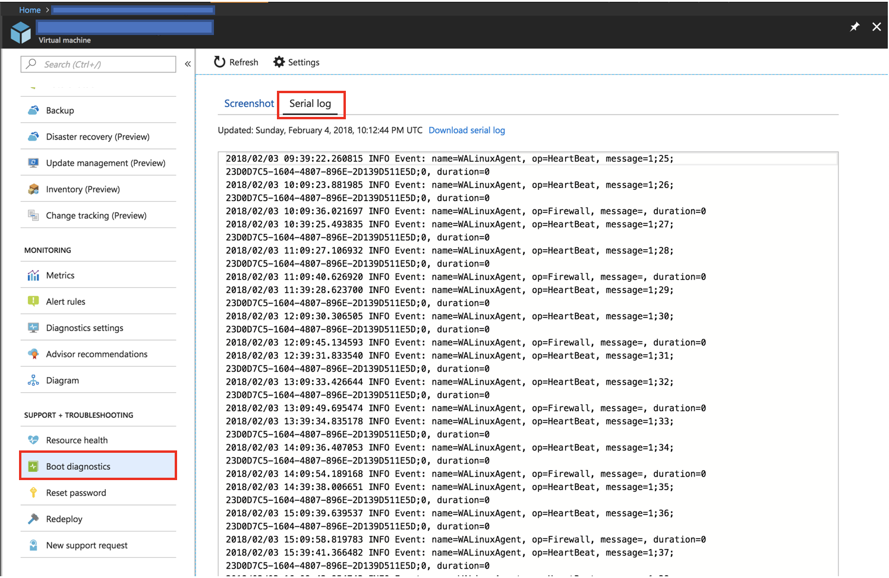
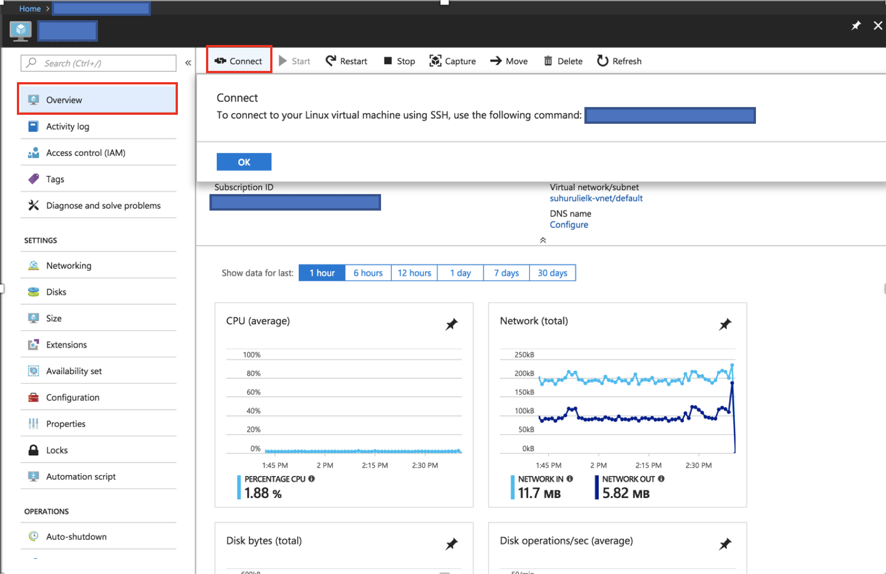
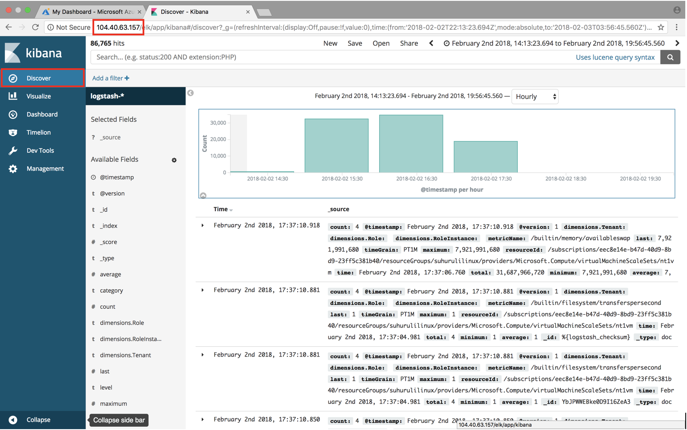

# Tutorial: Monitor your Service Fabric applications using ELK

This tutorial is part four of a series. It shows how to use ELK (Elasticsearch, Logstash, and Kibana) to monitor Service Fabric applications running in Azure.

In part four of the series, you learn how to:
> [!div class="checklist"]
> * Set up ELK server in Azure
> * Configure Logstash to receive logs from Event Hubs
> * Visualize platform and application logs in Kibana

In this tutorial series you learn how to:
> [!div class="checklist"]
> * [Build a Java Service Fabric Reliable Services application](service-fabric-tutorial-create-java-app.md)
> * [Deploy and debug the application on a local cluster](service-fabric-tutorial-debug-log-local-cluster.md)
> * [Deploy application to an Azure cluster](service-fabric-tutorial-java-deploy-azure.md)
> * Set up monitoring and diagnostics for the application
> * [Set up CI/CD](service-fabric-tutorial-java-jenkins.md)

## Prerequisites

Before you begin this tutorial:

* If you don't have an Azure subscription, create a [free account](https://azure.microsoft.com/free/?WT.mc_id=A261C142F)
* Set up your application to emit logs to the location specified in [part two](service-fabric-tutorial-debug-log-local-cluster.md).
* Complete [part three](service-fabric-tutorial-java-deploy-azure.md) and have a running Service Fabric cluster configured to send logs to Event Hubs.
* The policy in Event Hubs that has the 'Listen' permission and the associated primary key from series three.

## Download the Voting sample application

If you did not build the Voting sample application in [part one of this tutorial series](service-fabric-tutorial-create-java-app.md), you can download it. In a command window, run the following command to clone the sample app repository to your local machine.

```bash
git clone https://github.com/Azure-Samples/service-fabric-java-quickstart
```

## Create an ELK server in Azure

You can use a preconfigured ELK environment for this tutorial and if you already have one, skip to the **Setup Logstash** section. However, if you do not have one, the following steps creates one in Azure.

1. Create an ELK Certified by [Bitnami](https://ms.portal.azure.com/#create/bitnami.elk4-6) in Azure. For the purposes of the tutorial, there are not any particular specifications to follow for the creation of this server.

2. Go to your resource in Azure portal and enter the **Boot Diagnostics** tab under the **Support + Troubleshooting** section. Next, click on the **Serial Log** tab.

    
3. Do a search on the logs for the password is required to access the Kibana instance. It resembles the following snippet:

    ```bash
    [   25.932766] bitnami[1496]: #########################################################################
    [   25.948656] bitnami[1496]: #                                                                       #
    [   25.962448] bitnami[1496]: #        Setting Bitnami application password to '[PASSWORD]'           #
    [   25.978137] bitnami[1496]: #        (the default application username is 'user')                   #
    [   26.004770] bitnami[1496]: #                                                                       #
    [   26.029413] bitnami[1496]: #########################################################################
    ```

4. Press the connect button on the Overview page of the server in Azure portal to get the login details.

    

5. SSH into the server hosting the ELK image using the following command

    ```bash
    ssh [USERNAME]@[CONNECTION-IP-OF-SERVER]

    Example: ssh testaccount@104.40.63.157
    ```

## Set up ELK

1. The first step is to load the ELK environment

    ```bash
    sudo /opt/bitnami/use_elk
    ```

2. If you are using an existing environment, you have to run the following command to stop the Logstash service

    ```bash
    sudo /opt/bitnami/ctlscript.sh stop logstash
    ```

3. Run the following command to install the Logstash plugin for Event Hubs.

    ```bash
    logstash-plugin install logstash-input-azureeventhub
    ```

4. Create or modify your existing Logstash config file with the following contents: If you are creating the file, it has to be created at ```/opt/bitnami/logstash/conf/access-log.conf``` if using the ELK Bitnami image in Azure.

    ```json
    input
    {
        azureeventhub
        {
            key => "[RECEIVER-POLICY-KEY-FOR-EVENT-HUB]"
            username => "[RECEIVER-POLICY-NAME]"
            namespace => "[EVENTHUB-NAMESPACENAME]"
            eventhub => "[EVENTHUB-NAME]"
            partitions => 4
        }
    }

    output {
         elasticsearch {
             hosts => [ "127.0.0.1:9200" ]
         }
     }
    ```

5. To verify the configuration, run the following command:

    ```bash
    /opt/bitnami/logstash/bin/logstash -f /opt/bitnami/logstash/conf/ --config.test_and_exit
    ```

6. Start the Logstash service

    ```bash
    sudo /opt/bitnami/ctlscript.sh start logstash
    ```

7. Check your Elasticsearch to make sure you are receiving data

    ```bash
    curl 'localhost:9200/_cat/indices?v'
    ```

8. Access your Kibana dashboard at **http:\//SERVER-IP** and enter the username and password for Kibana. If you used the ELK image in Azure, the default username is 'user' and the password is the one obtained from the **Boot Diagnostics**.

    

## Next steps

In this tutorial, you learned how to:

> [!div class="checklist"]
> * Get an ELK server up and running in Azure
> * Configure the server to receive diagnostic information from your Service Fabric cluster

Advance to the next tutorial:
> [!div class="nextstepaction"]
> [Set up CI/CD with Jenkins](service-fabric-tutorial-java-jenkins.md)
