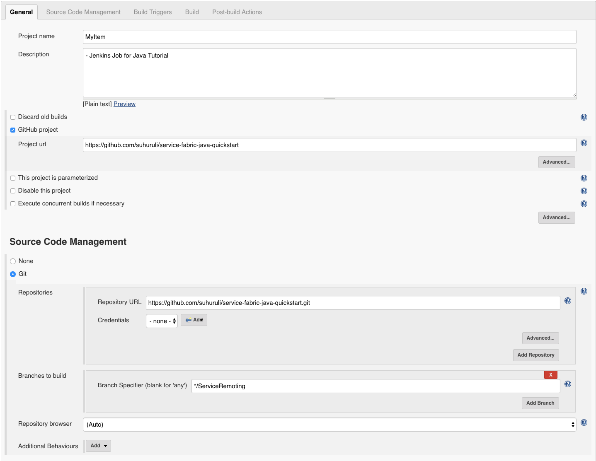
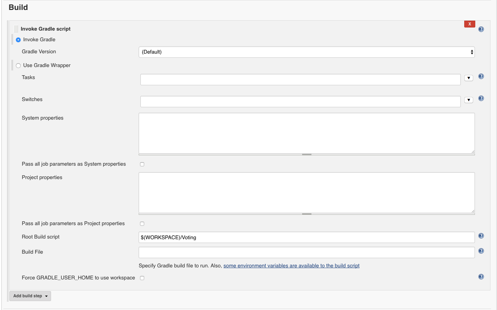
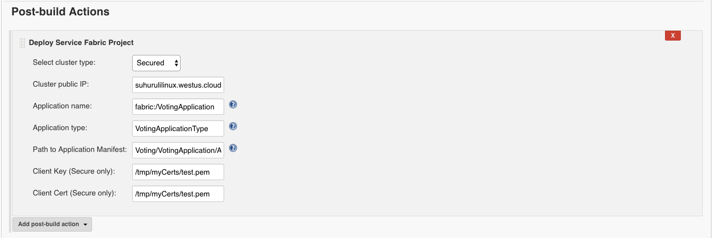
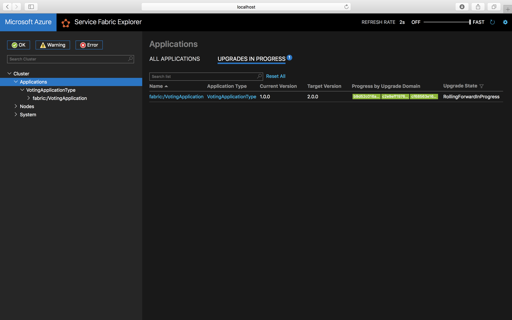
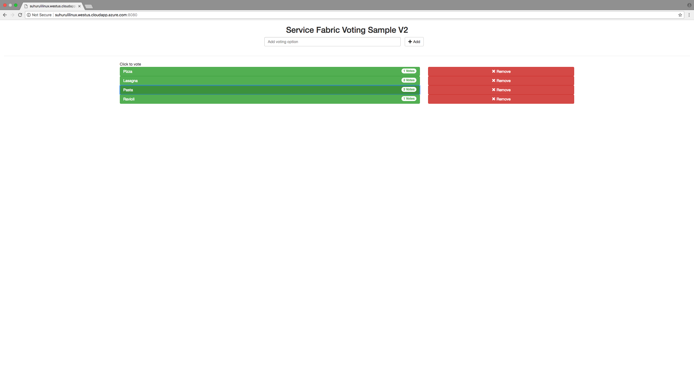

# Tutorial: Configure a Jenkins environment to enable CI/CD for a Java application on Service Fabric

This tutorial is part five of a series. It shows you how to use Jenkins to deploy upgrades to your application. In this tutorial, the Service Fabric Jenkins plugin is used in combination with a GitHub repository hosting the Voting application to deploy the application to a cluster.

In part five of the series, you learn how to:
> [!div class="checklist"]
> * Deploy Service Fabric Jenkins container on your machine
> * Set up Jenkins environment for deployment to Service Fabric
> * Upgrade your application

In this tutorial series you learn how to:
> [!div class="checklist"]
> * [Build a Java Service Fabric Reliable Services application](service-fabric-tutorial-create-java-app.md)
> * [Deploy and debug the application on a local cluster](service-fabric-tutorial-debug-log-local-cluster.md)
> * [Deploy application to an Azure cluster](service-fabric-tutorial-java-deploy-azure.md)
> * [Set up monitoring and diagnostics for the application](service-fabric-tutorial-java-elk.md)
> * Set up CI/CD

## Prerequisites

* Install Git on your local computer from [the Git downloads page](https://git-scm.com/downloads). For more information about Git, read the [Git documentation](https://git-scm.com/docs).
* Have a working knowledge of [Jenkins](https://jenkins.io/).
* Create a [GitHub](https://github.com/) account and know how to use GitHub.
* Install [Docker](https://www.docker.com/community-edition) on your computer.

## Pull and deploy Service Fabric Jenkins container image

You can set up Jenkins either inside or outside a Service Fabric cluster. The following instructions show how to set it up outside a cluster using a provided Docker image. However, a preconfigured Jenkins build environment can also be used. The following container image comes installed with the Service Fabric plugin and is ready for use with Service Fabric immediately.

1. Pull the Service Fabric Jenkins container image: ``docker pull rapatchi/jenkins:v10``. This image comes with Service Fabric Jenkins plugin pre-installed.

1. Run the container image with the location where your Azure certificates are stored on your mounted local machine.

    ```bash
    docker run -itd -p 8080:8080 -v /service-fabric-java-quickstart/AzureCluster rapatchi/jenkins:v10
    ```

1. Get the ID of the container image instance. You can list all the Docker containers with the command ``docker ps –a``

1. Retrieve the password of your Jenkins instance by running the following command:

    ```sh
    docker exec [first-four-digits-of-container-ID] cat /var/jenkins_home/secrets/initialAdminPassword
    ```

    If container ID is 2d24a73b5964, use 2d24.
    * This password is required for signing in to the Jenkins dashboard from portal, which is ``http://<HOST-IP>:8080``
    * After you sign in for the first time, you can create your own user account or use the admin account.

1. Set up GitHub to work with Jenkins by using the steps mentioned in [Generating a new SSH key and adding it to the SSH agent](https://help.github.com/articles/generating-a-new-ssh-key-and-adding-it-to-the-ssh-agent/). Since the commands are run from the Docker container, follow the instructions for the Linux environment.
   * Use the instructions provided by GitHub to generate the SSH key. Next, add the SSH key to the GitHub account that is hosting the repository.
   * Run the commands mentioned in the preceding link in the Jenkins Docker shell (and not on your host).
   * To sign in to the Jenkins shell from your host, use the following commands:

     ```sh
     docker exec -t -i [first-four-digits-of-container-ID] /bin/bash
     ```

     Ensure that the cluster or machine where the Jenkins container image is hosted has a public-facing IP. Having a public-facing IP enables the Jenkins instance to receive notifications from GitHub.

## Create and configure a Jenkins job

1. First, if you do not have a repository that you can use to host the Voting project on GitHub, create one. The repository is called **dev_test** for the remaining of this tutorial.

1. Create a **new item** on your Jenkins dashboard at ``http://<HOST-IP>:8080``.

1. Enter an item name (for example, **MyJob**). Select **free-style project**, and click **OK**.

1. Go the job page, and click **Configure**.

   a. In the general section, select the checkbox for **GitHub project**, and specify your GitHub project URL. This URL hosts the Service Fabric Java application that you want to integrate with the Jenkins continuous integration, continuous deployment (CI/CD) flow (for example, ``https://github.com/testaccount/dev_test``).

   b. Under the **Source Code Management** section, select **Git**. Specify the repository URL that hosts the Service Fabric Java application that you want to integrate with the Jenkins CI/CD flow (for example, *`https://github.com/testaccount/dev_test.git`*). Also, you can specify here which branch to build (for example, **/master**).

1. Configure your *GitHub* (which is hosting the repository) so that it is able to talk to Jenkins. Use the following steps:

   a. Go to your GitHub repository page. Go to **Settings** > **Integrations and Services**.

   b. Select **Add Service**, type **Jenkins**, and select the **Jenkins-GitHub plugin**.

   c. Enter your Jenkins webhook URL (by default, it should be ``http://<PublicIPorFQDN>:8081/github-webhook/``). Click **add/update service**.

   d. A test event is sent to your Jenkins instance. You should see a green check by the webhook in GitHub, and your project builds.

   

1. Under the **Build Triggers** section, select which build option you want. For this example, you want to trigger a build whenever some push to the repository happens. So you select **GitHub hook trigger for GITScm polling**.

1. Under the **Build section**, from the drop-down **Add build step**, select the option **Invoke Gradle Script**. In the widget that comes open the advanced menu, specify the path to **Root build script** for your application. It picks up build.gradle from the path specified and works accordingly.

    

1. From the **Post-Build Actions** drop-down, select **Deploy Service Fabric Project**. Here you need to provide cluster details where the Jenkins compiled Service Fabric application would be deployed. The path to the certificate is where the volume was mounted (/tmp/myCerts).

    You can also provide additional details used to deploy the application. See the following screenshot for an example for the application details:

    

    > [!NOTE]
    > The cluster here could be same as the one hosting the Jenkins container application, in case you are using Service Fabric to deploy the Jenkins container image.
    >

1. Click **Save**.

## Update your existing application

1. Update the title of the HTML in the *VotingApplication/VotingWebPkg/Code/wwwroot/index.html* file with **Service Fabric Voting Sample V2**.

    ```html
    <div ng-app="VotingApp" ng-controller="VotingAppController" ng-init="refresh()">
        <div class="container-fluid">
            <div class="row">
                <div class="col-xs-8 col-xs-offset-2 text-center">
                    <h2>Service Fabric Voting Sample V2</h2>
                </div>
            </div>
        </div>
    </div>
    ```

1. Update the **ApplicationTypeVersion** and **ServiceManifestVersion** version to **2.0.0** in the *Voting/VotingApplication/ApplicationManifest.xml* file.

    ```xml
    <?xml version="1.0" encoding="utf-8" standalone="no"?>
    <ApplicationManifest xmlns="http://schemas.microsoft.com/2011/01/fabric" xmlns:xsi="https://www.w3.org/2001/XMLSchema-instance" ApplicationTypeName="VotingApplicationType" ApplicationTypeVersion="2.0.0">
      <Description>Voting Application</Description>
      <ServiceManifestImport>
        <ServiceManifestRef ServiceManifestName="VotingWebPkg" ServiceManifestVersion="2.0.0"/>
      </ServiceManifestImport>
      <ServiceManifestImport>
            <ServiceManifestRef ServiceManifestName="VotingDataServicePkg" ServiceManifestVersion="1.0.0"/>
        </ServiceManifestImport>
        <DefaultServices>
          <Service Name="VotingWeb">
             <StatelessService InstanceCount="1" ServiceTypeName="VotingWebType">
                <SingletonPartition/>
             </StatelessService>
          </Service>
       <Service Name="VotingDataService">
                <StatefulService MinReplicaSetSize="3" ServiceTypeName="VotingDataServiceType" TargetReplicaSetSize="3">
                    <UniformInt64Partition HighKey="9223372036854775807" LowKey="-9223372036854775808" PartitionCount="1"/>
                </StatefulService>
            </Service>
        </DefaultServices>
    </ApplicationManifest>
    ```

1. Update the **Version** field in the **ServiceManifest** and the **Version** field in the **CodePackage** tag in the *Voting/VotingApplication/VotingWebPkg/ServiceManifest.xml* file to **2.0.0**.

    ```xml
    <CodePackage Name="Code" Version="2.0.0">
    <EntryPoint>
        <ExeHost>
        <Program>entryPoint.sh</Program>
        </ExeHost>
    </EntryPoint>
    </CodePackage>
    ```

1. To initialize a Jenkins job that performs an application upgrade, push your new changes to your GitHub repository.

1. In Service Fabric Explorer, click on the **Applications** dropdown. To see the status of your upgrade, click on the **Upgrades in Progress** tab.

    

1. If you access **http://\<Host-IP>:8080**  the Voting application with full functionality is now up and running.

    

## Next steps

In this tutorial, you learned how to:

> [!div class="checklist"]
> * Deploy Service Fabric Jenkins container on your machine
> * Set up Jenkins environment for deployment to Service Fabric
> * Upgrade your application

* Checkout other [Java Samples](https://github.com/Azure-Samples/service-fabric-java-getting-started)
