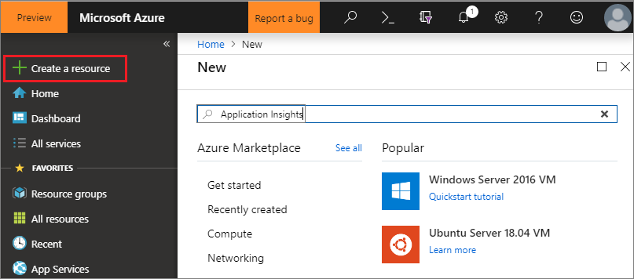
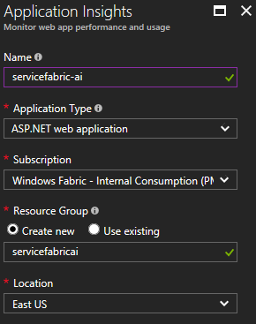
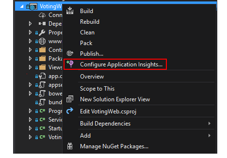
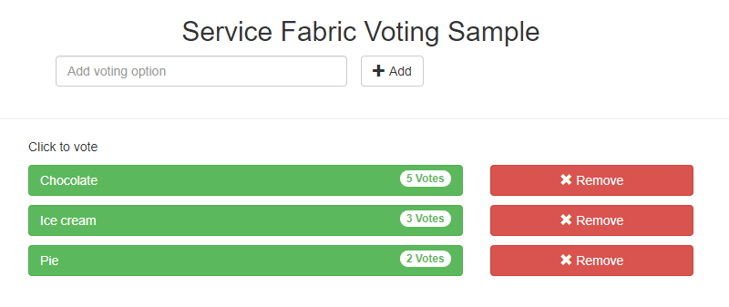
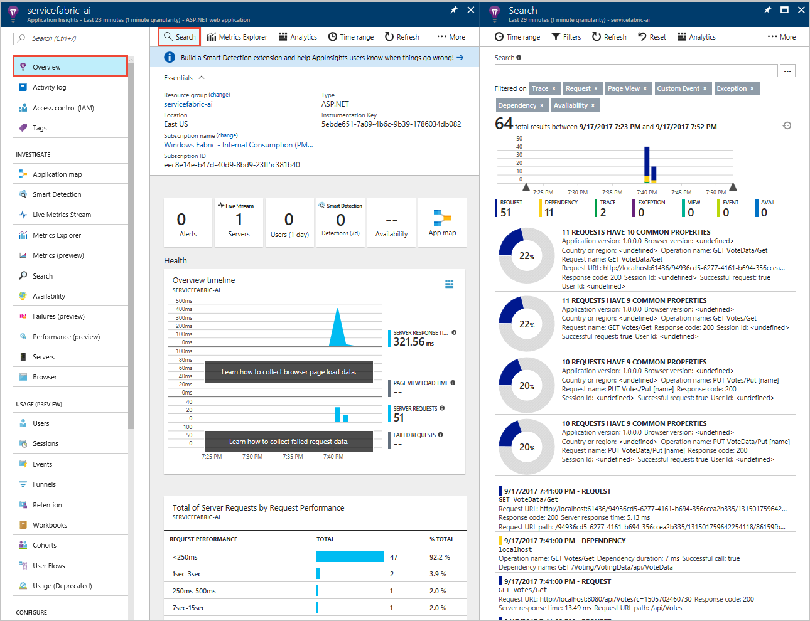
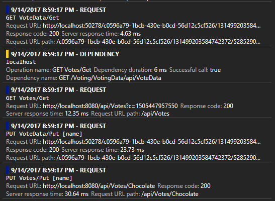
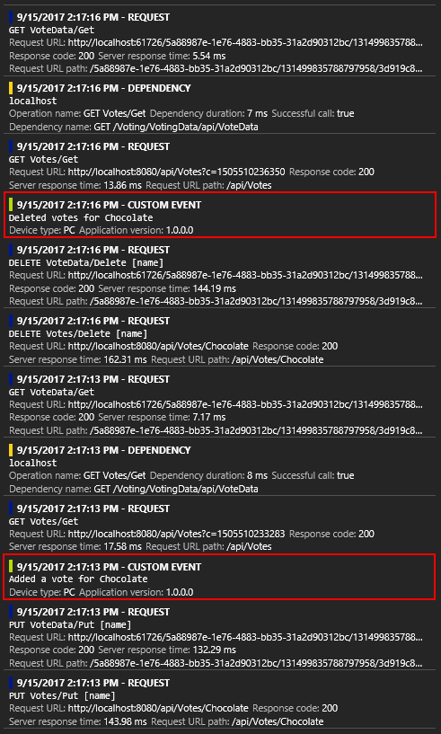

# Tutorial: Monitor and diagnose an ASP.NET Core application on Service Fabric using Application Insights

This tutorial is part five of a series. It goes through the steps to set up monitoring and diagnostics for an ASP.NET Core application running on a Service Fabric cluster using Application Insights. We will collect telemetry from the application developed in the first part of the tutorial, [Build a .NET Service Fabric application](service-fabric-tutorial-create-dotnet-app.md).

In part four of the tutorial series, you learn how to:
> [!div class="checklist"]
> * Configure Application Insights for your application
> * Collect response telemetry to trace HTTP-based communication between services
> * Use the App Map feature in Application Insights
> * Add custom events using the Application Insights API

In this tutorial series you learn how to:
> [!div class="checklist"]
> * [Build a .NET Service Fabric application](service-fabric-tutorial-create-dotnet-app.md)
> * [Deploy the application to a remote cluster](service-fabric-tutorial-deploy-app-to-party-cluster.md)
> * [Add an HTTPS endpoint to an ASP.NET Core front-end service](service-fabric-tutorial-dotnet-app-enable-https-endpoint.md)
> * [Configure CI/CD using Azure Pipelines](service-fabric-tutorial-deploy-app-with-cicd-vsts.md)
> * Set up monitoring and diagnostics for the application

## Prerequisites

Before you begin this tutorial:

* If you don't have an Azure subscription, create a [free account](https://azure.microsoft.com/free/?WT.mc_id=A261C142F)
* [Install Visual Studio 2019](https://www.visualstudio.com/) and install the **Azure development** and **ASP.NET and web development** workloads.
* [Install the Service Fabric SDK](service-fabric-get-started.md)

## Download the Voting sample application

If you did not build the Voting sample application in [part one of this tutorial series](service-fabric-tutorial-create-dotnet-app.md), you can download it. In a command window or terminal, run the following command to clone the sample app repository to your local machine.

```git
git clone https://github.com/Azure-Samples/service-fabric-dotnet-quickstart
```

## Set up an Application Insights resource

Application Insights is Azure's application performance management platform, and Service Fabric's recommended platform for application monitoring and diagnostics.

To create an Application Insights resource, navigate to [Azure portal](https://portal.azure.com). Click **Create a resource** on the left navigation menu to open up Azure Marketplace. Click on **Monitoring + Management** and then **Application Insights**.



You will now need to fill out required information about the attributes of the resource to be created. Enter an appropriate *Name*, *Resource Group*, and *Subscription*. Set the *Location* to where you would deploy your Service Fabric cluster in the future. In this tutorial, we will deploy the app to a local cluster so the *Location* field is irrelevant. The *Application Type* should be left as "ASP.NET web application."



Once you've filled out the required information, click **Create** to provision the resource - it should take about a minute.
<!-- When completed, navigate to the newly deployed resource, and find the "Instrumentation Key" (visible in the "Essentials" drop down section). Copy it to clipboard, since we will need it in the next step. -->

## Add Application Insights to the application's services

Launch Visual Studio 2019 with elevated privileges by right-clicking the Visual Studio icon in the Start Menu and choosing **Run as administrator**. Click **File** > **Open** > **Project/Solution** and navigate to the Voting application (either created in part one of the tutorial or git cloned). Open *Voting.sln*. If prompted to restore the application's NuGet packages, click **Yes**.

Follow these steps to configure Application Insights for both the VotingWeb and VotingData services:

1. Right-click on the name of the service, and click **Add > Connected Services > Monitoring with Application Insights**.

    
>[!NOTE]
>Depending on the project type, when you Right-click on the name of the service, you may need to click Add-> Application Insights Telemetry ...

2. Click **Get started**.
3. Sign in to the account you used to set up your Azure subscription and select the subscription in which you created the Application Insights resource. Find the resource under *Existing Application Insights resource* in the "Resource" dropdown. Click **Register** to add Application Insights to your service.

    

4. Click **Finish** once the dialog box that pops up completes the action.

> [!NOTE]
> Make sure to do the above steps for **both** of the services in the application to finish configuring Application Insights for the application.
> The same Application Insights resource is used for both of the services in order to see incoming and outgoing requests and communication between the services.

## Add the Microsoft.ApplicationInsights.ServiceFabric.Native NuGet to the services

Application Insights has two Service Fabric specific NuGets that can be used depending on the scenario. One is used with Service Fabric's native services, and the other with containers and guest executables. In this case, we'll be using the Microsoft.ApplicationInsights.ServiceFabric.Native NuGet to leverage the understanding of service context that it brings. To read more about the Application Insights SDK and the Service Fabric specific NuGets, see [Microsoft Application Insights for Service Fabric](https://github.com/Microsoft/ApplicationInsights-ServiceFabric/blob/master/README.md).

Here are the steps to set up the NuGet package:

1. Right-click on **Solution 'Voting'** at the very top of your Solution Explorer, and click **Manage NuGet Packages for Solution...**.
2. Click **Browse** on the top navigation menu of the "NuGet - Solution" window, and check the **Include prerelease** box next to the search bar.
>[!NOTE]
>You may need to install the Microsoft.ServiceFabric.Diagnostics.Internal package in a similar fashion if not preinstalled before installing the Application Insights package

3. Search for `Microsoft.ApplicationInsights.ServiceFabric.Native` and click on the appropriate NuGet package.
4. On the right, click on the two check boxes next to the two services in the application, **VotingWeb** and **VotingData** and click **Install**.
    
5. Click **OK** on the *Preview Changes* dialog box that appears, and accept the *License Acceptance*. This will complete adding the NuGet to the services.
6. You now need to set up the telemetry initializer in the two services. To do this, open up *VotingWeb.cs* and *VotingData.cs*. For both of them, do the following two steps:
    1. Add these two *using* statements at the top of each *\<ServiceName>.cs*, after the existing *using* statements:

    ```csharp
    using Microsoft.ApplicationInsights.Extensibility;
    using Microsoft.ApplicationInsights.ServiceFabric;
    ```

    2. In both files, in the nested *return* statement of *CreateServiceInstanceListeners()* or *CreateServiceReplicaListeners()*, under *ConfigureServices* > *services*, with the other singleton services declared, add:
    ```csharp
    .AddSingleton<ITelemetryInitializer>((serviceProvider) => FabricTelemetryInitializerExtension.CreateFabricTelemetryInitializer(serviceContext))
    ```
    This will add the *Service Context* to your telemetry, allowing you to better understand the source of your telemetry in Application Insights. Your nested *return* statement in *VotingWeb.cs* should look like this:

    ```csharp
    return new WebHostBuilder()
        .UseKestrel()
        .ConfigureServices(
            services => services
                .AddSingleton<HttpClient>(new HttpClient())
                .AddSingleton<FabricClient>(new FabricClient())
                .AddSingleton<StatelessServiceContext>(serviceContext)
                .AddSingleton<ITelemetryInitializer>((serviceProvider) => FabricTelemetryInitializerExtension.CreateFabricTelemetryInitializer(serviceContext)))
        .UseContentRoot(Directory.GetCurrentDirectory())
        .UseStartup<Startup>()
        .UseApplicationInsights()
        .UseServiceFabricIntegration(listener, ServiceFabricIntegrationOptions.None)
        .UseUrls(url)
        .Build();
    ```

    Similarly, in *VotingData.cs*, you should have:

    ```csharp
    return new WebHostBuilder()
        .UseKestrel()
        .ConfigureServices(
            services => services
                .AddSingleton<StatefulServiceContext>(serviceContext)
                .AddSingleton<IReliableStateManager>(this.StateManager)
                .AddSingleton<ITelemetryInitializer>((serviceProvider) => FabricTelemetryInitializerExtension.CreateFabricTelemetryInitializer(serviceContext)))
        .UseContentRoot(Directory.GetCurrentDirectory())
        .UseStartup<Startup>()
        .UseApplicationInsights()
        .UseServiceFabricIntegration(listener, ServiceFabricIntegrationOptions.UseUniqueServiceUrl)
        .UseUrls(url)
        .Build();
    ```

Double check that the `UseApplicationInsights()` method is called in both *VotingWeb.cs* and *VotingData.cs* as shown above.

>[!NOTE]
>This sample app uses http for the services to communicate. If you develop an app with Service Remoting V2 you'd need to add the following lines of code as well in the same place as you did above

```csharp
ConfigureServices(services => services
    ...
    .AddSingleton<ITelemetryModule>(new ServiceRemotingDependencyTrackingTelemetryModule())
    .AddSingleton<ITelemetryModule>(new ServiceRemotingRequestTrackingTelemetryModule())
)
```

At this point, you are ready to deploy the application. Click **Start** at the top (or **F5**), and Visual Studio will build and package the application, set up your local cluster, and deploy the application to it.

>[!NOTE]
>You may get a build error if you do not have an up-to-date version of the .NET Core SDK installed.

Once the application is done deploying, head over to `localhost:8080`, where you should be able to see the Voting Sample single page application. Vote for a few different items of your choice to create some sample data and telemetry - I went for desserts!



Feel free to *Remove* some of the voting options as well when you're done adding a few votes.

## View telemetry and the App map in Application Insights

Head over to your Application Insights resource in Azure portal.

Click **Overview** to go back to the landing page of your resource. Then click **Search** in the top to see the traces coming in. It takes a few minutes for traces to appear in Application Insights. In the case that you do not see any, wait a minute and hit the **Refresh** button at the top.


Scrolling down on the *Search* window will show you all the incoming telemetry you get out-of-the-box with Application Insights. For each action that you took in the Voting application, there should be an outgoing PUT request from *VotingWeb* (PUT Votes/Put [name]), an incoming PUT request from *VotingData* (PUT VoteData/Put [name]), followed by a pair of GET requests for refreshing the data being displayed. There will also be a dependency trace for HTTP on localhost, since these are HTTP requests. Here is an example of what you will see for how one vote is added:



You can click on one of the traces to view more details about it. There is useful information about the request that is provided by Application Insights, including the *Response time* and the *Request URL*. In addition, since you added the Service Fabric specific NuGet, you will also get data about your application in the context of a Service Fabric cluster in the *Custom Data* section below. This includes the service context, so you can see the *PartitionID* and *ReplicaId* of the source of the request, and better localize issues when diagnosing errors in your application.


Additionally, you can click *Application map* on the left menu on the Overview page, or click on the **App map** icon to take you to the App Map showing your two services connected.


The App map can help you understand your application topology better, especially as you start adding multiple different services that work together. It also gives you basic data on request success rates, and can help you diagnose failed request to understand where things may have gone wrong. To learn more about using the App map, see [Application Map in Application Insights](../azure-monitor/app/app-map.md).

## Add custom instrumentation to your application

Though Application Insights provides a lot of telemetry out of the box, you may want to add further custom instrumentation. This could be based on your business needs or to improve diagnostics when things go wrong in your application. Application Insights has an API to ingest custom events and metrics, which you can read more about [here](../azure-monitor/app/api-custom-events-metrics.md).

Let's add some custom events to *VoteDataController.cs* (under *VotingData* > *Controllers*) to track when votes are being added and deleted from the underlying *votesDictionary*.

1. Add `using Microsoft.ApplicationInsights;` at the end of the other using statements.
2. Declare a new *TelemetryClient* at the start of the class, under the creation of the *IReliableStateManager*: `private TelemetryClient telemetry = new TelemetryClient();`.
3. In the *Put()* function, add an event that confirms a vote has been added. Add `telemetry.TrackEvent($"Added a vote for {name}");` after the transaction has completed, right before the return *OkResult* statement.
4. In *Delete()*, there is an "if/else" based on the condition that the *votesDictionary* contains votes for a given voting option.
    1. Add an event that confirms the deletion of a vote in the *if* statement, after the *await tx.CommitAsync()*:
     `telemetry.TrackEvent($"Deleted votes for {name}");`
    2. Add an event to show that the deletion did not take place in the *else* statement, before the return statement:
    `telemetry.TrackEvent($"Unable to delete votes for {name}, voting option not found");`

Here's an example of what your *Put()* and *Delete()* functions may look like after adding the events:

```csharp
// PUT api/VoteData/name
[HttpPut("{name}")]
public async Task<IActionResult> Put(string name)
{
    var votesDictionary = await this.stateManager.GetOrAddAsync<IReliableDictionary<string, int>>("counts");

    using (ITransaction tx = this.stateManager.CreateTransaction())
    {
        await votesDictionary.AddOrUpdateAsync(tx, name, 1, (key, oldvalue) => oldvalue + 1);
        await tx.CommitAsync();
    }

    telemetry.TrackEvent($"Added a vote for {name}");
    return new OkResult();
}

// DELETE api/VoteData/name
[HttpDelete("{name}")]
public async Task<IActionResult> Delete(string name)
{
    var votesDictionary = await this.stateManager.GetOrAddAsync<IReliableDictionary<string, int>>("counts");

    using (ITransaction tx = this.stateManager.CreateTransaction())
    {
        if (await votesDictionary.ContainsKeyAsync(tx, name))
        {
            await votesDictionary.TryRemoveAsync(tx, name);
            await tx.CommitAsync();
            telemetry.TrackEvent($"Deleted votes for {name}");
            return new OkResult();
        }
        else
        {
            telemetry.TrackEvent($"Unable to delete votes for {name}, voting option not found");
            return new NotFoundResult();
        }
    }
}
```

Once you're done making these changes, **Start** the application so that it builds and deploys the latest version of it. Once the application is done deploying, head over to `localhost:8080`, and add and delete some voting options. Then, go back to your Application Insights resource to see the traces for the latest run (as before, traces can take 1-2 min to show up in Application Insights). For all the votes you added and deleted, you should now see a "Custom Event* along with all the response telemetry.



## Next steps

In this tutorial, you learned how to:
> [!div class="checklist"]
> * Configure Application Insights for your application
> * Collect response telemetry to trace HTTP-based communication between services
> * Use the App Map feature in Application Insights
> * Add custom events using the Application Insights API

Now that you have completed setting up monitoring and diagnostics for your ASP.NET application, try the following:

* [Further explore monitoring and diagnostics in Service Fabric](service-fabric-diagnostics-overview.md)
* [Service Fabric event analysis with Application Insights](service-fabric-diagnostics-event-analysis-appinsights.md)
* To learn more about Application Insights, see [Application Insights Documentation](https://docs.microsoft.com/azure/application-insights/)
