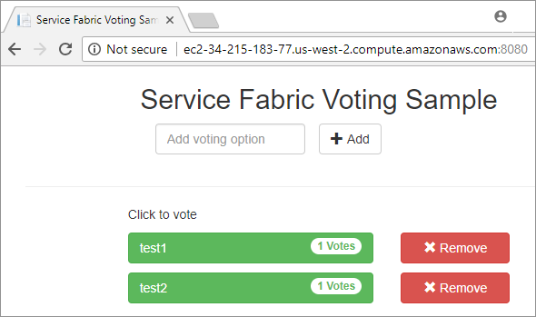

# Tutorial: Deploy an application on your Service Fabric standalone cluster

Service Fabric standalone clusters offer you the option to choose your own environment and create a cluster as part of the "any OS, any cloud" approach that Service Fabric is taking. In this tutorial series, you create a standalone cluster hosted on AWS and deploy an application into it.

This tutorial is part three of a series.  Service Fabric standalone clusters offer you the option to choose your own environment and create a cluster as part of our "any OS, any cloud" approach with Service Fabric. This tutorial shows you how to create the AWS infrastructure necessary to host this standalone cluster.

In part three of the series, you learn how to:

> [!div class="checklist"]
> * Download the sample app
> * Deploy to the cluster

## Prerequisites

Before you begin this tutorial:

* [Install Visual Studio 2019](https://www.visualstudio.com/) and install the **Azure development** and **ASP.NET and web development** workloads.
* [Install the Service Fabric SDK](service-fabric-get-started.md)

## Download the voting sample application

In a command window, run the following command to clone the sample app repository to your local machine.

```
git clone https://github.com/Azure-Samples/service-fabric-dotnet-quickstart
```

### Deploy the app to the Service Fabric cluster

Once the application is downloaded, you can deploy it to a cluster directly from Visual Studio.

1. Open Visual Studio

2. Select **File** > **Open**

3. Navigate to the folder you cloned the git repository to, and select Voting.sln

4. Right-click on the `Voting` application project in the Solution Explorer and choose **Publish**

5. Select the dropdown for the **Connection Endpoint** and enter the public DNS Name of one of the nodes in your cluster.  For example, `ec2-34-215-183-77.us-west-2.compute.amazonaws.com:19000`. Note that in Azure, a fully qualified domain name (FQDN) is not given automatically, but can easily [be set in VM Overview page.](https://docs.microsoft.com/azure/virtual-machines/linux/portal-create-fqdn)

6. Open you preferred browser and type in the cluster address (the connection endpoint, this app deploys on port 8080 - for example, ec2-34-215-183-77.us-west-2.compute.amazonaws.com:8080).

    

## Next steps

In part three of the series, you learned how to deploy an application to your cluster:

> [!div class="checklist"]
> * Download the sample app
> * Deploy to the cluster

Advance to part four of the series to clean up your cluster.

> [!div class="nextstepaction"]
> [Clean up your resources](service-fabric-tutorial-standalone-clean-up.md)