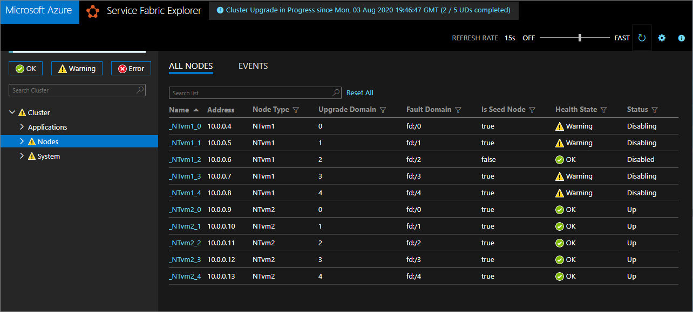
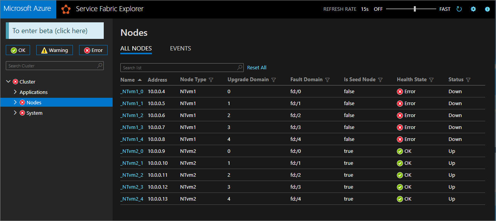

# Upgrade cluster nodes to use Azure managed disks

[Azure managed disks](../virtual-machines/windows/managed-disks-overview.md) are the recommended disk storage offering for use with Azure virtual machines for persistent storage of data. You can improve the resiliency of your Service Fabric workloads by upgrading the virtual machine scale sets that underlie your node types to use managed disks. Here's how to upgrade an existing Service Fabric cluster to use Azure managed disks with little or no downtime of your cluster.

The general strategy for upgrading a Service Fabric cluster node to use managed disks is to:

1. Deploy an otherwise duplicate virtual machine scale set of that node type, but with the [managedDisk](https://docs.microsoft.com/azure/templates/microsoft.compute/2019-07-01/virtualmachinescalesets/virtualmachines#ManagedDiskParameters) object added to the `osDisk` section of the virtual machine scale set deployment template. The new scale set should bind to the same load balancer / IP as the original, so that your customers don't experience a service outage during the migration.

2. Once both the original and upgraded scale sets are running side by side, disable the original node instances one at a time so that the system services (or replicas of stateful services) migrate to the new scale set.

3. Verify the cluster and new nodes are healthy, then remove the original scale set and node state for the deleted nodes.

This article will walk you through the steps of upgrading the primary node type of an example cluster to use managed disks, while avoiding any cluster downtime (see note below). The initial state of the example test cluster consists of one node type of [Silver durability](service-fabric-cluster-capacity.md#durability-characteristics-of-the-cluster), backed by a single scale set with five nodes.

> [!CAUTION]
> You will experience an outage with this procedure only if you have dependencies on the cluster DNS (such as when accessing [Service Fabric Explorer](service-fabric-visualizing-your-cluster.md)). Architectural [best practice for front-end services](https://docs.microsoft.com/azure/architecture/microservices/design/gateway) is to have some kind of [load balancer](https://docs.microsoft.com/azure/architecture/guide/technology-choices/load-balancing-overview) in front of your node types to make node swapping possible without an outage.

Here are the [templates and cmdlets](https://github.com/microsoft/service-fabric-scripts-and-templates/tree/master/templates/nodetype-upgrade-no-outage) for Azure Resource Manager that we'll use to complete the upgrade scenario. The template changes will be explained in [Deploy an upgraded scale set for the primary node type](#deploy-an-upgraded-scale-set-for-the-primary-node-type)  below.

## Set up the test cluster

Let's set up the initial Service Fabric test cluster. First, [download](https://github.com/microsoft/service-fabric-scripts-and-templates/tree/master/templates/nodetype-upgrade-no-outage) the Azure Resource Manager sample templates that we'll use to complete this scenario.

Next, sign in to your Azure account.

```powershell
# Sign in to your Azure account
Login-AzAccount -SubscriptionId "<subscription ID>"
```

The following commands will guide you through generating a new self-signed certificate and deploying the test cluster. If you already have a certificate you'd like to use, skip to [Use an existing certificate to deploy the cluster](#use-an-existing-certificate-to-deploy-the-cluster).

### Generate a self-signed certificate and deploy the cluster

First, assign the variables you'll need for Service Fabric cluster deployment. Adjust the values for `resourceGroupName`,  `certSubjectName`, `parameterFilePath`, and `templateFilePath` for your specific account and environment:

```powershell
# Assign deployment variables
$resourceGroupName = "sftestupgradegroup"
$certOutputFolder = "c:\certificates"
$certPassword = "Password!1" | ConvertTo-SecureString -AsPlainText -Force
$certSubjectName = "sftestupgrade.southcentralus.cloudapp.azure.com"
$templateFilePath = "C:\Initial-1NodeType-UnmanagedDisks.json"
$parameterFilePath = "C:\Initial-1NodeType-UnmanagedDisks.parameters.json"
```

> [!NOTE]
> Ensure that the `certOutputFolder` location exist on your local machine before running the command to deploy a new Service Fabric cluster.

Next open the [*Initial-1NodeType-UnmanagedDisks.parameters.json*](https://github.com/erikadoyle/service-fabric-scripts-and-templates/blob/managed-disks/templates/nodetype-upgrade-no-outage/Initial-1NodeType-UnmanagedDisks.parameters.json) file and adjust the values for `clusterName` and `dnsName` to correspond to the dynamic values you set in PowerShell and save your changes.

Then deploy the Service Fabric test cluster:

```powershell
# Deploy the initial test cluster
New-AzServiceFabricCluster `
    -ResourceGroupName $resourceGroupName `
    -CertificateOutputFolder $certOutputFolder `
    -CertificatePassword $certPassword `
    -CertificateSubjectName $certSubjectName `
    -TemplateFile $templateFilePath `
    -ParameterFile $parameterFilePath
```

Once the deployment is complete, locate the *.pfx* file (`$certPfx`) on your local machine and import it to your certificate store:

```powershell
cd c:\certificates
$certPfx = ".\sftestupgradegroup20200312121003.pfx"

Import-PfxCertificate `
     -FilePath $certPfx `
     -CertStoreLocation Cert:\CurrentUser\My `
     -Password (ConvertTo-SecureString Password!1 -AsPlainText -Force)
```

The operation will return the certificate thumbprint, which you'll use to [connect to the new cluster](#connect-to-the-new-cluster-and-check-health-status) and check its health status. (Skip the following section, which is an alternate approach to cluster deployment.)

### Use an existing certificate to deploy the cluster

You can also use an existing Azure Key Vault certificate  to deploy the test cluster. To do this, you'll need to [obtain references to your Key Vault](#obtain-your-key-vault-references) and certificate thumbprint.

```powershell
# Key Vault variables
$certUrlValue = "https://sftestupgradegroup.vault.azure.net/secrets/sftestupgradegroup20200309235308/dac0e7b7f9d4414984ccaa72bfb2ea39"
$sourceVaultValue = "/subscriptions/########-####-####-####-############/resourceGroups/sftestupgradegroup/providers/Microsoft.KeyVault/vaults/sftestupgradegroup"
$thumb = "BB796AA33BD9767E7DA27FE5182CF8FDEE714A70"
```

Open the [*Initial-1NodeType-UnmanagedDisks.parameters.json*](https://github.com/erikadoyle/service-fabric-scripts-and-templates/blob/managed-disks/templates/nodetype-upgrade-no-outage/Initial-1NodeType-UnmanagedDisks.parameters.json) file and change the values for `clusterName` and `dnsName` to something unique.

Finally, designate a resource group name for the cluster and set the `templateFilePath` and `parameterFilePath` locations of your *Initial-1NodeType-UnmanagedDisks* files:

> [!NOTE]
> The designated resource group must already exist and be located in the same region as your Key Vault.

```powershell
# Deploy the new scale set (upgraded to use managed disks) into the primary node type.
$resourceGroupName = "sftestupgradegroup"
$templateFilePath = "C:\Upgrade-1NodeType-2ScaleSets-ManagedDisks.json"
$parameterFilePath = "C:\Upgrade-1NodeType-2ScaleSets-ManagedDisks.parameters.json"
```

Finally, run the following command to deploy the initial test cluster:

```powershell
New-AzResourceGroupDeployment `
    -ResourceGroupName $resourceGroupName `
    -TemplateFile $templateFilePath `
    -TemplateParameterFile $parameterFilePath `
    -CertificateThumbprint $thumb `
    -CertificateUrlValue $certUrlValue `
    -SourceVaultValue $sourceVaultValue `
    -Verbose
```

### Connect to the new cluster and check health status

Connect to the cluster and ensure that all five of its nodes are healthy (replacing the `clusterName` and `thumb` variables for your cluster):

```powershell
# Connect to the cluster
$clusterName = "sftestupgrade.southcentralus.cloudapp.azure.com:19000"
$thumb = "BB796AA33BD9767E7DA27FE5182CF8FDEE714A70"

Connect-ServiceFabricCluster `
    -ConnectionEndpoint $clusterName `
    -KeepAliveIntervalInSec 10 `
    -X509Credential `
    -ServerCertThumbprint $thumb  `
    -FindType FindByThumbprint `
    -FindValue $thumb `
    -StoreLocation CurrentUser `
    -StoreName My

# Check cluster health
Get-ServiceFabricClusterHealth
```

With that, we're ready to begin the upgrade procedure.

## Deploy an upgraded scale set for the primary node type

In order to upgrade, or *vertically scale*, a node type, we'll need to deploy a copy of that node type's virtual machine scale set, which is otherwise identical to the original scale set (including reference to the same `nodeTypeRef`, `subnet`, and `loadBalancerBackendAddressPools`) except that it includes the desired upgrade/changes and its own separate subnet and inbound NAT address pool. Because we are upgrading a primary node type, the new scale set will be marked as primary (`isPrimary: true`), just like the original scale set. (For non-primary node type upgrades, simply omit this.)

For convenience, the required changes have already been made for you in the *Upgrade-1NodeType-2ScaleSets-ManagedDisks* [template](https://github.com/erikadoyle/service-fabric-scripts-and-templates/blob/managed-disks/templates/nodetype-upgrade-no-outage/Upgrade-1NodeType-2ScaleSets-ManagedDisks.json) and [parameters](https://github.com/erikadoyle/service-fabric-scripts-and-templates/blob/managed-disks/templates/nodetype-upgrade-no-outage/Upgrade-1NodeType-2ScaleSets-ManagedDisks.parameters.json) files.

The following sections will explain the template changes in detail. If you prefer, you can skip the explanation and continue on to [the next step of the upgrade procedure](#obtain-your-key-vault-references).

### Update the cluster template with the upgraded scale set

Here are the section-by-section modifications of the original cluster deployment template for adding an upgraded scale set for the primary node type.

#### Parameters

Add parameters for the instance name, count, and size of the new scale set. Note that `vmNodeType1Name` is unique to the new scale set, while the count and size values are identical to the original scale set.

**Template file**

```json
"vmNodeType1Name": {
    "type": "string",
    "defaultValue": "NTvm2",
    "maxLength": 9
},
"nt1InstanceCount": {
    "type": "int",
    "defaultValue": 5,
    "metadata": {
        "description": "Instance count for node type"
    }
},
"vmNodeType1Size": {
    "type": "string",
    "defaultValue": "Standard_D2_v2"
},
```

**Parameters file**

```json
"vmNodeType1Name": {
    "value": "NTvm2"
},
"nt1InstanceCount": {
    "value": 5
},
"vmNodeType1Size": {
    "value": "Standard_D2_v2"
}
```

### Variables

In the deployment template `variables` section, add an entry for the inbound NAT address pool of the new scale set.

**Template file**

```json
"lbNatPoolID1": "[concat(variables('lbID0'),'/inboundNatPools/LoadBalancerBEAddressNatPool1')]", 
```

### Resources

In the deployment template *resources* section, add the new virtual machine scale set, keeping in mind these things:

* The new scale set references the same node type as the original:

    ```json
    "nodeTypeRef": "[parameters('vmNodeType0Name')]",
    ```

* The new scale set references the same load balancer backend address and subnet (but uses a different load balancer inbound NAT pool):

   ```json
    "loadBalancerBackendAddressPools": [
        {
            "id": "[variables('lbPoolID0')]"
        }
    ],
    "loadBalancerInboundNatPools": [
        {
            "id": "[variables('lbNatPoolID1')]"
        }
    ],
    "subnet": {
        "id": "[variables('subnet0Ref')]"
    }
   ```

* Like the original scale set, the new scale set is marked as the primary node type. (When upgrading non-primary node types, omit this change.)

    ```json
    "isPrimary": true,
    ```

* Unlike the original scale set, the new scale set is upgraded to use managed disks.

    ```json
    "managedDisk": {
        "storageAccountType": "[parameters('storageAccountType')]"
    }
    ```

Once you've implemented all the changes in your template and parameters files, proceed to the next section to acquire your Key Vault references and deploy the updates to your cluster.

### Obtain your Key Vault references

To deploy the updated configuration, you'll first to obtain several references to your cluster certificate stored in your Key Vault. The easiest way to find these values is through Azure portal. You'll need:

* **The Key Vault URL of your cluster certificate.** From your Key Vault in Azure portal, select **Certificates** > *Your desired certificate* > **Secret Identifier**:

    ```powershell
    $certUrlValue="https://sftestupgradegroup.vault.azure.net/secrets/sftestupgradegroup20200309235308/dac0e7b7f9d4414984ccaa72bfb2ea39"
    ```

* **The thumbprint of your cluster certificate.** (You probably already have this if you [connected to the initial cluster](#connect-to-the-new-cluster-and-check-health-status) to check its health status.) From the same certificate blade (**Certificates** > *Your desired certificate*) in Azure portal, copy **X.509 SHA-1 Thumbprint (in hex)**:

    ```powershell
    $thumb = "BB796AA33BD9767E7DA27FE5182CF8FDEE714A70"
    ```

* **The Resource ID of your Key Vault.** From your Key Vault in Azure portal, select **Properties** > **Resource ID**:

    ```powershell
    $sourceVaultValue = "/subscriptions/########-####-####-####-############/resourceGroups/sftestupgradegroup/providers/Microsoft.KeyVault/vaults/sftestupgradegroup"
    ```

### Deploy the updated template

Adjust the `parameterFilePath` and `templateFilePath` as needed and then run the following command:

```powershell
# Deploy the new scale set (upgraded to use managed disks) into the primary node type.
$templateFilePath = "C:\Upgrade-1NodeType-2ScaleSets-ManagedDisks.json"
$parameterFilePath = "C:\Upgrade-1NodeType-2ScaleSets-ManagedDisks.parameters.json"

New-AzResourceGroupDeployment `
    -ResourceGroupName $resourceGroupName `
    -TemplateFile $templateFilePath `
    -TemplateParameterFile $parameterFilePath `
    -CertificateThumbprint $thumb `
    -CertificateUrlValue $certUrlValue `
    -SourceVaultValue $sourceVaultValue `
    -Verbose
```

When the deployment completes, check the cluster health again and ensure all ten nodes (five on the original and five on the new scale set) are healthy.

```powershell
Get-ServiceFabricClusterHealth
```

## Migrate seed nodes to the new scale set

We're now ready to start disabling the nodes of the original scale set. As these nodes become disabled, the system services and seed nodes migrate to the VMs of the new scale set because it is also marked as the primary node type.

```powershell
# Disable the nodes in the original scale set.
$nodeNames = @("_NTvm1_0","_NTvm1_1","_NTvm1_2","_NTvm1_3","_NTvm1_4")

Write-Host "Disabling nodes..."
foreach($name in $nodeNames){
    Disable-ServiceFabricNode -NodeName $name -Intent RemoveNode -Force
}
```

Use Service Fabric Explorer to monitor the migration of seed nodes to the new scale set and the progression of nodes in the original scale set from *Disabling* to *Disabled* status.



> [!NOTE]
> It may take some time to complete the disabling operation across all the nodes of the original scale set. To guarantee data consistency, only one seed node can change at a time. Each seed node change requires a cluster update; thus replacing a seed node requires two cluster upgrades (one each for node addition and removal). Upgrading the five seed nodes in this sample scenario will result in ten cluster upgrades.

## Remove the original scale set

Once the disabling operation is complete, remove the scale set.

```powershell
# Remove the original scale set
$scaleSetName = "NTvm1"

Remove-AzVmss `
    -ResourceGroupName $resourceGroupName `
    -VMScaleSetName $scaleSetName `
    -Force

Write-Host "Removed scale set $scaleSetName"
```

In Service Fabric Explorer, the removed nodes (and thus the *Cluster Health State*) will now appear in *Error* state.



Remove the obsolete nodes from the Service Fabric cluster to restore the Cluster Health State to *OK*.

```powershell
# Remove node states for the deleted scale set
foreach($name in $nodeNames){
    Remove-ServiceFabricNodeState -NodeName $name -TimeoutSec 300 -Force
    Write-Host "Removed node state for node $name"
}
```


## Next steps

In this walkthrough, you learned how to upgrade the virtual machine scale sets of a Service Fabric cluster to use managed disks while avoiding service outages during the process. For more info on related topics check out the following resources.

Learn how to:

* [Scale up a Service Fabric cluster primary node type](service-fabric-scale-up-node-type.md)

* [Convert a scale set template to use managed disks](../virtual-machine-scale-sets/virtual-machine-scale-sets-convert-template-to-md.md)

* [Remove a Service Fabric node type](service-fabric-how-to-remove-node-type.md)

See also:

* [Sample: Upgrade cluster nodes to use Azure managed disks](https://github.com/microsoft/service-fabric-scripts-and-templates/tree/master/templates/nodetype-upgrade-no-outage)

* [Vertical scaling considerations](service-fabric-best-practices-capacity-scaling.md#vertical-scaling-considerations)